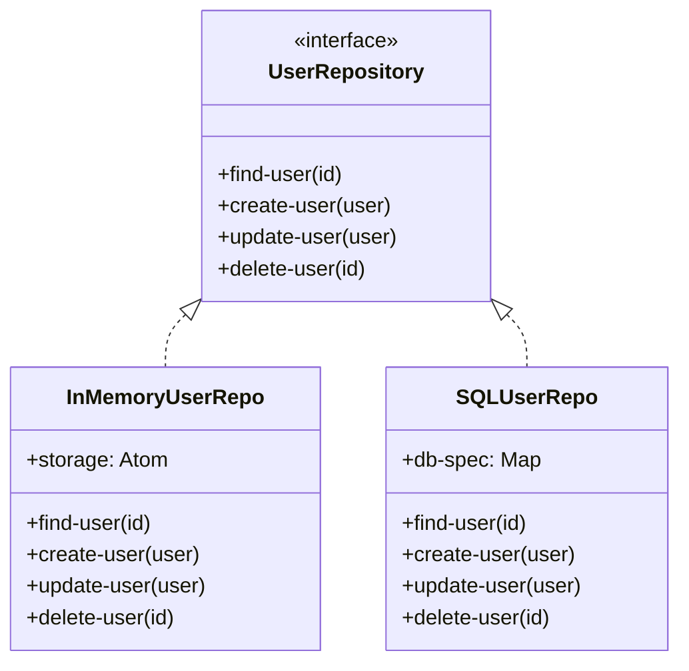

## 8.1 Repository in Clojure

In the realm of software design patterns, the Repository pattern plays a crucial role in abstracting data access and providing a clean interface for data operations. This pattern is particularly beneficial in decoupling business logic from data access logic, thereby promoting a clear separation of concerns. In this section, we will delve into how the Repository pattern can be effectively implemented in Clojure, leveraging its functional programming paradigms and powerful abstractions.

### Introduction

The Repository pattern serves as a mediator between the domain and data mapping layers, acting as an in-memory collection of domain objects. It provides a more object-oriented view of the persistence layer, offering a collection-like interface for accessing domain objects. This pattern is essential for maintaining a clean architecture, where business logic remains agnostic of the underlying data storage mechanisms.

### Detailed Explanation

#### The Role of the Repository Pattern

- **Abstraction of Data Access:** The Repository pattern abstracts the complexities of data access, providing a simple interface for CRUD (Create, Read, Update, Delete) operations.
- **Separation of Concerns:** By decoupling data access logic from business logic, it enhances maintainability and scalability.
- **Interchangeable Implementations:** Allows for easy swapping of data storage mechanisms (e.g., in-memory, SQL databases) without altering business logic.

#### Implementing the Repository Pattern in Clojure

In Clojure, repositories can be implemented using protocols and records or as simple namespaces with functions. This flexibility allows developers to choose the most suitable approach based on their specific needs.

##### Define a Repository Protocol

A protocol in Clojure defines a set of functions that must be implemented by any type that satisfies the protocol. Here, we define a `UserRepository` protocol for user-related operations:

```clojure
(defprotocol UserRepository
  (find-user [this id])
  (create-user [this user])
  (update-user [this user])
  (delete-user [this id]))
```

##### Implement the Protocol

###### In-Memory Implementation

An in-memory implementation is useful for testing or simple cases where persistence is not required. It uses an atom to store data:

```clojure
(defrecord InMemoryUserRepo [storage]
  UserRepository
  (find-user [this id]
    (get @storage id))
  (create-user [this user]
    (swap! storage assoc (:id user) user))
  (update-user [this user]
    (swap! storage assoc (:id user) user))
  (delete-user [this id]
    (swap! storage dissoc id)))

(def user-storage (atom {}))
(def user-repo (->InMemoryUserRepo user-storage))
```

###### Database Implementation (Using JDBC)

For a more robust solution, a database-backed implementation can be used. Here, we use JDBC for SQL database operations:

```clojure
(require '[clojure.java.jdbc :as jdbc])

(defrecord SQLUserRepo [db-spec]
  UserRepository
  (find-user [this id]
    (first (jdbc/query db-spec ["SELECT * FROM users WHERE id=?" id])))
  (create-user [this user]
    (jdbc/insert! db-spec :users user))
  (update-user [this user]
    (jdbc/update! db-spec :users user ["id=?" (:id user)]))
  (delete-user [this id]
    (jdbc/delete! db-spec :users ["id=?" id])))

(def db-spec {:dbtype "h2" :dbname "testdb"})
(def sql-user-repo (->SQLUserRepo db-spec))
```

### Visual Aids

#### Conceptual Diagram



### Use the Repository in Business Logic

The beauty of the Repository pattern is its ability to allow business logic to remain unchanged regardless of the underlying data storage mechanism:

```clojure
(defn register-user [repo user-data]
  (create-user repo user-data))

(defn get-user-profile [repo user-id]
  (find-user repo user-id))
```

### Swap Implementations Easily

One of the key advantages of the Repository pattern is the ability to switch between different implementations without modifying the business logic. For instance, you can switch between `user-repo` (in-memory) and `sql-user-repo` (database) seamlessly.

### Mock the Repository for Testing

Mocking is essential for testing business logic in isolation. Here's a simple mock implementation:

```clojure
(defrecord MockUserRepo []
  UserRepository
  (find-user [this id]
    {:id id :name "Mock User" :email "mock@example.com"})
  (create-user [this user]
    (println "Mock create user" user))
  (update-user [this user]
    (println "Mock update user" user))
  (delete-user [this id]
    (println "Mock delete user with id" id)))
```

### Advantages and Disadvantages

#### Advantages

- **Decoupling:** Separates business logic from data access, enhancing maintainability.
- **Flexibility:** Easily switch between different data storage mechanisms.
- **Testability:** Simplifies testing by allowing for mock implementations.

#### Disadvantages

- **Complexity:** May introduce additional complexity, especially for simple applications.
- **Overhead:** Can add overhead if not needed for small-scale projects.

### Best Practices

- **Use Protocols:** Leverage Clojure protocols to define clear interfaces for repositories.
- **Keep It Simple:** Avoid over-engineering; use the pattern only when necessary.
- **Mock for Tests:** Utilize mock implementations to test business logic in isolation.

### Conclusion

The Repository pattern is a powerful tool in the Clojure developer's toolkit, providing a clean abstraction for data access and promoting a separation of concerns. By leveraging Clojure's protocols and records, developers can create flexible and maintainable applications that are easy to test and extend.

## Quiz Time!



### What is the primary purpose of the Repository pattern?

- [x] To abstract data access and provide a clean interface for data operations
- [ ] To directly manipulate database tables
- [ ] To handle user authentication
- [ ] To manage application configuration

> **Explanation:** The Repository pattern abstracts data access, providing a clean interface for data operations, and decouples business logic from data access logic.

### How does the Repository pattern promote separation of concerns?

- [x] By decoupling business logic from data access logic
- [ ] By integrating business logic with data access logic
- [ ] By centralizing all logic in a single module
- [ ] By using global variables for data access

> **Explanation:** The Repository pattern separates business logic from data access logic, promoting a clear separation of concerns.

### In Clojure, how can repositories be implemented?

- [x] Using protocols and records
- [x] As simple namespaces with functions
- [ ] Using only global variables
- [ ] By directly embedding SQL queries in business logic

> **Explanation:** In Clojure, repositories can be implemented using protocols and records or as simple namespaces with functions.

### What is the advantage of using protocols in Clojure for repositories?

- [x] They define clear interfaces for data operations
- [ ] They allow for global state management
- [ ] They eliminate the need for testing
- [ ] They automatically optimize database queries

> **Explanation:** Protocols in Clojure define clear interfaces for data operations, which is essential for implementing the Repository pattern.

### Which of the following is a benefit of using the Repository pattern?

- [x] Flexibility in switching data storage mechanisms
- [ ] Increased complexity for simple applications
- [ ] Direct access to database internals
- [ ] Reduced testability

> **Explanation:** The Repository pattern provides flexibility in switching between different data storage mechanisms without altering business logic.

### What is a potential disadvantage of the Repository pattern?

- [x] It may introduce additional complexity
- [ ] It simplifies all aspects of application development
- [ ] It eliminates the need for data validation
- [ ] It requires global variables

> **Explanation:** The Repository pattern can introduce additional complexity, especially if used unnecessarily in simple applications.

### How can the Repository pattern aid in testing?

- [x] By allowing for mock implementations
- [ ] By requiring integration tests only
- [ ] By eliminating the need for tests
- [ ] By using global state

> **Explanation:** The Repository pattern aids in testing by allowing for mock implementations, which can isolate business logic from data access.

### What is a common use case for an in-memory repository implementation?

- [x] Testing or simple cases where persistence is not required
- [ ] Production environments with large datasets
- [ ] Real-time data processing
- [ ] High-security applications

> **Explanation:** An in-memory repository implementation is commonly used for testing or simple cases where persistence is not required.

### How does the Repository pattern affect application architecture?

- [x] It promotes a clean architecture by separating concerns
- [ ] It centralizes all logic in a single module
- [ ] It requires the use of global variables
- [ ] It mandates the use of a specific database technology

> **Explanation:** The Repository pattern promotes a clean architecture by separating business logic from data access concerns.

### True or False: The Repository pattern can be used to switch between different data storage mechanisms without altering business logic.

- [x] True
- [ ] False

> **Explanation:** True. The Repository pattern allows for easy switching between different data storage mechanisms without altering business logic.


