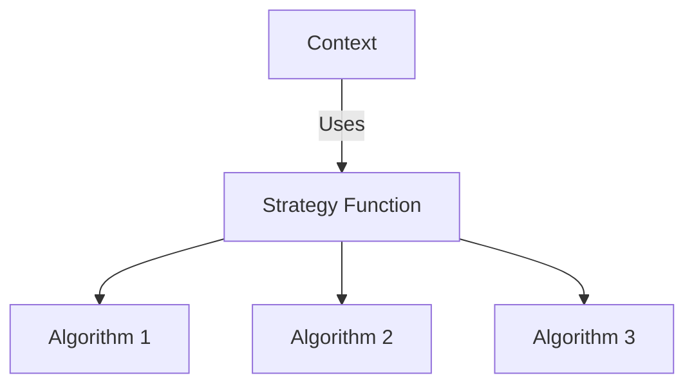

## 8.1. Strategy Pattern with Higher-Order Functions

### Introduction

The Strategy Pattern is a behavioral design pattern that enables selecting an algorithm's behavior at runtime. In Clojure, this pattern can be elegantly implemented using higher-order functions, which are functions that take other functions as arguments or return them as results. This approach allows for flexible and dynamic algorithm selection, making it a powerful tool in functional programming.

### Strategy Pattern Defined

**Intent**: The Strategy Pattern defines a family of algorithms, encapsulates each one, and makes them interchangeable. It allows the algorithm to vary independently from the clients that use it.

In traditional object-oriented programming, the Strategy Pattern involves creating a set of classes that implement a common interface. However, in Clojure, we can leverage the power of higher-order functions to achieve the same goal with less boilerplate and more flexibility.

### Higher-Order Functions in Clojure

Higher-order functions are a cornerstone of functional programming. They allow us to treat functions as first-class citizens, passing them as arguments, returning them from other functions, and storing them in data structures.

#### Example of a Higher-Order Function

```clojure
(defn apply-strategy [strategy x y]
  (strategy x y))

(defn add [a b]
  (+ a b))

(defn multiply [a b]
  (* a b))

;; Using the higher-order function
(apply-strategy add 5 3)       ;; => 8
(apply-strategy multiply 5 3)  ;; => 15
```

In this example, `apply-strategy` is a higher-order function that takes a strategy (another function) and two numbers, applying the strategy to the numbers.

### Encapsulating Algorithms with Higher-Order Functions

In Clojure, we can encapsulate algorithms as functions and pass them around as needed. This allows us to decouple the algorithm from the context in which it is used, providing flexibility and reusability.

#### Implementing the Strategy Pattern

Let's consider a scenario where we need to calculate the cost of a trip based on different transportation strategies: driving, cycling, and walking.

```clojure
(defn driving-cost [distance]
  (* distance 0.5))  ;; Assume $0.5 per mile

(defn cycling-cost [distance]
  (* distance 0.1))  ;; Assume $0.1 per mile

(defn walking-cost [distance]
  0)  ;; Walking is free

(defn calculate-trip-cost [strategy distance]
  (strategy distance))

;; Using different strategies
(calculate-trip-cost driving-cost 100)  ;; => 50.0
(calculate-trip-cost cycling-cost 100)  ;; => 10.0
(calculate-trip-cost walking-cost 100)  ;; => 0
```

In this example, `calculate-trip-cost` is a higher-order function that takes a strategy function and a distance, applying the strategy to calculate the cost.

### Benefits of Decoupling Algorithms from Context

1. **Flexibility**: By decoupling the algorithm from its context, we can easily switch strategies at runtime without changing the surrounding code.

2. **Reusability**: Strategies can be reused across different parts of an application, reducing duplication and improving maintainability.

3. **Testability**: Each strategy can be tested independently, leading to more robust and reliable code.

4. **Simplicity**: In a functional language like Clojure, the Strategy Pattern can be implemented with minimal code, leveraging the language's strengths.

### Visualizing the Strategy Pattern

Below is a diagram illustrating how the Strategy Pattern works with higher-order functions in Clojure:



**Diagram Description**: The context uses a strategy function, which can be any one of the encapsulated algorithms (Algorithm 1, Algorithm 2, Algorithm 3).

### Real-World Applications

The Strategy Pattern is widely used in various applications, such as:

- **Sorting Algorithms**: Selecting different sorting strategies based on data size or characteristics.
- **Payment Processing**: Choosing different payment gateways based on user preferences or availability.
- **Data Compression**: Applying different compression algorithms based on file type or size.

### Clojure's Unique Features

Clojure's support for first-class functions and its emphasis on immutability make it an ideal language for implementing the Strategy Pattern. The language's simplicity and expressiveness allow for clean and concise code, enhancing readability and maintainability.

### Differences and Similarities with Other Patterns

The Strategy Pattern is often confused with the State Pattern. While both involve encapsulating behavior, the Strategy Pattern focuses on interchangeable algorithms, whereas the State Pattern deals with object state changes.

### Design Considerations

- **When to Use**: Use the Strategy Pattern when you have multiple algorithms for a specific task and want to switch between them dynamically.
- **Pitfalls**: Avoid overcomplicating the design with too many strategies. Ensure that each strategy is distinct and necessary.

### Try It Yourself

Experiment with the code examples provided. Try adding new strategies or modifying existing ones to see how the pattern adapts to changes.

### Knowledge Check

Reflect on the concepts covered and consider how you might apply the Strategy Pattern in your projects. What scenarios could benefit from this approach?

## **Ready to Test Your Knowledge?**



### What is the primary intent of the Strategy Pattern?

- [x] To define a family of algorithms, encapsulate each one, and make them interchangeable.
- [ ] To manage object state changes.
- [ ] To create a single interface for multiple classes.
- [ ] To provide a way to access the elements of an aggregate object sequentially.

> **Explanation:** The Strategy Pattern's primary intent is to define a family of algorithms, encapsulate each one, and make them interchangeable, allowing the algorithm to vary independently from the clients that use it.

### How does Clojure implement the Strategy Pattern differently from traditional OOP languages?

- [x] By using higher-order functions instead of classes and interfaces.
- [ ] By using classes and interfaces.
- [ ] By using inheritance.
- [ ] By using abstract classes.

> **Explanation:** Clojure implements the Strategy Pattern using higher-order functions, which allows for more flexibility and less boilerplate compared to traditional OOP languages that use classes and interfaces.

### What is a higher-order function?

- [x] A function that takes other functions as arguments or returns them as results.
- [ ] A function that only performs mathematical operations.
- [ ] A function that is always recursive.
- [ ] A function that cannot be passed as an argument.

> **Explanation:** A higher-order function is one that takes other functions as arguments or returns them as results, allowing for flexible and dynamic programming.

### What are the benefits of using the Strategy Pattern in Clojure?

- [x] Flexibility, reusability, testability, and simplicity.
- [ ] Complexity, rigidity, and difficulty in testing.
- [ ] Increased code size and reduced readability.
- [ ] None of the above.

> **Explanation:** The Strategy Pattern in Clojure offers flexibility, reusability, testability, and simplicity, making it a powerful tool for dynamic algorithm selection.

### Which of the following is NOT a real-world application of the Strategy Pattern?

- [ ] Sorting Algorithms
- [ ] Payment Processing
- [ ] Data Compression
- [x] Memory Management

> **Explanation:** Memory Management is not typically a real-world application of the Strategy Pattern, which is more suited for tasks like sorting algorithms, payment processing, and data compression.

### What is the key difference between the Strategy Pattern and the State Pattern?

- [x] The Strategy Pattern focuses on interchangeable algorithms, while the State Pattern deals with object state changes.
- [ ] The Strategy Pattern deals with object state changes, while the State Pattern focuses on interchangeable algorithms.
- [ ] Both patterns are identical in their implementation.
- [ ] The Strategy Pattern is used for data storage, while the State Pattern is used for data retrieval.

> **Explanation:** The key difference is that the Strategy Pattern focuses on interchangeable algorithms, while the State Pattern deals with object state changes.

### How can you test strategies independently in Clojure?

- [x] By writing unit tests for each strategy function.
- [ ] By using integration tests only.
- [ ] By testing them all together in a single test case.
- [ ] By not testing them at all.

> **Explanation:** You can test strategies independently in Clojure by writing unit tests for each strategy function, ensuring each one works correctly on its own.

### What is the role of the context in the Strategy Pattern?

- [x] To use the strategy function to perform a task.
- [ ] To define the algorithms.
- [ ] To store the strategies.
- [ ] To execute all strategies simultaneously.

> **Explanation:** The context in the Strategy Pattern uses the strategy function to perform a task, selecting the appropriate algorithm at runtime.

### Which Clojure feature makes the Strategy Pattern particularly simple to implement?

- [x] First-class functions and immutability.
- [ ] Object-oriented inheritance.
- [ ] Static typing.
- [ ] Complex syntax.

> **Explanation:** Clojure's first-class functions and immutability make the Strategy Pattern particularly simple to implement, allowing for clean and concise code.

### True or False: The Strategy Pattern can only be used for mathematical operations.

- [ ] True
- [x] False

> **Explanation:** False. The Strategy Pattern can be used for a wide range of applications beyond mathematical operations, such as sorting, payment processing, and data compression.



Remember, this is just the beginning. As you progress, you'll build more complex and interactive applications using the Strategy Pattern. Keep experimenting, stay curious, and enjoy the journey!
