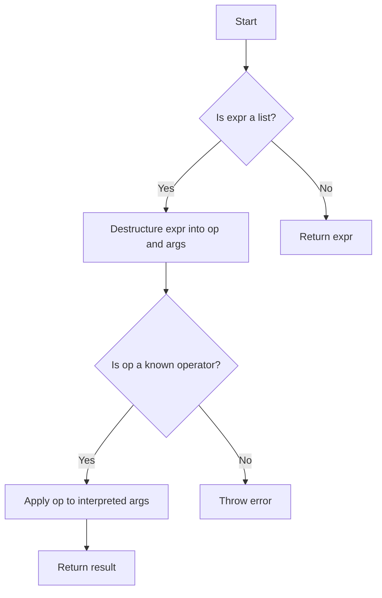

## 8.10. Interpreter Pattern Using Evaluated Data Structures

### Introduction

The Interpreter Pattern is a design pattern that specifies how to evaluate sentences in a language. It is particularly useful for designing and implementing Domain-Specific Languages (DSLs) and is a natural fit for Clojure due to its homoiconicity—the property that code and data share the same structure. This section will explore how to leverage Clojure's unique features to implement the Interpreter Pattern using evaluated data structures.

### Understanding the Interpreter Pattern

**Intent**: The Interpreter Pattern is used to define a representation for a language's grammar along with an interpreter that uses the representation to interpret sentences in the language.

**Key Participants**:
- **Abstract Expression**: Declares an interface for executing an operation.
- **Terminal Expression**: Implements an operation associated with terminal symbols in the grammar.
- **Nonterminal Expression**: Implements an operation for nonterminal symbols in the grammar.
- **Context**: Contains information that's global to the interpreter.
- **Client**: Builds (or is given) an abstract syntax tree representing a particular sentence in the language defined by the grammar.

### Clojure's Homoiconicity and the Interpreter Pattern

Clojure's homoiconicity allows us to represent code as data structures, typically lists, vectors, maps, and sets. This makes it an ideal language for implementing the Interpreter Pattern, as we can easily manipulate and evaluate these data structures to interpret code.

#### Code as Data

In Clojure, code is written in the form of data structures. This means that we can construct, manipulate, and evaluate code just like any other data. Here's a simple example:

```clojure
(def code '(+ 1 2 3))

(eval code) ; => 6
```

In this example, `code` is a list that represents a Clojure expression. Using `eval`, we can evaluate this list as if it were code.

### Building a Simple Interpreter

Let's build a simple interpreter for arithmetic expressions. We'll define a small language that supports addition, subtraction, multiplication, and division.

#### Defining the Language

We'll represent expressions as nested lists, where the first element is the operator and the remaining elements are operands. Here's an example expression:

```clojure
(def expr '(* (+ 1 2) (- 4 2)))
```

This expression represents the arithmetic operation `(1 + 2) * (4 - 2)`.

#### Implementing the Interpreter

We'll write a function `interpret` that evaluates these expressions:

```clojure
(defn interpret [expr]
  (if (list? expr)
    (let [[op & args] expr]
      (case op
        '+ (apply + (map interpret args))
        '- (apply - (map interpret args))
        '* (apply * (map interpret args))
        '/ (apply / (map interpret args))
        (throw (IllegalArgumentException. (str "Unknown operator: " op)))))
    expr))

(interpret expr) ; => 6
```

**Explanation**:
- We check if `expr` is a list. If it is, we destructure it into an operator `op` and a list of `args`.
- We use a `case` expression to determine which operation to perform based on `op`.
- We recursively call `interpret` on each argument to handle nested expressions.

### The Power and Risks of `eval`

While `eval` is powerful, allowing us to execute arbitrary code represented as data, it also poses significant security risks. Using `eval` on untrusted input can lead to code injection attacks, where malicious code is executed.

#### Best Practices for Safe Evaluation

1. **Avoid `eval` When Possible**: Use other means of interpretation, such as pattern matching or predefined functions, to avoid the risks associated with `eval`.

2. **Sanitize Input**: If you must use `eval`, ensure that the input is sanitized and validated to prevent injection attacks.

3. **Limit the Scope**: Restrict the environment in which `eval` executes to minimize potential damage.

4. **Use Sandboxing**: Consider using a sandboxed environment to execute evaluated code safely.

### Creating a Domain-Specific Language (DSL)

Clojure's flexibility makes it an excellent choice for creating DSLs. Let's create a simple DSL for arithmetic operations.

#### Defining the DSL

We'll create a DSL that allows users to define variables and perform arithmetic operations:

```clojure
(defn eval-dsl [env expr]
  (cond
    (symbol? expr) (get env expr)
    (list? expr)
    (let [[op & args] expr]
      (case op
        'let (let [[var val body] args]
               (eval-dsl (assoc env var (eval-dsl env val)) body))
        '+ (apply + (map (partial eval-dsl env) args))
        '- (apply - (map (partial eval-dsl env) args))
        '* (apply * (map (partial eval-dsl env) args))
        '/ (apply / (map (partial eval-dsl env) args))
        (throw (IllegalArgumentException. (str "Unknown operator: " op)))))
    :else expr))

(def dsl-expr '(let [x 10 y 20] (+ x y (* x y))))

(eval-dsl {} dsl-expr) ; => 230
```

**Explanation**:
- We use an environment `env` to store variable bindings.
- The `eval-dsl` function evaluates expressions based on the current environment.
- We handle variable definitions using the `let` operator, updating the environment with new bindings.

### Visualizing the Interpreter Pattern

Below is a diagram illustrating the flow of interpreting an expression using our simple interpreter:



**Diagram Explanation**: This flowchart represents the decision-making process in our interpreter. It checks if the expression is a list, destructures it, checks for known operators, and applies the operation recursively.

### Try It Yourself

Experiment with the interpreter by modifying the expressions or adding new operations. Here are some suggestions:

- Add support for additional arithmetic operations, such as modulus or exponentiation.
- Implement logical operations like `and`, `or`, and `not`.
- Extend the DSL to support conditional expressions, such as `if`.

### Design Considerations

- **When to Use**: The Interpreter Pattern is ideal for implementing simple languages or DSLs where the grammar is not too complex.
- **Performance**: Interpreters can be slower than compiled code, so consider performance implications for large or complex expressions.
- **Security**: Be cautious with `eval` and ensure that any evaluated code is safe and trusted.

### Clojure Unique Features

Clojure's homoiconicity and powerful macro system make it uniquely suited for implementing the Interpreter Pattern. The ability to treat code as data and manipulate it with macros allows for flexible and expressive DSLs.

### Differences and Similarities

The Interpreter Pattern is often confused with the Visitor Pattern, as both involve traversing a structure. However, the Interpreter Pattern focuses on evaluating expressions, while the Visitor Pattern is about performing operations on elements of an object structure.

### Conclusion

The Interpreter Pattern is a powerful tool for implementing DSLs and evaluating expressions in Clojure. By leveraging Clojure's unique features, such as homoiconicity and macros, we can create flexible and expressive interpreters. Remember to prioritize safety when using `eval` and explore the possibilities of extending your DSLs with new features.

## **Ready to Test Your Knowledge?**



### What is the primary purpose of the Interpreter Pattern?

- [x] To evaluate sentences in a language
- [ ] To compile code into machine language
- [ ] To optimize code for performance
- [ ] To translate code between languages

> **Explanation:** The Interpreter Pattern is used to evaluate sentences in a language by defining a representation for the language's grammar and an interpreter to process it.

### Which Clojure feature makes it particularly suitable for the Interpreter Pattern?

- [x] Homoiconicity
- [ ] Static typing
- [ ] Object-oriented programming
- [ ] Strong encapsulation

> **Explanation:** Clojure's homoiconicity, where code and data share the same structure, makes it ideal for implementing the Interpreter Pattern.

### What is a key risk associated with using `eval`?

- [x] Code injection attacks
- [ ] Increased performance
- [ ] Simplified code structure
- [ ] Enhanced security

> **Explanation:** Using `eval` can lead to code injection attacks if untrusted input is evaluated, posing a significant security risk.

### How can you safely evaluate expressions in Clojure?

- [x] Sanitize input and limit the scope of evaluation
- [ ] Use `eval` on all inputs
- [ ] Avoid using any data structures
- [ ] Execute code in a global context

> **Explanation:** To safely evaluate expressions, sanitize input, limit the scope of evaluation, and avoid using `eval` on untrusted data.

### What is a common use case for the Interpreter Pattern?

- [x] Implementing Domain-Specific Languages (DSLs)
- [ ] Compiling code to machine language
- [ ] Optimizing algorithms
- [ ] Managing memory allocation

> **Explanation:** The Interpreter Pattern is commonly used to implement DSLs, allowing for the evaluation of expressions in a specific language.

### Which of the following is NOT a key participant in the Interpreter Pattern?

- [ ] Abstract Expression
- [ ] Terminal Expression
- [ ] Nonterminal Expression
- [x] Compiler

> **Explanation:** The Compiler is not a key participant in the Interpreter Pattern, which focuses on interpreting rather than compiling code.

### What is the role of the `Context` in the Interpreter Pattern?

- [x] Contains information that's global to the interpreter
- [ ] Executes the operations
- [ ] Defines the grammar of the language
- [ ] Optimizes the interpreted code

> **Explanation:** The `Context` contains information that is global to the interpreter, such as variable bindings or environment settings.

### Which of the following is a best practice for using `eval`?

- [x] Avoid `eval` when possible
- [ ] Use `eval` for all code execution
- [ ] Execute `eval` in a global context
- [ ] Ignore input validation

> **Explanation:** It is best to avoid `eval` when possible due to its security risks and to use other means of interpretation.

### What does the `let` operator do in the provided DSL example?

- [x] Defines variables and updates the environment
- [ ] Compiles the code
- [ ] Optimizes the expression
- [ ] Executes the expression in a global context

> **Explanation:** In the DSL example, the `let` operator defines variables and updates the environment with new bindings.

### True or False: The Interpreter Pattern is often confused with the Visitor Pattern.

- [x] True
- [ ] False

> **Explanation:** The Interpreter Pattern is often confused with the Visitor Pattern, but they serve different purposes. The Interpreter Pattern evaluates expressions, while the Visitor Pattern performs operations on elements of an object structure.


