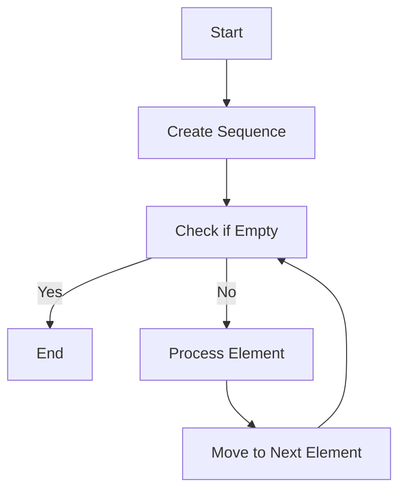

## 8.11. Iterator Pattern with Sequences

### Introduction

In the realm of software design patterns, the **Iterator Pattern** is a fundamental concept that provides a way to access elements of a collection sequentially without exposing its underlying representation. In Clojure, this pattern is elegantly embodied by sequences, which offer a powerful abstraction for traversing collections. This section delves into the iterator pattern, its implementation in Clojure through sequences, and the benefits of this approach.

### Understanding the Iterator Pattern

The **Iterator Pattern** is a behavioral design pattern that allows clients to traverse elements of a collection without needing to understand its internal structure. The pattern typically involves an `Iterator` interface that provides methods such as `next()` and `hasNext()`, enabling sequential access to the collection's elements.

#### Intent

- **Provide a standard way to traverse collections**: The iterator pattern offers a uniform interface for accessing elements, making it easier to work with different types of collections.
- **Encapsulate collection traversal logic**: By abstracting the traversal mechanism, the pattern decouples the client code from the collection's internal representation.
- **Support multiple traversal algorithms**: Iterators can be customized to support various traversal strategies, such as forward, backward, or filtered traversal.

### Clojure's Sequence Abstraction

Clojure's sequences (`seqs`) are a core feature of the language, providing a uniform interface for accessing elements of collections. Sequences are lazy, immutable, and can represent a wide variety of data structures, including lists, vectors, maps, and sets.

#### Key Features of Sequences

- **Laziness**: Sequences in Clojure are lazy, meaning they compute their elements on demand. This allows for efficient processing of large or infinite collections.
- **Uniform Interface**: Sequences provide a consistent API for accessing elements, regardless of the underlying collection type.
- **Immutability**: Sequences are immutable, ensuring that operations on them do not alter the original collection.

### Iterating Over Collections with Sequences

Clojure's sequence abstraction allows for elegant and concise iteration over collections. Let's explore how to iterate over different collection types using sequences.

#### Lists

Lists in Clojure are linked lists, and they naturally support sequential access through sequences.

```clojure
(def my-list '(1 2 3 4 5))

;; Using `map` to iterate over the list
(map inc my-list)
;; => (2 3 4 5 6)

;; Using `doseq` for side effects
(doseq [x my-list]
  (println x))
;; Prints: 1 2 3 4 5
```

#### Vectors

Vectors are indexed collections, but they can also be traversed using sequences.

```clojure
(def my-vector [1 2 3 4 5])

;; Using `map` to iterate over the vector
(map inc my-vector)
;; => (2 3 4 5 6)

;; Using `reduce` to sum elements
(reduce + my-vector)
;; => 15
```

#### Maps

Maps are key-value pairs, and sequences allow iteration over keys, values, or entries.

```clojure
(def my-map {:a 1 :b 2 :c 3})

;; Iterating over keys
(keys my-map)
;; => (:a :b :c)

;; Iterating over values
(vals my-map)
;; => (1 2 3)

;; Iterating over entries
(doseq [[k v] my-map]
  (println k v))
;; Prints: :a 1 :b 2 :c 3
```

#### Sets

Sets are collections of unique elements, and sequences provide a way to iterate over them.

```clojure
(def my-set #{1 2 3 4 5})

;; Using `map` to iterate over the set
(map inc my-set)
;; => (2 3 4 5 6)

;; Using `filter` to select even numbers
(filter even? my-set)
;; => (2 4)
```

### Benefits of Clojure's Sequence Abstraction

Clojure's sequence abstraction offers several advantages over traditional iterator implementations:

- **Uniform Interfaces**: Sequences provide a consistent API for accessing elements, simplifying code that works with multiple collection types.
- **Laziness**: The lazy nature of sequences allows for efficient processing of large or infinite collections, as elements are computed only when needed.
- **Immutability**: Sequences are immutable, ensuring that operations do not alter the original collection, leading to safer and more predictable code.

### The Simplicity and Power of Sequences

Clojure's sequences are a testament to the power of functional programming. They provide a simple yet powerful abstraction for traversing collections, enabling developers to write concise and expressive code. The combination of laziness, immutability, and a uniform interface makes sequences an ideal tool for implementing the iterator pattern in Clojure.

### Visualizing Sequence Traversal

To better understand how sequences work, let's visualize the process of traversing a collection using sequences.



**Diagram Description**: This flowchart illustrates the process of traversing a collection using sequences in Clojure. The sequence is created, and elements are processed one by one until the sequence is empty.

### Try It Yourself

Experiment with the code examples provided in this section. Try modifying the collections, applying different sequence functions, and observing the results. Here are some suggestions:

- Change the collection types and see how sequences handle them.
- Use different sequence functions like `filter`, `take`, or `drop` to manipulate the collections.
- Create your own collections and apply sequence operations to them.

### References and Further Reading

For more information on Clojure's sequences and the iterator pattern, consider exploring the following resources:

- [Clojure Documentation on Sequences](https://clojure.org/reference/sequences)
- [Functional Programming in Clojure](https://www.braveclojure.com/functional-programming/)
- [Design Patterns: Elements of Reusable Object-Oriented Software](https://en.wikipedia.org/wiki/Design_Patterns)

### Knowledge Check

Let's test your understanding of the iterator pattern and sequences in Clojure with some quiz questions.

## **Ready to Test Your Knowledge?**



### What is the primary purpose of the iterator pattern?

- [x] To provide a way to access elements of a collection sequentially without exposing its underlying representation.
- [ ] To modify elements of a collection in place.
- [ ] To sort elements of a collection.
- [ ] To convert a collection into a different data structure.

> **Explanation:** The iterator pattern is designed to allow sequential access to elements without exposing the collection's internal structure.

### How do sequences in Clojure differ from traditional iterators?

- [x] Sequences are lazy and immutable.
- [ ] Sequences are mutable and eager.
- [ ] Sequences require explicit iteration control.
- [ ] Sequences expose the underlying collection's structure.

> **Explanation:** Clojure's sequences are lazy and immutable, providing a uniform interface for accessing elements.

### Which function would you use to iterate over a collection and apply a transformation to each element?

- [x] `map`
- [ ] `reduce`
- [ ] `filter`
- [ ] `assoc`

> **Explanation:** The `map` function is used to apply a transformation to each element of a collection.

### What is a key advantage of using lazy sequences in Clojure?

- [x] They allow for efficient processing of large or infinite collections.
- [ ] They modify the original collection.
- [ ] They require more memory.
- [ ] They are faster than eager sequences in all cases.

> **Explanation:** Lazy sequences compute elements on demand, making them efficient for large or infinite collections.

### Which Clojure function is used to iterate over key-value pairs in a map?

- [x] `doseq`
- [ ] `map`
- [ ] `filter`
- [ ] `reduce`

> **Explanation:** The `doseq` function is used for side-effectful iteration over collections, including key-value pairs in a map.

### What is the result of `(map inc [1 2 3])` in Clojure?

- [x] `(2 3 4)`
- [ ] `[2 3 4]`
- [ ] `(1 2 3)`
- [ ] `[1 2 3]`

> **Explanation:** The `map` function applies `inc` to each element, resulting in `(2 3 4)`.

### How does Clojure ensure that sequence operations do not alter the original collection?

- [x] By using immutable data structures.
- [ ] By copying the collection before each operation.
- [ ] By locking the collection during operations.
- [ ] By using mutable data structures.

> **Explanation:** Clojure's sequences are immutable, ensuring that operations do not change the original collection.

### What is the purpose of the `reduce` function in Clojure?

- [x] To accumulate a result by applying a function to each element of a collection.
- [ ] To filter elements of a collection.
- [ ] To transform each element of a collection.
- [ ] To iterate over a collection with side effects.

> **Explanation:** The `reduce` function is used to accumulate a result by applying a function to each element.

### Which of the following is a characteristic of Clojure's sequences?

- [x] They provide a uniform interface for accessing elements.
- [ ] They are mutable.
- [ ] They are eager.
- [ ] They expose the underlying collection's structure.

> **Explanation:** Clojure's sequences provide a uniform interface for accessing elements, regardless of the underlying collection type.

### True or False: Sequences in Clojure can represent infinite collections.

- [x] True
- [ ] False

> **Explanation:** Clojure's lazy sequences can represent infinite collections, as elements are computed on demand.



### Conclusion

Clojure's sequence abstraction provides a powerful and elegant implementation of the iterator pattern, offering a uniform interface for traversing collections. The combination of laziness, immutability, and simplicity makes sequences an essential tool for functional programming in Clojure. As you continue your journey with Clojure, remember to leverage the power of sequences to write concise, expressive, and efficient code. Keep experimenting, stay curious, and enjoy the journey!
