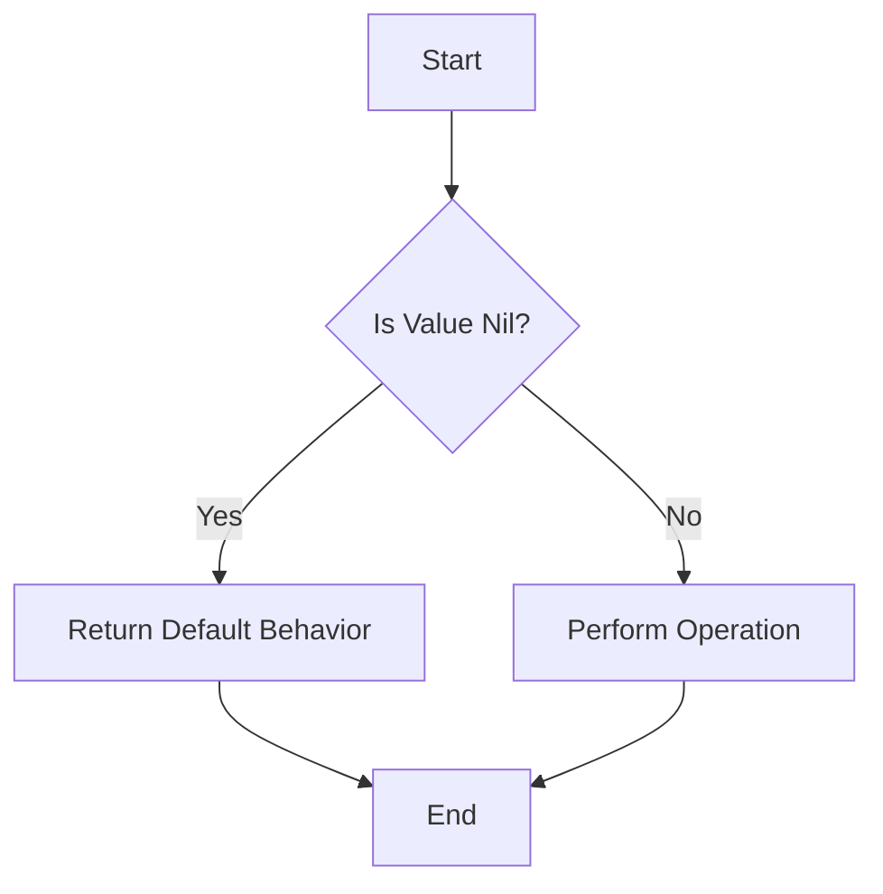

## 8.12. Null Object Pattern with `nil` and Default Behaviors

In the world of software development, handling null values gracefully is a common challenge. The Null Object Pattern is a design pattern that aims to eliminate the need for null checks by providing a default behavior when a null value is encountered. In Clojure, a functional programming language known for its simplicity and power, we can leverage `nil` and default behaviors to implement this pattern effectively. This section will guide you through understanding and applying the Null Object Pattern in Clojure, ensuring your code is robust and free from `NullPointerException`s.

### Understanding the Null Object Pattern

The Null Object Pattern is a behavioral design pattern that provides an object as a surrogate for the absence of a value. Instead of returning `null` (or `nil` in Clojure), a method returns an object that implements the expected interface but does nothing. This approach eliminates the need for null checks and allows the code to operate seamlessly, even in the absence of a value.

#### Intent

The primary intent of the Null Object Pattern is to encapsulate the absence of an object by providing a default behavior. This pattern helps in reducing the complexity of code by eliminating the need for repetitive null checks and handling null values gracefully.

#### Key Participants

1. **Null Object**: An object that implements the expected interface but performs no operation.
2. **Client**: The code that interacts with the object, expecting it to perform certain operations.

### Applying the Null Object Pattern in Clojure

Clojure, with its functional programming paradigm, provides unique ways to implement the Null Object Pattern. Let's explore how we can design functions that accept `nil` as a valid input and provide default behaviors or harmless operations.

#### Designing Functions with Default Behaviors

In Clojure, functions can be designed to handle `nil` values gracefully by providing default behaviors. This approach ensures that the absence of a value does not lead to errors or unexpected behavior.

```clojure
(defn safe-divide [numerator denominator]
  (if (nil? denominator)
    0 ; Default behavior when denominator is nil
    (/ numerator denominator)))

;; Usage
(safe-divide 10 nil) ; => 0
(safe-divide 10 2)   ; => 5
```

In the example above, the `safe-divide` function checks if the denominator is `nil` and returns a default value of `0` to avoid division by zero.

#### Using the `some->` Threading Macro

Clojure provides powerful threading macros like `some->` that can be used to handle `nil` values gracefully. The `some->` macro threads a value through a series of expressions, stopping if any expression returns `nil`.

```clojure
(defn process-data [data]
  (some-> data
          (get :value)
          (* 2)
          (inc)))

;; Usage
(process-data {:value 5}) ; => 11
(process-data nil)        ; => nil
```

In this example, the `process-data` function uses the `some->` macro to safely process the `data` map. If `data` is `nil`, the function returns `nil` without throwing an error.

### Best Practices for Preventing `NullPointerException`s

To prevent `NullPointerException`s and ensure your Clojure code is robust, follow these best practices:

1. **Use Default Values**: Provide default values for function arguments to handle `nil` inputs gracefully.
2. **Leverage Threading Macros**: Use threading macros like `some->` and `->` to chain operations safely.
3. **Encapsulate Null Checks**: Encapsulate null checks within functions to reduce repetitive code.
4. **Adopt Immutability**: Embrace Clojure's immutable data structures to minimize side effects and unexpected behavior.

### Sample Code Snippet

Let's explore a more comprehensive example that demonstrates the Null Object Pattern in Clojure.

```clojure
(defn get-user-name [user]
  (some-> user
          :name
          (str "User: ")))

(defn greet-user [user]
  (let [name (get-user-name user)]
    (println (or name "Guest"))))

;; Usage
(greet-user {:name "Alice"}) ; => "User: Alice"
(greet-user nil)             ; => "Guest"
```

In this example, the `get-user-name` function uses the `some->` macro to safely retrieve the user's name. The `greet-user` function then prints a greeting, defaulting to "Guest" if the user is `nil`.

### Design Considerations

When implementing the Null Object Pattern in Clojure, consider the following:

- **Performance**: Ensure that the default behaviors do not introduce unnecessary overhead.
- **Readability**: Maintain code readability by using clear and concise default behaviors.
- **Consistency**: Apply the pattern consistently across your codebase to avoid confusion.

### Clojure Unique Features

Clojure's unique features, such as immutable data structures and powerful threading macros, make it an ideal language for implementing the Null Object Pattern. By leveraging these features, you can create robust and error-free applications.

### Differences and Similarities

The Null Object Pattern is often compared to other patterns like the Strategy Pattern. While both patterns provide a way to encapsulate behavior, the Null Object Pattern focuses on providing a default behavior for the absence of a value, whereas the Strategy Pattern allows for interchangeable behaviors.

### Try It Yourself

To deepen your understanding of the Null Object Pattern in Clojure, try modifying the code examples provided. Experiment with different default behaviors and explore how the `some->` macro can be used in various scenarios.

### Visualizing the Null Object Pattern

To better understand the flow of the Null Object Pattern, let's visualize it using a Mermaid.js diagram.



**Diagram Description**: This flowchart illustrates the decision-making process in the Null Object Pattern. If a value is `nil`, a default behavior is returned. Otherwise, the operation is performed.

### References and Links

For further reading on the Null Object Pattern and Clojure, consider the following resources:

- [Clojure Documentation](https://clojure.org/reference)
- [Functional Programming Patterns](https://www.manning.com/books/functional-programming-patterns-in-scala-and-clojure)
- [Design Patterns: Elements of Reusable Object-Oriented Software](https://www.amazon.com/Design-Patterns-Elements-Reusable-Object-Oriented/dp/0201633612)

### Knowledge Check

To reinforce your understanding of the Null Object Pattern in Clojure, try answering the following questions.

## **Ready to Test Your Knowledge?**



### What is the primary intent of the Null Object Pattern?

- [x] To provide a default behavior for the absence of a value
- [ ] To encapsulate multiple behaviors in a single object
- [ ] To optimize performance by reducing memory usage
- [ ] To simplify complex algorithms

> **Explanation:** The Null Object Pattern aims to provide a default behavior when a value is absent, eliminating the need for null checks.

### How does the `some->` macro help in implementing the Null Object Pattern?

- [x] It threads a value through expressions, stopping if any return `nil`
- [ ] It optimizes performance by parallelizing operations
- [ ] It provides a default value for missing keys in maps
- [ ] It simplifies error handling by catching exceptions

> **Explanation:** The `some->` macro threads a value through a series of expressions, stopping if any expression returns `nil`, which helps in handling null values gracefully.

### Which of the following is a best practice for preventing `NullPointerException`s in Clojure?

- [x] Use default values for function arguments
- [ ] Avoid using threading macros
- [ ] Use mutable data structures
- [ ] Rely on global state for default behaviors

> **Explanation:** Using default values for function arguments is a best practice to handle `nil` inputs gracefully and prevent `NullPointerException`s.

### What is the role of the Null Object in the Null Object Pattern?

- [x] It implements the expected interface but performs no operation
- [ ] It encapsulates multiple behaviors in a single object
- [ ] It optimizes performance by reducing memory usage
- [ ] It simplifies complex algorithms

> **Explanation:** The Null Object implements the expected interface but performs no operation, providing a default behavior for the absence of a value.

### How can you handle `nil` values in Clojure functions?

- [x] By providing default behaviors or harmless operations
- [ ] By throwing exceptions when `nil` is encountered
- [ ] By using mutable data structures
- [ ] By relying on global state

> **Explanation:** Handling `nil` values with default behaviors or harmless operations ensures that functions operate seamlessly without errors.

### What is a key benefit of using the Null Object Pattern?

- [x] It eliminates the need for repetitive null checks
- [ ] It increases the complexity of the code
- [ ] It reduces the readability of the code
- [ ] It requires extensive error handling

> **Explanation:** The Null Object Pattern eliminates the need for repetitive null checks, simplifying the code and reducing complexity.

### Which Clojure feature is particularly useful for implementing the Null Object Pattern?

- [x] Threading macros like `some->`
- [ ] Mutable data structures
- [ ] Global state management
- [ ] Exception handling mechanisms

> **Explanation:** Threading macros like `some->` are particularly useful for implementing the Null Object Pattern, as they allow for safe chaining of operations.

### What should you consider when implementing the Null Object Pattern?

- [x] Performance, readability, and consistency
- [ ] Complexity, error handling, and global state
- [ ] Memory usage, exception handling, and mutable data
- [ ] Thread safety, parallelism, and synchronization

> **Explanation:** When implementing the Null Object Pattern, consider performance, readability, and consistency to ensure robust and maintainable code.

### How does Clojure's immutability benefit the Null Object Pattern?

- [x] It minimizes side effects and unexpected behavior
- [ ] It increases the complexity of handling `nil` values
- [ ] It requires extensive error handling
- [ ] It relies on global state for default behaviors

> **Explanation:** Clojure's immutability minimizes side effects and unexpected behavior, making it easier to implement the Null Object Pattern.

### True or False: The Null Object Pattern is often compared to the Strategy Pattern.

- [x] True
- [ ] False

> **Explanation:** True. The Null Object Pattern is often compared to the Strategy Pattern, as both provide a way to encapsulate behavior, but they serve different purposes.



Remember, mastering the Null Object Pattern in Clojure is just the beginning. As you progress, you'll build more robust and error-free applications. Keep experimenting, stay curious, and enjoy the journey!
