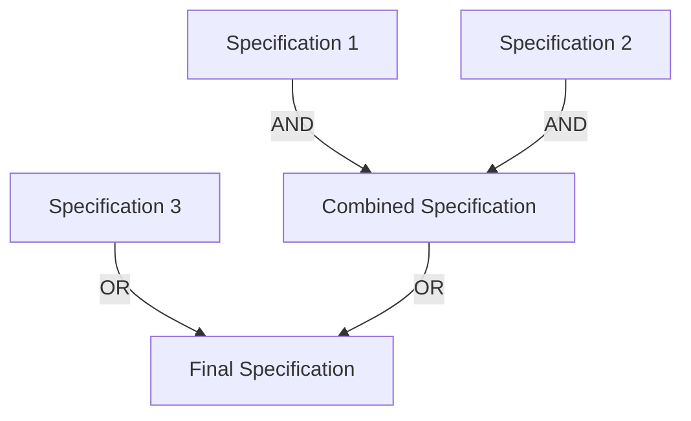

## 8.13. Specification Pattern for Complex Criteria

### Introduction

The Specification Pattern is a powerful design pattern used to encapsulate business rules and validation logic in a way that is reusable, combinable, and easy to maintain. In Clojure, this pattern can be implemented using predicates or functions, allowing developers to express complex criteria in a modular and readable manner. This section will guide you through understanding the Specification Pattern, its implementation in Clojure, and its integration with validation libraries like Clojure Spec.

### Understanding the Specification Pattern

#### Definition

The Specification Pattern is a behavioral design pattern that allows you to encapsulate business rules into a specification object. This object can be reused across different parts of an application, combined with other specifications, and modified without affecting the rest of the codebase. The pattern is particularly useful in scenarios where complex business logic needs to be applied consistently across various operations.

#### Use Cases

- **Validation Logic**: Centralize and reuse validation logic across different components.
- **Business Rules**: Encapsulate business rules that can be applied to entities or operations.
- **Filtering and Querying**: Define criteria for filtering data collections or querying databases.
- **Combinatorial Logic**: Combine multiple specifications using logical operators to form complex criteria.

### Implementing Specifications in Clojure

In Clojure, specifications can be implemented using functions or predicates. Let's explore how to create and combine specifications using these constructs.

#### Basic Specification Implementation

A specification in Clojure can be represented as a function that takes an entity and returns a boolean indicating whether the entity satisfies the specification.

```clojure
(defn age-greater-than-18? [person]
  (> (:age person) 18))

(defn name-starts-with-a? [person]
  (clojure.string/starts-with? (:name person) "A"))
```

In this example, `age-greater-than-18?` and `name-starts-with-a?` are simple specifications that check if a person's age is greater than 18 and if their name starts with "A", respectively.

#### Combining Specifications

Specifications can be combined using logical operators to form more complex criteria. Clojure's functional nature makes it easy to compose these specifications.

```clojure
(defn and-spec [spec1 spec2]
  (fn [entity]
    (and (spec1 entity) (spec2 entity))))

(defn or-spec [spec1 spec2]
  (fn [entity]
    (or (spec1 entity) (spec2 entity))))

(defn not-spec [spec]
  (fn [entity]
    (not (spec entity))))

(def adult-named-a? (and-spec age-greater-than-18? name-starts-with-a?))
```

Here, `and-spec`, `or-spec`, and `not-spec` are higher-order functions that combine specifications using logical AND, OR, and NOT operations. The `adult-named-a?` specification combines the previous specifications to check if a person is an adult and their name starts with "A".

### Benefits of the Specification Pattern

#### Modularity

By encapsulating business rules into specifications, you can achieve a high degree of modularity. Each specification is a self-contained unit that can be reused and combined with other specifications without duplication.

#### Readability

Specifications make the code more readable by clearly expressing the intent of the business rules. Instead of embedding complex logic directly into the code, you can define specifications that describe the criteria in a declarative manner.

#### Flexibility

The Specification Pattern provides flexibility in how business rules are applied. You can easily modify or extend specifications without affecting other parts of the application.

### Integration with Clojure Spec

Clojure Spec is a powerful library for describing the structure of data and functions. It can be used to define specifications for data validation, generation, and testing.

#### Defining Specifications with Clojure Spec

Clojure Spec allows you to define specifications using the `s/def` function. You can use predicates to describe the criteria that data must satisfy.

```clojure
(require '[clojure.spec.alpha :as s])

(s/def ::age (s/and int? #(> % 18)))
(s/def ::name (s/and string? #(clojure.string/starts-with? % "A")))

(s/def ::person (s/keys :req [::age ::name]))
```

In this example, we define specifications for `::age` and `::name` using predicates. The `::person` specification combines these to describe a person entity.

#### Validating Data with Clojure Spec

You can use Clojure Spec to validate data against the defined specifications.

```clojure
(defn validate-person [person]
  (if (s/valid? ::person person)
    (println "Valid person")
    (println "Invalid person")))

(validate-person {:age 20 :name "Alice"}) ; Valid person
(validate-person {:age 17 :name "Bob"})   ; Invalid person
```

The `validate-person` function checks if a person satisfies the `::person` specification and prints the result.

### Visualizing the Specification Pattern

To better understand how specifications can be combined, let's visualize the process using a diagram.



**Diagram Description**: This diagram illustrates how multiple specifications can be combined using logical operators to form a final specification. Specifications 1 and 2 are combined using AND, and the result is combined with Specification 3 using OR.

### Design Considerations

When implementing the Specification Pattern, consider the following:

- **Performance**: Combining multiple specifications can impact performance, especially if they involve complex computations. Optimize specifications for efficiency.
- **Complexity**: While the pattern promotes modularity, excessive use of specifications can lead to complexity. Use specifications judiciously to avoid over-engineering.
- **Testing**: Ensure that specifications are thoroughly tested to verify their correctness and behavior in different scenarios.

### Clojure Unique Features

Clojure's functional programming paradigm and support for higher-order functions make it an ideal language for implementing the Specification Pattern. The ability to treat functions as first-class citizens allows for elegant composition and reuse of specifications.

### Differences and Similarities

The Specification Pattern is similar to other patterns like the Strategy Pattern, where behavior is encapsulated in separate objects. However, the Specification Pattern focuses on defining criteria rather than behavior. It is also related to the Composite Pattern, as specifications can be composed to form complex criteria.

### Try It Yourself

To deepen your understanding of the Specification Pattern, try modifying the code examples provided. Experiment with creating new specifications and combining them in different ways. Consider integrating Clojure Spec into your projects to leverage its powerful validation capabilities.

### References and Links

- [Clojure Spec Guide](https://clojure.org/guides/spec)
- [Functional Programming in Clojure](https://clojure.org/about/rationale)
- [Design Patterns: Elements of Reusable Object-Oriented Software](https://en.wikipedia.org/wiki/Design_Patterns)

### Knowledge Check

To reinforce your understanding of the Specification Pattern, try answering the following questions.

## **Ready to Test Your Knowledge?**



### What is the primary purpose of the Specification Pattern?

- [x] To encapsulate business rules and validation logic
- [ ] To manage object creation
- [ ] To handle concurrency
- [ ] To optimize performance

> **Explanation:** The Specification Pattern is used to encapsulate business rules and validation logic, making them reusable and combinable.

### How can specifications be combined in Clojure?

- [x] Using logical operators like AND, OR, and NOT
- [ ] Using inheritance
- [ ] Using polymorphism
- [ ] Using reflection

> **Explanation:** Specifications in Clojure can be combined using logical operators like AND, OR, and NOT to form complex criteria.

### What is a key benefit of using the Specification Pattern?

- [x] Modularity and reusability of business rules
- [ ] Improved performance
- [ ] Simplified concurrency management
- [ ] Enhanced security

> **Explanation:** The Specification Pattern enhances modularity and reusability by encapsulating business rules into specifications.

### Which Clojure library is commonly used for data validation?

- [x] Clojure Spec
- [ ] Ring
- [ ] Compojure
- [ ] Aleph

> **Explanation:** Clojure Spec is a library used for data validation, generation, and testing in Clojure.

### What is the role of higher-order functions in the Specification Pattern?

- [x] To enable composition of specifications
- [ ] To manage state
- [ ] To handle exceptions
- [ ] To perform I/O operations

> **Explanation:** Higher-order functions enable the composition of specifications, allowing them to be combined and reused.

### Which of the following is a valid use case for the Specification Pattern?

- [x] Filtering data collections
- [ ] Managing database connections
- [ ] Handling user authentication
- [ ] Rendering web pages

> **Explanation:** The Specification Pattern is useful for defining criteria for filtering data collections or querying databases.

### How does Clojure Spec enhance the Specification Pattern?

- [x] By providing a framework for defining and validating specifications
- [ ] By improving performance
- [ ] By simplifying concurrency
- [ ] By enhancing security

> **Explanation:** Clojure Spec provides a framework for defining and validating specifications, making it easier to apply the Specification Pattern.

### What is a potential drawback of using the Specification Pattern?

- [x] Increased complexity if overused
- [ ] Reduced code readability
- [ ] Limited reusability
- [ ] Poor performance

> **Explanation:** While the Specification Pattern promotes modularity, excessive use can lead to increased complexity.

### True or False: Specifications in Clojure are typically implemented as classes.

- [ ] True
- [x] False

> **Explanation:** Specifications in Clojure are typically implemented as functions or predicates, not classes.

### Which of the following is a common pattern related to the Specification Pattern?

- [x] Composite Pattern
- [ ] Singleton Pattern
- [ ] Factory Pattern
- [ ] Observer Pattern

> **Explanation:** The Specification Pattern is related to the Composite Pattern, as specifications can be composed to form complex criteria.



Remember, this is just the beginning. As you progress, you'll build more complex and interactive applications using the Specification Pattern. Keep experimenting, stay curious, and enjoy the journey!

---
