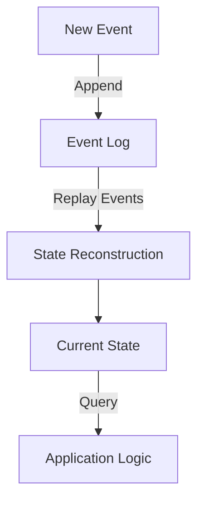

## 8.14. Event Sourcing Pattern in Clojure

### Introduction to Event Sourcing

Event Sourcing is a powerful design pattern that captures all changes to an application's state as a sequence of events. Instead of storing the current state directly, the system records each state change as an event. This approach provides a robust mechanism for reconstructing past states, auditing changes, and ensuring data integrity.

#### Advantages of Event Sourcing

1. **Auditability**: Every change is logged, allowing for complete traceability and accountability.
2. **Reproducibility**: The entire state can be reconstructed from the event log, enabling debugging and historical analysis.
3. **Scalability**: Event logs can be distributed across systems, facilitating scalability and fault tolerance.
4. **Flexibility**: New features can be added by replaying events with additional logic, without altering existing data.

### Representing Events in Clojure

In Clojure, events can be represented as immutable data structures, typically maps. Each event contains a type and relevant data, capturing the essence of a state change.

```clojure
(defn create-event [event-type data]
  {:type event-type
   :timestamp (System/currentTimeMillis)
   :data data})

(defn account-created [account-id initial-balance]
  (create-event :account-created {:account-id account-id
                                  :initial-balance initial-balance}))

(defn funds-deposited [account-id amount]
  (create-event :funds-deposited {:account-id account-id
                                  :amount amount}))
```

### Applying Events to State

To apply events to state, we define a function that takes the current state and an event, returning the new state. This function acts as a reducer, processing each event in sequence to build the final state.

```clojure
(defn apply-event [state event]
  (case (:type event)
    :account-created (assoc state (:account-id (:data event)) {:balance (:initial-balance (:data event))})
    :funds-deposited (update-in state [(:account-id (:data event)) :balance] + (:amount (:data event)))
    state))
```

### Building and Restoring State from Events

To build or restore the state, we start with an initial state and apply each event in the log sequentially.

```clojure
(defn build-state [events]
  (reduce apply-event {} events))

;; Example usage
(def events [(account-created "123" 1000)
             (funds-deposited "123" 200)])

(def current-state (build-state events))
;; => {"123" {:balance 1200}}
```

### Considerations for Event Sourcing

#### Performance

- **Event Storage**: Efficient storage mechanisms are crucial. Consider using databases optimized for write-heavy operations.
- **Event Replay**: Replaying events can be computationally expensive. Use snapshots to periodically capture the state, reducing the number of events to replay.

#### Consistency

- **Event Ordering**: Ensure events are processed in the correct order to maintain consistency.
- **Idempotency**: Design event handlers to be idempotent, allowing safe reprocessing of events.

### Tools and Libraries Supporting Event Sourcing in Clojure

Several libraries and tools can facilitate event sourcing in Clojure:

- **Datomic**: A database designed for immutable data and time-based queries, ideal for event sourcing.
- **EventStore**: A specialized database for event sourcing, with Clojure client libraries available.
- **Kafka**: A distributed streaming platform that can be used to store and process event streams.

### Visualizing Event Sourcing in Clojure

Below is a diagram illustrating the flow of events and state reconstruction in an event-sourced system.



### Try It Yourself

Experiment with the code examples by modifying the event types or adding new events. Consider implementing a withdrawal event and updating the `apply-event` function to handle it.

### Summary

Event Sourcing in Clojure provides a robust framework for managing state changes, ensuring data integrity, and enabling powerful auditing capabilities. By leveraging Clojure's immutable data structures and functional programming paradigms, we can build scalable and maintainable systems.

### Ready to Test Your Knowledge?



### What is the primary advantage of using Event Sourcing?

- [x] Complete traceability and accountability of state changes
- [ ] Simplified data storage
- [ ] Reduced computational complexity
- [ ] Enhanced user interface design

> **Explanation:** Event Sourcing logs every state change as an event, providing complete traceability and accountability.

### How are events typically represented in Clojure?

- [x] As immutable maps
- [ ] As mutable objects
- [ ] As XML documents
- [ ] As JSON strings

> **Explanation:** Events in Clojure are typically represented as immutable maps, capturing the type and data of the event.

### What function is used to apply events to state in the provided example?

- [x] `apply-event`
- [ ] `create-event`
- [ ] `build-state`
- [ ] `process-event`

> **Explanation:** The `apply-event` function takes the current state and an event, returning the new state.

### Which library is NOT mentioned as supporting event sourcing in Clojure?

- [ ] Datomic
- [ ] EventStore
- [ ] Kafka
- [x] Redis

> **Explanation:** Redis is not mentioned in the article as a tool for event sourcing in Clojure.

### What is a key consideration when replaying events?

- [x] Performance and computational cost
- [ ] User interface design
- [ ] Network latency
- [ ] Color scheme of the application

> **Explanation:** Replaying events can be computationally expensive, so performance is a key consideration.

### What is the purpose of using snapshots in event sourcing?

- [x] To reduce the number of events to replay
- [ ] To enhance the user interface
- [ ] To increase network bandwidth
- [ ] To simplify event creation

> **Explanation:** Snapshots capture the state at a point in time, reducing the number of events needed to reconstruct the state.

### What is the role of idempotency in event sourcing?

- [x] Ensures safe reprocessing of events
- [ ] Enhances user experience
- [ ] Reduces memory usage
- [ ] Increases computational complexity

> **Explanation:** Idempotency ensures that event handlers can safely reprocess events without unintended side effects.

### Which of the following is a benefit of event sourcing?

- [x] Flexibility in adding new features
- [ ] Simplified user interface
- [ ] Reduced storage requirements
- [ ] Enhanced color schemes

> **Explanation:** Event sourcing allows new features to be added by replaying events with additional logic.

### What is the initial state used in the `build-state` function?

- [x] An empty map
- [ ] A list of events
- [ ] A JSON object
- [ ] A mutable object

> **Explanation:** The `build-state` function starts with an empty map and applies each event to build the final state.

### True or False: Event Sourcing is primarily used for enhancing user interfaces.

- [ ] True
- [x] False

> **Explanation:** Event Sourcing is primarily used for managing state changes, ensuring data integrity, and enabling auditing, not for enhancing user interfaces.



Remember, this is just the beginning. As you progress, you'll build more complex and interactive systems using event sourcing. Keep experimenting, stay curious, and enjoy the journey!


