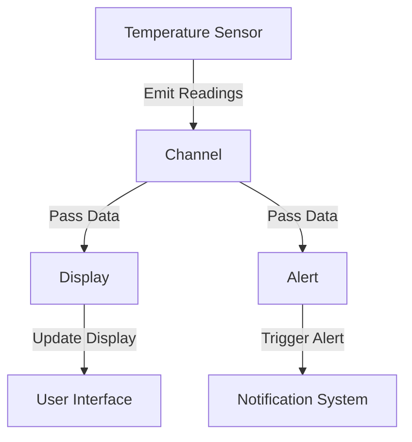

## 8.15. Implementing Reactive Programming Concepts

Reactive programming is a paradigm that focuses on the propagation of change and the flow of data. In Clojure, this approach is particularly powerful due to its functional nature and robust concurrency primitives. This section will guide you through the fundamentals of reactive programming, how to model data flows and dependencies, and how to leverage Clojure's core abstractions and libraries to build responsive and scalable applications.

### Understanding Reactive Programming

Reactive programming is about building systems that react to changes in data. It emphasizes:

- **Data Flow**: The movement of data through a system, where changes in one part of the system automatically propagate to other parts.
- **Change Propagation**: The automatic updating of dependent computations when the data they depend on changes.
- **Asynchronous Data Streams**: Handling data as it arrives, rather than waiting for all data to be available before processing.

#### Key Concepts

1. **Observables and Observers**: Observables are data sources that emit values over time, while observers subscribe to these observables to receive updates.
2. **Streams**: A sequence of ongoing events ordered in time, which can be processed asynchronously.
3. **Functional Reactive Programming (FRP)**: Combines functional programming with reactive programming to handle asynchronous data streams in a declarative manner.

### Modeling Data Flows and Dependencies

In reactive programming, modeling data flows involves defining how data moves through the system and how changes in data trigger updates in dependent computations.

#### Example: Temperature Monitoring System

Consider a temperature monitoring system where sensors emit temperature readings. We want to react to these readings by updating a display and triggering alerts if the temperature exceeds a threshold.

```clojure
(defn temperature-sensor []
  ;; Simulate a temperature sensor emitting readings
  (repeatedly #(rand-int 100)))

(defn display [temperature]
  ;; Display the temperature
  (println "Current Temperature:" temperature))

(defn alert [temperature]
  ;; Trigger an alert if temperature exceeds threshold
  (when (> temperature 75)
    (println "Alert! High Temperature:" temperature)))

(defn monitor-temperature []
  (let [sensor (temperature-sensor)]
    (doseq [temperature sensor]
      (display temperature)
      (alert temperature))))
```

### Leveraging Clojure's Core Abstractions

Clojure provides several abstractions and libraries that facilitate reactive programming, such as `core.async` and `manifold`.

#### Using `core.async`

`core.async` is a library that brings asynchronous programming capabilities to Clojure, allowing you to work with channels and go blocks to manage data flow and concurrency.

```clojure
(require '[clojure.core.async :refer [chan go <! >!]])

(defn temperature-sensor []
  ;; Simulate a temperature sensor emitting readings
  (repeatedly #(rand-int 100)))

(defn monitor-temperature []
  (let [sensor (temperature-sensor)
        ch (chan)]
    (go
      (doseq [temperature sensor]
        (>! ch temperature)))
    (go
      (while true
        (let [temperature (<! ch)]
          (println "Current Temperature:" temperature)
          (when (> temperature 75)
            (println "Alert! High Temperature:" temperature)))))))
```

### Benefits of Reactive Programming

Reactive programming offers several benefits, particularly in terms of responsiveness and scalability:

- **Responsiveness**: Systems can react to changes in real-time, providing immediate feedback to users.
- **Scalability**: By handling data asynchronously, systems can scale to handle large volumes of data without blocking.
- **Declarative Code**: Reactive programming allows you to express complex data flows and dependencies declaratively, making code easier to understand and maintain.

### Paradigm Shift from Imperative Styles

Embracing reactive programming requires a shift from traditional imperative styles to a more declarative approach. This involves:

- **Thinking in Streams**: Instead of processing data in batches, think of data as continuous streams that can be transformed and combined.
- **Emphasizing Composition**: Build complex behaviors by composing simple, reusable functions that operate on streams.
- **Handling Asynchrony**: Use abstractions like channels and go blocks to manage asynchronous data flows without blocking.

### Visualizing Reactive Programming in Clojure

To better understand how reactive programming works in Clojure, let's visualize the flow of data and the propagation of changes using a Mermaid.js diagram.



**Diagram Description**: This diagram illustrates the flow of data in a reactive temperature monitoring system. The temperature sensor emits readings that are passed through a channel to both the display and alert components. The display updates the user interface, while the alert triggers notifications if necessary.

### Try It Yourself

Experiment with the code examples provided by modifying the temperature threshold or adding additional processing steps. Consider how you might extend the system to handle multiple sensors or integrate with external systems.

### References and Further Reading

- [ReactiveX Documentation](http://reactivex.io/documentation)
- [Clojure Core.Async Guide](https://clojure.org/guides/core_async)
- [Functional Reactive Programming in Clojure](https://www.infoq.com/articles/functional-reactive-programming-clojure/)

### Knowledge Check

To reinforce your understanding of reactive programming concepts in Clojure, try answering the following questions and challenges.

## **Ready to Test Your Knowledge?**



### What is the primary focus of reactive programming?

- [x] Propagation of change and data flow
- [ ] Object-oriented design
- [ ] Static typing
- [ ] Manual memory management

> **Explanation:** Reactive programming emphasizes the propagation of change and the flow of data through a system.

### Which Clojure library is commonly used for asynchronous programming?

- [x] core.async
- [ ] clojure.spec
- [ ] clojure.test
- [ ] clojure.java.jdbc

> **Explanation:** `core.async` is a library that provides asynchronous programming capabilities in Clojure.

### What is a key benefit of reactive programming?

- [x] Responsiveness
- [ ] Increased memory usage
- [ ] Slower execution
- [ ] Complexity

> **Explanation:** Reactive programming enhances responsiveness by allowing systems to react to changes in real-time.

### In reactive programming, what is an observable?

- [x] A data source that emits values over time
- [ ] A function that processes data
- [ ] A variable that stores data
- [ ] A static data structure

> **Explanation:** An observable is a data source that emits values over time, which observers can subscribe to.

### What does the `go` block in `core.async` do?

- [x] Manages asynchronous data flow
- [ ] Blocks execution
- [ ] Compiles code
- [ ] Handles exceptions

> **Explanation:** The `go` block in `core.async` is used to manage asynchronous data flow without blocking execution.

### Which of the following is a characteristic of reactive programming?

- [x] Declarative code
- [ ] Imperative loops
- [ ] Synchronous execution
- [ ] Static typing

> **Explanation:** Reactive programming often involves declarative code, where data flows and dependencies are expressed clearly.

### How does reactive programming improve scalability?

- [x] By handling data asynchronously
- [ ] By using more memory
- [ ] By increasing CPU usage
- [ ] By reducing code complexity

> **Explanation:** Reactive programming improves scalability by handling data asynchronously, allowing systems to process large volumes of data efficiently.

### What is a stream in reactive programming?

- [x] A sequence of ongoing events ordered in time
- [ ] A static array of data
- [ ] A single data point
- [ ] A compiled program

> **Explanation:** A stream is a sequence of ongoing events ordered in time, which can be processed asynchronously.

### True or False: Reactive programming requires a paradigm shift from imperative styles.

- [x] True
- [ ] False

> **Explanation:** Reactive programming requires a shift from traditional imperative styles to a more declarative approach, focusing on data flows and change propagation.

### Which of the following is NOT a benefit of reactive programming?

- [ ] Responsiveness
- [ ] Scalability
- [ ] Declarative code
- [x] Increased complexity

> **Explanation:** Reactive programming aims to reduce complexity by providing clear, declarative ways to handle data flows and dependencies.



Remember, this is just the beginning. As you progress, you'll build more complex and interactive systems using reactive programming concepts. Keep experimenting, stay curious, and enjoy the journey!
