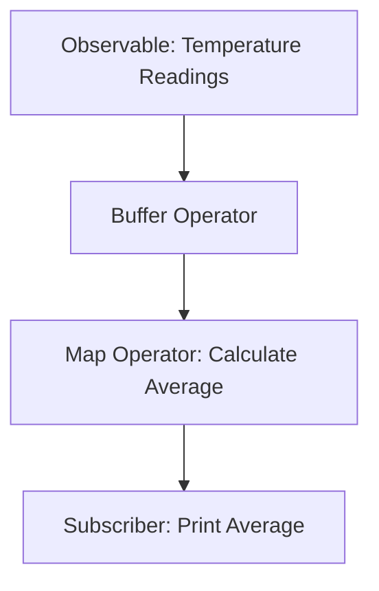

## 8.16. Functional Reactive Programming with RxClojure

Functional Reactive Programming (FRP) is a paradigm for programming with asynchronous data streams. RxClojure is a library that brings the power of ReactiveX to Clojure, allowing developers to compose asynchronous and event-based programs using functional programming techniques. In this section, we will explore the core concepts of RxClojure, including Observables and Subscribers, and demonstrate how to use them to handle real-time data processing efficiently.

### Introduction to RxClojure

RxClojure is a Clojure binding for the ReactiveX library, which is a set of tools for working with asynchronous data streams. ReactiveX allows you to treat events as collections and provides a rich set of operators to transform, filter, and combine these event streams.

#### Core Concepts

- **Observables**: The core type in RxClojure, representing a stream of data or events.
- **Subscribers**: Consumers of data from an Observable, which react to emitted items.
- **Operators**: Functions that allow you to manipulate and transform data streams.

### Observables and Subscribers

Observables are the heart of RxClojure. They represent a sequence of data or events that can be asynchronously pushed to subscribers. Observables can emit zero or more items and can complete successfully or with an error.

#### Creating Observables

You can create Observables in RxClojure using various methods. Here's a simple example of creating an Observable that emits a sequence of numbers:

```clojure
(require '[rx.lang.clojure.core :as rx])

(def numbers (rx/observable [1 2 3 4 5]))

(rx/subscribe numbers
  (fn [item] (println "Received:" item))
  (fn [error] (println "Error:" error))
  (fn [] (println "Completed")))
```

In this example, we create an Observable from a vector of numbers. We then subscribe to this Observable, providing three functions: one for handling each emitted item, one for handling errors, and one for handling completion.

#### Transforming Observables

RxClojure provides a wide range of operators to transform Observables. For example, you can use the `map` operator to apply a function to each item emitted by an Observable:

```clojure
(def squared-numbers (rx/map #(* % %) numbers))

(rx/subscribe squared-numbers
  (fn [item] (println "Squared:" item)))
```

This code will print the square of each number in the original Observable.

### Composing Asynchronous Operations

One of the strengths of RxClojure is its ability to compose complex asynchronous operations using a declarative style. You can chain operators to build sophisticated data processing pipelines.

#### Example: Real-Time Data Processing

Let's consider a real-time data processing scenario where we receive a stream of temperature readings and want to calculate the moving average:

```clojure
(def temperatures (rx/observable [20 21 19 22 23 24 25]))

(def moving-average
  (-> temperatures
      (rx/buffer 3 1) ; Create overlapping windows of 3 readings
      (rx/map #(double (/ (reduce + %) (count %))))))

(rx/subscribe moving-average
  (fn [avg] (println "Moving Average:" avg)))
```

In this example, we use the `buffer` operator to create overlapping windows of three readings and then calculate the average for each window using `map`.

### Advantages of RxClojure

RxClojure offers several advantages over traditional callback-based approaches:

- **Composability**: RxClojure allows you to compose complex asynchronous operations using a declarative style, making your code more readable and maintainable.
- **Error Handling**: With RxClojure, you can handle errors in a centralized manner, reducing the risk of unhandled exceptions.
- **Concurrency**: RxClojure provides built-in support for concurrency, allowing you to process data streams in parallel without the need for explicit thread management.

### Use Cases

RxClojure is well-suited for a variety of use cases, including:

- **Real-Time Data Processing**: Process streams of data in real-time, such as sensor readings or user interactions.
- **Event-Driven Systems**: Build systems that react to events, such as user actions or network messages.
- **Asynchronous I/O**: Handle asynchronous I/O operations, such as reading from a database or making HTTP requests.

### Visualizing RxClojure

To better understand how Observables and Subscribers interact, let's visualize the flow of data in a simple RxClojure pipeline:



This diagram illustrates a data flow where temperature readings are buffered, averaged, and then printed by a subscriber.

### Try It Yourself

Experiment with the following code example by modifying the sequence of numbers or the buffer size:

```clojure
(def temperatures (rx/observable [20 21 19 22 23 24 25]))

(def moving-average
  (-> temperatures
      (rx/buffer 3 1) ; Try changing the buffer size
      (rx/map #(double (/ (reduce + %) (count %))))))

(rx/subscribe moving-average
  (fn [avg] (println "Moving Average:" avg)))
```

### Further Reading

For more information on RxClojure, visit the [RxClojure GitHub repository](https://github.com/ReactiveX/RxClojure).

### Knowledge Check

To reinforce your understanding of RxClojure, try answering the following questions:

## **Ready to Test Your Knowledge?**



### What is the core type in RxClojure that represents a stream of data or events?

- [x] Observable
- [ ] Subscriber
- [ ] Operator
- [ ] Function

> **Explanation:** An Observable is the core type in RxClojure that represents a stream of data or events.

### Which function is used to apply a transformation to each item emitted by an Observable?

- [ ] filter
- [x] map
- [ ] reduce
- [ ] buffer

> **Explanation:** The `map` function is used to apply a transformation to each item emitted by an Observable.

### What operator would you use to create overlapping windows of data in RxClojure?

- [ ] map
- [ ] filter
- [x] buffer
- [ ] reduce

> **Explanation:** The `buffer` operator is used to create overlapping windows of data in RxClojure.

### Which of the following is NOT an advantage of using RxClojure?

- [ ] Composability
- [ ] Error Handling
- [ ] Concurrency
- [x] Increased Complexity

> **Explanation:** RxClojure simplifies code by providing composability, error handling, and concurrency, not increased complexity.

### What is the purpose of a Subscriber in RxClojure?

- [x] To consume data from an Observable
- [ ] To transform data in an Observable
- [ ] To create new Observables
- [ ] To handle errors in Observables

> **Explanation:** A Subscriber consumes data from an Observable and reacts to emitted items.

### How can you handle errors in an Observable stream?

- [x] By providing an error handling function in the subscribe method
- [ ] By using a try-catch block
- [ ] By ignoring them
- [ ] By logging them

> **Explanation:** Errors in an Observable stream can be handled by providing an error handling function in the subscribe method.

### What is the role of the `map` operator in RxClojure?

- [x] To transform each item emitted by an Observable
- [ ] To filter items in an Observable
- [ ] To create new Observables
- [ ] To handle errors

> **Explanation:** The `map` operator is used to transform each item emitted by an Observable.

### Which of the following is a common use case for RxClojure?

- [x] Real-Time Data Processing
- [ ] Static Data Analysis
- [ ] Synchronous I/O
- [ ] Batch Processing

> **Explanation:** RxClojure is commonly used for real-time data processing.

### True or False: RxClojure provides built-in support for concurrency.

- [x] True
- [ ] False

> **Explanation:** RxClojure provides built-in support for concurrency, allowing parallel processing of data streams.

### Which operator would you use to calculate the moving average of a data stream?

- [ ] filter
- [ ] map
- [x] buffer
- [ ] reduce

> **Explanation:** The `buffer` operator is used to create windows of data, which can then be averaged using `map`.



Remember, this is just the beginning. As you progress, you'll build more complex and interactive applications using RxClojure. Keep experimenting, stay curious, and enjoy the journey!
