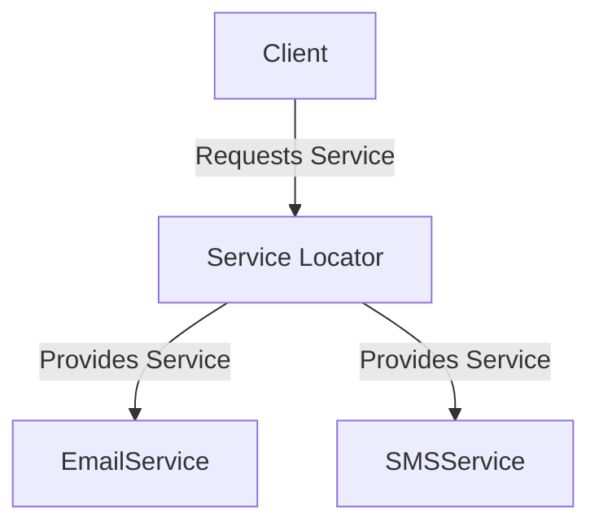

## 8.17. Service Locator Pattern

### Introduction

In the realm of software design patterns, the **Service Locator Pattern** stands out as a powerful tool for managing dependencies and services in a centralized manner. This pattern provides a mechanism to retrieve services using a centralized registry, allowing clients to access them without needing to know the details of their implementations. In this section, we will delve into the Service Locator Pattern, explore its implementation in Clojure, and discuss its advantages and potential pitfalls.

### Understanding the Service Locator Pattern

The Service Locator Pattern is a design pattern used to encapsulate the processes involved in obtaining a service with a strong abstraction layer. It acts as a registry for all services, providing a single point of access for service retrieval. This pattern is particularly useful in scenarios where multiple services need to be accessed by various components of an application.

#### Intent

The primary intent of the Service Locator Pattern is to decouple the client from the concrete implementations of services. By using a service locator, clients can request services without needing to know how they are instantiated or managed. This promotes a more modular and maintainable codebase.

#### Key Participants

- **Service Locator**: The central registry that holds references to services and provides methods to retrieve them.
- **Service**: The actual service implementation that provides specific functionality.
- **Client**: The component that requires access to a service.

### Implementing the Service Locator Pattern in Clojure

Clojure, with its functional programming paradigm and emphasis on immutability, offers unique ways to implement the Service Locator Pattern. Let's explore how we can create a simple service locator in Clojure.

#### Step 1: Define a Protocol for Services

In Clojure, protocols provide a way to define a set of functions that can be implemented by different types. We can use a protocol to define the interface for our services.

```clojure
(defprotocol Service
  (execute [this] "Execute the service operation."))
```

#### Step 2: Implement Concrete Services

Next, we implement concrete services that adhere to the `Service` protocol.

```clojure
(defrecord EmailService []
  Service
  (execute [this]
    (println "Sending email...")))

(defrecord SMSService []
  Service
  (execute [this]
    (println "Sending SMS...")))
```

#### Step 3: Create the Service Locator

The service locator will be responsible for registering and retrieving services. We can use a Clojure map to store service instances.

```clojure
(def service-registry (atom {}))

(defn register-service [key service]
  (swap! service-registry assoc key service))

(defn get-service [key]
  (get @service-registry key))
```

#### Step 4: Register and Retrieve Services

Now, let's register our services and retrieve them using the service locator.

```clojure
(register-service :email (->EmailService))
(register-service :sms (->SMSService))

(def email-service (get-service :email))
(def sms-service (get-service :sms))

(execute email-service) ; Output: Sending email...
(execute sms-service)   ; Output: Sending SMS...
```

### Visualizing the Service Locator Pattern

To better understand the flow of the Service Locator Pattern, let's visualize it using a Mermaid.js diagram.



**Diagram Description**: The client requests a service from the Service Locator, which then provides the appropriate service instance, such as `EmailService` or `SMSService`.

### Alternatives to the Service Locator Pattern

While the Service Locator Pattern offers a centralized way to manage services, it's important to consider alternatives like Dependency Injection (DI). DI involves injecting dependencies directly into a component, often at construction time, which can lead to more explicit and testable code.

#### Dependency Injection vs. Service Locator

- **Dependency Injection**: Promotes explicit dependencies and is often preferred in scenarios where testability and clarity are paramount.
- **Service Locator**: Offers a centralized registry, which can be useful in complex systems where services need to be dynamically resolved.

### Potential Drawbacks of the Service Locator Pattern

Despite its advantages, the Service Locator Pattern has some potential drawbacks:

- **Hidden Dependencies**: Clients may not be aware of the dependencies they are using, leading to less transparent code.
- **Tight Coupling**: Over-reliance on a service locator can lead to tight coupling between the locator and the services.
- **Testing Challenges**: Mocking services for testing can be more challenging compared to dependency injection.

### Clojure-Specific Considerations

Clojure's emphasis on immutability and functional programming offers unique advantages when implementing the Service Locator Pattern. By using immutable data structures and pure functions, we can create a more predictable and maintainable service locator.

### Try It Yourself

To deepen your understanding of the Service Locator Pattern in Clojure, try modifying the code examples provided. Consider adding new services, such as a `NotificationService`, and explore how the service locator can be extended to support additional functionality.

### Summary

The Service Locator Pattern provides a centralized approach to managing and accessing services in a Clojure application. While it offers several benefits, such as decoupling clients from service implementations, it's important to be aware of its potential drawbacks and consider alternatives like dependency injection. By leveraging Clojure's unique features, we can implement a robust and maintainable service locator.

## **Ready to Test Your Knowledge?**



### What is the primary intent of the Service Locator Pattern?

- [x] To decouple the client from the concrete implementations of services
- [ ] To tightly couple the client with the service implementations
- [ ] To provide a direct access to service implementations
- [ ] To eliminate the need for service interfaces

> **Explanation:** The Service Locator Pattern aims to decouple the client from the concrete implementations of services by providing a centralized registry for service access.

### Which Clojure construct is used to define a set of functions that can be implemented by different types?

- [x] Protocol
- [ ] Macro
- [ ] Atom
- [ ] Namespace

> **Explanation:** In Clojure, a protocol is used to define a set of functions that can be implemented by different types, providing a way to achieve polymorphism.

### What is a potential drawback of the Service Locator Pattern?

- [x] Hidden dependencies
- [ ] Increased transparency
- [ ] Simplified testing
- [ ] Reduced coupling

> **Explanation:** One potential drawback of the Service Locator Pattern is hidden dependencies, where clients may not be aware of the services they are using.

### How can services be registered in the service locator in Clojure?

- [x] Using a map stored in an atom
- [ ] Using a list stored in a ref
- [ ] Using a vector stored in an agent
- [ ] Using a set stored in a var

> **Explanation:** Services can be registered in the service locator using a map stored in an atom, allowing for thread-safe updates.

### What is an alternative to the Service Locator Pattern?

- [x] Dependency Injection
- [ ] Singleton Pattern
- [ ] Factory Pattern
- [ ] Observer Pattern

> **Explanation:** Dependency Injection is an alternative to the Service Locator Pattern, promoting explicit dependencies and often leading to more testable code.

### In the provided code example, what does the `execute` function do?

- [x] Executes the service operation
- [ ] Registers a new service
- [ ] Retrieves a service from the registry
- [ ] Deletes a service from the registry

> **Explanation:** The `execute` function in the provided code example executes the service operation, such as sending an email or SMS.

### What is a benefit of using Clojure's immutable data structures in the Service Locator Pattern?

- [x] Predictable and maintainable service locator
- [ ] Increased mutability
- [ ] Reduced performance
- [ ] Complex codebase

> **Explanation:** Using Clojure's immutable data structures in the Service Locator Pattern leads to a more predictable and maintainable service locator.

### Which of the following is a key participant in the Service Locator Pattern?

- [x] Service Locator
- [ ] Singleton
- [ ] Factory
- [ ] Observer

> **Explanation:** The Service Locator is a key participant in the Service Locator Pattern, acting as the central registry for services.

### True or False: The Service Locator Pattern promotes explicit dependencies.

- [ ] True
- [x] False

> **Explanation:** False. The Service Locator Pattern can lead to hidden dependencies, as clients may not be aware of the services they are using.

### What is the role of the `register-service` function in the Clojure code example?

- [x] To add a service to the service registry
- [ ] To remove a service from the service registry
- [ ] To execute a service operation
- [ ] To retrieve a service from the service registry

> **Explanation:** The `register-service` function adds a service to the service registry, allowing it to be retrieved later.



Remember, mastering design patterns like the Service Locator Pattern is just one step in your journey to becoming a proficient Clojure developer. Keep exploring, experimenting, and building your skills!
