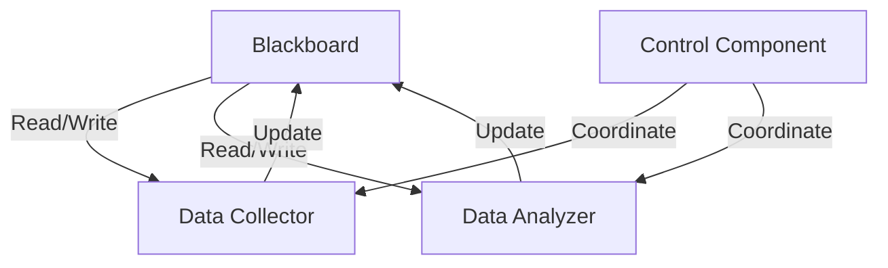

## 8.18. Blackboard Pattern

The Blackboard Pattern is a powerful architectural pattern used in artificial intelligence and complex problem-solving domains. It involves multiple components or "knowledge sources" that collaborate by reading and writing to a shared data structure known as the "blackboard." This pattern is particularly effective in scenarios where the solution to a problem emerges from the contributions of various specialized components.

### Intent

The intent of the Blackboard Pattern is to provide a flexible and dynamic problem-solving architecture where different components can contribute to the solution by interacting with a shared knowledge base. This pattern is especially useful in situations where the problem-solving process is not linear and requires the integration of diverse expertise.

### Key Participants

1. **Blackboard**: The central data structure that holds the current state of the problem and potential solutions. It acts as the shared memory for all components.
2. **Knowledge Sources**: Independent components that contribute to the problem-solving process by reading from and writing to the blackboard.
3. **Control Component**: Manages the flow of information and coordination among knowledge sources. It decides which knowledge source should act next based on the current state of the blackboard.

### Applicability

The Blackboard Pattern is applicable in scenarios where:
- The problem is complex and requires the integration of different types of expertise.
- The solution is not predetermined and emerges through the interaction of multiple components.
- Flexibility and adaptability are required in the problem-solving process.

### Implementing the Blackboard Pattern in Clojure

In Clojure, we can implement the blackboard using immutable data structures and concurrency primitives like atoms or refs. Atoms are suitable for managing shared, synchronous, and independent state, while refs are ideal for coordinated, synchronous updates in a transactional context.

#### Example: Solving a Complex Problem with the Blackboard Pattern

Let's consider a simplified example where we use the Blackboard Pattern to solve a complex problem involving data analysis. We'll have multiple knowledge sources, each responsible for a specific aspect of the analysis.

```clojure
(ns blackboard-pattern.core
  (:require [clojure.core.async :as async]))

;; Define the blackboard as an atom
(def blackboard (atom {:data [] :results []}))

;; Knowledge source 1: Data Collector
(defn data-collector []
  (swap! blackboard update :data conj (range 1 10))
  (println "Data collected:" (:data @blackboard)))

;; Knowledge source 2: Data Analyzer
(defn data-analyzer []
  (let [data (:data @blackboard)]
    (when (seq data)
      (let [analysis (reduce + data)]
        (swap! blackboard update :results conj analysis)
        (println "Data analyzed:" analysis)))))

;; Control component to coordinate knowledge sources
(defn control-loop []
  (data-collector)
  (data-analyzer)
  (println "Final Blackboard State:" @blackboard))

;; Run the control loop
(control-loop)
```

In this example, we have two knowledge sources: `data-collector` and `data-analyzer`. The `data-collector` gathers data and writes it to the blackboard, while the `data-analyzer` processes the data and updates the results on the blackboard. The `control-loop` orchestrates the execution of these components.

### Synchronization and Coordination

Synchronization and coordination are crucial in the Blackboard Pattern to ensure that knowledge sources do not interfere with each other. In Clojure, we can use atoms for independent updates and refs for coordinated updates. The choice between atoms and refs depends on the level of coordination required among knowledge sources.

#### Using Refs for Coordinated Updates

If our problem-solving process requires coordinated updates, we can use refs and transactions to ensure consistency.

```clojure
(def blackboard (ref {:data [] :results []}))

(defn data-collector []
  (dosync
    (alter blackboard update :data conj (range 1 10))
    (println "Data collected:" (:data @blackboard))))

(defn data-analyzer []
  (dosync
    (let [data (:data @blackboard)]
      (when (seq data)
        (let [analysis (reduce + data)]
          (alter blackboard update :results conj analysis)
          (println "Data analyzed:" analysis))))))

(defn control-loop []
  (data-collector)
  (data-analyzer)
  (println "Final Blackboard State:" @blackboard))

(control-loop)
```

In this version, we use `dosync` to ensure that updates to the blackboard are atomic and consistent.

### Scenarios Where the Blackboard Pattern is Effective

The Blackboard Pattern is particularly effective in the following scenarios:
- **AI and Machine Learning**: Integrating various algorithms and models to solve complex problems.
- **Data Fusion**: Combining data from multiple sources to create a comprehensive view.
- **Collaborative Systems**: Enabling multiple agents or systems to work together towards a common goal.

### Clojure Unique Features

Clojure's immutable data structures and concurrency primitives make it an excellent choice for implementing the Blackboard Pattern. The use of atoms and refs allows for safe and efficient management of shared state, while the language's functional nature promotes modular and composable knowledge sources.

### Differences and Similarities with Other Patterns

The Blackboard Pattern is often compared to the Observer Pattern, as both involve multiple components interacting with shared data. However, the Blackboard Pattern is more focused on collaborative problem-solving, while the Observer Pattern is about notifying observers of changes in state.

### Design Considerations

When implementing the Blackboard Pattern, consider the following:
- **Concurrency**: Ensure that knowledge sources do not interfere with each other.
- **Scalability**: Design the blackboard to handle large amounts of data and interactions.
- **Flexibility**: Allow for easy addition and modification of knowledge sources.

### Try It Yourself

Experiment with the provided code examples by adding new knowledge sources or modifying existing ones. Consider implementing a more complex problem-solving scenario, such as a simple AI system that integrates multiple algorithms.

### Visualizing the Blackboard Pattern

To better understand the flow of information in the Blackboard Pattern, let's visualize the interaction between components using a Mermaid.js diagram.



This diagram illustrates how the blackboard serves as the central hub for data exchange between knowledge sources, with the control component managing the flow of information.

### References and Links

- [Clojure Documentation](https://clojure.org/reference)
- [Concurrency in Clojure](https://clojure.org/reference/atoms)
- [Design Patterns: Elements of Reusable Object-Oriented Software](https://en.wikipedia.org/wiki/Design_Patterns)

## **Ready to Test Your Knowledge?**



### What is the primary purpose of the Blackboard Pattern?

- [x] To provide a flexible and dynamic problem-solving architecture where different components can contribute to the solution by interacting with a shared knowledge base.
- [ ] To notify observers of changes in state.
- [ ] To encapsulate a request as an object.
- [ ] To define a family of algorithms and make them interchangeable.

> **Explanation:** The Blackboard Pattern is designed to facilitate collaborative problem-solving by allowing different components to interact with a shared knowledge base.

### Which Clojure concurrency primitive is suitable for managing shared, synchronous, and independent state?

- [x] Atoms
- [ ] Refs
- [ ] Agents
- [ ] Vars

> **Explanation:** Atoms are used for managing shared, synchronous, and independent state in Clojure.

### In the Blackboard Pattern, what role does the control component play?

- [x] It manages the flow of information and coordination among knowledge sources.
- [ ] It stores the current state of the problem and potential solutions.
- [ ] It acts as an independent component contributing to the problem-solving process.
- [ ] It provides a user interface for interacting with the system.

> **Explanation:** The control component is responsible for managing the flow of information and coordination among knowledge sources.

### What is a key benefit of using the Blackboard Pattern in AI applications?

- [x] It allows for the integration of various algorithms and models to solve complex problems.
- [ ] It simplifies the user interface design.
- [ ] It reduces the need for data validation.
- [ ] It eliminates the need for concurrency control.

> **Explanation:** The Blackboard Pattern is beneficial in AI applications because it allows for the integration of various algorithms and models to solve complex problems.

### Which Clojure concurrency primitive is ideal for coordinated, synchronous updates in a transactional context?

- [x] Refs
- [ ] Atoms
- [ ] Agents
- [ ] Vars

> **Explanation:** Refs are ideal for coordinated, synchronous updates in a transactional context in Clojure.

### How does the Blackboard Pattern differ from the Observer Pattern?

- [x] The Blackboard Pattern focuses on collaborative problem-solving, while the Observer Pattern is about notifying observers of changes in state.
- [ ] The Blackboard Pattern is used for encapsulating requests as objects.
- [ ] The Blackboard Pattern is used for defining a family of algorithms.
- [ ] The Blackboard Pattern is used for creating a user interface.

> **Explanation:** The Blackboard Pattern is focused on collaborative problem-solving, whereas the Observer Pattern is about notifying observers of changes in state.

### What is a common application of the Blackboard Pattern?

- [x] Data fusion and collaborative systems.
- [ ] User interface design.
- [ ] Data validation.
- [ ] Simplifying concurrency control.

> **Explanation:** The Blackboard Pattern is commonly used in data fusion and collaborative systems.

### What is the role of the blackboard in the Blackboard Pattern?

- [x] It acts as the central data structure that holds the current state of the problem and potential solutions.
- [ ] It manages the flow of information and coordination among knowledge sources.
- [ ] It provides a user interface for interacting with the system.
- [ ] It encapsulates requests as objects.

> **Explanation:** The blackboard acts as the central data structure that holds the current state of the problem and potential solutions.

### Which of the following is a key design consideration for the Blackboard Pattern?

- [x] Ensuring concurrency and scalability.
- [ ] Simplifying user interface design.
- [ ] Reducing the need for data validation.
- [ ] Eliminating the need for concurrency control.

> **Explanation:** Ensuring concurrency and scalability is a key design consideration for the Blackboard Pattern.

### True or False: The Blackboard Pattern is only applicable in AI applications.

- [ ] True
- [x] False

> **Explanation:** The Blackboard Pattern is not limited to AI applications; it is applicable in any scenario where collaborative problem-solving is required.



Remember, this is just the beginning. As you progress, you'll build more complex and interactive systems using the Blackboard Pattern. Keep experimenting, stay curious, and enjoy the journey!
