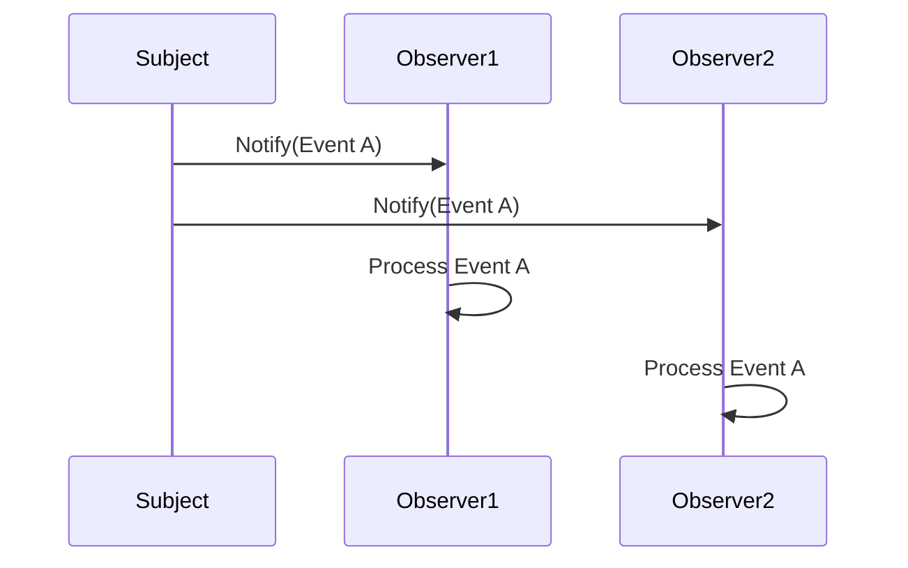

## 8.2. Observer Pattern Using Core.Async Channels

The Observer Pattern is a fundamental design pattern used extensively in software development to create a one-to-many dependency between objects. When one object changes state, all its dependents are notified and updated automatically. In Clojure, the `core.async` library provides a powerful way to implement this pattern using channels, offering a more flexible and efficient alternative to traditional callback mechanisms.

### Understanding the Observer Pattern

**Intent**: The Observer Pattern defines a subscription mechanism to allow multiple objects to listen and react to events or changes in another object.

**Use Cases**:
- Implementing event-driven systems.
- Creating reactive user interfaces.
- Monitoring changes in data models.
- Building publish-subscribe systems.

### Introducing Core.Async Channels

Clojure's `core.async` library introduces channels, which are abstractions for communication between concurrent processes. Channels allow you to pass messages between different parts of your program, making them ideal for implementing the Observer Pattern.

**Key Concepts**:
- **Channels**: Act as conduits for passing messages.
- **Go Blocks**: Lightweight threads that can perform asynchronous operations.
- **Puts and Takes**: Operations to send and receive messages on channels.

### Setting Up Observers with Core.Async

To implement the Observer Pattern using `core.async`, we need to set up channels for communication between the subject (the object being observed) and the observers (the objects that react to changes).

#### Step-by-Step Implementation

1. **Define the Subject**: The subject maintains a list of observers and notifies them of any changes.

```clojure
(ns observer-pattern.core
  (:require [clojure.core.async :refer [chan put! go <!]]))

(defn create-subject []
  (let [observers (atom [])]
    {:add-observer (fn [observer]
                     (swap! observers conj observer))
     :notify (fn [event]
               (doseq [observer @observers]
                 (put! observer event)))}))
```

2. **Create Observers**: Observers listen for events on their channels and react accordingly.

```clojure
(defn create-observer [name]
  (let [ch (chan)]
    (go (while true
          (let [event (<! ch)]
            (println (str name " received event: " event)))))
    ch))
```

3. **Connect Observers to the Subject**: Add observers to the subject's list.

```clojure
(def subject (create-subject))
(def observer1 (create-observer "Observer 1"))
(def observer2 (create-observer "Observer 2"))

((:add-observer subject) observer1)
((:add-observer subject) observer2)
```

4. **Emit Events**: Notify all observers of an event.

```clojure
((:notify subject) "Event A")
((:notify subject) "Event B")
```

### Concurrency Considerations and Backpressure

When using `core.async` channels, it's important to consider concurrency and backpressure. Channels can become full if messages are produced faster than they are consumed, leading to potential bottlenecks.

**Strategies to Handle Backpressure**:
- **Buffering**: Use buffered channels to allow for temporary storage of messages.
- **Rate Limiting**: Control the rate at which events are emitted.
- **Dropping**: Use dropping channels to discard messages when the buffer is full.

```clojure
(def buffered-channel (chan 10)) ; Buffered channel with capacity of 10
(def dropping-channel (chan (dropping-buffer 10))) ; Dropping channel
```

### Advantages of Using Channels Over Callbacks

- **Decoupling**: Channels decouple the sender and receiver, allowing for more modular code.
- **Concurrency**: Channels naturally support concurrent operations, making them ideal for multi-threaded applications.
- **Flexibility**: Channels can be composed and transformed, providing greater flexibility in handling events.

### Visualizing the Observer Pattern with Core.Async



**Diagram Description**: This sequence diagram illustrates the flow of events from the subject to multiple observers using `core.async` channels. The subject notifies each observer, which then processes the event independently.

### Try It Yourself

Experiment with the provided code by adding more observers or changing the event types. Try using different types of channels (e.g., buffered, dropping) to see how they affect the system's behavior.

### External Resources

For more information on `core.async`, visit the [core.async on Clojure.org](https://clojure.org/reference/async).

### Knowledge Check

1. What is the primary purpose of the Observer Pattern?
2. How do `core.async` channels improve upon traditional callback mechanisms?
3. What are some strategies for handling backpressure in `core.async` channels?
4. How can you modify the provided code to use a buffered channel?

### Summary

In this section, we've explored how to implement the Observer Pattern in Clojure using `core.async` channels. By leveraging channels, we can create efficient, decoupled systems that handle concurrency gracefully. Remember, this is just the beginning. As you progress, you'll build more complex and interactive systems. Keep experimenting, stay curious, and enjoy the journey!

## **Ready to Test Your Knowledge?**



### What is the primary purpose of the Observer Pattern?

- [x] To create a one-to-many dependency between objects
- [ ] To create a one-to-one dependency between objects
- [ ] To create a many-to-many dependency between objects
- [ ] To create a many-to-one dependency between objects

> **Explanation:** The Observer Pattern is used to create a one-to-many dependency between objects, allowing multiple observers to be notified of changes in a subject.

### How do `core.async` channels improve upon traditional callback mechanisms?

- [x] By decoupling the sender and receiver
- [ ] By coupling the sender and receiver
- [ ] By making the code synchronous
- [ ] By increasing the complexity of the code

> **Explanation:** `core.async` channels decouple the sender and receiver, providing a more modular and flexible approach compared to traditional callbacks.

### What is a strategy for handling backpressure in `core.async` channels?

- [x] Use buffered channels
- [ ] Use unbuffered channels
- [ ] Increase the number of observers
- [ ] Decrease the number of observers

> **Explanation:** Buffered channels can help manage backpressure by allowing temporary storage of messages when the consumer is slower than the producer.

### What is the role of a go block in `core.async`?

- [x] To perform asynchronous operations
- [ ] To perform synchronous operations
- [ ] To block the main thread
- [ ] To increase the complexity of the code

> **Explanation:** Go blocks in `core.async` are used to perform asynchronous operations, allowing for non-blocking execution.

### Which of the following is NOT a benefit of using `core.async` channels?

- [ ] Decoupling sender and receiver
- [ ] Supporting concurrency
- [ ] Flexibility in handling events
- [x] Increasing code complexity

> **Explanation:** `core.async` channels provide benefits such as decoupling, concurrency support, and flexibility, without necessarily increasing code complexity.

### What is a potential downside of using unbuffered channels?

- [x] They can block if the consumer is not ready
- [ ] They can drop messages
- [ ] They can increase memory usage
- [ ] They can decrease performance

> **Explanation:** Unbuffered channels can block if the consumer is not ready to receive messages, potentially leading to performance issues.

### How can you modify the provided code to use a buffered channel?

- [x] Replace `chan` with `(chan 10)`
- [ ] Replace `chan` with `(chan)`
- [ ] Replace `chan` with `(unbuffered-chan)`
- [ ] Replace `chan` with `(dropping-chan)`

> **Explanation:** To use a buffered channel, you can replace `chan` with `(chan 10)`, specifying the buffer size.

### What is the purpose of the `put!` function in `core.async`?

- [x] To send a message to a channel
- [ ] To receive a message from a channel
- [ ] To close a channel
- [ ] To open a channel

> **Explanation:** The `put!` function is used to send a message to a channel in `core.async`.

### What is the purpose of the `<!` operator in `core.async`?

- [x] To receive a message from a channel
- [ ] To send a message to a channel
- [ ] To close a channel
- [ ] To open a channel

> **Explanation:** The `<!` operator is used to receive a message from a channel in `core.async`.

### True or False: Channels in `core.async` can only be used for synchronous communication.

- [ ] True
- [x] False

> **Explanation:** Channels in `core.async` are designed for asynchronous communication, allowing for non-blocking message passing.


