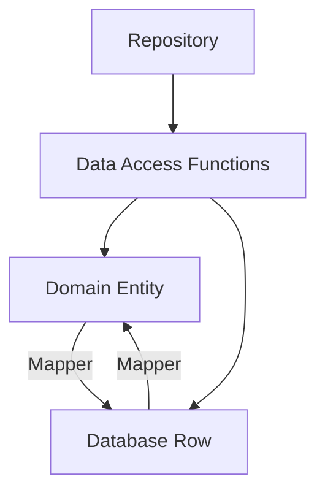

## 8.2 Data Mapper in Clojure

The Data Mapper design pattern is a powerful tool in software development, particularly when working with databases. It provides a way to separate the in-memory representation of data from the database schema, allowing both to evolve independently. This separation facilitates testing, promotes cleaner domain models, and supports multiple persistence mechanisms. In this article, we will explore how to implement the Data Mapper pattern in Clojure, leveraging its functional programming capabilities and modern libraries.

### Introduction to Data Mapper Pattern

The Data Mapper pattern is a structural pattern that acts as a layer of abstraction between the domain model and the database. It maps between the in-memory objects and database rows, ensuring that changes in one do not necessitate changes in the other. This pattern is particularly useful in complex applications where domain logic and database interactions need to be decoupled.

### Detailed Explanation

#### Key Components of the Data Mapper Pattern

1. **Domain Entities:** These are the in-memory representations of your data. They encapsulate the business logic and are independent of the database schema.

2. **Mapper Functions:** These functions handle the conversion between domain entities and database rows. They ensure that the domain model remains unaffected by changes in the database schema.

3. **Data Access Functions:** These functions interact with the database using the mapper functions to retrieve and persist data.

4. **Repositories:** These provide a higher-level abstraction over data access functions, encapsulating the logic for interacting with domain entities.

#### Workflow of the Data Mapper Pattern

The workflow involves defining domain entities, creating mapper functions to convert between entities and database rows, implementing data access functions using these mappers, and using repositories to manage data interactions.

### Visual Aids

#### Conceptual Diagram



> **Explanation:** This diagram illustrates the flow of data between domain entities and database rows through mapper functions, with data access functions and repositories managing the interactions.

### Implementing Data Mapper in Clojure

#### Define Domain Entities

Domain entities represent the core business objects in your application. In Clojure, you can define them using records:

```clojure
(defrecord User [id name email])
```

#### Create Mapper Functions

Mapper functions convert between database rows and domain entities.

- **Database Row to Domain Object:**

  ```clojure
  (defn row->user [row]
    (->User (:id row) (:name row) (:email row)))
  ```

- **Domain Object to Database Row:**

  ```clojure
  (defn user->row [user]
    {:id (:id user)
     :name (:name user)
     :email (:email user)})
  ```

#### Implement Data Access Functions Using Mappers

Data access functions use the mapper functions to interact with the database.

```clojure
(require '[clojure.java.jdbc :as jdbc])

(defn find-user [db-spec id]
  (when-let [row (first (jdbc/query db-spec ["SELECT * FROM users WHERE id=?" id]))]
    (row->user row)))

(defn create-user [db-spec user]
  (jdbc/insert! db-spec :users (user->row user)))
```

#### Use the Data Mapper in Repositories

Repositories provide a higher-level abstraction for managing domain entities.

```clojure
(defprotocol UserRepository
  (find-user [this id])
  (create-user [this user]))

(defrecord UserRepo [db-spec]
  UserRepository
  (find-user [this id]
    (find-user db-spec id))
  (create-user [this user]
    (create-user db-spec user)))
```

### Use Cases

The Data Mapper pattern is ideal for applications where:

- The domain model and database schema need to evolve independently.
- There is a need to support multiple persistence mechanisms.
- Testing and maintaining clean domain models is a priority.

### Advantages and Disadvantages

#### Advantages

- **Separation of Concerns:** Decouples the domain model from the database schema.
- **Flexibility:** Allows independent evolution of the domain model and database schema.
- **Testability:** Facilitates testing by isolating domain logic from database interactions.

#### Disadvantages

- **Complexity:** Introduces additional layers of abstraction, which can increase complexity.
- **Performance Overhead:** May introduce performance overhead due to the mapping process.

### Best Practices

- **Maintain Independence:** Ensure that changes in the domain model do not affect the database schema and vice versa.
- **Use Libraries:** Leverage libraries like `clojure.java.jdbc` for database interactions and `next.jdbc` for modern JDBC features.
- **Encapsulate Logic:** Use repositories to encapsulate data access logic, promoting modularity and reusability.

### Comparisons

The Data Mapper pattern can be compared to the Active Record pattern, which combines data access logic within the domain model. While Active Record is simpler, Data Mapper provides greater flexibility and separation of concerns.

### Conclusion

The Data Mapper pattern is a valuable tool in the Clojure developer's arsenal, offering a clean separation between domain models and database schemas. By implementing this pattern, you can create flexible, testable, and maintainable applications that can adapt to changing requirements.

## Quiz Time!



### What is the primary purpose of the Data Mapper pattern?

- [x] To separate the in-memory representation of data from the database schema.
- [ ] To combine data access logic within the domain model.
- [ ] To enhance the performance of database queries.
- [ ] To simplify the database schema design.

> **Explanation:** The Data Mapper pattern separates the in-memory representation of data from the database schema, allowing both to evolve independently.

### Which Clojure construct is used to define domain entities in the Data Mapper pattern?

- [x] `defrecord`
- [ ] `defn`
- [ ] `defmacro`
- [ ] `defprotocol`

> **Explanation:** Domain entities are defined using `defrecord` in Clojure, which provides a way to create immutable data structures with named fields.

### What is the role of mapper functions in the Data Mapper pattern?

- [x] To convert between domain entities and database rows.
- [ ] To execute database queries.
- [ ] To manage database connections.
- [ ] To define domain entities.

> **Explanation:** Mapper functions handle the conversion between domain entities and database rows, ensuring that changes in one do not affect the other.

### How do repositories contribute to the Data Mapper pattern?

- [x] They provide a higher-level abstraction for managing domain entities.
- [ ] They execute raw SQL queries.
- [ ] They define the database schema.
- [ ] They handle database transactions.

> **Explanation:** Repositories encapsulate data access logic and provide a higher-level abstraction for managing domain entities, promoting modularity and reusability.

### What is a potential disadvantage of the Data Mapper pattern?

- [x] It introduces additional layers of abstraction, which can increase complexity.
- [ ] It tightly couples the domain model with the database schema.
- [ ] It simplifies database interactions.
- [ ] It reduces testability of the domain model.

> **Explanation:** The Data Mapper pattern introduces additional layers of abstraction, which can increase complexity, although it provides greater flexibility and separation of concerns.

### Which library is commonly used in Clojure for database interactions in the Data Mapper pattern?

- [x] `clojure.java.jdbc`
- [ ] `core.async`
- [ ] `ring`
- [ ] `compojure`

> **Explanation:** `clojure.java.jdbc` is commonly used for database interactions in Clojure, providing functions for executing SQL queries and managing connections.

### What is the benefit of using the Data Mapper pattern in testing?

- [x] It facilitates testing by isolating domain logic from database interactions.
- [ ] It simplifies the creation of test data.
- [ ] It reduces the need for mocking dependencies.
- [ ] It automatically generates test cases.

> **Explanation:** The Data Mapper pattern facilitates testing by isolating domain logic from database interactions, allowing for easier testing of business logic.

### How does the Data Mapper pattern support multiple persistence mechanisms?

- [x] By implementing different mappers for different data sources.
- [ ] By using a single mapper for all data sources.
- [ ] By tightly coupling the domain model with the database schema.
- [ ] By simplifying the database schema design.

> **Explanation:** The Data Mapper pattern supports multiple persistence mechanisms by implementing different mappers for different data sources, allowing for flexibility in data storage.

### Which of the following is NOT a component of the Data Mapper pattern?

- [ ] Domain Entities
- [ ] Mapper Functions
- [ ] Data Access Functions
- [x] User Interface Components

> **Explanation:** User Interface Components are not part of the Data Mapper pattern, which focuses on separating domain models from database interactions.

### True or False: The Data Mapper pattern is ideal for applications where the domain model and database schema need to evolve independently.

- [x] True
- [ ] False

> **Explanation:** True. The Data Mapper pattern is designed to allow the domain model and database schema to evolve independently, providing flexibility and separation of concerns.


