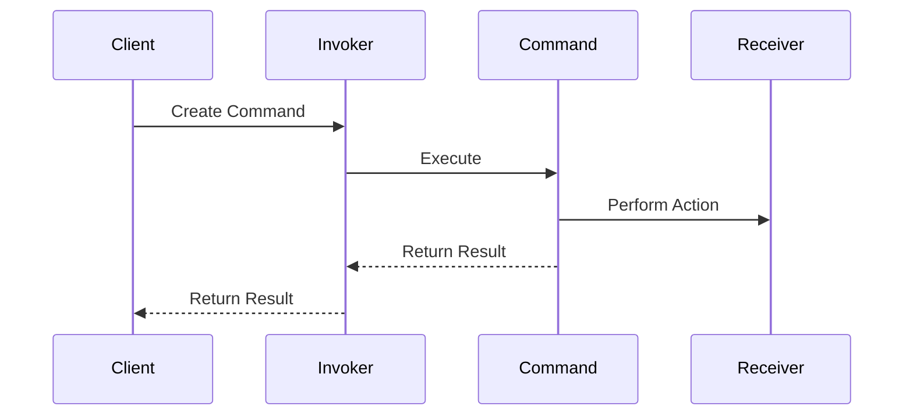

## 8.3. Command Pattern via Functions and Maps

The Command Pattern is a behavioral design pattern that turns a request into a stand-alone object containing all information about the request. This transformation allows you to parameterize methods with different requests, delay or queue a request's execution, and support undoable operations. In Clojure, the Command Pattern can be elegantly implemented using functions and maps, leveraging the language's functional programming paradigm and first-class functions.

### Understanding the Command Pattern

**Intent**: The Command Pattern encapsulates a request as an object, thereby allowing for parameterization of clients with queues, requests, and operations. It also provides support for undoable operations.

**Key Participants**:
- **Command**: An interface or abstract class defining the execute method.
- **ConcreteCommand**: A class that implements the Command interface and defines the binding between a Receiver object and an action.
- **Receiver**: The object that performs the actual work.
- **Invoker**: Asks the command to carry out the request.
- **Client**: Creates a ConcreteCommand object and sets its receiver.

### Command Pattern in Clojure

In Clojure, we can represent commands using functions and maps, which simplifies the implementation by avoiding the need for explicit classes and interfaces. This approach aligns well with Clojure's functional nature and its emphasis on immutability and first-class functions.

#### Defining Commands as Functions

In Clojure, a command can be represented as a function that encapsulates the action to be performed. Here's a simple example:

```clojure
(defn print-command [message]
  (fn []
    (println message)))

(def hello-command (print-command "Hello, World!"))

;; Execute the command
(hello-command)
```

In this example, `print-command` is a higher-order function that returns a command function. The command function, when called, executes the encapsulated action.

#### Using Maps to Represent Commands

Maps can be used to encapsulate both the action and its parameters, providing a more data-driven approach:

```clojure
(defn execute-command [command]
  ((:action command) (:params command)))

(def command-map {:action println :params "Hello from a map!"})

;; Execute the command
(execute-command command-map)
```

Here, `command-map` is a map containing an `:action` key with a function and a `:params` key with the parameters for the function. The `execute-command` function extracts and executes the action with its parameters.

### Queuing and Executing Commands

One of the powerful aspects of the Command Pattern is the ability to queue commands for later execution. This can be particularly useful in scenarios like task scheduling or batch processing.

```clojure
(def command-queue (atom []))

(defn queue-command [command]
  (swap! command-queue conj command))

(defn process-commands []
  (doseq [command @command-queue]
    (execute-command command))
  (reset! command-queue []))

;; Queue some commands
(queue-command {:action println :params "First command"})
(queue-command {:action println :params "Second command"})

;; Process the queued commands
(process-commands)
```

In this example, we use an atom to hold a queue of commands. The `queue-command` function adds a command to the queue, and `process-commands` executes all queued commands and clears the queue.

### Benefits for Undo Functionality and Transactional Systems

The Command Pattern is particularly beneficial for implementing undo functionality and transactional systems. By encapsulating actions and their parameters, you can easily store and reverse actions.

#### Implementing Undo

To implement undo functionality, you can extend the command map to include an `:undo` action:

```clojure
(defn execute-with-undo [command]
  (let [result ((:action command) (:params command))]
    (assoc command :undo-result result)))

(defn undo-command [command]
  ((:undo command) (:undo-result command)))

(def command-with-undo
  {:action #(println "Executing:" %)
   :params "Undoable command"
   :undo #(println "Undoing:" %)})

;; Execute and undo the command
(let [executed-command (execute-with-undo command-with-undo)]
  (undo-command executed-command))
```

In this example, the command map includes an `:undo` key with a function to reverse the action. The `execute-with-undo` function executes the command and stores the result needed for undoing.

#### Transactional Systems

In transactional systems, commands can be queued and executed in a controlled manner, ensuring that all operations succeed or fail together.

```clojure
(defn transactional-execute [commands]
  (try
    (doseq [command commands]
      (execute-command command))
    (catch Exception e
      (println "Transaction failed:" (.getMessage e))
      (doseq [command (reverse commands)]
        (undo-command command)))))

;; Define some transactional commands
(def transactional-commands
  [{:action #(println "Processing:" %) :params "Command 1" :undo #(println "Reverting:" %)}
   {:action #(println "Processing:" %) :params "Command 2" :undo #(println "Reverting:" %)}])

;; Execute the transaction
(transactional-execute transactional-commands)
```

This example demonstrates how to execute a series of commands transactionally. If any command fails, the system reverts all executed commands using their undo actions.

### Simplicity Through First-Class Functions

Clojure's first-class functions simplify the implementation of the Command Pattern. Functions can be passed around, stored in data structures, and executed dynamically, providing a flexible and concise way to represent commands.

#### Advantages of Using Functions and Maps

- **Flexibility**: Functions and maps provide a flexible way to define and execute commands without the need for complex class hierarchies.
- **Simplicity**: The use of first-class functions reduces boilerplate code and enhances readability.
- **Immutability**: Clojure's immutable data structures ensure that commands are safe to use in concurrent environments.
- **Data-Driven**: Using maps allows for a data-driven approach, making it easy to serialize, store, and manipulate commands.

### Visualizing the Command Pattern in Clojure

To better understand how the Command Pattern works in Clojure, let's visualize the flow of command execution using a Mermaid.js diagram.



**Diagram Description**: This sequence diagram illustrates the flow of command execution in Clojure. The client creates a command and sends it to the invoker, which executes the command. The command then interacts with the receiver to perform the action, and the result is returned to the client.

### Try It Yourself

Experiment with the provided code examples by modifying the actions and parameters. Try creating a command that performs a different action, such as updating a data structure or interacting with an external system. Consider implementing a more complex transactional system with multiple commands and error handling.

### Knowledge Check

- **What is the primary purpose of the Command Pattern?**
- **How can functions and maps be used to represent commands in Clojure?**
- **What are the benefits of using the Command Pattern for undo functionality?**
- **How does Clojure's use of first-class functions simplify the Command Pattern?**
- **What are some potential use cases for queuing and executing commands?**

### Summary

The Command Pattern in Clojure, implemented via functions and maps, provides a powerful and flexible way to encapsulate actions and parameters. This approach leverages Clojure's strengths in functional programming, immutability, and first-class functions, making it ideal for scenarios requiring flexible execution, undo functionality, and transactional systems. By understanding and applying this pattern, you can create more robust and maintainable Clojure applications.

## **Ready to Test Your Knowledge?**



### What is the primary purpose of the Command Pattern?

- [x] To encapsulate a request as an object, allowing for flexible execution and undo functionality.
- [ ] To create complex class hierarchies for object-oriented programming.
- [ ] To simplify the implementation of data structures.
- [ ] To enhance the performance of Clojure applications.

> **Explanation:** The Command Pattern encapsulates a request as an object, allowing for flexible execution, queuing, and undo functionality.

### How can functions and maps be used to represent commands in Clojure?

- [x] Functions encapsulate actions, while maps store actions and parameters.
- [ ] Functions are used only for parameter storage.
- [ ] Maps are used only for action execution.
- [ ] Functions and maps cannot represent commands in Clojure.

> **Explanation:** In Clojure, functions can encapsulate actions, and maps can store both actions and parameters, providing a flexible way to represent commands.

### What are the benefits of using the Command Pattern for undo functionality?

- [x] It allows actions to be reversed easily by storing undo information.
- [ ] It makes commands immutable.
- [ ] It enhances the performance of command execution.
- [ ] It simplifies the creation of complex data structures.

> **Explanation:** The Command Pattern allows actions to be reversed by storing undo information, making it ideal for implementing undo functionality.

### How does Clojure's use of first-class functions simplify the Command Pattern?

- [x] First-class functions reduce boilerplate code and enhance flexibility.
- [ ] First-class functions complicate the implementation.
- [ ] First-class functions are not relevant to the Command Pattern.
- [ ] First-class functions increase the complexity of command execution.

> **Explanation:** Clojure's first-class functions reduce boilerplate code and enhance flexibility, simplifying the implementation of the Command Pattern.

### What are some potential use cases for queuing and executing commands?

- [x] Task scheduling and batch processing.
- [ ] Creating complex class hierarchies.
- [ ] Enhancing the performance of data structures.
- [ ] Simplifying the implementation of algorithms.

> **Explanation:** Queuing and executing commands are useful for task scheduling and batch processing, allowing for flexible execution of actions.

### What is a key advantage of using maps to represent commands?

- [x] Maps provide a data-driven approach, making it easy to serialize and manipulate commands.
- [ ] Maps increase the complexity of command execution.
- [ ] Maps are not suitable for representing commands.
- [ ] Maps simplify the creation of complex class hierarchies.

> **Explanation:** Maps provide a data-driven approach, making it easy to serialize, store, and manipulate commands.

### How can the Command Pattern be beneficial in transactional systems?

- [x] It ensures all operations succeed or fail together, providing consistency.
- [ ] It complicates the execution of commands.
- [ ] It enhances the performance of transactional systems.
- [ ] It simplifies the creation of complex data structures.

> **Explanation:** The Command Pattern ensures all operations succeed or fail together, providing consistency in transactional systems.

### What is the role of the invoker in the Command Pattern?

- [x] The invoker asks the command to carry out the request.
- [ ] The invoker performs the actual work.
- [ ] The invoker creates the command.
- [ ] The invoker stores the command's parameters.

> **Explanation:** The invoker asks the command to carry out the request, acting as an intermediary between the client and the command.

### How can undo functionality be implemented in the Command Pattern?

- [x] By including an `:undo` action in the command map.
- [ ] By creating complex class hierarchies.
- [ ] By enhancing the performance of command execution.
- [ ] By simplifying the creation of data structures.

> **Explanation:** Undo functionality can be implemented by including an `:undo` action in the command map, allowing actions to be reversed.

### True or False: Clojure's immutable data structures make the Command Pattern safe for concurrent environments.

- [x] True
- [ ] False

> **Explanation:** Clojure's immutable data structures ensure that commands are safe to use in concurrent environments, preventing data races and inconsistencies.



Remember, this is just the beginning. As you progress, you'll discover more ways to leverage Clojure's unique features to create robust and elegant solutions. Keep experimenting, stay curious, and enjoy the journey!
