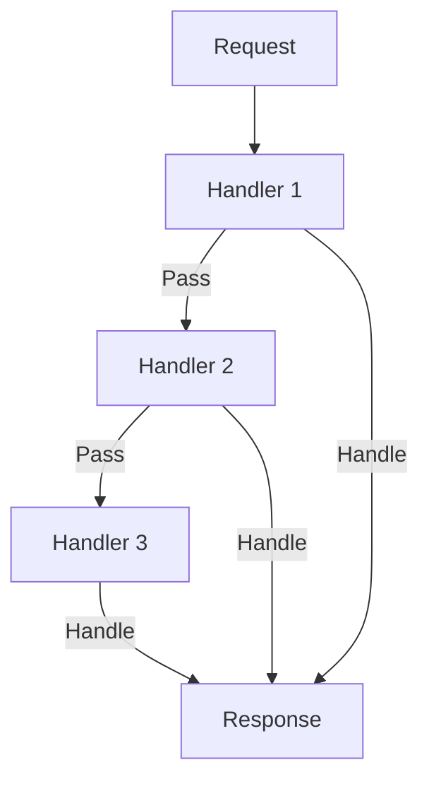

## 8.4. Chain of Responsibility with Composed Functions

In this section, we delve into the Chain of Responsibility design pattern, a behavioral pattern that allows you to pass requests along a chain of handlers. In Clojure, we can leverage the power of functional programming to compose functions that form a processing chain. This approach is particularly useful in scenarios such as middleware pipelines, where each function in the chain decides whether to handle a request or pass it on to the next function.

### Understanding the Chain of Responsibility Pattern

The Chain of Responsibility pattern is a design pattern that decouples the sender of a request from its receivers by allowing multiple objects to handle the request. The request is passed along a chain of potential handlers until one of them handles it. This pattern is useful for implementing a series of processing steps where each step can either handle the request or pass it to the next step.

#### Key Participants

- **Handler**: An interface or abstract class defining a method for handling requests.
- **Concrete Handler**: A class that implements the handler interface and processes requests it is responsible for.
- **Client**: The object that initiates the request to be handled.

### Composing Functions in Clojure

In Clojure, we can implement the Chain of Responsibility pattern using composed functions. Each function in the chain takes a request and either handles it or passes it to the next function. This approach is both flexible and powerful, allowing us to build complex processing pipelines with minimal boilerplate.

#### Function Composition

Function composition is the process of combining two or more functions to produce a new function. In Clojure, we can use the `comp` function to compose functions. The `comp` function takes a variable number of functions as arguments and returns a new function that is the composition of those functions.

```clojure
(defn handler1 [request]
  (if (some-condition? request)
    (handle-request request)
    request))

(defn handler2 [request]
  (if (another-condition? request)
    (handle-another-request request)
    request))

(def composed-handler (comp handler2 handler1))
```

In this example, `composed-handler` is a function that first applies `handler1` to a request, and then applies `handler2` to the result.

### Implementing the Chain of Responsibility

Let's implement a simple Chain of Responsibility using composed functions in Clojure. We'll create a series of handlers that process a request and pass it along the chain.

#### Example: Middleware Pipeline

Consider a web application where we need to process HTTP requests through a series of middleware functions. Each middleware function can either handle the request or pass it to the next middleware in the chain.

```clojure
(defn logging-middleware [handler]
  (fn [request]
    (println "Logging request:" request)
    (handler request)))

(defn authentication-middleware [handler]
  (fn [request]
    (if (authenticated? request)
      (handler request)
      {:status 401 :body "Unauthorized"})))

(defn response-middleware [handler]
  (fn [request]
    (let [response (handler request)]
      (assoc response :headers {"Content-Type" "application/json"}))))

(defn handle-request [request]
  {:status 200 :body "Hello, World!"})

(def app
  (-> handle-request
      logging-middleware
      authentication-middleware
      response-middleware))
```

In this example, `app` is a composed function that processes HTTP requests through a series of middleware functions. Each middleware function takes a handler as an argument and returns a new handler that wraps the original handler.

### Error Handling and Termination

In a Chain of Responsibility, it's important to handle errors gracefully and terminate the chain when necessary. In Clojure, we can use exception handling to manage errors in the chain.

#### Example: Error Handling

Let's extend our middleware pipeline to handle errors.

```clojure
(defn error-handling-middleware [handler]
  (fn [request]
    (try
      (handler request)
      (catch Exception e
        {:status 500 :body "Internal Server Error"}))))

(def app-with-error-handling
  (-> handle-request
      logging-middleware
      authentication-middleware
      response-middleware
      error-handling-middleware))
```

In this example, `error-handling-middleware` catches any exceptions thrown by the handler and returns a 500 Internal Server Error response.

### Scenarios and Use Cases

The Chain of Responsibility pattern is particularly useful in scenarios where you need to process requests through a series of steps, such as:

- **Middleware Pipelines**: In web applications, middleware functions can be composed to process HTTP requests and responses.
- **Event Processing**: In event-driven systems, events can be processed through a chain of handlers.
- **Command Processing**: In command-based systems, commands can be processed through a series of handlers.

### Clojure Unique Features

Clojure's functional programming paradigm and support for higher-order functions make it an ideal language for implementing the Chain of Responsibility pattern. The use of composed functions allows for concise and expressive code, while Clojure's immutable data structures ensure that requests are processed safely and efficiently.

### Differences and Similarities

The Chain of Responsibility pattern is similar to other behavioral patterns, such as the Strategy pattern and the Observer pattern. However, it is unique in its ability to decouple the sender of a request from its receivers, allowing for flexible and dynamic processing chains.

### Design Considerations

When implementing the Chain of Responsibility pattern in Clojure, consider the following:

- **Order of Handlers**: The order in which handlers are composed can affect the behavior of the chain.
- **Error Handling**: Ensure that errors are handled gracefully and that the chain terminates when necessary.
- **Performance**: Composing a large number of functions can impact performance, so consider optimizing the chain where possible.

### Try It Yourself

To get a better understanding of the Chain of Responsibility pattern in Clojure, try modifying the code examples provided. Experiment with adding new middleware functions, changing the order of handlers, and handling different types of requests.

### Visualizing the Chain of Responsibility

To better understand the flow of requests through a Chain of Responsibility, let's visualize the process using a flowchart.



In this flowchart, a request is passed through a series of handlers. Each handler can either handle the request or pass it to the next handler in the chain.

### References and Links

For further reading on the Chain of Responsibility pattern and functional programming in Clojure, consider the following resources:

- [Clojure Documentation](https://clojure.org/)
- [Functional Programming in Clojure](https://www.braveclojure.com/)
- [Design Patterns: Elements of Reusable Object-Oriented Software](https://en.wikipedia.org/wiki/Design_Patterns)

### Knowledge Check

To reinforce your understanding of the Chain of Responsibility pattern in Clojure, try answering the following questions.

## **Ready to Test Your Knowledge?**



### What is the primary purpose of the Chain of Responsibility pattern?

- [x] To decouple the sender of a request from its receivers
- [ ] To couple the sender and receiver tightly
- [ ] To handle requests in parallel
- [ ] To ensure only one handler processes a request

> **Explanation:** The Chain of Responsibility pattern decouples the sender of a request from its receivers by allowing multiple objects to handle the request.

### How can you compose functions in Clojure?

- [x] Using the `comp` function
- [ ] Using the `concat` function
- [ ] Using the `map` function
- [ ] Using the `reduce` function

> **Explanation:** The `comp` function in Clojure is used to compose multiple functions into a single function.

### What is a common use case for the Chain of Responsibility pattern in Clojure?

- [x] Middleware pipelines in web applications
- [ ] Database transactions
- [ ] File I/O operations
- [ ] Sorting algorithms

> **Explanation:** Middleware pipelines in web applications are a common use case for the Chain of Responsibility pattern in Clojure.

### How can you handle errors in a Chain of Responsibility in Clojure?

- [x] By using exception handling
- [ ] By ignoring errors
- [ ] By logging errors only
- [ ] By terminating the application

> **Explanation:** Exception handling can be used to manage errors in a Chain of Responsibility in Clojure.

### What is the effect of changing the order of handlers in a composed function chain?

- [x] It can affect the behavior of the chain
- [ ] It has no effect on the chain
- [ ] It improves performance
- [ ] It causes errors

> **Explanation:** The order of handlers in a composed function chain can affect the behavior of the chain.

### Which Clojure feature makes it ideal for implementing the Chain of Responsibility pattern?

- [x] Higher-order functions
- [ ] Object-oriented programming
- [ ] Static typing
- [ ] Manual memory management

> **Explanation:** Clojure's support for higher-order functions makes it ideal for implementing the Chain of Responsibility pattern.

### What is the role of a handler in the Chain of Responsibility pattern?

- [x] To process requests it is responsible for
- [ ] To send requests
- [ ] To generate requests
- [ ] To terminate requests

> **Explanation:** A handler in the Chain of Responsibility pattern processes requests it is responsible for.

### What is the benefit of using immutable data structures in a Chain of Responsibility?

- [x] Ensures requests are processed safely and efficiently
- [ ] Increases memory usage
- [ ] Decreases performance
- [ ] Complicates code

> **Explanation:** Immutable data structures ensure that requests are processed safely and efficiently in a Chain of Responsibility.

### Can the Chain of Responsibility pattern be used for event processing?

- [x] True
- [ ] False

> **Explanation:** The Chain of Responsibility pattern can be used for event processing by passing events through a chain of handlers.

### Is the Chain of Responsibility pattern similar to the Observer pattern?

- [x] True
- [ ] False

> **Explanation:** The Chain of Responsibility pattern is similar to the Observer pattern in that both involve multiple objects handling requests or events, but they differ in their approach and use cases.



Remember, this is just the beginning. As you progress, you'll build more complex and interactive systems using the Chain of Responsibility pattern in Clojure. Keep experimenting, stay curious, and enjoy the journey!
