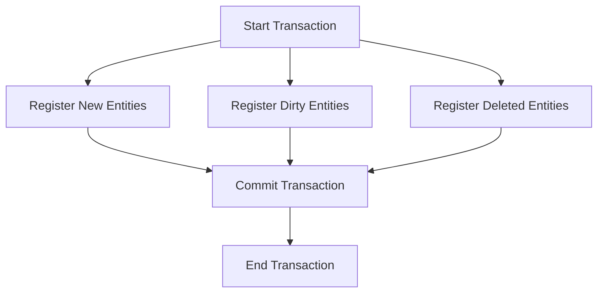

## 8.4 Unit of Work in Clojure

In the realm of data management, ensuring consistency and integrity across operations is paramount. The Unit of Work pattern is a design strategy that addresses these concerns by tracking changes to objects and coordinating the writing of these changes in a single transaction. This pattern is particularly useful in scenarios involving batch operations or when maintaining data consistency is critical.

### Introduction

The Unit of Work pattern acts as a controller that manages a set of operations to be performed as a single transaction. It keeps track of changes to objects and ensures that all changes are committed or rolled back together, maintaining data consistency and integrity. This is especially beneficial in complex systems where multiple operations need to be coordinated.

### Detailed Explanation

The Unit of Work pattern can be broken down into several key components:

1. **Tracking Changes:** The pattern maintains a list of new, modified, and deleted entities.
2. **Transactional Integrity:** All changes are committed in a single transaction, ensuring atomicity.
3. **Batch Operations:** Efficiently handles batch processing by grouping multiple operations.

### Creating a Unit of Work Structure

To implement the Unit of Work pattern in Clojure, we start by defining a structure to hold our entities:

```clojure
(defn create-unit-of-work []
  {:new (atom [])
   :dirty (atom [])
   :deleted (atom [])})

(def uow (create-unit-of-work))
```

Here, we use Clojure's `atom` to manage collections of new, dirty (modified), and deleted entities. This allows us to track changes in a thread-safe manner.

### Registering Entities with the Unit of Work

Next, we define functions to register entities with the Unit of Work:

```clojure
(defn register-new [uow entity]
  (swap! (:new uow) conj entity))

(defn register-dirty [uow entity]
  (swap! (:dirty uow) conj entity))

(defn register-deleted [uow entity]
  (swap! (:deleted uow) conj entity))
```

These functions update the respective collections within the Unit of Work, ensuring that all changes are tracked.

### Committing Changes in a Transaction

The core of the Unit of Work pattern is committing changes in a single transaction. We can achieve this using Clojure's `jdbc` library:

```clojure
(require '[clojure.java.jdbc :as jdbc])

(defn commit [uow db-spec]
  (jdbc/with-db-transaction [tx db-spec]
    (doseq [entity @(:new uow)]
      (create-user tx entity))
    (doseq [entity @(:dirty uow)]
      (update-user tx entity))
    (doseq [entity @(:deleted uow)]
      (delete-user tx (:id entity)))))
```

In this function, we use `jdbc/with-db-transaction` to ensure that all operations are executed within a transactional boundary. This guarantees that either all changes are committed, or none are, preserving data integrity.

### Using the Unit of Work in Business Logic

Here's how you might use the Unit of Work pattern in a business logic scenario:

```clojure
(defn process-users []
  (let [user (find-user db-spec 1)]
    (register-dirty uow (assoc user :email "new@example.com"))
    (commit uow db-spec)))
```

In this example, we retrieve a user, modify their email, register the change as a dirty entity, and commit the changes using the Unit of Work.

### Resetting the Unit of Work After Commit

After committing changes, it's important to reset the Unit of Work to prepare for the next transaction:

```clojure
(def uow (create-unit-of-work))
```

### Handling Transactions and Concurrency

When implementing the Unit of Work pattern, consider the following best practices:

- **Transactional Boundaries:** Ensure that all operations within the Unit of Work are executed within a transactional boundary to maintain atomicity.
- **Concurrency Control:** Use Clojure's concurrency primitives, such as `atom`, to manage state changes safely in a concurrent environment.

### Visualizing the Unit of Work Pattern

To better understand the flow of the Unit of Work pattern, consider the following diagram:



This diagram illustrates the process of starting a transaction, registering entities, committing changes, and ending the transaction.

### Advantages and Disadvantages

**Advantages:**

- **Consistency:** Ensures all changes are applied consistently.
- **Efficiency:** Reduces the number of database round-trips by batching operations.
- **Atomicity:** Guarantees that all operations succeed or fail together.

**Disadvantages:**

- **Complexity:** Introduces additional complexity in managing the Unit of Work lifecycle.
- **Memory Usage:** May consume more memory by holding entities in memory until the transaction is committed.

### Best Practices

- **Keep the Unit of Work Short-Lived:** Minimize the lifespan of a Unit of Work to reduce the risk of stale data.
- **Use in Conjunction with Repositories:** Combine the Unit of Work with repository patterns for better separation of concerns.
- **Handle Exceptions Gracefully:** Ensure that exceptions during commit operations are handled to maintain data integrity.

### Conclusion

The Unit of Work pattern is a powerful tool for managing data consistency and transactional integrity in Clojure applications. By tracking changes and coordinating their application in a single transaction, it ensures that your data remains consistent and reliable. While it introduces some complexity, the benefits in terms of consistency and efficiency make it a valuable pattern in many scenarios.

## Quiz Time!



### What is the primary purpose of the Unit of Work pattern?

- [x] To track changes to objects and coordinate the writing of these changes in a single transaction.
- [ ] To manage user authentication and authorization.
- [ ] To provide a caching mechanism for database queries.
- [ ] To facilitate asynchronous communication between services.

> **Explanation:** The Unit of Work pattern is designed to track changes to objects and ensure that all changes are committed in a single transaction, maintaining data consistency.

### Which Clojure construct is used to manage collections of new, dirty, and deleted entities in the Unit of Work pattern?

- [x] atom
- [ ] ref
- [ ] agent
- [ ] promise

> **Explanation:** The `atom` construct is used to manage collections of entities in a thread-safe manner within the Unit of Work pattern.

### What is the role of `jdbc/with-db-transaction` in the Unit of Work pattern?

- [x] To ensure that all operations are executed within a transactional boundary.
- [ ] To manage user sessions in a web application.
- [ ] To provide a mechanism for logging database queries.
- [ ] To facilitate the creation of database indexes.

> **Explanation:** `jdbc/with-db-transaction` is used to ensure that all operations within the Unit of Work are executed within a transactional boundary, maintaining atomicity.

### What should be done after committing changes in the Unit of Work pattern?

- [x] Reset the Unit of Work to prepare for the next transaction.
- [ ] Log the transaction details for auditing purposes.
- [ ] Send a notification to the user.
- [ ] Archive the transaction data for future reference.

> **Explanation:** After committing changes, the Unit of Work should be reset to prepare for the next transaction, ensuring that it is ready to track new changes.

### Which of the following is an advantage of the Unit of Work pattern?

- [x] Ensures all changes are applied consistently.
- [ ] Reduces the complexity of the application.
- [ ] Eliminates the need for database transactions.
- [ ] Provides a user-friendly interface for data entry.

> **Explanation:** The Unit of Work pattern ensures that all changes are applied consistently, maintaining data integrity.

### What is a potential disadvantage of the Unit of Work pattern?

- [x] Introduces additional complexity in managing the Unit of Work lifecycle.
- [ ] Increases the number of database round-trips.
- [ ] Reduces the consistency of data.
- [ ] Eliminates the need for error handling.

> **Explanation:** The Unit of Work pattern introduces additional complexity in managing the lifecycle of the Unit of Work, which can be a disadvantage.

### How can concurrency be managed in the Unit of Work pattern?

- [x] By using Clojure's concurrency primitives, such as `atom`.
- [ ] By implementing a custom locking mechanism.
- [ ] By using global variables to store state.
- [ ] By avoiding the use of transactions altogether.

> **Explanation:** Concurrency can be managed using Clojure's concurrency primitives, such as `atom`, to ensure thread-safe operations.

### In which scenarios is the Unit of Work pattern particularly useful?

- [x] Batch operations and maintaining data consistency.
- [ ] Real-time data streaming and processing.
- [ ] User interface design and layout.
- [ ] Network communication and protocol handling.

> **Explanation:** The Unit of Work pattern is particularly useful for batch operations and maintaining data consistency.

### What is the main benefit of committing changes in a single transaction?

- [x] It ensures atomicity, meaning all operations succeed or fail together.
- [ ] It reduces the need for database indexing.
- [ ] It simplifies the user interface design.
- [ ] It enhances the performance of network communication.

> **Explanation:** Committing changes in a single transaction ensures atomicity, meaning all operations succeed or fail together, maintaining data integrity.

### True or False: The Unit of Work pattern eliminates the need for database transactions.

- [ ] True
- [x] False

> **Explanation:** False. The Unit of Work pattern relies on database transactions to ensure that all changes are committed or rolled back together, maintaining data consistency.


