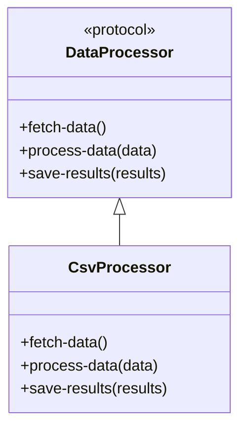

## 8.5. Template Method Pattern Using Protocols

### Introduction

The Template Method Pattern is a behavioral design pattern that defines the skeleton of an algorithm in a method, deferring some steps to subclasses. This pattern allows subclasses to redefine certain steps of an algorithm without changing its structure. In Clojure, we can leverage protocols to implement this pattern, providing a flexible yet controlled way to define algorithms.

### Intent of the Template Method Pattern

The primary intent of the Template Method Pattern is to define the overall structure of an algorithm while allowing subclasses to implement specific steps. This pattern promotes code reuse and enforces a consistent algorithm structure across different implementations.

### Protocols in Clojure

In Clojure, protocols provide a mechanism for polymorphism, allowing us to define a set of functions that can be implemented by different types. Protocols are similar to interfaces in object-oriented languages but are more flexible and dynamic.

### Using Protocols to Implement the Template Method Pattern

In the context of the Template Method Pattern, protocols can be used to define the fixed structure of an algorithm. Implementations of the protocol can then provide the specific details for each step of the algorithm.

#### Example: Data Processing Pipeline

Let's consider a data processing pipeline where we want to define a fixed sequence of steps, but allow different implementations to provide the details for each step.

```clojure
(defprotocol DataProcessor
  (fetch-data [this])
  (process-data [this data])
  (save-results [this results]))

(defn execute-pipeline [processor]
  (let [data (fetch-data processor)
        processed-data (process-data processor data)]
    (save-results processor processed-data)))
```

In this example, `DataProcessor` is a protocol that defines three steps: `fetch-data`, `process-data`, and `save-results`. The `execute-pipeline` function defines the fixed structure of the algorithm, calling each step in sequence.

#### Implementing the Protocol

Now, let's implement the `DataProcessor` protocol for a specific type of data processing.

```clojure
(defrecord CsvProcessor []
  DataProcessor
  (fetch-data [this]
    ;; Fetch data from a CSV file
    (println "Fetching data from CSV")
    ;; Simulate data fetching
    ["row1" "row2" "row3"])
  (process-data [this data]
    ;; Process the CSV data
    (println "Processing CSV data")
    ;; Simulate data processing
    (map clojure.string/upper-case data))
  (save-results [this results]
    ;; Save the processed results
    (println "Saving results")
    ;; Simulate saving results
    (doseq [result results]
      (println "Saved:" result))))

(def csv-processor (->CsvProcessor))

(execute-pipeline csv-processor)
```

In this implementation, `CsvProcessor` is a record that implements the `DataProcessor` protocol. Each method provides the specific details for fetching, processing, and saving data.

### Balancing Flexibility and Control

The Template Method Pattern using protocols strikes a balance between flexibility and control. The fixed structure of the algorithm ensures consistency, while the protocol implementations provide flexibility to customize each step.

### Differences from Object-Oriented Implementations

In object-oriented languages, the Template Method Pattern is typically implemented using inheritance, where a base class defines the template method and subclasses override specific steps. In Clojure, we use protocols to achieve a similar effect, but with more flexibility and less coupling between the template and its implementations.

### Visualizing the Template Method Pattern

Let's visualize the Template Method Pattern using a class diagram to illustrate the relationship between the protocol and its implementations.



This diagram shows the `DataProcessor` protocol and its implementation by the `CsvProcessor` record. The arrows indicate that `CsvProcessor` implements the `DataProcessor` protocol.

### Try It Yourself

Experiment with the code by creating a new implementation of the `DataProcessor` protocol. For example, you could implement a `JsonProcessor` that fetches data from a JSON file and processes it differently.

### Knowledge Check

1. What is the primary intent of the Template Method Pattern?
2. How do protocols in Clojure differ from interfaces in object-oriented languages?
3. What are the benefits of using the Template Method Pattern with protocols?
4. How does the Template Method Pattern promote code reuse?
5. What is the role of the `execute-pipeline` function in the example?

### Conclusion

The Template Method Pattern using protocols in Clojure provides a powerful way to define algorithms with a fixed structure while allowing flexibility in implementation. By leveraging protocols, we can achieve polymorphism and code reuse without the tight coupling of inheritance-based approaches.

## **Ready to Test Your Knowledge?**



### What is the primary intent of the Template Method Pattern?

- [x] To define the overall structure of an algorithm while allowing subclasses to implement specific steps.
- [ ] To allow multiple inheritance in object-oriented programming.
- [ ] To encapsulate a group of individual factories.
- [ ] To provide a way to access the elements of an aggregate object sequentially.

> **Explanation:** The Template Method Pattern defines the skeleton of an algorithm, allowing subclasses to override specific steps without changing the algorithm's structure.

### How do protocols in Clojure differ from interfaces in object-oriented languages?

- [x] Protocols are more flexible and dynamic.
- [ ] Protocols enforce strict type checking.
- [ ] Protocols allow multiple inheritance.
- [ ] Protocols are only used for data validation.

> **Explanation:** Protocols in Clojure provide a flexible and dynamic way to achieve polymorphism, unlike interfaces which are more static and rigid.

### What are the benefits of using the Template Method Pattern with protocols?

- [x] It promotes code reuse and consistency.
- [ ] It allows for multiple inheritance.
- [ ] It simplifies error handling.
- [ ] It eliminates the need for testing.

> **Explanation:** The Template Method Pattern with protocols promotes code reuse by defining a consistent algorithm structure while allowing flexibility in implementation.

### How does the Template Method Pattern promote code reuse?

- [x] By defining a fixed algorithm structure that can be reused across different implementations.
- [ ] By allowing multiple inheritance.
- [ ] By eliminating the need for error handling.
- [ ] By providing default implementations for all methods.

> **Explanation:** The Template Method Pattern promotes code reuse by defining a fixed structure that can be reused, while allowing specific steps to be customized.

### What is the role of the `execute-pipeline` function in the example?

- [x] It defines the fixed structure of the algorithm.
- [ ] It implements the `DataProcessor` protocol.
- [ ] It provides default implementations for protocol methods.
- [ ] It handles error logging.

> **Explanation:** The `execute-pipeline` function defines the fixed structure of the algorithm by calling each step in sequence.

### In Clojure, what mechanism allows for polymorphism similar to interfaces in object-oriented languages?

- [x] Protocols
- [ ] Macros
- [ ] Atoms
- [ ] Refs

> **Explanation:** Protocols in Clojure provide a mechanism for polymorphism, similar to interfaces in object-oriented languages.

### What is a key difference between the Template Method Pattern in Clojure and in object-oriented languages?

- [x] Clojure uses protocols instead of inheritance.
- [ ] Clojure allows multiple inheritance.
- [ ] Clojure requires strict type checking.
- [ ] Clojure does not support polymorphism.

> **Explanation:** In Clojure, the Template Method Pattern is implemented using protocols, which provide more flexibility than inheritance-based approaches in object-oriented languages.

### What is the purpose of the `fetch-data` method in the `DataProcessor` protocol?

- [x] To define a step for fetching data in the algorithm.
- [ ] To save processed data.
- [ ] To handle error logging.
- [ ] To provide default data.

> **Explanation:** The `fetch-data` method defines a step in the algorithm for fetching data, which can be customized by different implementations.

### How can you experiment with the Template Method Pattern example provided?

- [x] By creating a new implementation of the `DataProcessor` protocol.
- [ ] By modifying the `execute-pipeline` function to skip steps.
- [ ] By adding more methods to the `DataProcessor` protocol.
- [ ] By using inheritance to override methods.

> **Explanation:** You can experiment by creating a new implementation of the `DataProcessor` protocol, providing different details for each step.

### True or False: The Template Method Pattern using protocols in Clojure eliminates the need for inheritance.

- [x] True
- [ ] False

> **Explanation:** True. The Template Method Pattern using protocols in Clojure provides a way to achieve polymorphism and code reuse without the need for inheritance.


