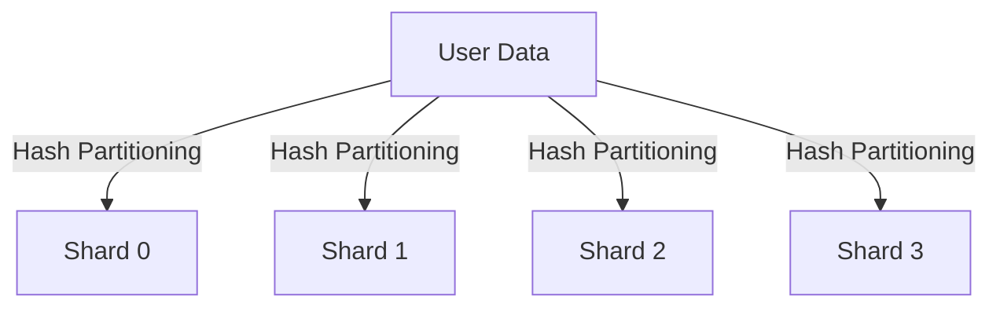

## 8.5 Sharding in Clojure

As applications grow and handle increasingly large datasets, the need for efficient data management becomes paramount. Sharding is a powerful design pattern that addresses this challenge by distributing data across multiple databases or servers. This approach enhances scalability and performance, making it a crucial strategy for modern applications. In this article, we'll delve into the intricacies of implementing sharding in Clojure, exploring strategies, code examples, and best practices.

### Introduction to Sharding

Sharding involves partitioning a dataset into smaller, more manageable pieces called shards. Each shard is stored on a separate database or server, allowing for parallel processing and reducing the load on any single database. This distribution not only improves performance but also enhances the system's ability to scale horizontally.

### Detailed Explanation

#### Sharding Strategy

The first step in implementing sharding is determining an appropriate strategy. This involves selecting a shard key and a sharding algorithm. The shard key is a field in your data that determines how the data is distributed across shards. A common choice is a user ID or another unique identifier.

**Shard Key Selection:**
- Choose a key that evenly distributes data across shards.
- Consider the query patterns to ensure efficient data retrieval.

**Sharding Algorithm:**
- **Hash Partitioning:** Uses a hash function to map data to shards.
- **Range Partitioning:** Divides data based on ranges of values.

#### Implementing Shard Mapping

Once you've determined your sharding strategy, the next step is to implement shard mapping. This involves creating a function that maps a given key to a specific shard.

```clojure
(def total-shards 4)

(defn get-shard [user-id]
  (mod (hash user-id) total-shards))

(def db-specs {0 db-spec-0, 1 db-spec-1, 2 db-spec-2, 3 db-spec-3})
```

In this example, `get-shard` uses hash partitioning to determine the shard for a given `user-id`. The `db-specs` map associates each shard with its corresponding database specification.

#### Accessing the Correct Shard

With shard mapping in place, you can now direct data access operations to the appropriate shard. This ensures that each query or update is executed on the correct database.

```clojure
(defn find-user [user-id]
  (let [shard (get-shard user-id)
        db-spec (db-specs shard)]
    (jdbc/query db-spec ["SELECT * FROM users WHERE id=?" user-id])))
```

This function retrieves a user from the correct shard by first determining the shard using `get-shard` and then querying the corresponding database.

#### Adapting Data Access Functions for Sharding

To fully integrate sharding into your application, ensure that all CRUD operations utilize the shard mapping. This involves modifying existing data access functions to incorporate shard determination and database selection.

#### Managing Shard Balancing and Rebalancing

Over time, the distribution of data across shards may become uneven, leading to performance bottlenecks. It's essential to monitor shard loads and redistribute data as needed.

- **Monitoring:** Use metrics and logging to track shard usage and performance.
- **Rebalancing:** Implement strategies to redistribute data, such as moving data between shards or adding new shards.

#### Handling Cross-Shard Queries

Cross-shard queries, such as joins between tables on different shards, can be challenging and should be minimized. Consider the following strategies:

- **Denormalization:** Store redundant data to avoid cross-shard joins.
- **Application-Level Joins:** Perform joins in the application logic rather than the database.

### Visual Aids

To better understand the sharding process, consider the following conceptual diagram illustrating data distribution across shards:



This diagram shows how user data is distributed across four shards using hash partitioning.

### Code Examples

Here's a complete example demonstrating sharding in a Clojure application:

```clojure
(ns myapp.sharding
  (:require [clojure.java.jdbc :as jdbc]))

(def total-shards 4)

(defn get-shard [user-id]
  (mod (hash user-id) total-shards))

(def db-specs {0 {:dbtype "h2" :dbname "shard0"}
               1 {:dbtype "h2" :dbname "shard1"}
               2 {:dbtype "h2" :dbname "shard2"}
               3 {:dbtype "h2" :dbname "shard3"}})

(defn find-user [user-id]
  (let [shard (get-shard user-id)
        db-spec (db-specs shard)]
    (jdbc/query db-spec ["SELECT * FROM users WHERE id=?" user-id])))

(defn add-user [user-id user-data]
  (let [shard (get-shard user-id)
        db-spec (db-specs shard)]
    (jdbc/insert! db-spec :users user-data)))
```

### Use Cases

Sharding is particularly beneficial for applications with large datasets and high traffic, such as:

- Social media platforms with millions of users.
- E-commerce sites with extensive product catalogs.
- Analytics systems processing vast amounts of data.

### Advantages and Disadvantages

**Advantages:**
- **Scalability:** Easily add more shards to handle increased load.
- **Performance:** Distribute queries and updates across multiple databases, reducing bottlenecks.

**Disadvantages:**
- **Complexity:** Requires careful planning and management.
- **Cross-Shard Queries:** Can be challenging to implement efficiently.

### Best Practices

- **Plan Shard Keys Carefully:** Ensure even data distribution and efficient query patterns.
- **Monitor and Rebalance:** Regularly assess shard loads and adjust as needed.
- **Minimize Cross-Shard Operations:** Use denormalization and application-level joins to reduce complexity.

### Comparisons

Sharding is often compared to other data distribution strategies, such as replication. While replication focuses on data redundancy and availability, sharding emphasizes distribution for scalability and performance.

### Conclusion

Sharding is a powerful design pattern for managing large datasets in Clojure applications. By distributing data across multiple databases, it enhances scalability and performance. However, it requires careful planning and management to implement effectively. By following best practices and leveraging Clojure's capabilities, you can build robust, scalable systems that handle large volumes of data efficiently.

## Quiz Time!



### What is the primary purpose of sharding?

- [x] To distribute data across multiple databases or servers for scalability and performance.
- [ ] To replicate data for redundancy and availability.
- [ ] To compress data for storage efficiency.
- [ ] To encrypt data for security.

> **Explanation:** Sharding distributes data across multiple databases or servers to enhance scalability and performance, especially for large datasets.


### Which of the following is a common choice for a shard key?

- [x] User ID
- [ ] Timestamp
- [ ] File size
- [ ] IP address

> **Explanation:** A user ID is a common choice for a shard key because it often provides a unique and evenly distributed value across shards.


### What is hash partitioning?

- [x] A sharding algorithm that uses a hash function to map data to shards.
- [ ] A method for encrypting data before storage.
- [ ] A technique for compressing data to save space.
- [ ] A strategy for replicating data across multiple servers.

> **Explanation:** Hash partitioning is a sharding algorithm that uses a hash function to determine which shard a piece of data belongs to.


### What is a potential disadvantage of sharding?

- [x] Complexity in managing data distribution and cross-shard queries.
- [ ] Increased data redundancy.
- [ ] Reduced data availability.
- [ ] Decreased performance for small datasets.

> **Explanation:** Sharding introduces complexity in managing data distribution and handling cross-shard queries, which can be challenging.


### How can cross-shard queries be minimized?

- [x] By denormalizing data and using application-level joins.
- [ ] By increasing the number of shards.
- [ ] By using more complex SQL queries.
- [ ] By reducing the size of each shard.

> **Explanation:** Denormalizing data and using application-level joins can help minimize the need for cross-shard queries.


### What is the role of the `get-shard` function in the provided code example?

- [x] To determine which shard a given user ID belongs to.
- [ ] To encrypt user data before storage.
- [ ] To compress data for efficient storage.
- [ ] To replicate data across all shards.

> **Explanation:** The `get-shard` function calculates which shard a given user ID should be stored in, based on hash partitioning.


### What is the purpose of the `db-specs` map in the code example?

- [x] To associate each shard with its corresponding database specification.
- [ ] To store user data in memory.
- [ ] To encrypt database connections.
- [ ] To manage user authentication.

> **Explanation:** The `db-specs` map associates each shard with its corresponding database specification, allowing queries to be directed to the correct database.


### Why is monitoring shard loads important?

- [x] To identify imbalances and redistribute data if necessary.
- [ ] To increase data redundancy.
- [ ] To reduce data availability.
- [ ] To compress data for storage efficiency.

> **Explanation:** Monitoring shard loads helps identify imbalances in data distribution, allowing for data redistribution to maintain performance.


### What is a benefit of using sharding in an e-commerce site?

- [x] Improved scalability and performance for handling large product catalogs.
- [ ] Increased data redundancy for product information.
- [ ] Simplified data encryption for transactions.
- [ ] Reduced need for database backups.

> **Explanation:** Sharding improves scalability and performance, which is beneficial for e-commerce sites with large product catalogs and high traffic.


### True or False: Sharding is primarily used to enhance data security.

- [ ] True
- [x] False

> **Explanation:** Sharding is primarily used to enhance scalability and performance, not specifically for data security.


