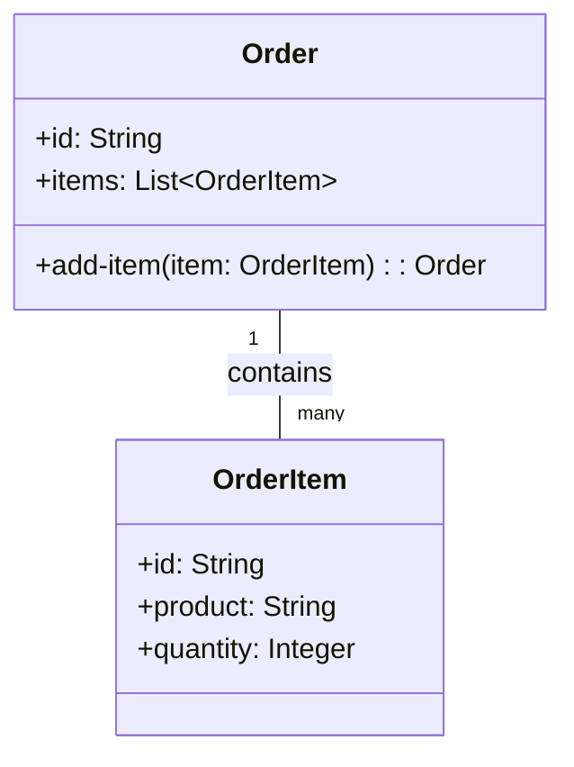

## 8.6 Aggregates in Clojure

In the realm of Domain-Driven Design (DDD), aggregates play a crucial role in managing the complexity of data interactions within a system. An aggregate is a cluster of related objects that are treated as a single unit, with a defined boundary and a root entity that ensures the integrity of the entire aggregate. This concept is particularly useful in Clojure, where immutability and functional programming paradigms align well with the principles of aggregates. In this article, we will delve into the intricacies of aggregates in Clojure, exploring their structure, implementation, and best practices.

### Introduction to Aggregates

Aggregates are designed to encapsulate a set of related entities and value objects, ensuring that all changes to the data are made through a single entry point, known as the aggregate root. This approach helps maintain consistency and integrity across the system by enforcing business rules and invariants at the aggregate level.

#### Key Concepts:
- **Aggregate Root:** The primary entity that controls access to the aggregate. All modifications to the aggregate must go through the root.
- **Entities and Value Objects:** Components within the aggregate that represent domain concepts. Entities have a distinct identity, while value objects are immutable and defined by their attributes.
- **Invariants:** Business rules that must be consistently enforced across the aggregate.

### Defining the Aggregate Root and Entities

In Clojure, we can define aggregates using records to represent entities and value objects. Let's consider an example of an `Order` aggregate, which consists of an `Order` entity and `OrderItem` entities.

```clojure
(defrecord Order [id items])
(defrecord OrderItem [id product quantity])
```

Here, `Order` is the aggregate root, and it contains a collection of `OrderItem` entities. The `Order` entity is responsible for managing the lifecycle and integrity of its items.

### Enforcing Invariants Through the Root

To maintain the integrity of the aggregate, all operations that modify the state of the aggregate should be performed through the aggregate root. This ensures that any business rules or invariants are consistently applied.

```clojure
(defn add-item [order item]
  (update order :items conj item))
```

In this example, the `add-item` function allows us to add an `OrderItem` to an `Order`. By encapsulating this logic within the aggregate root, we can enforce any necessary validation or business rules.

### Persisting Aggregates as a Whole

When persisting aggregates, it's important to treat them as a single unit. This means that all changes to the aggregate should be saved in a single transaction to ensure consistency.

```clojure
(defn save-order [db-spec order]
  (jdbc/with-db-transaction [tx db-spec]
    ;; Save order
    (jdbc/insert! tx :orders {:id (:id order)})
    ;; Save items
    (doseq [item (:items order)]
      (jdbc/insert! tx :order_items (assoc item :order_id (:id order))))))
```

Using a database transaction, we can ensure that both the `Order` and its `OrderItem` entities are persisted atomically, preventing partial updates that could lead to data inconsistency.

### Preventing Direct Access to Inner Entities

To maintain the integrity of the aggregate, it's crucial to prevent direct access to its inner entities. This means avoiding exposing functions that allow modifications to `OrderItem` outside the context of `Order`.

### Implementing Repositories per Aggregate

Repositories provide an abstraction layer for data access, allowing us to encapsulate the logic for retrieving and persisting aggregates. In Clojure, we can define a protocol for the `OrderRepository`.

```clojure
(defprotocol OrderRepository
  (find-order [this id])
  (save-order [this order]))
```

By implementing this protocol, we can create concrete repository classes that handle the specifics of data storage and retrieval, whether it's using a relational database, a document store, or another persistence mechanism.

### Visualizing Aggregates

To better understand the structure and interactions within an aggregate, let's visualize the `Order` aggregate using a conceptual diagram.



This diagram illustrates the relationship between the `Order` and `OrderItem` entities, highlighting the aggregate boundary and the role of the aggregate root.

### Use Cases for Aggregates

Aggregates are particularly useful in scenarios where consistency and integrity are paramount. Some common use cases include:

- **E-commerce Systems:** Managing orders, products, and inventory as aggregates to ensure consistent business rules.
- **Banking Applications:** Handling transactions and accounts as aggregates to maintain financial integrity.
- **Event Sourcing:** Using aggregates to encapsulate state changes and replay events for consistency.

### Advantages and Disadvantages

#### Advantages:
- **Consistency:** Aggregates ensure that business rules are consistently enforced across related entities.
- **Encapsulation:** By encapsulating related entities, aggregates simplify the management of complex data interactions.
- **Atomicity:** Aggregates allow for atomic operations, reducing the risk of data inconsistency.

#### Disadvantages:
- **Complexity:** Designing aggregates can be complex, especially in systems with intricate relationships.
- **Performance:** Large aggregates may impact performance due to the need to load and persist all related entities.

### Best Practices for Implementing Aggregates

- **Define Clear Boundaries:** Ensure that the aggregate boundary is well-defined and aligns with business requirements.
- **Limit Aggregate Size:** Keep aggregates small to improve performance and maintainability.
- **Use Repositories:** Implement repositories to abstract data access and encapsulate persistence logic.

### Conclusion

Aggregates are a powerful pattern for managing data integrity and consistency in Clojure applications. By encapsulating related entities and enforcing business rules through a single entry point, aggregates help maintain a clean and organized codebase. As you design your systems, consider the role of aggregates in simplifying data interactions and ensuring consistency across your domain.

## Quiz Time!



### What is an aggregate in Domain-Driven Design?

- [x] A cluster of related objects treated as a single unit
- [ ] A single object with no related entities
- [ ] A database table
- [ ] A user interface component

> **Explanation:** An aggregate is a cluster of related objects that are treated as a single unit, ensuring consistency and integrity.

### What is the role of the aggregate root?

- [x] To ensure the integrity of the aggregate
- [ ] To manage database transactions
- [ ] To handle user input
- [ ] To render the user interface

> **Explanation:** The aggregate root ensures the integrity of the aggregate by controlling access and enforcing business rules.

### How should changes be made to an aggregate?

- [x] Through the root entity
- [ ] Directly to any entity within the aggregate
- [ ] Through a database query
- [ ] By modifying the user interface

> **Explanation:** Changes should only be made through the root entity to maintain consistency and enforce invariants.

### What is the purpose of a repository in the context of aggregates?

- [x] To abstract data access and encapsulate persistence logic
- [ ] To render the user interface
- [ ] To manage user sessions
- [ ] To handle network requests

> **Explanation:** A repository abstracts data access and encapsulates the logic for retrieving and persisting aggregates.

### Why is it important to prevent direct access to inner entities of an aggregate?

- [x] To maintain the integrity of the aggregate
- [ ] To improve user interface performance
- [ ] To reduce database load
- [ ] To simplify network communication

> **Explanation:** Preventing direct access to inner entities helps maintain the integrity of the aggregate by ensuring all changes go through the root.

### What is a common disadvantage of using large aggregates?

- [x] Performance impact due to loading and persisting all related entities
- [ ] Increased user interface complexity
- [ ] Difficulty in managing user sessions
- [ ] Reduced database storage requirements

> **Explanation:** Large aggregates may impact performance because they require loading and persisting all related entities.

### In which scenario are aggregates particularly useful?

- [x] E-commerce systems for managing orders and inventory
- [ ] Rendering user interfaces
- [ ] Managing network requests
- [ ] Handling user authentication

> **Explanation:** Aggregates are useful in e-commerce systems for managing orders and inventory to ensure consistent business rules.

### What is the benefit of using repositories with aggregates?

- [x] They provide a clean interface for data access and manipulation
- [ ] They improve user interface rendering speed
- [ ] They reduce network latency
- [ ] They simplify user authentication

> **Explanation:** Repositories provide a clean interface for data access and manipulation, encapsulating persistence logic.

### How can aggregates help in event sourcing?

- [x] By encapsulating state changes and replaying events for consistency
- [ ] By improving user interface responsiveness
- [ ] By reducing database storage
- [ ] By simplifying network communication

> **Explanation:** Aggregates encapsulate state changes and replay events for consistency, which is beneficial in event sourcing.

### True or False: Aggregates should always be as large as possible to encapsulate all related entities.

- [ ] True
- [x] False

> **Explanation:** Aggregates should be kept small to improve performance and maintainability, not necessarily encapsulating all related entities.


