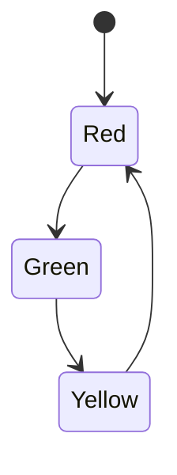

## 8.6. State Pattern with Atoms and State Machines

The State Pattern is a behavioral design pattern that allows an object to change its behavior when its internal state changes. This pattern is particularly useful in scenarios where an object must exhibit different behaviors depending on its current state. In Clojure, we can leverage atoms and state machines to implement the State Pattern effectively, taking advantage of Clojure's functional programming paradigms and concurrency models.

### Understanding the State Pattern

**Intent**: The State Pattern aims to encapsulate varying behavior for the same object based on its internal state. This is achieved by defining a state interface and concrete state classes that implement this interface.

**Use Cases**:
- **Finite State Machines**: Systems that transition between a finite number of states, such as a vending machine or a traffic light.
- **UI Components**: Components that change behavior based on user interactions or data changes.
- **Game Development**: Characters or objects that have different behaviors based on their state (e.g., idle, walking, running).

### Modeling States and Transitions with Atoms

In Clojure, atoms provide a way to manage shared, mutable state in a thread-safe manner. Atoms are ideal for implementing the State Pattern because they allow us to encapsulate state transitions and ensure that state changes are atomic.

#### Defining States

Let's start by defining a simple state machine for a traffic light system. The traffic light can be in one of three states: `:red`, `:green`, or `:yellow`.

```clojure
(defn red-state []
  {:name :red
   :next :green})

(defn green-state []
  {:name :green
   :next :yellow})

(defn yellow-state []
  {:name :yellow
   :next :red})
```

Each state is represented as a map with a `:name` key indicating the current state and a `:next` key indicating the next state.

#### Managing State Transitions

We use an atom to hold the current state of the traffic light. The atom allows us to safely transition between states.

```clojure
(def traffic-light (atom (red-state)))

(defn transition-state [state]
  (case (:name state)
    :red (green-state)
    :green (yellow-state)
    :yellow (red-state)))

(defn change-light []
  (swap! traffic-light transition-state))
```

Here, `traffic-light` is an atom initialized with the `red-state`. The `transition-state` function determines the next state based on the current state. The `change-light` function uses `swap!` to atomically update the state of the traffic light.

### Implementing State Machines

State machines are a powerful abstraction for managing complex state transitions. They can be used to model systems with well-defined states and transitions.

#### Example: Vending Machine

Let's implement a simple vending machine that accepts coins and dispenses items. The vending machine can be in one of the following states: `:waiting`, `:accepting`, or `:dispensing`.

```clojure
(defn waiting-state []
  {:name :waiting
   :next :accepting})

(defn accepting-state []
  {:name :accepting
   :next :dispensing})

(defn dispensing-state []
  {:name :dispensing
   :next :waiting})

(def vending-machine (atom (waiting-state)))

(defn transition-vending-state [state]
  (case (:name state)
    :waiting (accepting-state)
    :accepting (dispensing-state)
    :dispensing (waiting-state)))

(defn insert-coin []
  (swap! vending-machine transition-vending-state))

(defn dispense-item []
  (swap! vending-machine transition-vending-state))
```

In this example, the vending machine transitions from `:waiting` to `:accepting` when a coin is inserted, and from `:accepting` to `:dispensing` when an item is dispensed. After dispensing, the machine returns to the `:waiting` state.

### State Changes and Behavior

The State Pattern allows us to change the behavior of an object based on its current state. This is achieved by defining different behaviors for each state.

#### Example: Traffic Light Behavior

Let's extend our traffic light example to include behavior for each state.

```clojure
(defn red-behavior []
  (println "Stop!"))

(defn green-behavior []
  (println "Go!"))

(defn yellow-behavior []
  (println "Caution!"))

(defn traffic-light-behavior [state]
  (case (:name state)
    :red (red-behavior)
    :green (green-behavior)
    :yellow (yellow-behavior)))

(defn update-light []
  (traffic-light-behavior @traffic-light)
  (change-light))
```

The `traffic-light-behavior` function defines the behavior for each state. The `update-light` function first executes the behavior for the current state and then transitions to the next state.

### Concurrency Considerations

Clojure's atoms provide a simple and efficient way to manage state transitions in a concurrent environment. Atoms ensure that state changes are atomic and thread-safe, making them ideal for implementing the State Pattern in concurrent applications.

#### Handling Concurrency

When using atoms, it's important to consider potential race conditions and ensure that state transitions are atomic. The `swap!` function in Clojure provides atomic updates, ensuring that state transitions are consistent and thread-safe.

```clojure
(defn safe-change-light []
  (swap! traffic-light transition-state)
  (traffic-light-behavior @traffic-light))
```

In this example, `safe-change-light` ensures that the state transition and behavior execution are atomic, preventing race conditions.

### Visualizing State Transitions

To better understand the state transitions in our examples, let's visualize the state machine for the traffic light system.



**Diagram Description**: This state diagram represents the traffic light system, showing the transitions between the `Red`, `Green`, and `Yellow` states.

### Try It Yourself

Experiment with the code examples provided by modifying the state transitions and behaviors. For instance, you can add a `:flashing` state to the traffic light system or implement additional behaviors for the vending machine.

### Key Takeaways

- The State Pattern allows objects to change behavior based on their internal state.
- Atoms in Clojure provide a thread-safe way to manage state transitions.
- State machines are a powerful abstraction for modeling systems with well-defined states and transitions.
- Concurrency considerations are important when implementing the State Pattern in Clojure.

### Further Reading

- [Clojure Atoms](https://clojure.org/reference/atoms)
- [State Pattern on Wikipedia](https://en.wikipedia.org/wiki/State_pattern)
- [Concurrency in Clojure](https://clojure.org/reference/concurrency)

## **Ready to Test Your Knowledge?**



### What is the primary purpose of the State Pattern?

- [x] To allow an object to change its behavior when its internal state changes.
- [ ] To encapsulate algorithms within a class.
- [ ] To provide a way to access the elements of an aggregate object sequentially.
- [ ] To define a family of algorithms and make them interchangeable.

> **Explanation:** The State Pattern is used to allow an object to change its behavior when its internal state changes, making it appear as if the object changed its class.

### How are states represented in the traffic light example?

- [x] As maps with `:name` and `:next` keys.
- [ ] As lists with state names.
- [ ] As vectors with transition functions.
- [ ] As strings representing state names.

> **Explanation:** In the traffic light example, states are represented as maps with `:name` and `:next` keys to indicate the current state and the next state.

### What function is used to atomically update the state in Clojure?

- [x] `swap!`
- [ ] `reset!`
- [ ] `alter`
- [ ] `ref-set`

> **Explanation:** The `swap!` function is used to atomically update the state of an atom in Clojure.

### What is the initial state of the vending machine in the example?

- [x] `:waiting`
- [ ] `:accepting`
- [ ] `:dispensing`
- [ ] `:idle`

> **Explanation:** The initial state of the vending machine in the example is `:waiting`.

### Which function defines the behavior for each state in the traffic light example?

- [x] `traffic-light-behavior`
- [ ] `red-behavior`
- [ ] `green-behavior`
- [ ] `yellow-behavior`

> **Explanation:** The `traffic-light-behavior` function defines the behavior for each state in the traffic light example.

### What is the benefit of using atoms in Clojure for state management?

- [x] They provide a thread-safe way to manage state transitions.
- [ ] They allow for mutable state in a functional language.
- [ ] They enable direct manipulation of state without functions.
- [ ] They simplify the syntax of state transitions.

> **Explanation:** Atoms provide a thread-safe way to manage state transitions, ensuring atomic updates in concurrent environments.

### What does the `transition-state` function do in the traffic light example?

- [x] Determines the next state based on the current state.
- [ ] Executes the behavior for the current state.
- [ ] Resets the traffic light to its initial state.
- [ ] Logs the current state to the console.

> **Explanation:** The `transition-state` function determines the next state based on the current state in the traffic light example.

### How can you ensure atomic state transitions in Clojure?

- [x] By using the `swap!` function with atoms.
- [ ] By using the `reset!` function with refs.
- [ ] By using the `alter` function with agents.
- [ ] By using the `ref-set` function with vars.

> **Explanation:** Atomic state transitions in Clojure can be ensured by using the `swap!` function with atoms.

### What is a common use case for the State Pattern?

- [x] Finite State Machines
- [ ] Sorting Algorithms
- [ ] Data Serialization
- [ ] Graph Traversal

> **Explanation:** A common use case for the State Pattern is Finite State Machines, where an object transitions between a finite number of states.

### True or False: Atoms in Clojure are mutable.

- [ ] True
- [x] False

> **Explanation:** Atoms in Clojure are not mutable; they provide a way to manage shared, mutable state in a thread-safe manner, but the state itself is immutable.



Remember, this is just the beginning. As you progress, you'll build more complex and interactive systems using the State Pattern in Clojure. Keep experimenting, stay curious, and enjoy the journey!
