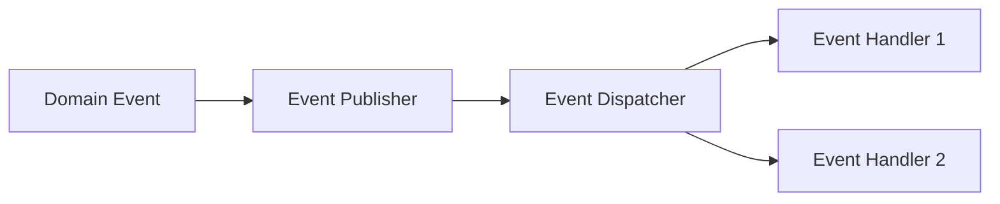

## 8.7 Domain Events in Clojure

### Introduction

Domain events are a powerful concept in software design, particularly within Domain-Driven Design (DDD) and event-driven architectures. They represent significant occurrences within a business domain, allowing different components of a system to communicate in a decoupled manner. This article explores the implementation of domain events in Clojure, showcasing how they can be used to build scalable and maintainable systems.

### Detailed Explanation

Domain events capture changes or actions within a system that are of interest to other parts of the application. By encapsulating these events as distinct entities, we can achieve loose coupling between components, enabling them to react to changes without direct dependencies on each other.

#### Key Concepts

- **Decoupled Communication:** Domain events allow components to communicate without being tightly coupled, promoting flexibility and scalability.
- **Event-Driven Architecture:** By leveraging domain events, systems can be designed to react to changes in real-time, enhancing responsiveness and user experience.
- **Domain-Driven Design (DDD):** In DDD, domain events are used to model business processes and ensure that the system's behavior aligns with business requirements.

### Visual Aids

#### Conceptual Diagram



*Figure 1: Domain events flow from the publisher through a dispatcher to various handlers.*

### Code Examples

Let's explore how to implement domain events in Clojure with practical code examples.

#### Define Domain Events

Domain events are typically defined as immutable data structures. In Clojure, we can use `defrecord` to define them:

```clojure
(defrecord UserCreated [user-id timestamp])
(defrecord OrderConfirmed [order-id timestamp])
```

These records represent events that occur within the domain, such as a user being created or an order being confirmed.

#### Publish Events

To publish events, we create functions that perform domain actions and emit events:

```clojure
(defn create-user [user-data]
  ;; Save user to database
  (publish-event (->UserCreated (:id user-data) (System/currentTimeMillis))))
```

In this example, when a user is created, a `UserCreated` event is published.

#### Implement an Event Dispatcher

An event dispatcher manages the registration of event handlers and the distribution of events to these handlers:

```clojure
(def event-handlers (atom {}))

(defn register-handler [event-type handler]
  (swap! event-handlers update event-type conj handler))

(defn publish-event [event]
  (doseq [handler (get @event-handlers (type event))]
    (handler event)))
```

The dispatcher uses an atom to store handlers for different event types, allowing dynamic registration and execution.

#### Register Event Handlers

Event handlers are functions that react to specific events. They are registered with the dispatcher:

```clojure
(register-handler UserCreated
  (fn [event]
    (send-welcome-email (:user-id event))))
```

In this case, when a `UserCreated` event is published, the handler sends a welcome email to the new user.

### Use Cases

Domain events are applicable in various scenarios, including:

- **Microservices Communication:** Enabling services to communicate asynchronously without direct dependencies.
- **Audit Logging:** Capturing and storing significant events for auditing purposes.
- **Real-Time Notifications:** Sending notifications to users or systems in response to domain events.

### Advantages and Disadvantages

#### Advantages

- **Loose Coupling:** Components can evolve independently, reducing the impact of changes.
- **Scalability:** Systems can handle increased loads by distributing event processing.
- **Flexibility:** New features can be added by introducing new event handlers without modifying existing code.

#### Disadvantages

- **Complexity:** Managing a large number of events and handlers can become complex.
- **Debugging:** Tracing the flow of events through the system can be challenging.

### Best Practices

- **Use Immutable Data Structures:** Ensure that events are immutable to prevent unintended side effects.
- **Design for Failure:** Implement error handling and retries to manage failures in event processing.
- **Document Event Contracts:** Clearly define the structure and purpose of each event to facilitate understanding and maintenance.

### Comparisons

Domain events can be compared to other communication patterns, such as direct method calls or message queues. Unlike direct calls, domain events promote decoupling, while message queues provide additional features like persistence and delivery guarantees.

### Conclusion

Domain events are a fundamental pattern in building robust, scalable, and maintainable systems. By leveraging Clojure's functional programming capabilities, developers can implement domain events effectively, enhancing the flexibility and responsiveness of their applications.

## Quiz Time!



### What is the primary purpose of domain events in software design?

- [x] To enable decoupled communication between components
- [ ] To increase the complexity of the system
- [ ] To replace all direct method calls
- [ ] To ensure all components are tightly coupled

> **Explanation:** Domain events facilitate decoupled communication, allowing components to interact without direct dependencies.

### How are domain events typically represented in Clojure?

- [x] As immutable data structures using `defrecord`
- [ ] As mutable objects using `defclass`
- [ ] As global variables
- [ ] As functions

> **Explanation:** Domain events are defined as immutable data structures using `defrecord` to ensure consistency and prevent side effects.

### What is the role of an event dispatcher in a domain event system?

- [x] To manage the registration and distribution of events to handlers
- [ ] To create new events
- [ ] To store events in a database
- [ ] To delete old events

> **Explanation:** The event dispatcher is responsible for managing event handlers and distributing events to them.

### Which of the following is a benefit of using domain events?

- [x] Loose coupling between components
- [ ] Increased system complexity
- [ ] Direct communication between all components
- [ ] Reduced flexibility

> **Explanation:** Domain events promote loose coupling, allowing components to evolve independently.

### In the provided code example, what does the `publish-event` function do?

- [x] It distributes the event to all registered handlers for the event type
- [ ] It saves the event to a database
- [ ] It logs the event to a file
- [ ] It deletes the event after processing

> **Explanation:** The `publish-event` function distributes the event to all handlers registered for the event type.

### What is a potential disadvantage of using domain events?

- [x] Increased complexity in managing events and handlers
- [ ] Reduced system flexibility
- [ ] Tighter coupling between components
- [ ] Decreased scalability

> **Explanation:** Managing a large number of events and handlers can increase system complexity.

### How can domain events be used in microservices architectures?

- [x] To enable asynchronous communication between services
- [ ] To replace all synchronous communication
- [ ] To ensure all services are tightly coupled
- [ ] To eliminate the need for service discovery

> **Explanation:** Domain events enable asynchronous communication, allowing services to interact without direct dependencies.

### What is a best practice when implementing domain events?

- [x] Use immutable data structures for events
- [ ] Use mutable objects for events
- [ ] Avoid documenting event contracts
- [ ] Ignore error handling in event processing

> **Explanation:** Using immutable data structures ensures consistency and prevents unintended side effects.

### How do domain events enhance scalability?

- [x] By distributing event processing across multiple components
- [ ] By centralizing all event processing in a single component
- [ ] By reducing the number of components in the system
- [ ] By eliminating the need for load balancing

> **Explanation:** Domain events allow event processing to be distributed, enhancing scalability.

### True or False: Domain events are only useful in Domain-Driven Design (DDD) contexts.

- [x] False
- [ ] True

> **Explanation:** While domain events are integral to DDD, they are also useful in other contexts, such as event-driven architectures.


