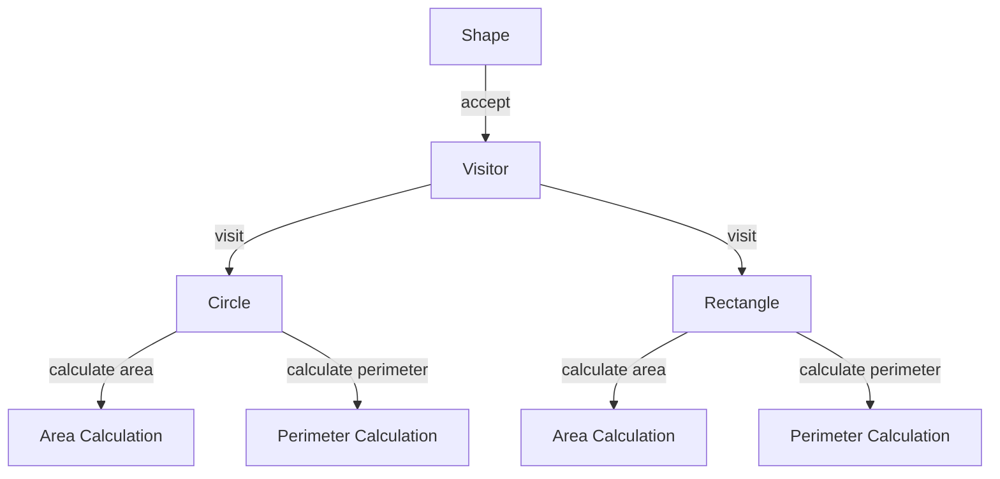

## 8.7. Visitor Pattern via Multimethods

The Visitor Pattern is a powerful design pattern that allows you to define new operations on a set of objects without changing the objects themselves. In Clojure, this pattern can be elegantly implemented using multimethods, which provide a flexible way to dispatch functions based on the types or attributes of their arguments. This section will delve into the Visitor Pattern, its purpose, and how Clojure's multimethods can be leveraged to implement it effectively.

### Understanding the Visitor Pattern

#### Definition and Purpose

The Visitor Pattern is a behavioral design pattern that lets you separate algorithms from the objects on which they operate. It involves creating a visitor class that implements an operation to be performed on elements of an object structure. The key purpose of the Visitor Pattern is to add new operations to existing object structures without modifying the structures themselves. This is particularly useful when dealing with complex object hierarchies.

#### Key Participants

- **Visitor**: An interface or abstract class that declares a visit method for each type of element in the object structure.
- **ConcreteVisitor**: Implements the operations defined in the Visitor interface.
- **Element**: An interface or abstract class that declares an accept method that takes a visitor as an argument.
- **ConcreteElement**: Implements the accept method to call the visitor's method corresponding to its class.

### Implementing the Visitor Pattern with Multimethods

Clojure's multimethods provide a dynamic dispatch mechanism that can be used to implement the Visitor Pattern. Multimethods allow you to define a single function that can have multiple implementations, each selected based on the type or attributes of its arguments.

#### Multimethods in Clojure

Multimethods in Clojure are defined using the `defmulti` and `defmethod` constructs. The `defmulti` function defines a multimethod and specifies a dispatch function that determines which method implementation to invoke. The `defmethod` function is used to define the actual implementations of the multimethod for different dispatch values.

```clojure
(defmulti visit (fn [element visitor] (:type element)))

(defmethod visit :circle [element visitor]
  (println "Visiting a circle with radius:" (:radius element)))

(defmethod visit :rectangle [element visitor]
  (println "Visiting a rectangle with width:" (:width element) "and height:" (:height element)))
```

In this example, the `visit` multimethod dispatches based on the `:type` attribute of the `element` argument. Different implementations are provided for `:circle` and `:rectangle` types.

#### Example: Shape Visitor

Let's consider a simple example where we have a set of geometric shapes, and we want to perform different operations on them using the Visitor Pattern.

```clojure
(defrecord Circle [radius])
(defrecord Rectangle [width height])

(defmulti visit-shape (fn [shape visitor] (:type shape)))

(defmethod visit-shape :circle [shape visitor]
  (println "Calculating area of circle with radius:" (:radius shape))
  (* Math/PI (:radius shape) (:radius shape)))

(defmethod visit-shape :rectangle [shape visitor]
  (println "Calculating area of rectangle with width:" (:width shape) "and height:" (:height shape))
  (* (:width shape) (:height shape)))

(def circle (->Circle 5))
(def rectangle (->Rectangle 4 6))

(visit-shape circle nil)
(visit-shape rectangle nil)
```

In this example, we define a `visit-shape` multimethod that calculates the area of different shapes. The `defmethod` constructs provide specific implementations for `:circle` and `:rectangle`.

### Extensibility and Separation of Concerns

One of the main advantages of using the Visitor Pattern with multimethods is the separation of operations from the data structures. This separation allows you to add new operations without modifying the existing data structures, adhering to the open/closed principle.

#### Adding New Operations

Suppose we want to add a new operation to calculate the perimeter of the shapes. We can easily do this by defining a new multimethod without altering the existing shape definitions.

```clojure
(defmulti calculate-perimeter (fn [shape] (:type shape)))

(defmethod calculate-perimeter :circle [shape]
  (println "Calculating perimeter of circle with radius:" (:radius shape))
  (* 2 Math/PI (:radius shape)))

(defmethod calculate-perimeter :rectangle [shape]
  (println "Calculating perimeter of rectangle with width:" (:width shape) "and height:" (:height shape))
  (* 2 (+ (:width shape) (:height shape))))

(calculate-perimeter circle)
(calculate-perimeter rectangle)
```

Here, we define a `calculate-perimeter` multimethod with specific implementations for `:circle` and `:rectangle`. This demonstrates how easily new operations can be added without modifying the existing data structures.

### Advantages of Using Multimethods for the Visitor Pattern

- **Flexibility**: Multimethods provide a flexible way to dispatch functions based on types or attributes, making it easy to extend functionality.
- **Separation of Concerns**: By separating operations from data structures, you can adhere to the open/closed principle, making your code more maintainable and extensible.
- **Dynamic Dispatch**: Multimethods allow for dynamic dispatch based on runtime values, providing a powerful mechanism for implementing complex behavior.
- **Simplicity**: Clojure's multimethods offer a simple and elegant way to implement the Visitor Pattern without the need for complex class hierarchies.

### Design Considerations

When using the Visitor Pattern with multimethods in Clojure, consider the following:

- **Dispatch Function**: Choose an appropriate dispatch function that accurately reflects the criteria for selecting the correct method implementation.
- **Performance**: Be mindful of the performance implications of dynamic dispatch, especially in performance-critical applications.
- **Complexity**: While multimethods provide flexibility, they can also introduce complexity if overused. Use them judiciously to maintain code readability.

### Clojure Unique Features

Clojure's multimethods offer unique features that make them particularly well-suited for implementing the Visitor Pattern:

- **Dynamic Typing**: Clojure's dynamic typing allows for flexible dispatch based on runtime values, enabling powerful and dynamic behavior.
- **Functional Programming**: The functional programming paradigm in Clojure encourages the separation of data and behavior, aligning well with the principles of the Visitor Pattern.
- **Immutable Data Structures**: Clojure's immutable data structures ensure that operations do not modify the original data, promoting safe and predictable behavior.

### Differences and Similarities

The Visitor Pattern is often compared to other behavioral patterns, such as the Strategy Pattern. While both patterns allow for dynamic behavior, the Visitor Pattern focuses on adding new operations to existing structures, whereas the Strategy Pattern is more about selecting algorithms at runtime.

### Visualizing the Visitor Pattern with Multimethods

To better understand how the Visitor Pattern works with multimethods, let's visualize the process using a Mermaid.js diagram.



**Diagram Description**: This diagram illustrates the interaction between shapes and the visitor. The visitor performs different operations (area and perimeter calculations) on the shapes (circle and rectangle) using multimethods.

### Try It Yourself

To deepen your understanding of the Visitor Pattern via multimethods, try modifying the code examples provided:

- Add a new shape, such as a `Triangle`, and implement the necessary multimethods to calculate its area and perimeter.
- Experiment with different dispatch functions to see how they affect the behavior of the multimethods.
- Implement additional operations, such as calculating the diagonal of a rectangle, using the Visitor Pattern.

### References and Links

For further reading on the Visitor Pattern and multimethods in Clojure, consider the following resources:

- [Clojure Multimethods Documentation](https://clojure.org/reference/multimethods)
- [Design Patterns: Elements of Reusable Object-Oriented Software](https://en.wikipedia.org/wiki/Design_Patterns)
- [Functional Programming in Clojure](https://clojure.org/about/rationale)

### Knowledge Check

To reinforce your understanding of the Visitor Pattern via multimethods, try answering the following questions and challenges.

## **Ready to Test Your Knowledge?**



### What is the primary purpose of the Visitor Pattern?

- [x] To add new operations to existing object structures without modifying them
- [ ] To encapsulate a family of algorithms
- [ ] To provide a way to access the elements of an aggregate object sequentially
- [ ] To define a one-to-many dependency between objects

> **Explanation:** The Visitor Pattern allows new operations to be added to existing object structures without modifying the structures themselves.

### How do Clojure's multimethods support the Visitor Pattern?

- [x] By allowing dynamic dispatch based on types or attributes
- [ ] By providing a way to encapsulate algorithms
- [ ] By enabling sequential access to elements
- [ ] By defining a one-to-many dependency

> **Explanation:** Multimethods in Clojure support the Visitor Pattern by enabling dynamic dispatch based on types or attributes, allowing new operations to be defined over existing structures.

### What is a key advantage of using the Visitor Pattern with multimethods?

- [x] Separation of operations from data structures
- [ ] Simplification of class hierarchies
- [ ] Improved performance in all cases
- [ ] Reduced code complexity

> **Explanation:** A key advantage of using the Visitor Pattern with multimethods is the separation of operations from data structures, which adheres to the open/closed principle.

### Which of the following is NOT a participant in the Visitor Pattern?

- [ ] Visitor
- [ ] ConcreteVisitor
- [x] Strategy
- [ ] Element

> **Explanation:** The Strategy is not a participant in the Visitor Pattern; it is a separate design pattern.

### What is the role of the dispatch function in a multimethod?

- [x] To determine which method implementation to invoke
- [ ] To encapsulate the algorithm
- [ ] To provide sequential access to elements
- [ ] To define a one-to-many dependency

> **Explanation:** The dispatch function in a multimethod determines which method implementation to invoke based on the provided arguments.

### In the provided example, what does the `visit-shape` multimethod do?

- [x] Calculates the area of different shapes
- [ ] Encapsulates algorithms for shape manipulation
- [ ] Provides a way to access shape elements sequentially
- [ ] Defines a one-to-many dependency between shapes

> **Explanation:** The `visit-shape` multimethod calculates the area of different shapes based on their types.

### How can you add a new operation to the existing shape structure using multimethods?

- [x] Define a new multimethod for the operation
- [ ] Modify the existing shape definitions
- [ ] Encapsulate the operation in a new class
- [ ] Use inheritance to extend the shape classes

> **Explanation:** You can add a new operation to the existing shape structure by defining a new multimethod for the operation, without modifying the existing shape definitions.

### What is a potential drawback of using multimethods?

- [x] They can introduce complexity if overused
- [ ] They always reduce code readability
- [ ] They are not flexible enough for dynamic dispatch
- [ ] They cannot be used with immutable data structures

> **Explanation:** A potential drawback of using multimethods is that they can introduce complexity if overused, so they should be used judiciously.

### Which principle does the Visitor Pattern adhere to when implemented with multimethods?

- [x] Open/Closed Principle
- [ ] Single Responsibility Principle
- [ ] Liskov Substitution Principle
- [ ] Dependency Inversion Principle

> **Explanation:** The Visitor Pattern adheres to the Open/Closed Principle when implemented with multimethods, as it allows new operations to be added without modifying existing structures.

### True or False: Multimethods in Clojure can only dispatch based on the type of the first argument.

- [ ] True
- [x] False

> **Explanation:** False. Multimethods in Clojure can dispatch based on any criteria, including types or attributes of any arguments.



Remember, this is just the beginning. As you progress, you'll build more complex and interactive applications using the Visitor Pattern and multimethods in Clojure. Keep experimenting, stay curious, and enjoy the journey!
