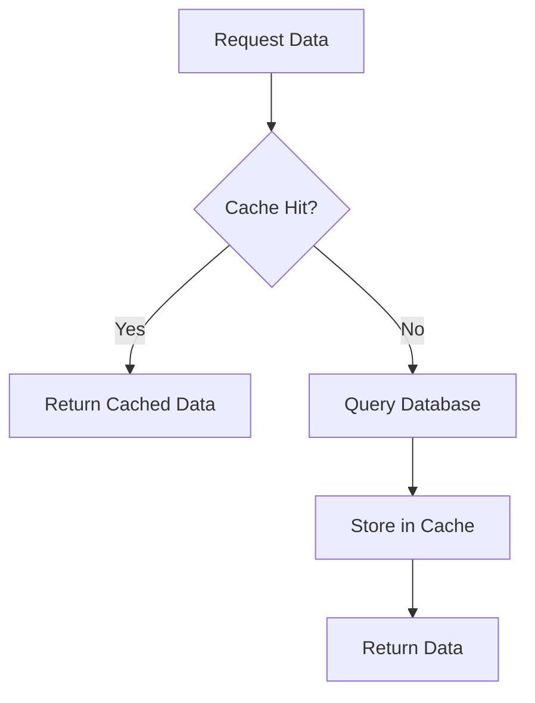

## 8.8 Cache-Aside Pattern in Clojure

In modern software development, efficient data management is crucial for achieving high performance and scalability. The Cache-Aside Pattern, also known as Lazy Loading, is a widely used caching strategy that helps optimize data retrieval by reducing the load on databases and improving response times. This article delves into the Cache-Aside Pattern in the context of Clojure, providing insights into its implementation, benefits, and best practices.

### Introduction

The Cache-Aside Pattern is a caching strategy where the application code is responsible for loading data into the cache as needed. This pattern is particularly useful when dealing with read-heavy workloads, as it minimizes database access by serving data from the cache whenever possible.

### Detailed Explanation

The Cache-Aside Pattern operates on a simple principle: check the cache before querying the database. If the data is present in the cache (a cache hit), it is returned immediately. If the data is not in the cache (a cache miss), it is fetched from the database, stored in the cache, and then returned to the caller. This approach ensures that frequently accessed data is readily available, reducing latency and improving application performance.

#### Workflow of the Cache-Aside Pattern



1. **Request Data:** The application requests data.
2. **Cache Hit?:** The cache is checked for the requested data.
3. **Return Cached Data:** If the data is found in the cache, it is returned.
4. **Query Database:** If the data is not in the cache, the database is queried.
5. **Store in Cache:** The retrieved data is stored in the cache for future requests.
6. **Return Data:** The data is returned to the application.

### Implementing Cache Access Functions

In Clojure, we can implement basic cache operations using an `atom` to store cached data. Here's a simple implementation:

```clojure
(def cache (atom {}))

(defn cache-get [key]
  (@cache key))

(defn cache-put [key value]
  (swap! cache assoc key value))

(defn cache-remove [key]
  (swap! cache dissoc key))
```

### Modifying Data Access to Use the Cache

To leverage the cache, modify data access functions to check the cache before querying the database. Here's an example of fetching a user by ID:

```clojure
(defn get-user [user-id]
  (or (cache-get user-id)
      (let [user (find-user db-spec user-id)]
        (when user
          (cache-put user-id user))
        user)))
```

### Updating the Cache on Data Changes

When data changes, it's essential to update or invalidate the cache to ensure consistency:

```clojure
(defn update-user [user]
  ;; Update in database
  (cache-put (:id user) user))

(defn delete-user [user-id]
  ;; Delete from database
  (cache-remove user-id))
```

### Implementing Cache Expiration

For long-lived applications, implementing cache expiration strategies like Time-To-Live (TTL) or Least Recently Used (LRU) can prevent stale data:

- **TTL:** Automatically remove cache entries after a specified duration.
- **LRU:** Evict the least recently used items when the cache reaches its capacity.

### Using External Caching Solutions

For scalability, consider integrating with external caching solutions like Redis or Memcached. These systems provide robust caching capabilities, including persistence, replication, and advanced eviction policies.

### Advantages and Disadvantages

#### Advantages

- **Improved Performance:** Reduces database load and improves response times.
- **Scalability:** Supports high read-throughput applications.
- **Flexibility:** Allows fine-grained control over caching logic.

#### Disadvantages

- **Complexity:** Requires additional logic for cache management.
- **Stale Data:** Risk of serving outdated data if cache is not properly invalidated.
- **Memory Overhead:** Increased memory usage due to cached data.

### Best Practices

- **Cache Invalidation:** Ensure cache is updated or invalidated on data changes to maintain consistency.
- **Monitoring:** Implement monitoring to track cache hit/miss ratios and optimize cache usage.
- **Testing:** Thoroughly test cache logic to prevent data inconsistencies and ensure reliability.

### Conclusion

The Cache-Aside Pattern is a powerful tool for optimizing data access in Clojure applications. By strategically caching data, developers can significantly enhance application performance and scalability. However, careful consideration must be given to cache management and invalidation strategies to avoid potential pitfalls.

## Quiz Time!



### What is the primary goal of the Cache-Aside Pattern?

- [x] To reduce database load and improve response times
- [ ] To increase database transactions
- [ ] To simplify data access logic
- [ ] To eliminate the need for a database

> **Explanation:** The Cache-Aside Pattern aims to reduce database load by serving frequently accessed data from the cache, thereby improving response times.

### In the Cache-Aside Pattern, what happens on a cache miss?

- [ ] The request is denied
- [x] The data is fetched from the database and stored in the cache
- [ ] The application crashes
- [ ] The cache is cleared

> **Explanation:** On a cache miss, the data is fetched from the database, stored in the cache, and then returned to the caller.

### Which Clojure construct is used to implement a simple cache in the provided example?

- [ ] ref
- [x] atom
- [ ] agent
- [ ] delay

> **Explanation:** An `atom` is used to implement a simple cache, allowing for mutable state management in a thread-safe manner.

### What is a potential disadvantage of the Cache-Aside Pattern?

- [ ] Simplified data access
- [x] Risk of serving stale data
- [ ] Reduced memory usage
- [ ] Increased database load

> **Explanation:** A potential disadvantage is the risk of serving stale data if the cache is not properly invalidated or updated.

### How can cache expiration be implemented in the Cache-Aside Pattern?

- [x] Using TTL or LRU strategies
- [ ] By increasing cache size
- [ ] By reducing database queries
- [ ] By using more atoms

> **Explanation:** Cache expiration can be implemented using strategies like Time-To-Live (TTL) or Least Recently Used (LRU) to manage cache entries.

### What is the role of `cache-put` in the provided Clojure code?

- [ ] To remove data from the cache
- [x] To add or update data in the cache
- [ ] To clear the entire cache
- [ ] To fetch data from the database

> **Explanation:** `cache-put` is used to add or update data in the cache, ensuring that the cache contains the latest data.

### Why might you integrate an external caching solution like Redis with the Cache-Aside Pattern?

- [x] For scalability and advanced caching features
- [ ] To simplify code
- [ ] To increase database load
- [ ] To reduce memory usage

> **Explanation:** External caching solutions like Redis provide scalability and advanced features such as persistence and replication, enhancing the caching strategy.

### What is a key benefit of using the Cache-Aside Pattern?

- [x] Improved application performance
- [ ] Simplified database schema
- [ ] Reduced code complexity
- [ ] Increased database transactions

> **Explanation:** The Cache-Aside Pattern improves application performance by reducing the need to access the database for frequently requested data.

### Which of the following is a best practice when implementing the Cache-Aside Pattern?

- [x] Ensuring cache invalidation on data changes
- [ ] Ignoring cache hit/miss ratios
- [ ] Using only in-memory caches
- [ ] Avoiding external caching solutions

> **Explanation:** Ensuring cache invalidation on data changes is crucial to maintaining data consistency and reliability.

### True or False: The Cache-Aside Pattern eliminates the need for a database.

- [ ] True
- [x] False

> **Explanation:** False. The Cache-Aside Pattern does not eliminate the need for a database; it complements it by caching frequently accessed data to improve performance.


