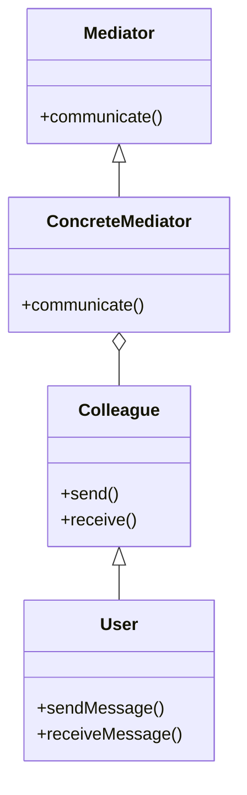

## 8.8. Mediator Pattern with Core.Async and Pub/Sub

The Mediator Pattern is a behavioral design pattern that centralizes communication between components, reducing the dependencies between them. In Clojure, the `core.async` library provides powerful tools for implementing this pattern using pub/sub (publish/subscribe) mechanisms. This section will delve into the Mediator Pattern, its intent, and how `core.async` channels facilitate pub/sub communication. We will explore examples, discuss the benefits of reduced coupling and improved maintainability, and highlight use cases in event-driven architectures.

### Understanding the Mediator Pattern

#### Definition and Intent

The Mediator Pattern is designed to manage complex communication between objects by introducing a mediator object. This mediator encapsulates how a set of objects interact, promoting loose coupling by preventing objects from referring to each other explicitly. Instead, they communicate through the mediator.

**Intent**: The primary intent of the Mediator Pattern is to reduce the complexity of communication between multiple objects or components. By centralizing the communication logic in a mediator, individual components become simpler and more focused on their specific tasks.

#### Key Participants

- **Mediator**: Defines an interface for communication between components.
- **ConcreteMediator**: Implements the mediator interface and coordinates communication between components.
- **Colleagues**: Components that communicate through the mediator.

### Core.Async and Pub/Sub Mechanisms

#### Introduction to Core.Async

`core.async` is a Clojure library that provides facilities for asynchronous programming using channels. Channels are abstractions for communication, allowing data to be passed between different parts of a program without direct coupling.

#### Pub/Sub with Core.Async

In a pub/sub system, publishers send messages to a channel, and subscribers listen for messages on that channel. This decouples the sender and receiver, allowing for flexible and dynamic communication patterns.

```clojure
(require '[clojure.core.async :refer [chan go >! <!]])

(defn publisher [ch]
  (go
    (loop [i 0]
      (>! ch i)
      (Thread/sleep 1000)
      (recur (inc i)))))

(defn subscriber [ch]
  (go
    (loop []
      (let [msg (<! ch)]
        (println "Received message:" msg))
      (recur))))

(let [ch (chan)]
  (publisher ch)
  (subscriber ch))
```

In this example, a publisher sends incrementing integers to a channel every second, while a subscriber listens for and prints these messages.

### Implementing the Mediator Pattern with Core.Async

#### Example: Chat Room Mediator

Consider a chat room application where users can send messages to each other. The mediator pattern can be used to manage communication between users without them knowing about each other directly.

```clojure
(require '[clojure.core.async :refer [chan go >! <! pub sub]])

(defn chat-room []
  (let [ch (chan)
        pub-ch (pub ch :topic)]
    {:channel ch
     :pub-ch pub-ch}))

(defn user [name chat-room]
  (let [ch (chan)]
    (sub (:pub-ch chat-room) :chat ch)
    (go
      (loop []
        (let [msg (<! ch)]
          (println name "received:" msg))
        (recur)))
    ch))

(defn send-message [chat-room user msg]
  (go (>! (:channel chat-room) {:topic :chat :msg msg})))

(let [chat-room (chat-room)
      user1 (user "Alice" chat-room)
      user2 (user "Bob" chat-room)]
  (send-message chat-room user1 "Hello, Bob!")
  (send-message chat-room user2 "Hi, Alice!"))
```

In this example, the chat room acts as the mediator, managing communication between users. Each user subscribes to the chat room's pub/sub channel, and messages are sent through the mediator.

### Benefits of the Mediator Pattern

#### Reduced Coupling

By centralizing communication in a mediator, components do not need to know about each other, reducing dependencies and making the system more modular.

#### Improved Maintainability

With communication logic encapsulated in a mediator, changes to the communication protocol or logic can be made in one place, simplifying maintenance and updates.

#### Enhanced Flexibility

The mediator pattern allows for dynamic and flexible communication patterns, as components can be added or removed without affecting others.

### Use Cases in Event-Driven Architectures

The mediator pattern is particularly useful in event-driven architectures, where components need to react to events without being tightly coupled. It is commonly used in:

- **User Interface Systems**: Managing interactions between UI components.
- **Distributed Systems**: Coordinating communication between distributed services.
- **Real-Time Applications**: Handling real-time data streams and updates.

### Design Considerations

When implementing the mediator pattern, consider the following:

- **Complexity**: While the mediator pattern reduces coupling, it can increase the complexity of the mediator itself. Ensure the mediator remains manageable and does not become a bottleneck.
- **Performance**: In high-throughput systems, ensure the mediator can handle the load without introducing latency.
- **Scalability**: Design the mediator to scale with the number of components and messages.

### Clojure Unique Features

Clojure's `core.async` library provides a unique and powerful way to implement the mediator pattern using channels and pub/sub mechanisms. The use of channels allows for asynchronous communication, making it well-suited for concurrent and distributed systems.

### Differences and Similarities

The mediator pattern is often confused with the observer pattern. While both involve communication between components, the mediator pattern centralizes communication in a mediator, whereas the observer pattern involves direct communication between observers and subjects.

### Try It Yourself

Experiment with the chat room example by adding more users or changing the message format. Try implementing additional features, such as private messaging or message filtering.

### Visualizing the Mediator Pattern



This diagram illustrates the relationship between the mediator and its colleagues, showing how communication is centralized in the mediator.

### References and Links

- [Clojure Core.Async Documentation](https://clojure.github.io/core.async/)
- [Design Patterns: Elements of Reusable Object-Oriented Software](https://en.wikipedia.org/wiki/Design_Patterns)
- [Pub/Sub Pattern](https://en.wikipedia.org/wiki/Publish%E2%80%93subscribe_pattern)

## **Ready to Test Your Knowledge?**



### What is the primary intent of the Mediator Pattern?

- [x] To reduce the complexity of communication between multiple objects.
- [ ] To increase the coupling between components.
- [ ] To eliminate the need for communication between objects.
- [ ] To simplify the user interface design.

> **Explanation:** The Mediator Pattern aims to reduce the complexity of communication by centralizing it in a mediator.

### How does `core.async` facilitate pub/sub communication?

- [x] By using channels to pass messages between publishers and subscribers.
- [ ] By directly connecting publishers and subscribers.
- [ ] By using a global variable to store messages.
- [ ] By eliminating the need for communication.

> **Explanation:** `core.async` uses channels to decouple publishers and subscribers, allowing for flexible communication.

### In the chat room example, what role does the chat room play?

- [x] Mediator
- [ ] Publisher
- [ ] Subscriber
- [ ] Observer

> **Explanation:** The chat room acts as the mediator, managing communication between users.

### What is a key benefit of using the Mediator Pattern?

- [x] Reduced coupling between components.
- [ ] Increased complexity of communication.
- [ ] Direct communication between objects.
- [ ] Simplified user interface design.

> **Explanation:** The Mediator Pattern reduces coupling by centralizing communication.

### Which library in Clojure provides tools for asynchronous programming?

- [x] core.async
- [ ] clojure.test
- [ ] clojure.java.io
- [ ] clojure.string

> **Explanation:** `core.async` provides facilities for asynchronous programming using channels.

### What is a common use case for the Mediator Pattern?

- [x] Event-driven architectures
- [ ] Static websites
- [ ] Single-threaded applications
- [ ] Direct database access

> **Explanation:** The Mediator Pattern is useful in event-driven architectures for managing communication.

### How can the complexity of the mediator be managed?

- [x] By ensuring the mediator remains manageable and does not become a bottleneck.
- [ ] By increasing the number of components.
- [ ] By eliminating communication between components.
- [ ] By using global variables.

> **Explanation:** Managing the complexity of the mediator involves keeping it manageable and efficient.

### What is a potential drawback of the Mediator Pattern?

- [x] Increased complexity of the mediator itself.
- [ ] Increased coupling between components.
- [ ] Reduced flexibility of communication.
- [ ] Elimination of communication between objects.

> **Explanation:** While the Mediator Pattern reduces coupling, it can increase the complexity of the mediator.

### Which pattern is often confused with the Mediator Pattern?

- [x] Observer Pattern
- [ ] Singleton Pattern
- [ ] Factory Pattern
- [ ] Strategy Pattern

> **Explanation:** The Mediator Pattern is often confused with the Observer Pattern, but they have different communication structures.

### True or False: The Mediator Pattern eliminates the need for communication between objects.

- [ ] True
- [x] False

> **Explanation:** The Mediator Pattern centralizes communication but does not eliminate it.



Remember, this is just the beginning. As you progress, you'll build more complex and interactive systems using the Mediator Pattern. Keep experimenting, stay curious, and enjoy the journey!
