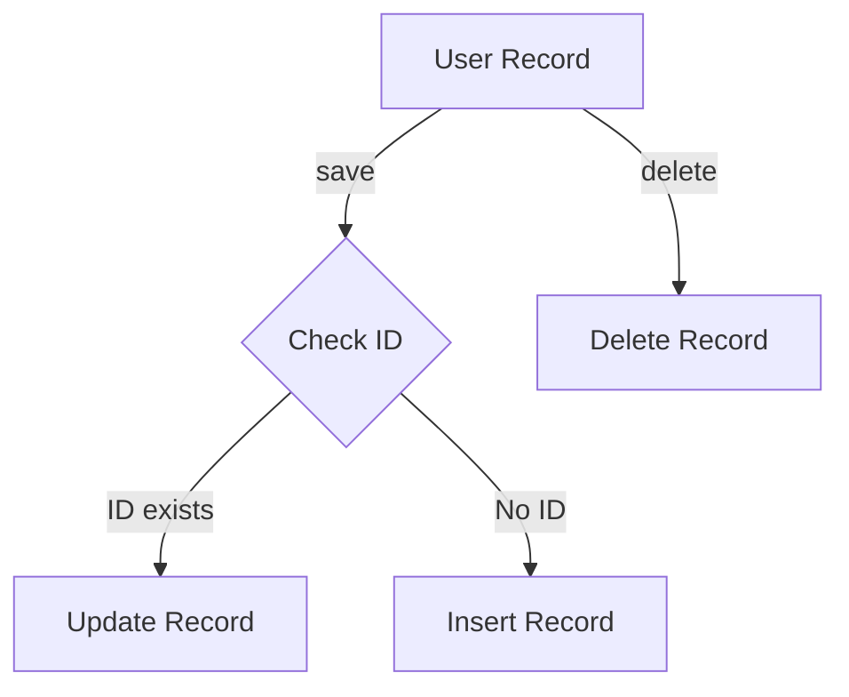

## 8.9 Active Record Pattern in Clojure

The Active Record pattern is a popular design pattern that combines data access and domain logic within a single object. This pattern is particularly useful for simplifying CRUD (Create, Read, Update, Delete) operations, making it a staple in many web applications. In this article, we will explore how the Active Record pattern can be implemented in Clojure, its advantages, limitations, and when to consider alternative patterns.

### Introduction

The Active Record pattern is a design pattern that treats each database table or view as a class, and each row as an instance of that class. This pattern encapsulates both the data and the behavior related to that data, providing methods to manipulate the data directly within the object.

### Detailed Explanation

#### Defining the Active Record Entity

In Clojure, we can define an Active Record entity using `defrecord` to create a data structure that represents a table in the database. We will also define a protocol, `ActiveRecord`, which will include methods for saving and deleting records.

```clojure
(defprotocol ActiveRecord
  (save [this])
  (delete [this]))

(defrecord User [id name email]
  ActiveRecord
  (save [this]
    (if (:id this)
      (jdbc/update! db-spec :users (dissoc this :save :delete) ["id=?" (:id this)])
      (jdbc/insert! db-spec :users (dissoc this :save :delete))))
  (delete [this]
    (jdbc/delete! db-spec :users ["id=?" (:id this)])))
```

In this example, the `User` record represents a user in the database. The `save` method checks if the user has an `id`. If it does, it updates the existing record; otherwise, it inserts a new record. The `delete` method removes the user from the database.

#### Using the Active Record Methods

Once the Active Record entity is defined, we can use its methods to perform CRUD operations.

```clojure
(def user (->User nil "Alice" "alice@example.com"))
(save user) ; Inserts user

(def existing-user (first (jdbc/query db-spec ["SELECT * FROM users WHERE id=?" 1])))
(def updated-user (assoc existing-user :email "newemail@example.com"))
(save updated-user) ; Updates user
```

In this example, we create a new `User` instance and save it to the database. We also retrieve an existing user, update their email, and save the changes.

### Visual Aids

To better understand the Active Record pattern, let's visualize the workflow using a diagram.



This diagram illustrates the decision-making process within the `save` method, where the presence of an ID determines whether to update or insert a record.

### Advantages and Disadvantages

#### Advantages

- **Simplicity:** The Active Record pattern simplifies CRUD operations by embedding data access logic within the domain object.
- **Ease of Use:** Developers can easily perform database operations without writing separate SQL queries.
- **Consistency:** Ensures that the data and behavior are encapsulated within the same object, promoting consistency.

#### Disadvantages

- **Tight Coupling:** The pattern tightly couples the domain logic with the database schema, making it less flexible for complex domains.
- **Scalability Issues:** Not suitable for applications with complex business logic or multiple data sources.
- **Limited Abstraction:** May lead to code duplication if not managed properly.

### Best Practices

- **Use for Simple Domains:** The Active Record pattern is best suited for applications with simple domain logic and a single data source.
- **Avoid Overuse:** For complex domains, consider using alternative patterns like Repository or Data Mapper to separate concerns.
- **Leverage Clojure's Strengths:** Utilize Clojure's functional programming features to enhance the pattern, such as using higher-order functions for query composition.

### Comparative Analysis

#### Active Record vs. Repository Pattern

| Feature           | Active Record                         | Repository Pattern                    |
|-------------------|---------------------------------------|---------------------------------------|
| **Coupling**      | Tightly coupled with database schema  | Loosely coupled, separates concerns   |
| **Complexity**    | Simple, suitable for CRUD operations  | Handles complex queries and logic     |
| **Flexibility**   | Limited flexibility                   | High flexibility, supports multiple data sources |

### Conclusion

The Active Record pattern in Clojure offers a straightforward approach to managing data access and domain logic within a single object. While it simplifies CRUD operations, it may not be suitable for all use cases, especially those involving complex domains or multiple data sources. By understanding its advantages and limitations, developers can make informed decisions about when to use this pattern and when to consider alternatives.

## Quiz Time!



### What is the primary purpose of the Active Record pattern?

- [x] To combine data access and domain logic within a single object
- [ ] To separate data access logic from domain logic
- [ ] To manage complex domain logic across multiple data sources
- [ ] To enhance performance by caching database queries

> **Explanation:** The Active Record pattern combines data access and domain logic within a single object, simplifying CRUD operations.

### In Clojure, how is an Active Record entity typically defined?

- [x] Using `defrecord` and a protocol for data access methods
- [ ] Using `defn` for each CRUD operation
- [ ] Using `defstruct` for data structure and logic
- [ ] Using `defmacro` for dynamic method generation

> **Explanation:** An Active Record entity in Clojure is typically defined using `defrecord` to create a data structure and a protocol to define data access methods.

### What is a key advantage of the Active Record pattern?

- [x] Simplifies CRUD operations by embedding data access logic within the domain object
- [ ] Provides high flexibility for complex domains
- [ ] Decouples domain logic from the database schema
- [ ] Enhances performance by reducing database queries

> **Explanation:** The Active Record pattern simplifies CRUD operations by embedding data access logic within the domain object, making it easy to perform database operations.

### Which of the following is a disadvantage of the Active Record pattern?

- [x] Tight coupling between domain logic and database schema
- [ ] High complexity in implementation
- [ ] Inability to handle CRUD operations
- [ ] Lack of support for simple domains

> **Explanation:** The Active Record pattern tightly couples domain logic with the database schema, which can be a disadvantage in complex domains.

### When should you consider using alternative patterns like Repository or Data Mapper?

- [x] When dealing with complex domains or multiple data sources
- [ ] When you need to simplify CRUD operations
- [ ] When you want to tightly couple domain logic with the database
- [ ] When you have a single data source with simple logic

> **Explanation:** Alternative patterns like Repository or Data Mapper should be considered when dealing with complex domains or multiple data sources to separate concerns.

### What is the role of the `save` method in an Active Record entity?

- [x] To insert or update a record in the database
- [ ] To delete a record from the database
- [ ] To query records from the database
- [ ] To validate the data before saving

> **Explanation:** The `save` method in an Active Record entity is responsible for inserting or updating a record in the database.

### How does the Active Record pattern handle data and behavior?

- [x] It encapsulates both data and behavior within the same object
- [ ] It separates data and behavior into different objects
- [ ] It focuses solely on data representation
- [ ] It focuses solely on behavior definition

> **Explanation:** The Active Record pattern encapsulates both data and behavior within the same object, providing methods to manipulate the data.

### What is a potential issue with using Active Record in complex domains?

- [x] It may lead to tight coupling and scalability issues
- [ ] It simplifies CRUD operations too much
- [ ] It requires too many database queries
- [ ] It lacks support for simple domains

> **Explanation:** In complex domains, the Active Record pattern may lead to tight coupling and scalability issues due to its integration of data access and domain logic.

### Which Clojure feature can enhance the Active Record pattern?

- [x] Higher-order functions for query composition
- [ ] Macros for dynamic method generation
- [ ] Atoms for state management
- [ ] Agents for asynchronous processing

> **Explanation:** Higher-order functions can enhance the Active Record pattern by allowing for more flexible query composition and manipulation.

### True or False: The Active Record pattern is always the best choice for data management in Clojure applications.

- [ ] True
- [x] False

> **Explanation:** False. While the Active Record pattern is useful for simplifying CRUD operations, it is not always the best choice, especially for complex domains or applications with multiple data sources.


