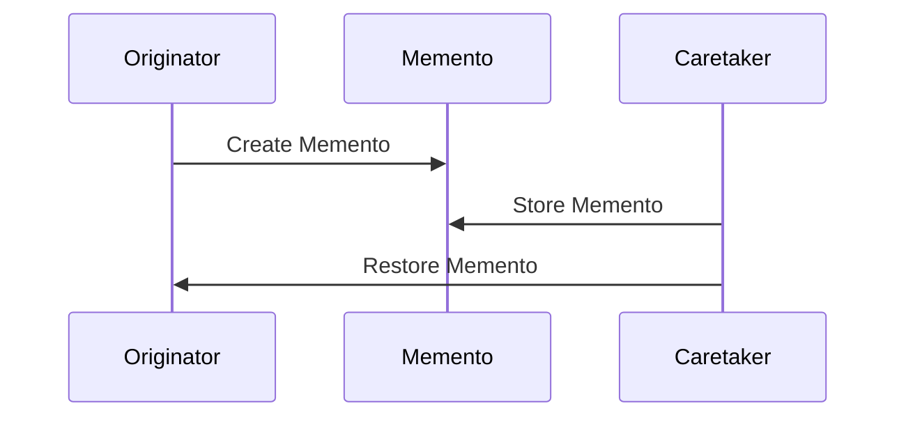

## 8.9. Memento Pattern for State Preservation

The Memento Pattern is a behavioral design pattern that allows you to capture and restore an object's state without violating encapsulation. This pattern is particularly useful in scenarios where you need to implement undo operations, such as in text editors or transaction systems. In this section, we will explore how to implement the Memento Pattern in Clojure, focusing on capturing state snapshots, serialization, and storage, while considering performance and security implications.

### Understanding the Memento Pattern

The Memento Pattern involves three key participants:

1. **Originator**: The object whose state needs to be saved and restored.
2. **Memento**: A representation of the Originator's state at a particular point in time.
3. **Caretaker**: Manages the mementos and is responsible for storing and restoring the Originator's state.

The primary intent of the Memento Pattern is to provide a way to capture and externalize an object's internal state so that it can be restored later, all without exposing the object's implementation details.

### Key Participants

- **Originator**: The object that holds the state. It creates a memento containing a snapshot of its current state and uses the memento to restore its state.
- **Memento**: The object that stores the state of the Originator. It is opaque to other objects, meaning that only the Originator can access its contents.
- **Caretaker**: The object responsible for keeping track of the mementos. It requests a memento from the Originator and stores it, but never modifies or examines its contents.

### Applicability

The Memento Pattern is applicable in scenarios where:

- You need to implement undo/redo functionality.
- You want to preserve an object's state without exposing its internal structure.
- You need to maintain a history of states for an object.

### Implementing the Memento Pattern in Clojure

Let's explore how to implement the Memento Pattern in Clojure with a practical example. We'll create a simple text editor that supports undo functionality.

#### Step 1: Define the Originator

The Originator is the text editor that holds the current state of the text. We'll define a simple Clojure record to represent the editor.

```clojure
(defrecord TextEditor [content])

(defn create-editor [initial-content]
  (->TextEditor initial-content))

(defn set-content [editor new-content]
  (assoc editor :content new-content))

(defn get-content [editor]
  (:content editor))
```

#### Step 2: Define the Memento

The Memento will store the state of the TextEditor. In Clojure, we can use a simple map to represent the memento.

```clojure
(defn create-memento [editor]
  {:content (get-content editor)})

(defn restore-from-memento [editor memento]
  (set-content editor (:content memento)))
```

#### Step 3: Define the Caretaker

The Caretaker will manage the mementos. It will store a history of mementos and provide functionality to undo changes.

```clojure
(defrecord Caretaker [history])

(defn create-caretaker []
  (->Caretaker []))

(defn save-state [caretaker editor]
  (update caretaker :history conj (create-memento editor)))

(defn undo [caretaker editor]
  (let [last-memento (peek (:history caretaker))]
    (if last-memento
      (do
        (restore-from-memento editor last-memento)
        (update caretaker :history pop))
      (println "No more states to undo"))))
```

#### Example Usage

Let's see how we can use the above components to implement undo functionality in our text editor.

```clojure
(def editor (create-editor "Hello, World!"))
(def caretaker (create-caretaker))

;; Save the initial state
(def caretaker (save-state caretaker editor))

;; Modify the content
(def editor (set-content editor "Hello, Clojure!"))

;; Save the new state
(def caretaker (save-state caretaker editor))

;; Undo the last change
(def caretaker (undo caretaker editor))
(println (get-content editor)) ;; Output: Hello, World!
```

### Serialization and Storage

In real-world applications, you may need to serialize and store the mementos to disk or a database for persistence. Clojure provides several libraries for serialization, such as `clojure.edn` for EDN (Extensible Data Notation) serialization and `cheshire` for JSON serialization.

#### Example: Serializing Mementos with EDN

```clojure
(require '[clojure.edn :as edn])

(defn serialize-memento [memento]
  (edn/write-string memento))

(defn deserialize-memento [memento-str]
  (edn/read-string memento-str))
```

#### Example: Storing Mementos to a File

```clojure
(defn save-memento-to-file [memento file-path]
  (spit file-path (serialize-memento memento)))

(defn load-memento-from-file [file-path]
  (deserialize-memento (slurp file-path)))
```

### Considerations for Performance and Security

When implementing the Memento Pattern, consider the following:

- **Performance**: Storing large states can be memory-intensive. Consider using incremental snapshots or compressing the state data.
- **Security**: Ensure that sensitive data is not exposed through mementos. Use encryption if necessary when storing mementos externally.

### Use Cases

The Memento Pattern is widely used in applications where state preservation is critical. Some common use cases include:

- **Text Editors**: Implementing undo/redo functionality.
- **Transaction Systems**: Capturing the state of a transaction for rollback purposes.
- **Games**: Saving game states for checkpoints or save points.

### Clojure Unique Features

Clojure's immutable data structures and functional programming paradigm make it particularly well-suited for implementing the Memento Pattern. The use of persistent data structures allows for efficient state snapshots without the need for deep copying.

### Differences and Similarities

The Memento Pattern is often compared to the Command Pattern, as both can be used to implement undo functionality. However, the Command Pattern focuses on encapsulating operations, while the Memento Pattern focuses on capturing state.

### Try It Yourself

Experiment with the provided code examples by modifying the text editor's functionality. Try adding redo functionality or implementing a more complex editor with additional features.

### Visualizing the Memento Pattern

Below is a diagram illustrating the interaction between the Originator, Memento, and Caretaker in the Memento Pattern.



### Conclusion

The Memento Pattern is a powerful tool for state preservation in software applications. By capturing and restoring an object's state without violating encapsulation, it enables the implementation of features like undo/redo and state rollback. Clojure's functional programming features and immutable data structures make it an ideal language for implementing this pattern.

## **Ready to Test Your Knowledge?**



### What is the primary purpose of the Memento Pattern?

- [x] To capture and restore an object's state without violating encapsulation.
- [ ] To encapsulate a request as an object.
- [ ] To define a family of algorithms and make them interchangeable.
- [ ] To provide a way to access the elements of an aggregate object sequentially.

> **Explanation:** The Memento Pattern is designed to capture and restore an object's state without exposing its internal structure.

### Which of the following is NOT a participant in the Memento Pattern?

- [ ] Originator
- [ ] Memento
- [x] Command
- [ ] Caretaker

> **Explanation:** The Command is not a participant in the Memento Pattern. The participants are Originator, Memento, and Caretaker.

### In Clojure, which data structure is commonly used to represent a Memento?

- [ ] List
- [x] Map
- [ ] Vector
- [ ] Set

> **Explanation:** In Clojure, a map is commonly used to represent a Memento because it can easily store key-value pairs representing the state.

### What is the role of the Caretaker in the Memento Pattern?

- [ ] To modify the state of the Originator.
- [x] To store and manage Mementos.
- [ ] To create Mementos.
- [ ] To expose the internal state of the Originator.

> **Explanation:** The Caretaker is responsible for storing and managing Mementos but does not modify or examine their contents.

### How can you serialize a Memento in Clojure?

- [x] Using `clojure.edn/write-string`
- [ ] Using `clojure.core/print`
- [ ] Using `clojure.string/join`
- [ ] Using `clojure.java.io/copy`

> **Explanation:** `clojure.edn/write-string` is used to serialize a Memento to a string in EDN format.

### What is a common use case for the Memento Pattern?

- [ ] Implementing a logging system.
- [x] Implementing undo functionality in text editors.
- [ ] Implementing a caching mechanism.
- [ ] Implementing a notification system.

> **Explanation:** A common use case for the Memento Pattern is implementing undo functionality in text editors.

### Which Clojure feature makes it well-suited for the Memento Pattern?

- [ ] Dynamic typing
- [x] Immutable data structures
- [ ] Homoiconicity
- [ ] Macros

> **Explanation:** Immutable data structures in Clojure make it well-suited for the Memento Pattern as they allow for efficient state snapshots.

### What should be considered when storing Mementos externally?

- [x] Security and encryption
- [ ] Syntax highlighting
- [ ] Code formatting
- [ ] Thread safety

> **Explanation:** When storing Mementos externally, security and encryption should be considered to protect sensitive data.

### Which pattern is often compared to the Memento Pattern?

- [ ] Observer Pattern
- [ ] Strategy Pattern
- [x] Command Pattern
- [ ] Singleton Pattern

> **Explanation:** The Command Pattern is often compared to the Memento Pattern as both can be used to implement undo functionality.

### True or False: The Memento Pattern exposes the internal state of the Originator.

- [ ] True
- [x] False

> **Explanation:** False. The Memento Pattern captures the state without exposing the internal structure of the Originator.



Remember, this is just the beginning. As you progress, you'll build more complex and interactive applications using the Memento Pattern. Keep experimenting, stay curious, and enjoy the journey!
