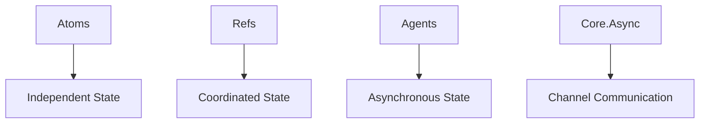

## 9.1. Introduction to Concurrent Programming in Clojure

In the realm of modern software development, concurrent programming has become a cornerstone for building responsive, efficient, and scalable applications. As we delve into Clojure's approach to concurrency, we will uncover how its functional paradigm and immutable data structures provide a robust foundation for tackling the complexities of concurrent programming.

### The Importance of Concurrent Programming

Concurrent programming is essential in today's computing landscape, where applications must handle multiple tasks simultaneously to maximize resource utilization and provide a seamless user experience. Whether it's a web server managing numerous client requests, a data processing pipeline handling streams of data, or a user interface responding to events, concurrency is key to achieving high performance and responsiveness.

### Challenges of Concurrency

Despite its benefits, concurrent programming introduces several challenges:

- **Race Conditions**: Occur when multiple threads access shared data simultaneously, leading to unpredictable results.
- **Deadlocks**: Happen when two or more threads are blocked forever, each waiting for the other to release resources.
- **Complexity**: Managing thread synchronization and communication can lead to intricate and error-prone code.

### Clojure's Approach to Concurrency

Clojure addresses these challenges through its functional programming paradigm and immutable data structures. By default, Clojure's data structures are immutable, meaning they cannot be changed once created. This immutability eliminates the need for locks when accessing shared data, as there is no risk of concurrent modifications.

#### Immutable Data Structures

Immutable data structures are central to Clojure's concurrency model. They provide several advantages:

- **Thread Safety**: Since data cannot be modified, there are no race conditions.
- **Ease of Reasoning**: Code is easier to understand and reason about when data is immutable.
- **Structural Sharing**: Clojure's persistent data structures use structural sharing to efficiently create modified versions without copying the entire structure.

### Concurrency Primitives in Clojure

Clojure offers several concurrency primitives that facilitate safe and efficient concurrent programming:

#### Atoms

Atoms provide a way to manage shared, synchronous, and independent state. They are ideal for managing simple, independent state changes.

```clojure
(def counter (atom 0))

;; Increment the counter atomically
(swap! counter inc)
```

- **Key Feature**: Atoms ensure atomic updates using compare-and-swap (CAS) operations.

#### Refs

Refs are used for coordinated, synchronous updates to shared state. They leverage Software Transactional Memory (STM) to manage complex state changes.

```clojure
(def account-balance (ref 1000))

;; Update balance within a transaction
(dosync
  (alter account-balance + 100))
```

- **Key Feature**: Refs allow multiple changes to be grouped into a transaction, ensuring consistency.

#### Agents

Agents are designed for asynchronous updates to shared state. They are suitable for tasks that can be performed independently and do not require immediate feedback.

```clojure
(def logger (agent []))

;; Send a message to the logger
(send logger conj "Log entry")
```

- **Key Feature**: Agents process actions asynchronously, allowing for non-blocking updates.

#### Core.Async

Core.async provides a CSP (Communicating Sequential Processes) style of concurrency, enabling complex coordination between concurrent processes using channels.

```clojure
(require '[clojure.core.async :refer [chan >!! <!!]])

(def my-channel (chan))

;; Put a value onto the channel
(>!! my-channel "Hello, World!")

;; Take a value from the channel
(println (<!! my-channel))
```

- **Key Feature**: Channels facilitate communication between concurrent processes, decoupling the sender and receiver.

### Visualizing Clojure's Concurrency Model

To better understand how Clojure's concurrency primitives interact, let's visualize the relationships between them using a Mermaid.js diagram.



**Diagram Description**: This diagram illustrates the different concurrency primitives in Clojure and their respective roles in managing state. Atoms handle independent state, Refs manage coordinated state, Agents deal with asynchronous state, and Core.Async facilitates channel-based communication.

### Setting the Stage for Deeper Exploration

As we continue our journey through Clojure's concurrency model, we will explore advanced patterns and techniques that build upon these foundational concepts. From designing scalable systems to implementing complex coordination mechanisms, Clojure's concurrency primitives offer a powerful toolkit for modern software development.

### Try It Yourself

To solidify your understanding of Clojure's concurrency primitives, try modifying the code examples provided. Experiment with different operations on Atoms, Refs, Agents, and Core.Async channels. Observe how these changes affect the behavior of your concurrent programs.

### References and Further Reading

- [Clojure Documentation on Atoms](https://clojure.org/reference/atoms)
- [Clojure Documentation on Refs](https://clojure.org/reference/refs)
- [Clojure Documentation on Agents](https://clojure.org/reference/agents)
- [Core.Async Guide](https://clojure.github.io/core.async/)

### Knowledge Check

To reinforce your understanding of concurrent programming in Clojure, let's test your knowledge with a quiz.

## **Ready to Test Your Knowledge?**



### What is a key advantage of using immutable data structures in Clojure?

- [x] They eliminate the need for locks in concurrent programming.
- [ ] They allow for direct modification of data.
- [ ] They require more memory than mutable structures.
- [ ] They are slower to access than mutable structures.

> **Explanation:** Immutable data structures eliminate the need for locks because they cannot be modified, ensuring thread safety.

### Which Clojure primitive is best suited for asynchronous updates to shared state?

- [ ] Atoms
- [ ] Refs
- [x] Agents
- [ ] Core.Async

> **Explanation:** Agents are designed for asynchronous updates, allowing tasks to be performed independently.

### What does the `dosync` macro do in Clojure?

- [ ] It synchronizes threads.
- [x] It starts a transaction for Refs.
- [ ] It updates an Atom.
- [ ] It sends a message to an Agent.

> **Explanation:** The `dosync` macro is used to start a transaction for coordinated updates to Refs.

### How do channels in Core.Async facilitate concurrency?

- [ ] By locking shared resources.
- [ ] By allowing direct data modification.
- [x] By enabling communication between processes.
- [ ] By synchronizing threads.

> **Explanation:** Channels in Core.Async enable communication between concurrent processes, decoupling the sender and receiver.

### Which concurrency primitive would you use for independent, synchronous state changes?

- [x] Atoms
- [ ] Refs
- [ ] Agents
- [ ] Core.Async

> **Explanation:** Atoms are ideal for managing independent, synchronous state changes using atomic operations.

### What is a race condition?

- [x] A situation where multiple threads access shared data simultaneously, leading to unpredictable results.
- [ ] A method for synchronizing threads.
- [ ] A type of deadlock.
- [ ] A way to improve performance.

> **Explanation:** A race condition occurs when multiple threads access shared data simultaneously, causing unpredictable behavior.

### What is the primary purpose of Refs in Clojure?

- [ ] To handle asynchronous updates.
- [x] To manage coordinated, synchronous updates.
- [ ] To facilitate communication between processes.
- [ ] To perform atomic operations.

> **Explanation:** Refs are used for coordinated, synchronous updates to shared state, ensuring consistency.

### What is the role of structural sharing in Clojure's persistent data structures?

- [x] To efficiently create modified versions without copying the entire structure.
- [ ] To allow direct modification of data.
- [ ] To increase memory usage.
- [ ] To slow down data access.

> **Explanation:** Structural sharing allows Clojure's persistent data structures to efficiently create modified versions without copying the entire structure.

### Which Clojure primitive is used for channel-based communication?

- [ ] Atoms
- [ ] Refs
- [ ] Agents
- [x] Core.Async

> **Explanation:** Core.Async provides channels for communication between concurrent processes.

### True or False: Clojure's immutable data structures require locks for thread safety.

- [ ] True
- [x] False

> **Explanation:** Clojure's immutable data structures do not require locks, as they cannot be modified, ensuring thread safety.



Remember, this is just the beginning. As you progress, you'll build more complex and interactive concurrent applications. Keep experimenting, stay curious, and enjoy the journey!
