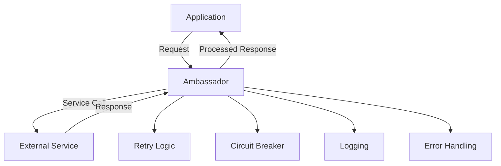

## 9.1 Ambassador in Clojure

In modern software architecture, applications often need to communicate with external services. These interactions can be fraught with challenges such as network unreliability, service downtime, and latency issues. The Ambassador pattern serves as a robust intermediary, managing these concerns to ensure smooth and reliable communication. This article delves into implementing the Ambassador pattern in Clojure, leveraging its functional programming paradigms and modern libraries.

### Introduction to the Ambassador Pattern

The Ambassador pattern acts as an intermediary between your application and external services. It encapsulates the complexities of communication, such as retries, circuit breaking, logging, and exception handling. This pattern enhances the robustness of your application by ensuring that external service failures do not cascade into your system.

### Detailed Explanation

The Ambassador pattern is particularly useful in scenarios where:

- **External Services are Unreliable:** Services may be temporarily unavailable or slow to respond.
- **Network Issues are Common:** Network latency and failures can disrupt service calls.
- **Resilience is Critical:** Applications must gracefully handle failures without affecting user experience.

In Clojure, the Ambassador pattern can be implemented using higher-order functions or middleware that wrap external service calls. This approach aligns well with Clojure's functional nature, allowing for clean and composable code.

### Visualizing the Ambassador Pattern

Below is a conceptual diagram illustrating the Ambassador pattern's role in handling external service communication:



### Implementing the Ambassador Pattern in Clojure

#### Step 1: Create a Function for the External Service Call

First, define a function that represents the interaction with the external service:

```clojure
(defn call-external-service [request]
  ;; Implementation to interact with the external system
  )
```

#### Step 2: Implement the Ambassador Function

The Ambassador function wraps the service call, adding error handling:

```clojure
(defn ambassador [request]
  (try
    (call-external-service request)
    (catch Exception e
      (handle-error e request))))
```

#### Step 3: Add Retry Logic

Retries are crucial for handling transient failures. Implement a retry mechanism using a higher-order function:

```clojure
(defn with-retries [f max-attempts]
  (fn [request]
    (loop [attempts 1]
      (try
        (f request)
        (catch Exception e
          (if (< attempts max-attempts)
            (do
              (log/warn "Retrying..." attempts)
              (recur (inc attempts)))
            (throw e)))))))

(def ambassador-with-retries
  (with-retries ambassador 3))
```

#### Step 4: Implement Circuit Breaking Mechanism

Circuit breaking prevents repeated failures from overwhelming the system:

```clojure
(def circuit-breaker (atom {:state :closed :failures 0}))

(defn circuit-breaker-wrapper [f failure-threshold reset-timeout]
  (fn [request]
    (let [{:keys [state failures]} @circuit-breaker]
      (cond
        (= state :open)
        (do
          (log/error "Circuit breaker is open.")
          (throw (Exception. "Service unavailable")))
        
        :else
        (try
          (let [response (f request)]
            (reset! circuit-breaker {:state :closed :failures 0})
            response)
          (catch Exception e
            (swap! circuit-breaker update :failures inc)
            (when (>= (:failures @circuit-breaker) failure-threshold)
              (reset! circuit-breaker {:state :open :failures 0})
              (future
                (Thread/sleep reset-timeout)
                (reset! circuit-breaker {:state :half-open :failures 0})))
            (throw e)))))))

(def ambassador-with-circuit-breaker
  (circuit-breaker-wrapper ambassador-with-retries 5 10000)) ; Reset after 10 seconds
```

#### Step 5: Use the Ambassador in Your Application

Integrate the Ambassador pattern into your application logic:

```clojure
(defn process-request [request]
  (ambassador-with-circuit-breaker request))
```

#### Step 6: Implement Additional Concerns

- **Timeouts:** Use `future` and `deref` with a timeout to prevent long waits.
- **Logging:** Integrate logging at each step to monitor service interactions.
- **Metrics Collection:** Collect metrics for monitoring and alerts to ensure system health.

### Use Cases

The Ambassador pattern is applicable in various scenarios, such as:

- **Microservices Communication:** Ensuring reliable communication between microservices.
- **Third-Party API Integration:** Handling interactions with external APIs that may be unreliable.
- **Distributed Systems:** Managing communication in distributed architectures where network issues are common.

### Advantages and Disadvantages

**Advantages:**

- **Resilience:** Enhances system resilience by managing failures gracefully.
- **Modularity:** Encapsulates communication logic, promoting separation of concerns.
- **Scalability:** Supports scalable architectures by preventing cascading failures.

**Disadvantages:**

- **Complexity:** Adds complexity to the system with additional layers of logic.
- **Overhead:** May introduce performance overhead due to retries and circuit breaking.

### Best Practices

- **Use Libraries:** Leverage libraries like `core.async` for asynchronous handling and `clojure.tools.logging` for logging.
- **Monitor and Tune:** Continuously monitor the system and tune retry and circuit breaker parameters based on real-world performance.
- **Test Thoroughly:** Ensure thorough testing of the Ambassador logic to handle various failure scenarios.

### Conclusion

The Ambassador pattern is a powerful tool for managing communication with external services in Clojure applications. By encapsulating retries, circuit breaking, and error handling, it enhances the robustness and resilience of your system. Implementing this pattern using Clojure's functional paradigms and modern libraries can lead to clean, maintainable, and scalable code.

## Quiz Time!



### What is the primary purpose of the Ambassador pattern in software architecture?

- [x] To act as an intermediary for handling communication with external services.
- [ ] To manage database transactions.
- [ ] To optimize memory usage.
- [ ] To enhance user interface design.

> **Explanation:** The Ambassador pattern serves as an intermediary to manage communication with external services, handling concerns like retries and circuit breaking.

### Which Clojure feature is commonly used to implement the Ambassador pattern?

- [x] Higher-order functions
- [ ] Macros
- [ ] Atoms
- [ ] Agents

> **Explanation:** Higher-order functions are used to wrap and manage external service calls, aligning with Clojure's functional nature.

### What is a key benefit of using the Ambassador pattern?

- [x] It enhances system resilience by managing failures gracefully.
- [ ] It simplifies user authentication.
- [ ] It reduces code complexity.
- [ ] It improves database performance.

> **Explanation:** The Ambassador pattern enhances resilience by handling failures, retries, and circuit breaking.

### How does the Ambassador pattern handle transient failures?

- [x] By implementing retry logic
- [ ] By increasing server resources
- [ ] By caching responses
- [ ] By reducing network latency

> **Explanation:** The pattern uses retry logic to handle transient failures, attempting the service call multiple times.

### What mechanism does the Ambassador pattern use to prevent repeated failures?

- [x] Circuit breaking
- [ ] Load balancing
- [ ] Data caching
- [ ] User authentication

> **Explanation:** Circuit breaking is used to prevent repeated failures from overwhelming the system.

### In the provided Clojure example, what is the purpose of the `circuit-breaker-wrapper` function?

- [x] To manage the state of the circuit breaker and handle failures
- [ ] To log all service requests
- [ ] To optimize memory usage
- [ ] To encrypt service requests

> **Explanation:** The `circuit-breaker-wrapper` function manages the circuit breaker's state and handles failures.

### What additional concern can be integrated into the Ambassador pattern for enhanced monitoring?

- [x] Metrics collection
- [ ] User interface design
- [ ] Database indexing
- [ ] Memory management

> **Explanation:** Metrics collection can be integrated to monitor system health and performance.

### What is a potential disadvantage of the Ambassador pattern?

- [x] It may introduce performance overhead.
- [ ] It simplifies code structure.
- [ ] It reduces system resilience.
- [ ] It complicates user authentication.

> **Explanation:** The pattern can introduce performance overhead due to additional logic for retries and circuit breaking.

### Which library can be used in Clojure for asynchronous handling in the Ambassador pattern?

- [x] core.async
- [ ] clojure.spec
- [ ] clojure.java.jdbc
- [ ] clojure.data.json

> **Explanation:** `core.async` is used for asynchronous handling in Clojure.

### True or False: The Ambassador pattern is only applicable in microservices architectures.

- [ ] True
- [x] False

> **Explanation:** While beneficial in microservices, the Ambassador pattern is applicable in any architecture involving external service communication.


