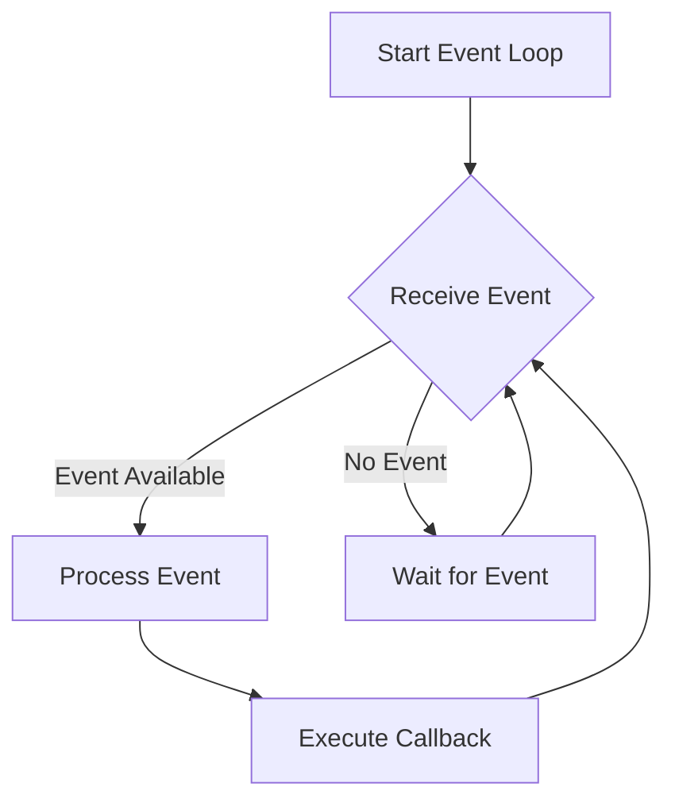

## 9.10. Implementing Event Loops

In the realm of concurrent programming, event loops play a crucial role in managing asynchronous events and tasks. They are the backbone of many modern applications, enabling efficient handling of I/O operations, user interactions, and other asynchronous tasks. In this section, we will delve into the concept of event loops, explore their implementation in Clojure using `core.async`, and discuss best practices for performance and responsiveness.

### Understanding Event Loops

An event loop is a programming construct that waits for and dispatches events or messages in a program. It is an essential component in environments where tasks need to be executed asynchronously, such as in GUI applications, web servers, and real-time systems. The event loop continuously checks for new events and processes them, allowing the program to remain responsive while performing background tasks.

#### Key Concepts of Event Loops

- **Asynchronous Execution**: Event loops enable non-blocking execution of tasks, allowing other operations to continue while waiting for an event to occur.
- **Event Queue**: Events are typically stored in a queue, where they are processed one at a time by the event loop.
- **Callbacks**: Functions that are executed in response to events, often used to handle the completion of asynchronous tasks.

### Implementing Event Loops in Clojure with `core.async`

Clojure's `core.async` library provides powerful tools for managing asynchronous programming through channels and go blocks. These constructs allow us to implement event loops efficiently, handling events and tasks concurrently without blocking the main thread.

#### Setting Up `core.async`

To get started with `core.async`, ensure you have it included in your project dependencies:

```clojure
(defproject event-loop-example "0.1.0-SNAPSHOT"
  :dependencies [[org.clojure/clojure "1.10.3"]
                 [org.clojure/core.async "1.3.618"]])
```

#### Basic Event Loop with `core.async`

Let's implement a simple event loop using `core.async` channels and go blocks. We'll create an event loop that processes messages from a channel and executes corresponding actions.

```clojure
(ns event-loop.core
  (:require [clojure.core.async :as async]))

(defn start-event-loop [event-chan]
  (async/go-loop []
    (when-let [event (async/<! event-chan)]
      (println "Processing event:" event)
      ;; Handle the event here
      (recur))))

(defn main []
  (let [event-chan (async/chan)]
    (start-event-loop event-chan)
    ;; Simulate sending events
    (async/>!! event-chan {:type :click :data "Button clicked"})
    (async/>!! event-chan {:type :input :data "User input"})))

(main)
```

In this example, we define an `event-chan` channel to hold events. The `start-event-loop` function uses a `go-loop` to continuously read from the channel and process each event.

#### Scheduling and Handling Events

To effectively manage events, we can introduce a scheduling mechanism that prioritizes tasks and ensures timely execution. Let's enhance our event loop to include scheduling capabilities.

```clojure
(defn schedule-event [event-chan event delay-ms]
  (async/go
    (async/<! (async/timeout delay-ms))
    (async/>! event-chan event)))

(defn main []
  (let [event-chan (async/chan)]
    (start-event-loop event-chan)
    ;; Schedule events with delays
    (schedule-event event-chan {:type :click :data "Button clicked"} 1000)
    (schedule-event event-chan {:type :input :data "User input"} 2000)))

(main)
```

Here, the `schedule-event` function uses a timeout to delay the sending of events to the channel, simulating scheduled tasks.

### Performance and Responsiveness Considerations

When implementing event loops, it's essential to consider performance and responsiveness. Here are some best practices:

- **Minimize Blocking Operations**: Avoid blocking the event loop with long-running tasks. Use asynchronous I/O and offload heavy computations to separate threads or processes.
- **Efficient Event Handling**: Process events quickly to prevent backlog in the event queue. Consider using worker threads or thread pools for parallel processing.
- **Prioritize Critical Events**: Implement a priority system to ensure critical events are handled promptly.

### Integrating with I/O Operations and External Systems

Event loops are often used to manage I/O operations, such as reading from or writing to files, network sockets, or databases. `core.async` provides tools to integrate these operations seamlessly.

#### Example: Handling Network I/O

Let's extend our event loop to handle network I/O using `core.async` channels.

```clojure
(defn handle-network-event [event]
  (println "Handling network event:" event))

(defn start-network-event-loop [network-chan]
  (async/go-loop []
    (when-let [event (async/<! network-chan)]
      (handle-network-event event)
      (recur))))

(defn main []
  (let [network-chan (async/chan)]
    (start-network-event-loop network-chan)
    ;; Simulate network events
    (async/>!! network-chan {:type :request :data "GET /index.html"})
    (async/>!! network-chan {:type :response :data "200 OK"})))

(main)
```

In this example, we create a separate channel for network events and process them in a dedicated event loop.

### Visualizing Event Loop Workflow

To better understand the flow of events in our event loop, let's visualize the process using a Mermaid.js diagram.



**Diagram Description**: This flowchart illustrates the workflow of an event loop. It starts by receiving an event, processes it if available, executes the corresponding callback, and then waits for the next event.

### Try It Yourself

Experiment with the provided code examples by modifying the event types, adding new event handlers, or introducing additional channels for different event categories. Consider integrating file I/O or database operations into the event loop to explore its full potential.

### Knowledge Check

- What is the primary purpose of an event loop?
- How does `core.async` facilitate asynchronous programming in Clojure?
- What are some best practices for maintaining performance in an event loop?
- How can you integrate I/O operations into an event loop?

### Summary

In this section, we've explored the concept of event loops and their implementation in Clojure using `core.async`. We've discussed scheduling and handling events, integrating I/O operations, and ensuring performance and responsiveness. By mastering event loops, you can build efficient, responsive applications that handle asynchronous tasks seamlessly.

Remember, this is just the beginning. As you progress, you'll build more complex and interactive applications. Keep experimenting, stay curious, and enjoy the journey!

## **Ready to Test Your Knowledge?**



### What is the primary purpose of an event loop?

- [x] To manage asynchronous events and tasks
- [ ] To execute synchronous code
- [ ] To handle only I/O operations
- [ ] To process only user interactions

> **Explanation:** The primary purpose of an event loop is to manage asynchronous events and tasks, allowing the program to remain responsive while performing background operations.

### How does `core.async` facilitate asynchronous programming in Clojure?

- [x] By providing channels and go blocks
- [ ] By using threads directly
- [ ] By implementing promises
- [ ] By using callbacks only

> **Explanation:** `core.async` facilitates asynchronous programming in Clojure by providing channels and go blocks, which allow for non-blocking communication and concurrent task execution.

### What is a best practice for maintaining performance in an event loop?

- [x] Minimize blocking operations
- [ ] Use only synchronous I/O
- [ ] Process events in a single thread
- [ ] Avoid using channels

> **Explanation:** Minimizing blocking operations is a best practice for maintaining performance in an event loop, as it prevents the loop from being stalled by long-running tasks.

### How can you integrate I/O operations into an event loop?

- [x] By using `core.async` channels for I/O events
- [ ] By blocking the main thread
- [ ] By using synchronous file reads
- [ ] By avoiding I/O operations

> **Explanation:** You can integrate I/O operations into an event loop by using `core.async` channels to handle I/O events asynchronously, ensuring the loop remains responsive.

### Which of the following is a key concept of event loops?

- [x] Asynchronous Execution
- [ ] Synchronous Execution
- [ ] Single-threaded Processing
- [ ] Blocking Operations

> **Explanation:** Asynchronous execution is a key concept of event loops, allowing tasks to be executed without blocking the main thread.

### What is the role of callbacks in an event loop?

- [x] To handle the completion of asynchronous tasks
- [ ] To block the event loop
- [ ] To execute synchronous code
- [ ] To manage I/O operations only

> **Explanation:** Callbacks are used in an event loop to handle the completion of asynchronous tasks, allowing the program to respond to events as they occur.

### What is a common use case for event loops?

- [x] Managing user interactions in GUI applications
- [ ] Executing batch processing tasks
- [ ] Running synchronous scripts
- [ ] Handling only network requests

> **Explanation:** A common use case for event loops is managing user interactions in GUI applications, where responsiveness is crucial.

### How does `core.async` handle scheduling of events?

- [x] By using timeouts and go blocks
- [ ] By using threads directly
- [ ] By implementing a built-in scheduler
- [ ] By relying on external libraries

> **Explanation:** `core.async` handles scheduling of events by using timeouts and go blocks, allowing for delayed execution of tasks.

### What is the benefit of using channels in an event loop?

- [x] They enable non-blocking communication
- [ ] They simplify synchronous code
- [ ] They eliminate the need for callbacks
- [ ] They ensure single-threaded execution

> **Explanation:** Channels enable non-blocking communication in an event loop, allowing tasks to be executed concurrently without blocking the main thread.

### True or False: Event loops are only used in web servers.

- [ ] True
- [x] False

> **Explanation:** False. Event loops are used in various environments, including GUI applications, real-time systems, and web servers, to manage asynchronous events and tasks.


