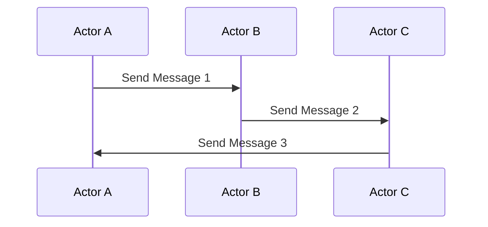

## 9.11. Actor Model in Clojure

Concurrency is a cornerstone of modern software development, enabling applications to perform multiple tasks simultaneously. The Actor Model is a concurrency paradigm that provides a structured approach to managing concurrent processes. In this section, we will explore how the Actor Model can be implemented in Clojure, leveraging its unique features to build robust and efficient applications.

### Understanding the Actor Model

The Actor Model is a conceptual model that treats "actors" as the fundamental units of computation. Each actor is an independent entity that can:

1. **Receive Messages**: Actors communicate by sending and receiving messages.
2. **Process Messages**: Upon receiving a message, an actor can perform computations, change its state, or send messages to other actors.
3. **Create New Actors**: Actors can create other actors to delegate tasks.

This model provides several benefits, including:

- **Encapsulation**: Actors encapsulate state and behavior, reducing the complexity of managing shared state.
- **Fault Tolerance**: Actors can be designed to handle failures gracefully, isolating errors and preventing them from affecting the entire system.
- **Scalability**: The Actor Model naturally supports distributed systems, allowing actors to run on different nodes.

### Implementing the Actor Model in Clojure

Clojure offers several constructs that can be used to implement the Actor Model, including Agents and `core.async`. Let's explore each of these in detail.

#### Using Agents as Actors

Agents in Clojure provide a simple way to manage state changes asynchronously. They are well-suited for implementing actors because they encapsulate state and process updates in a controlled manner.

**Example: Implementing an Actor with Agents**

```clojure
;; Define an agent to represent an actor
(def counter-agent (agent 0))

;; Function to handle messages (increment the counter)
(defn increment-counter [state increment]
  (+ state increment))

;; Send a message to the actor
(send counter-agent increment-counter 1)

;; Check the state of the agent
@counter-agent
;; => 1
```

In this example, we define an agent `counter-agent` with an initial state of `0`. The `increment-counter` function processes messages by incrementing the state. We use the `send` function to send messages to the agent.

#### Using `core.async` for Message Passing

`core.async` is a Clojure library that provides facilities for asynchronous programming using channels. Channels can be used to implement message passing between actors.

**Example: Implementing an Actor with `core.async`**

```clojure
(require '[clojure.core.async :as async])

;; Create a channel for communication
(def message-channel (async/chan))

;; Define an actor that listens for messages
(defn actor []
  (async/go-loop []
    (let [message (async/<! message-channel)]
      (println "Received message:" message)
      (recur))))

;; Start the actor
(actor)

;; Send a message to the actor
(async/>!! message-channel "Hello, Actor!")
```

In this example, we create a channel `message-channel` and define an actor using `async/go-loop` that listens for messages. The actor prints each received message and continues listening.

### Benefits of the Actor Model in Clojure

The Actor Model offers several advantages when implemented in Clojure:

- **Encapsulation**: By encapsulating state within actors, we reduce the risk of race conditions and make our code easier to reason about.
- **Fault Tolerance**: Actors can be designed to handle failures independently, improving the resilience of the application.
- **Scalability**: The Actor Model's message-passing architecture is well-suited for distributed systems, allowing actors to run on different nodes and communicate over the network.

### Tools and Libraries Supporting the Actor Model

While Clojure's core features provide a solid foundation for implementing the Actor Model, several libraries can enhance this capability:

- **Akka**: Although primarily a Scala library, Akka can be used with Clojure to implement the Actor Model in a more feature-rich environment.
- **Pulsar**: A Clojure library that provides an actor-based concurrency model, inspired by Erlang's actor system.

### Design Considerations

When implementing the Actor Model in Clojure, consider the following:

- **Message Handling**: Ensure that actors handle messages efficiently and avoid blocking operations that could delay message processing.
- **State Management**: Use immutable data structures to manage state within actors, leveraging Clojure's strengths in immutability.
- **Error Handling**: Design actors to handle errors gracefully, possibly using supervision strategies to restart failed actors.

### Clojure's Unique Features

Clojure's emphasis on immutability and functional programming aligns well with the Actor Model. By leveraging immutable data structures and higher-order functions, we can build actors that are both robust and easy to reason about.

### Differences and Similarities with Other Models

The Actor Model is often compared to other concurrency models, such as Software Transactional Memory (STM) and Communicating Sequential Processes (CSP). While STM focuses on managing shared state through transactions, the Actor Model emphasizes message passing and encapsulation. CSP, on the other hand, shares similarities with the Actor Model in its use of channels for communication.

### Visualizing the Actor Model in Clojure

To better understand the Actor Model, let's visualize the flow of messages between actors using a Mermaid.js sequence diagram.



This diagram illustrates a simple interaction between three actors, where messages are passed sequentially.

### Try It Yourself

Experiment with the examples provided by modifying the message handling logic or adding new actors. Consider implementing a simple chat application where multiple actors represent users sending messages to each other.

### Knowledge Check

Before moving on, let's reinforce our understanding of the Actor Model in Clojure with a few questions:

- What are the primary responsibilities of an actor in the Actor Model?
- How can agents be used to implement actors in Clojure?
- What are the benefits of using `core.async` for message passing?
- How does the Actor Model enhance fault tolerance in applications?

### Conclusion

The Actor Model is a powerful concurrency paradigm that aligns well with Clojure's strengths in functional programming and immutability. By leveraging agents and `core.async`, we can build robust and scalable applications that handle concurrency with ease. As you continue your journey with Clojure, consider exploring the Actor Model further to unlock its full potential.

## **Ready to Test Your Knowledge?**



### What is the primary role of an actor in the Actor Model?

- [x] To receive and process messages
- [ ] To manage global state
- [ ] To perform blocking operations
- [ ] To directly access other actors' states

> **Explanation:** An actor's primary role is to receive and process messages, encapsulating its state and behavior.

### Which Clojure construct is well-suited for implementing actors due to its encapsulation of state?

- [x] Agents
- [ ] Atoms
- [ ] Refs
- [ ] Vars

> **Explanation:** Agents are well-suited for implementing actors because they encapsulate state and process updates asynchronously.

### What is the main advantage of using `core.async` for message passing between actors?

- [x] It provides asynchronous communication
- [ ] It allows direct state access
- [ ] It requires less memory
- [ ] It simplifies error handling

> **Explanation:** `core.async` provides asynchronous communication through channels, facilitating message passing between actors.

### How does the Actor Model contribute to fault tolerance in applications?

- [x] By isolating errors within individual actors
- [ ] By sharing state across actors
- [ ] By using global locks
- [ ] By avoiding message passing

> **Explanation:** The Actor Model contributes to fault tolerance by isolating errors within individual actors, preventing them from affecting the entire system.

### Which library can be used with Clojure to implement a more feature-rich Actor Model?

- [x] Akka
- [ ] Ring
- [ ] Compojure
- [ ] Leiningen

> **Explanation:** Akka, although primarily a Scala library, can be used with Clojure to implement a more feature-rich Actor Model.

### What is a key design consideration when implementing the Actor Model in Clojure?

- [x] Efficient message handling
- [ ] Direct state access
- [ ] Global state management
- [ ] Avoiding message passing

> **Explanation:** Efficient message handling is crucial to ensure that actors process messages without delays or blocking operations.

### How does Clojure's emphasis on immutability benefit the Actor Model?

- [x] It simplifies state management within actors
- [ ] It complicates message passing
- [ ] It requires more memory
- [ ] It limits actor creation

> **Explanation:** Clojure's emphasis on immutability simplifies state management within actors, reducing the risk of race conditions.

### What is a common similarity between the Actor Model and Communicating Sequential Processes (CSP)?

- [x] Use of channels for communication
- [ ] Direct state access
- [ ] Global state management
- [ ] Avoidance of message passing

> **Explanation:** Both the Actor Model and CSP use channels for communication, facilitating message passing between concurrent processes.

### Which Clojure library provides an actor-based concurrency model inspired by Erlang?

- [x] Pulsar
- [ ] Ring
- [ ] Compojure
- [ ] Leiningen

> **Explanation:** Pulsar is a Clojure library that provides an actor-based concurrency model inspired by Erlang's actor system.

### True or False: The Actor Model is primarily focused on managing shared state through transactions.

- [ ] True
- [x] False

> **Explanation:** False. The Actor Model is primarily focused on message passing and encapsulation, rather than managing shared state through transactions.



Remember, this is just the beginning. As you progress, you'll build more complex and interactive applications using the Actor Model in Clojure. Keep experimenting, stay curious, and enjoy the journey!


