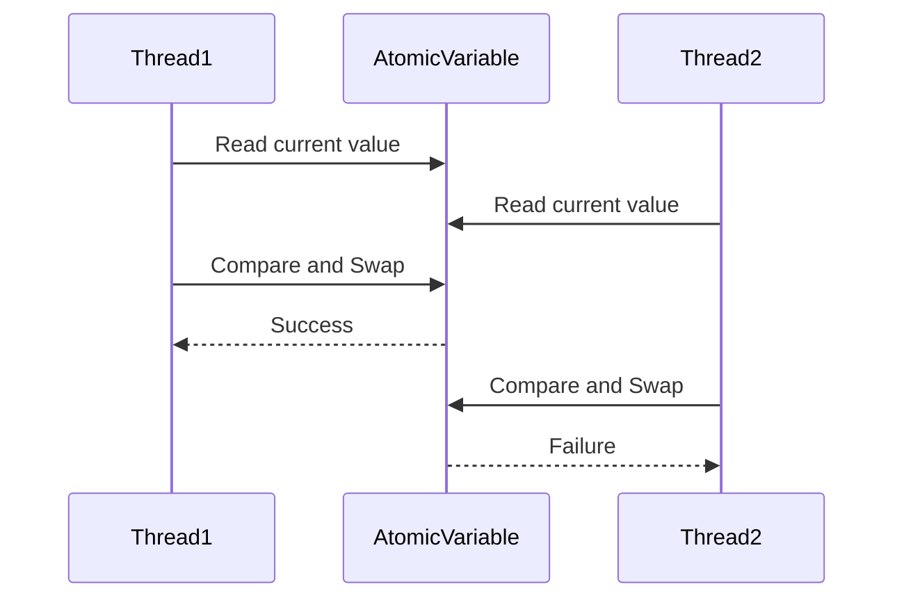

## 9.12. Lock-Free and Wait-Free Programming

Concurrency is a fundamental aspect of modern software development, especially in languages like Clojure that are designed to leverage the power of multi-core processors. In this section, we delve into the advanced concurrency techniques of lock-free and wait-free programming, which are crucial for building efficient and scalable applications.

### Understanding Lock-Free and Wait-Free Programming

**Lock-Free Programming** is a concurrency control mechanism that ensures that at least one thread makes progress in a finite number of steps. This approach avoids traditional locking mechanisms, which can lead to bottlenecks and reduced performance due to thread contention and deadlocks.

**Wait-Free Programming** takes this concept further by guaranteeing that every thread will complete its operation in a finite number of steps, regardless of the actions of other threads. This is the most robust form of concurrency control, ensuring maximum throughput and minimal latency.

### Clojure's Concurrency Primitives

Clojure provides several concurrency primitives that support lock-free and wait-free programming models:

- **Atoms**: Provide a way to manage shared, synchronous, and independent state. They use compare-and-swap (CAS) operations, which are inherently lock-free.
- **Refs**: Used within Clojure's Software Transactional Memory (STM) system, allowing coordinated, synchronous updates to multiple references.
- **Agents**: Facilitate asynchronous updates to shared state, ensuring that changes are applied in a lock-free manner.
- **Vars**: Support dynamic binding and are primarily used for thread-local state.

### Lock-Free Data Structures and Algorithms

Lock-free data structures are designed to allow multiple threads to operate on them without the need for locks. Here are some examples:

#### Lock-Free Stack

A lock-free stack can be implemented using atomic operations. Here's a simple example in Clojure:

```clojure
(ns lock-free.stack
  (:require [clojure.core.async :as async]))

(defn create-stack []
  (atom []))

(defn push [stack item]
  (loop []
    (let [current @stack]
      (if (compare-and-set! stack current (conj current item))
        nil
        (recur)))))

(defn pop [stack]
  (loop []
    (let [current @stack]
      (if (empty? current)
        nil
        (let [item (peek current)]
          (if (compare-and-set! stack current (pop current))
            item
            (recur)))))))
```

In this example, the `push` and `pop` operations use CAS to ensure that updates to the stack are lock-free.

#### Lock-Free Queue

A lock-free queue can be implemented using a similar approach. Here's a basic example:

```clojure
(ns lock-free.queue
  (:require [clojure.core.async :as async]))

(defn create-queue []
  (atom []))

(defn enqueue [queue item]
  (loop []
    (let [current @queue]
      (if (compare-and-set! queue current (conj current item))
        nil
        (recur)))))

(defn dequeue [queue]
  (loop []
    (let [current @queue]
      (if (empty? current)
        nil
        (let [item (first current)]
          (if (compare-and-set! queue current (rest current))
            item
            (recur)))))))
```

### Benefits of Lock-Free and Wait-Free Programming

1. **Scalability**: Lock-free and wait-free algorithms scale better with the number of threads, as they reduce contention and avoid bottlenecks.
2. **Performance**: These algorithms often provide better performance in multi-threaded environments by minimizing the overhead associated with locks.
3. **Robustness**: They are less prone to deadlocks and priority inversion, common issues in lock-based systems.

### Challenges of Lock-Free and Wait-Free Programming

1. **Complexity**: Designing lock-free and wait-free algorithms can be complex and error-prone.
2. **Limited Use Cases**: Not all problems can be efficiently solved with lock-free or wait-free techniques.
3. **Hardware Dependency**: These techniques often rely on specific hardware instructions, such as CAS, which may not be available on all platforms.

### When to Use Lock-Free Programming

Lock-free programming is particularly advantageous in scenarios where:

- High throughput and low latency are critical.
- The application needs to scale across many cores or processors.
- The cost of locking is prohibitive due to high contention.

### Visualizing Lock-Free Programming

To better understand the flow of lock-free programming, consider the following diagram illustrating the CAS operation:



**Caption**: This diagram shows how two threads interact with an atomic variable using CAS. Thread1 successfully updates the variable, while Thread2's update fails due to a concurrent modification.

### Try It Yourself

Experiment with the lock-free stack and queue implementations provided above. Try modifying the code to handle different data types or to add additional operations, such as `peek` for the queue. Observe how the lock-free nature of these data structures affects performance under concurrent access.

### References and Further Reading

- [Clojure's Concurrency Primitives](https://clojure.org/reference/atoms)
- [Lock-Free Data Structures](https://en.wikipedia.org/wiki/Non-blocking_algorithm)
- [Compare-and-Swap (CAS) Operation](https://en.wikipedia.org/wiki/Compare-and-swap)

### Knowledge Check

To reinforce your understanding of lock-free and wait-free programming, consider the following questions and challenges.

## **Ready to Test Your Knowledge?**



### What is the main advantage of lock-free programming?

- [x] It reduces contention and avoids bottlenecks.
- [ ] It simplifies code complexity.
- [ ] It eliminates the need for concurrency control.
- [ ] It is easier to implement than lock-based programming.

> **Explanation:** Lock-free programming reduces contention and avoids bottlenecks, making it more efficient in multi-threaded environments.

### Which Clojure concurrency primitive uses compare-and-swap (CAS)?

- [x] Atoms
- [ ] Refs
- [ ] Agents
- [ ] Vars

> **Explanation:** Atoms in Clojure use compare-and-swap (CAS) operations to manage state changes.

### What is a key characteristic of wait-free programming?

- [x] Every thread completes its operation in a finite number of steps.
- [ ] At least one thread makes progress in a finite number of steps.
- [ ] It relies on traditional locking mechanisms.
- [ ] It is only applicable to single-threaded applications.

> **Explanation:** Wait-free programming ensures that every thread completes its operation in a finite number of steps, providing maximum throughput.

### Which of the following is a challenge of lock-free programming?

- [x] Complexity in design and implementation.
- [ ] High memory usage.
- [ ] Incompatibility with multi-threaded environments.
- [ ] Lack of scalability.

> **Explanation:** Designing and implementing lock-free algorithms can be complex and error-prone.

### What operation is commonly used in lock-free data structures?

- [x] Compare-and-Swap (CAS)
- [ ] Mutex Locking
- [ ] Semaphore
- [ ] Thread Join

> **Explanation:** Compare-and-Swap (CAS) is commonly used in lock-free data structures to ensure atomic updates.

### In which scenario is lock-free programming most advantageous?

- [x] High throughput and low latency requirements.
- [ ] Single-threaded applications.
- [ ] Applications with minimal concurrency.
- [ ] Systems with low contention.

> **Explanation:** Lock-free programming is most advantageous in scenarios with high throughput and low latency requirements.

### What is a potential drawback of lock-free programming?

- [x] Complexity and error-prone design.
- [ ] Increased memory usage.
- [ ] Reduced performance in multi-threaded environments.
- [ ] Incompatibility with modern hardware.

> **Explanation:** The complexity and potential for errors in design are potential drawbacks of lock-free programming.

### Which Clojure primitive is used for asynchronous updates to shared state?

- [x] Agents
- [ ] Atoms
- [ ] Refs
- [ ] Vars

> **Explanation:** Agents in Clojure are used for asynchronous updates to shared state.

### What is the primary goal of wait-free programming?

- [x] To ensure every thread completes its operation in a finite number of steps.
- [ ] To eliminate the need for concurrency control.
- [ ] To simplify code complexity.
- [ ] To reduce memory usage.

> **Explanation:** The primary goal of wait-free programming is to ensure every thread completes its operation in a finite number of steps.

### True or False: Lock-free programming eliminates the need for concurrency control.

- [ ] True
- [x] False

> **Explanation:** Lock-free programming does not eliminate the need for concurrency control; it provides an alternative approach to managing concurrency without traditional locks.



Remember, mastering lock-free and wait-free programming is a journey. As you continue to explore these advanced techniques, you'll gain deeper insights into building efficient and scalable applications. Keep experimenting, stay curious, and enjoy the journey!
