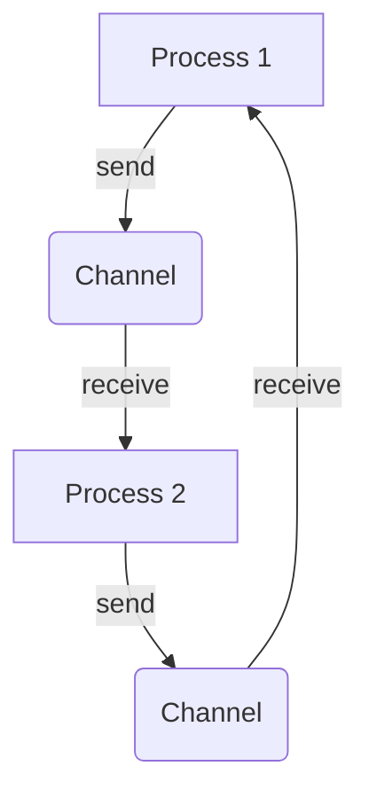

## 9.13. Communicating Sequential Processes (CSP) Model

### Introduction

The Communicating Sequential Processes (CSP) model is a formal language for describing patterns of interaction in concurrent systems. Developed by Tony Hoare in 1978, CSP provides a framework for understanding and designing systems where multiple processes operate independently and communicate through message passing. This model has influenced many modern concurrency paradigms, including Clojure's `core.async` library, which brings CSP concepts to the Clojure programming language.

### History and Principles of CSP

#### Origins of CSP

CSP was introduced by Tony Hoare as a mathematical model for concurrent computation. It was designed to address the complexities of concurrent programming by providing a clear and structured way to describe interactions between independent processes. CSP emphasizes communication over shared memory, allowing processes to synchronize and exchange data through channels.

#### Core Principles

1. **Processes**: In CSP, a process is an independent entity that performs computations. Processes can be thought of as the basic units of execution.

2. **Channels**: Communication between processes occurs through channels. Channels are first-class entities that facilitate message passing, allowing processes to send and receive data.

3. **Synchronization**: CSP enforces synchronization through communication. A process must wait for another process to send or receive a message before proceeding, ensuring safe and predictable interactions.

4. **Determinism**: CSP aims to provide deterministic behavior by clearly defining the order and conditions under which processes communicate.

### CSP vs. Other Concurrency Models

CSP differs from other concurrency models, such as the Actor model and shared-memory multithreading, in several key ways:

- **Message Passing vs. Shared Memory**: CSP relies on message passing for communication, whereas shared-memory models allow processes to access and modify shared data directly. This reduces the risk of race conditions and makes CSP more suitable for distributed systems.

- **Synchronization**: CSP enforces synchronization through communication, while other models may use locks or other mechanisms to coordinate access to shared resources.

- **Determinism**: CSP's focus on deterministic behavior contrasts with the non-deterministic nature of many other concurrency models, which can lead to unpredictable interactions and outcomes.

### Implementing CSP in Clojure with `core.async`

Clojure's `core.async` library brings the CSP model to the Clojure ecosystem, providing tools for building concurrent applications using channels and processes. `core.async` allows developers to write asynchronous code that is easy to reason about and maintain.

#### Key Components of `core.async`

1. **Channels**: Channels are the primary means of communication between processes in `core.async`. They can be buffered or unbuffered, and support operations like `put!`, `take!`, and `close!`.

2. **Go Blocks**: Go blocks are lightweight threads that allow you to write asynchronous code using a synchronous style. They use channels to communicate and synchronize with other go blocks.

3. **Alts!**: The `alts!` function allows a process to wait on multiple channels, proceeding with the first operation that becomes available. This enables complex coordination patterns.

#### Example: Basic Channel Communication

Let's explore a simple example of channel communication using `core.async`:

```clojure
(require '[clojure.core.async :refer [chan go >! <!]])

(defn simple-communication []
  (let [c (chan)]
    (go
      (>! c "Hello from process 1"))
    (go
      (println "Received message:" (<! c)))))

(simple-communication)
```

In this example, we create a channel `c` and two go blocks. The first go block sends a message to the channel, while the second go block receives and prints the message. This demonstrates basic communication and synchronization using channels.

#### Example: Using `alts!` for Multiple Channel Coordination

```clojure
(require '[clojure.core.async :refer [chan go >! <! alts!]])

(defn multiple-channel-coordination []
  (let [c1 (chan)
        c2 (chan)]
    (go
      (>! c1 "Message from channel 1"))
    (go
      (>! c2 "Message from channel 2"))
    (go
      (let [[v ch] (alts! [c1 c2])]
        (println "Received message:" v "from" ch)))))

(multiple-channel-coordination)
```

In this example, we use `alts!` to wait on two channels, `c1` and `c2`. The process proceeds with the first available message, demonstrating how `alts!` enables flexible coordination between multiple channels.

### Advantages of CSP in Structuring Concurrent Applications

1. **Simplified Reasoning**: CSP's focus on message passing and synchronization through communication simplifies reasoning about concurrent interactions, reducing the complexity of concurrent code.

2. **Deterministic Behavior**: By enforcing deterministic communication patterns, CSP helps prevent race conditions and other concurrency-related issues.

3. **Scalability**: CSP's emphasis on independent processes and message passing makes it well-suited for distributed systems and scalable architectures.

4. **Modularity**: CSP encourages modular design by decoupling processes and facilitating clear communication interfaces.

### Visualizing CSP with Mermaid.js

To better understand CSP, let's visualize a simple CSP system using Mermaid.js:



This diagram illustrates a basic CSP system with two processes communicating through channels. Process 1 sends a message to Process 2 via a channel, and Process 2 sends a response back to Process 1 through another channel.

### Try It Yourself

Experiment with the provided code examples by modifying the messages, adding more channels, or introducing delays to observe how CSP handles concurrency. Consider implementing a simple producer-consumer pattern using `core.async` to deepen your understanding of CSP.

### References and Further Reading

- [Clojure's core.async Documentation](https://clojure.github.io/core.async/)
- [Communicating Sequential Processes by Tony Hoare](https://www.cs.cmu.edu/~crary/819-f09/Hoare78.pdf)
- [Concurrency in Clojure: A Practical Guide](https://clojure.org/guides/concurrency)

### Knowledge Check

To reinforce your understanding of the CSP model and its implementation in Clojure, try answering the following questions.

## **Ready to Test Your Knowledge?**



### What is the primary communication mechanism in CSP?

- [x] Message passing through channels
- [ ] Shared memory access
- [ ] Global variables
- [ ] Direct function calls

> **Explanation:** CSP relies on message passing through channels for communication between processes.

### How does CSP ensure synchronization between processes?

- [x] Through communication
- [ ] Using locks
- [ ] By accessing shared memory
- [ ] Through global variables

> **Explanation:** CSP enforces synchronization by requiring processes to communicate through channels.

### What is a key advantage of CSP over shared-memory concurrency models?

- [x] Reduced risk of race conditions
- [ ] Faster execution
- [ ] Easier debugging
- [ ] More efficient memory usage

> **Explanation:** CSP reduces the risk of race conditions by avoiding shared memory and using message passing.

### Which Clojure library implements the CSP model?

- [x] core.async
- [ ] clojure.core
- [ ] clojure.java
- [ ] clojure.data

> **Explanation:** The `core.async` library in Clojure implements the CSP model.

### What function in `core.async` allows waiting on multiple channels?

- [x] alts!
- [ ] go
- [ ] chan
- [ ] put!

> **Explanation:** The `alts!` function allows a process to wait on multiple channels and proceed with the first available operation.

### What is the purpose of go blocks in `core.async`?

- [x] To create lightweight threads for asynchronous code
- [ ] To define new channels
- [ ] To synchronize processes
- [ ] To manage shared memory

> **Explanation:** Go blocks create lightweight threads that allow writing asynchronous code in a synchronous style.

### How does CSP promote modularity in concurrent applications?

- [x] By decoupling processes and facilitating clear communication interfaces
- [ ] By using global variables
- [ ] By sharing memory between processes
- [ ] By enforcing strict execution order

> **Explanation:** CSP promotes modularity by decoupling processes and using channels for clear communication.

### What is a common use case for CSP in distributed systems?

- [x] Scalable architectures
- [ ] Real-time graphics rendering
- [ ] Single-threaded applications
- [ ] Static web pages

> **Explanation:** CSP's emphasis on independent processes and message passing makes it well-suited for scalable architectures in distributed systems.

### Which of the following is NOT a component of `core.async`?

- [ ] Channels
- [ ] Go blocks
- [x] Threads
- [ ] Alts!

> **Explanation:** Threads are not a component of `core.async`; instead, `core.async` uses channels, go blocks, and functions like `alts!`.

### True or False: CSP is inherently non-deterministic.

- [ ] True
- [x] False

> **Explanation:** CSP aims to provide deterministic behavior by clearly defining communication patterns and synchronization.



Remember, this is just the beginning. As you progress, you'll build more complex and interactive concurrent applications using CSP and `core.async`. Keep experimenting, stay curious, and enjoy the journey!


