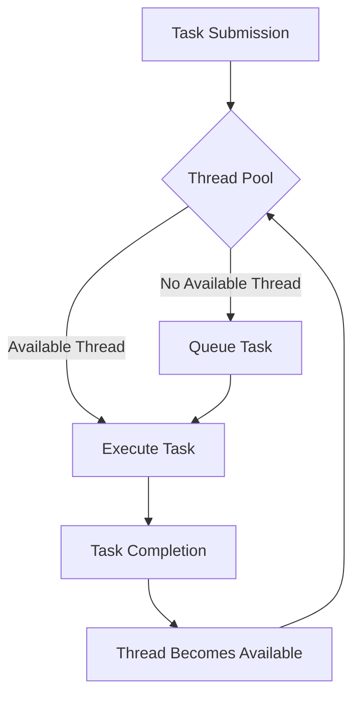

## 9.14. Utilizing Thread Pools

### Introduction to Thread Pools

In modern software development, efficiently managing concurrent tasks is crucial for building responsive and high-performance applications. Thread pools are a fundamental concept in concurrent programming that help manage the execution of multiple threads by reusing a fixed number of threads to execute tasks. This approach not only reduces the overhead of creating and destroying threads but also helps in controlling the number of concurrent threads, thereby preventing resource exhaustion.

### What Are Thread Pools?

A thread pool is a collection of pre-initialized threads that stand ready to execute tasks. When a task is submitted to a thread pool, it is assigned to an available thread. If no threads are available, the task waits in a queue until a thread becomes free. This mechanism allows for efficient task execution and resource management.

#### Importance of Thread Pools

- **Resource Management**: By limiting the number of active threads, thread pools prevent the system from being overwhelmed by too many concurrent threads, which can lead to resource exhaustion.
- **Performance Improvement**: Reusing threads reduces the overhead associated with thread creation and destruction, leading to improved application performance.
- **Scalability**: Thread pools allow applications to handle a large number of tasks efficiently, making them scalable.

### Configuring and Using Thread Pools in Clojure

Clojure provides several constructs for concurrent programming, including `future`, Agents, and `core.async`. Each of these can be used in conjunction with thread pools to manage concurrency effectively.

#### Using `future` with Thread Pools

The `future` construct in Clojure is used to execute a task asynchronously. By default, `future` uses a common thread pool provided by the Java Virtual Machine (JVM). Here's how you can use `future`:

```clojure
(defn compute-intensive-task []
  ;; Simulate a compute-intensive task
  (Thread/sleep 1000)
  (println "Task completed"))

(defn execute-tasks []
  (let [futures (doall (repeatedly 10 #(future (compute-intensive-task))))]
    (doseq [f futures]
      @f))) ; Wait for all futures to complete

(execute-tasks)
```

In this example, `future` is used to execute `compute-intensive-task` asynchronously. The `doall` function ensures that all futures are realized immediately, and `@f` waits for each future to complete.

#### Using Agents with Thread Pools

Agents in Clojure provide a way to manage shared state asynchronously. They use a thread pool to apply actions to the state they manage.

```clojure
(def counter (agent 0))

(defn increment-counter []
  (send counter inc))

(defn execute-agent-tasks []
  (dotimes [_ 100]
    (increment-counter))
  (await counter) ; Wait for all actions to complete
  (println "Final counter value:" @counter))

(execute-agent-tasks)
```

In this example, an agent is used to manage a counter. The `send` function asynchronously applies the `inc` function to the agent's state. The `await` function ensures that all actions are completed before proceeding.

#### Using `core.async` with Thread Pools

`core.async` is a library for asynchronous programming in Clojure, providing channels for communication between concurrent processes.

```clojure
(require '[clojure.core.async :refer [chan go <! >!]])

(defn async-task [ch]
  (go
    (Thread/sleep 1000)
    (>! ch "Task completed")))

(defn execute-async-tasks []
  (let [ch (chan)]
    (dotimes [_ 10]
      (async-task ch))
    (dotimes [_ 10]
      (println (<! ch)))))

(execute-async-tasks)
```

In this example, `core.async` is used to execute tasks asynchronously. The `go` block creates a lightweight thread that performs the task and sends the result to a channel.

### Best Practices for Sizing and Managing Thread Pools

Properly sizing and managing thread pools is crucial for maximizing performance and avoiding potential pitfalls such as thread starvation or oversubscription.

#### Sizing Thread Pools

- **CPU-Bound Tasks**: For tasks that are CPU-intensive, the number of threads should typically be equal to the number of available processor cores. This ensures that each core can be utilized effectively without context switching overhead.
- **I/O-Bound Tasks**: For tasks that involve I/O operations, such as network or file access, the number of threads can be higher than the number of cores, as these tasks spend a significant amount of time waiting for I/O operations to complete.

#### Managing Thread Pools

- **Monitor Thread Usage**: Use monitoring tools to observe thread usage and adjust the pool size as needed.
- **Handle Exceptions**: Ensure that exceptions in tasks do not terminate the threads in the pool. Use exception handling to manage errors gracefully.
- **Avoid Blocking Operations**: Minimize blocking operations within tasks to prevent threads from being held up unnecessarily.

### Impact on Application Throughput

Using thread pools effectively can significantly improve application throughput by allowing multiple tasks to be executed concurrently. However, improper configuration can lead to issues such as thread starvation, where tasks are unable to execute due to a lack of available threads.

#### Example: Impact of Thread Pool Size

Consider an application that processes incoming requests using a thread pool. The following example demonstrates how varying the thread pool size affects throughput:

```clojure
(defn process-request [request]
  ;; Simulate request processing
  (Thread/sleep 500)
  (println "Processed request:" request))

(defn simulate-requests [num-requests pool-size]
  (let [executor (java.util.concurrent.Executors/newFixedThreadPool pool-size)]
    (doseq [i (range num-requests)]
      (.submit executor #(process-request i)))
    (.shutdown executor)
    (.awaitTermination executor 1 java.util.concurrent.TimeUnit/MINUTES)))

(simulate-requests 100 5) ; Using a pool size of 5
(simulate-requests 100 10) ; Using a pool size of 10
```

In this example, `simulate-requests` processes a number of requests using a fixed thread pool. By adjusting the pool size, you can observe changes in throughput.

### Potential Pitfalls

While thread pools offer many benefits, they also come with potential pitfalls:

- **Thread Starvation**: Occurs when threads are unable to execute due to a lack of available threads. This can happen if the pool size is too small or if tasks are blocking.
- **Oversubscription**: Having too many threads can lead to excessive context switching, reducing performance. It's important to balance the number of threads with the available resources.
- **Resource Leaks**: Failing to properly shut down a thread pool can lead to resource leaks. Always ensure that thread pools are shut down when no longer needed.

### Visualizing Thread Pool Management

To better understand how thread pools manage tasks, consider the following diagram:



**Diagram Description**: This diagram illustrates the flow of task execution in a thread pool. Tasks are submitted to the pool, where they are either executed immediately by an available thread or queued if no threads are available. Upon completion, threads become available to execute queued tasks.

### Conclusion

Thread pools are a powerful tool for managing concurrency in Clojure applications. By understanding how to configure and use thread pools effectively, you can improve application performance and scalability. Remember to monitor thread usage, handle exceptions, and avoid blocking operations to maximize the benefits of thread pools.

### Try It Yourself

Experiment with the examples provided by adjusting the number of tasks, pool sizes, and task durations. Observe how these changes affect application throughput and resource utilization. This hands-on approach will deepen your understanding of thread pool management in Clojure.

### References and Further Reading

- [Java Concurrency in Practice](https://jcip.net/)
- [Clojure Documentation on Concurrency](https://clojure.org/reference/concurrency)
- [Core.Async Documentation](https://clojure.github.io/core.async/)

## **Ready to Test Your Knowledge?**



### What is the primary benefit of using thread pools?

- [x] Efficient resource management and reduced overhead
- [ ] Increased memory usage
- [ ] Slower task execution
- [ ] More complex code

> **Explanation:** Thread pools manage resources efficiently by reusing threads, reducing the overhead of creating and destroying threads.

### Which Clojure construct uses a common thread pool by default?

- [x] `future`
- [ ] Agents
- [ ] `core.async`
- [ ] `promise`

> **Explanation:** The `future` construct in Clojure uses a common thread pool provided by the JVM by default.

### What is a potential pitfall of having too many threads in a pool?

- [x] Oversubscription leading to excessive context switching
- [ ] Increased task execution speed
- [ ] Reduced memory usage
- [ ] Improved resource management

> **Explanation:** Having too many threads can lead to excessive context switching, which reduces performance.

### How can you prevent thread starvation in a thread pool?

- [x] Properly sizing the thread pool
- [ ] Increasing task complexity
- [ ] Reducing the number of tasks
- [ ] Using blocking operations

> **Explanation:** Properly sizing the thread pool ensures that there are enough threads to handle tasks, preventing starvation.

### What should you do to avoid resource leaks with thread pools?

- [x] Ensure thread pools are shut down when no longer needed
- [ ] Increase the pool size
- [ ] Use more blocking operations
- [ ] Avoid exception handling

> **Explanation:** Properly shutting down thread pools when they are no longer needed prevents resource leaks.

### Which Clojure library provides channels for communication between concurrent processes?

- [x] `core.async`
- [ ] `clojure.test`
- [ ] `clojure.java.io`
- [ ] `clojure.spec`

> **Explanation:** `core.async` provides channels for communication between concurrent processes in Clojure.

### What is the recommended thread pool size for CPU-bound tasks?

- [x] Equal to the number of available processor cores
- [ ] Twice the number of available processor cores
- [ ] Half the number of available processor cores
- [ ] Ten times the number of available processor cores

> **Explanation:** For CPU-bound tasks, the thread pool size should typically be equal to the number of available processor cores.

### How does `core.async` execute tasks asynchronously?

- [x] Using lightweight threads created by `go` blocks
- [ ] By blocking the main thread
- [ ] By using `future`
- [ ] By using `promise`

> **Explanation:** `core.async` uses `go` blocks to create lightweight threads for asynchronous task execution.

### What is the role of the `await` function when using Agents?

- [x] Ensures all actions are completed before proceeding
- [ ] Submits tasks to the thread pool
- [ ] Increases the agent's state
- [ ] Decreases the agent's state

> **Explanation:** The `await` function ensures that all actions on an agent are completed before proceeding.

### True or False: Thread pools can help improve application scalability.

- [x] True
- [ ] False

> **Explanation:** Thread pools allow applications to handle a large number of tasks efficiently, making them scalable.


