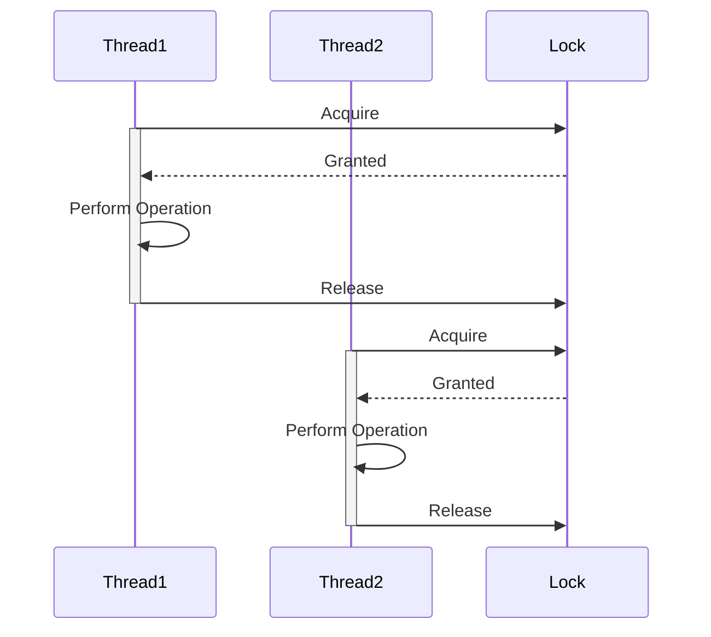

## 9.15. Synchronization Primitives and Their Use Cases

In the world of concurrent programming, synchronization primitives are essential tools that help manage access to shared resources. While Clojure offers powerful concurrency constructs like atoms, refs, agents, and core.async channels, there are scenarios where lower-level synchronization primitives, such as those provided by Java's `java.util.concurrent` package, become necessary. This section explores these synchronization primitives, their use cases, and how to effectively integrate them into Clojure applications.

### Introduction to Synchronization Primitives

Synchronization primitives are mechanisms that control the access of multiple threads to shared resources, ensuring data consistency and preventing race conditions. In Clojure, the need for such primitives arises when dealing with complex concurrency scenarios that go beyond the capabilities of Clojure's built-in constructs.

#### Key Synchronization Primitives

- **Locks**: Allow threads to have exclusive access to a resource.
- **Semaphores**: Control access to a resource by maintaining a set of permits.
- **Barriers**: Synchronize threads at a specific point in execution.
- **Latches**: Allow one or more threads to wait until a set of operations are completed.

### When to Use Low-Level Synchronization Primitives

While Clojure's concurrency constructs are sufficient for most use cases, there are situations where low-level synchronization primitives are necessary:

1. **Complex State Management**: When managing complex state transitions that require fine-grained control.
2. **Interoperability with Java Libraries**: When integrating with Java libraries that use these primitives.
3. **Performance Optimization**: In performance-critical applications where the overhead of higher-level constructs is unacceptable.
4. **Resource Management**: When managing limited resources, such as database connections or file handles.

### Using Java Synchronization Primitives in Clojure

Clojure's seamless interoperability with Java allows developers to leverage Java's synchronization primitives. Let's explore how to use some of these primitives in Clojure.

#### Locks

Locks provide mutual exclusion, ensuring that only one thread can access a resource at a time. Java provides several lock implementations, such as `ReentrantLock`.

```clojure
(import '[java.util.concurrent.locks ReentrantLock])

(def lock (ReentrantLock.))

(defn safe-increment [counter]
  (.lock lock)
  (try
    (swap! counter inc)
    (finally
      (.unlock lock))))
```

In this example, we use a `ReentrantLock` to ensure that only one thread can increment the counter at a time.

#### Semaphores

Semaphores control access to a resource by maintaining a set of permits. They are useful for limiting the number of threads that can access a resource simultaneously.

```clojure
(import '[java.util.concurrent Semaphore])

(def semaphore (Semaphore. 3)) ; Allow up to 3 threads

(defn access-resource []
  (.acquire semaphore)
  (try
    (println "Accessing resource")
    (finally
      (.release semaphore))))
```

Here, a `Semaphore` is used to limit access to a resource to three threads at a time.

#### Barriers

Barriers synchronize threads at a specific point in execution, ensuring that all threads reach a certain point before proceeding.

```clojure
(import '[java.util.concurrent CyclicBarrier])

(def barrier (CyclicBarrier. 3 (fn [] (println "All threads reached the barrier"))))

(defn task []
  (println "Performing task")
  (.await barrier))
```

In this example, a `CyclicBarrier` is used to synchronize three threads, printing a message once all threads reach the barrier.

#### Latches

Latches allow one or more threads to wait until a set of operations are completed. The `CountDownLatch` is a common implementation.

```clojure
(import '[java.util.concurrent CountDownLatch])

(def latch (CountDownLatch. 3))

(defn worker []
  (println "Working...")
  (.countDown latch))

(defn await-completion []
  (.await latch)
  (println "All tasks completed"))
```

Here, a `CountDownLatch` is used to wait for three tasks to complete before proceeding.

### Best Practices and Cautions

When using synchronization primitives, it's important to follow best practices to avoid common pitfalls:

- **Minimize Lock Scope**: Keep the scope of locks as small as possible to reduce contention.
- **Avoid Deadlocks**: Ensure that locks are acquired and released in a consistent order to prevent deadlocks.
- **Use Timeouts**: When possible, use timeouts to avoid indefinite blocking.
- **Prefer Higher-Level Constructs**: Use Clojure's higher-level concurrency constructs when they suffice, as they are easier to reason about and less error-prone.

### Visualizing Synchronization Primitives

To better understand the interaction between threads and synchronization primitives, let's visualize a simple scenario using a sequence diagram.



This diagram illustrates two threads acquiring and releasing a lock to perform operations safely.

### Knowledge Check

Before we conclude, let's reinforce our understanding with a few questions:

1. What are the main synchronization primitives available in Java?
2. When should you prefer using Java's synchronization primitives over Clojure's concurrency constructs?
3. How does a `Semaphore` differ from a `Lock`?
4. What is a common use case for a `CountDownLatch`?

### Conclusion

Synchronization primitives are powerful tools for managing concurrency in complex applications. By understanding their use cases and best practices, you can effectively integrate them into your Clojure applications, ensuring data consistency and optimal performance.

Remember, this is just the beginning. As you progress, you'll encounter more complex concurrency scenarios. Keep experimenting, stay curious, and enjoy the journey!

## **Ready to Test Your Knowledge?**



### What is the primary purpose of a lock in concurrency?

- [x] To ensure mutual exclusion
- [ ] To synchronize threads at a specific point
- [ ] To manage a set of permits
- [ ] To allow threads to wait for operations to complete

> **Explanation:** Locks are used to ensure mutual exclusion, allowing only one thread to access a resource at a time.

### How does a semaphore differ from a lock?

- [x] A semaphore controls access with permits
- [ ] A semaphore provides mutual exclusion
- [ ] A semaphore synchronizes threads at a barrier
- [ ] A semaphore allows threads to wait for operations to complete

> **Explanation:** A semaphore controls access to a resource by maintaining a set of permits, unlike a lock which provides mutual exclusion.

### What is a common use case for a `CountDownLatch`?

- [x] To wait for a set of operations to complete
- [ ] To synchronize threads at a specific point
- [ ] To control access with permits
- [ ] To ensure mutual exclusion

> **Explanation:** A `CountDownLatch` is used to allow one or more threads to wait until a set of operations are completed.

### When should you use Java's synchronization primitives over Clojure's constructs?

- [x] When dealing with complex state management
- [ ] When working with simple state transitions
- [ ] When using core.async channels
- [ ] When managing simple shared state

> **Explanation:** Java's synchronization primitives are useful for complex state management scenarios that require fine-grained control.

### What is the role of a `CyclicBarrier`?

- [x] To synchronize threads at a specific point
- [ ] To ensure mutual exclusion
- [ ] To control access with permits
- [ ] To allow threads to wait for operations to complete

> **Explanation:** A `CyclicBarrier` is used to synchronize threads at a specific point in execution.

### What is a best practice when using locks?

- [x] Minimize lock scope
- [ ] Use locks for all shared resources
- [ ] Avoid using timeouts
- [ ] Acquire locks in any order

> **Explanation:** Minimizing lock scope reduces contention and improves performance.

### What is a potential risk when using locks?

- [x] Deadlocks
- [ ] Increased performance
- [ ] Reduced contention
- [ ] Simplified code

> **Explanation:** Deadlocks can occur if locks are not acquired and released in a consistent order.

### How can you avoid indefinite blocking with locks?

- [x] Use timeouts
- [ ] Avoid using locks
- [ ] Acquire locks in any order
- [ ] Use more locks

> **Explanation:** Using timeouts can help avoid indefinite blocking when acquiring locks.

### What is the benefit of using Clojure's higher-level concurrency constructs?

- [x] Easier to reason about
- [ ] More complex
- [ ] Less efficient
- [ ] More error-prone

> **Explanation:** Clojure's higher-level concurrency constructs are easier to reason about and less error-prone.

### True or False: A `Semaphore` can be used to limit the number of threads accessing a resource.

- [x] True
- [ ] False

> **Explanation:** A `Semaphore` is designed to limit the number of threads that can access a resource simultaneously by maintaining a set of permits.


