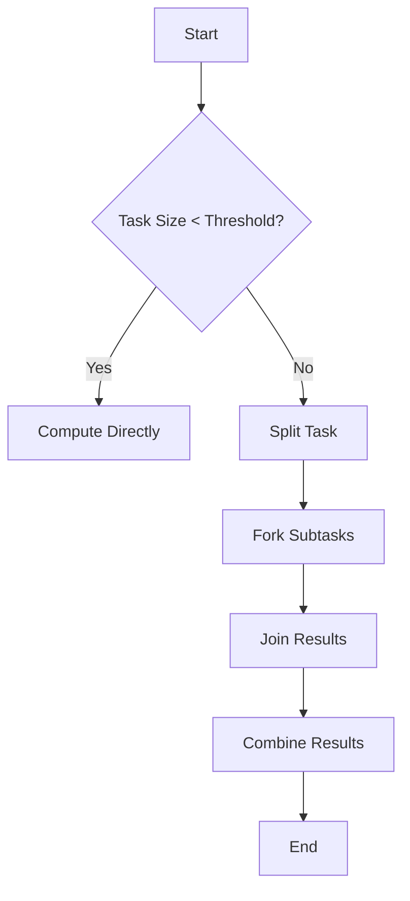

## 9.16. Fork-Join Pattern

### Introduction

The **Fork-Join Pattern** is a powerful design pattern used in parallel computing to efficiently execute tasks by recursively splitting them into smaller subtasks, processing them concurrently, and then combining the results. This pattern is particularly useful in Clojure, a language known for its strong support for concurrency and parallelism. In this section, we will explore the Fork-Join Pattern, its implementation in Clojure, and its application in various algorithms.

### Understanding the Fork-Join Pattern

The Fork-Join Pattern is based on the divide-and-conquer approach. It involves two main operations:

- **Fork**: Divide a task into smaller subtasks that can be executed concurrently.
- **Join**: Combine the results of the subtasks to produce the final result.

This pattern is ideal for tasks that can be broken down into independent units of work, such as sorting algorithms, matrix multiplication, and recursive computations.

### Implementing Fork-Join in Clojure

Clojure provides several tools to implement the Fork-Join Pattern, including `future`, `pmap`, and Java's `ForkJoinPool`. Let's explore each of these options.

#### Using `future`

The `future` function in Clojure allows you to execute a task asynchronously and retrieve the result later. It is a simple way to implement the Fork-Join Pattern for tasks that can be divided into independent subtasks.

```clojure
(defn parallel-sum [coll]
  (if (< (count coll) 1000) ; Base case for small collections
    (reduce + coll)
    (let [mid (quot (count coll) 2)
          left (subvec coll 0 mid)
          right (subvec coll mid)
          left-future (future (parallel-sum left))
          right-future (future (parallel-sum right))]
      (+ @left-future @right-future)))) ; Join results
```

In this example, the `parallel-sum` function splits the collection into two halves and processes each half in parallel using `future`. The results are then combined using `+`.

#### Using `pmap`

`pmap` is a parallel version of `map` that applies a function to each element of a collection in parallel. It is suitable for tasks where each element can be processed independently.

```clojure
(defn parallel-square [coll]
  (pmap #(* % %) coll)) ; Square each element in parallel
```

Here, `parallel-square` uses `pmap` to square each element of the collection concurrently.

#### Using ForkJoinPool

For more complex scenarios, you can use Java's `ForkJoinPool`, which provides a more fine-grained control over parallel execution. Clojure's interop with Java makes it possible to leverage this powerful tool.

```clojure
(import '[java.util.concurrent ForkJoinPool RecursiveTask])

(defn fork-join-sum [coll]
  (let [pool (ForkJoinPool.)]
    (.invoke pool
             (proxy [RecursiveTask] []
               (compute []
                 (if (< (count coll) 1000)
                   (reduce + coll)
                   (let [mid (quot (count coll) 2)
                         left (subvec coll 0 mid)
                         right (subvec coll mid)
                         left-task (proxy [RecursiveTask] []
                                     (compute [] (fork-join-sum left)))
                         right-task (proxy [RecursiveTask] []
                                      (compute [] (fork-join-sum right)))]
                     (.fork left-task)
                     (+ (.join left-task) (.invoke right-task)))))))))
```

This example demonstrates how to use `ForkJoinPool` and `RecursiveTask` to implement the Fork-Join Pattern in Clojure. The `compute` method recursively splits the task and combines the results.

### Algorithms Benefiting from Fork-Join

Several algorithms can benefit from the Fork-Join Pattern, including:

- **Merge Sort**: A classic example of a divide-and-conquer algorithm that can be parallelized using Fork-Join.
- **Matrix Multiplication**: Large matrices can be divided into smaller submatrices and processed concurrently.
- **Fibonacci Sequence**: Recursive computation of Fibonacci numbers can be parallelized, although the overhead may outweigh the benefits for small inputs.

### Performance Considerations

While the Fork-Join Pattern can significantly improve performance, it is essential to consider the overhead of task creation and synchronization. Here are some tips to optimize performance:

- **Granularity**: Choose an appropriate granularity for dividing tasks. Too fine-grained tasks can lead to excessive overhead, while too coarse-grained tasks may not fully utilize available resources.
- **Task Overhead**: Minimize the overhead of task creation and synchronization by using efficient data structures and algorithms.
- **Thread Management**: Use a thread pool to manage threads efficiently and avoid excessive context switching.

### Tools and Libraries

Clojure provides several tools and libraries to assist with fork-join operations:

- **core.async**: A library for asynchronous programming in Clojure, providing channels and go blocks for managing concurrency.
- **clojure.parallel**: A library for parallel programming in Clojure, offering functions like `pmap` and `pcalls` for parallel execution.
- **Java Interop**: Leverage Java's `ForkJoinPool` and other concurrency utilities through Clojure's seamless interop with Java.

### Visualizing the Fork-Join Pattern

To better understand the Fork-Join Pattern, let's visualize the process using a flowchart.



**Figure 1**: Flowchart illustrating the Fork-Join Pattern. Tasks are split into subtasks, processed concurrently, and results are combined.

### Try It Yourself

Experiment with the provided code examples by modifying the threshold for task splitting or changing the function applied to each element. Observe how these changes affect performance and resource utilization.

### Knowledge Check

1. What is the primary purpose of the Fork-Join Pattern?
2. How does `future` help in implementing the Fork-Join Pattern in Clojure?
3. What are some algorithms that benefit from the Fork-Join Pattern?
4. What are the performance considerations when using the Fork-Join Pattern?
5. How can Java's `ForkJoinPool` be utilized in Clojure?

### Conclusion

The Fork-Join Pattern is a powerful tool for parallel computation in Clojure, enabling efficient execution of tasks by dividing them into smaller subtasks. By leveraging Clojure's concurrency features and Java's ForkJoinPool, you can optimize performance and resource utilization in your applications. Remember, this is just the beginning. As you progress, you'll build more complex and interactive applications. Keep experimenting, stay curious, and enjoy the journey!

## **Ready to Test Your Knowledge?**



### What is the primary purpose of the Fork-Join Pattern?

- [x] To divide tasks into smaller subtasks and execute them concurrently
- [ ] To execute tasks sequentially
- [ ] To optimize memory usage
- [ ] To simplify code structure

> **Explanation:** The Fork-Join Pattern is designed to divide tasks into smaller subtasks, execute them concurrently, and then combine the results.

### How does `future` help in implementing the Fork-Join Pattern in Clojure?

- [x] By allowing asynchronous execution of tasks
- [ ] By providing a synchronous execution model
- [ ] By simplifying error handling
- [ ] By reducing memory usage

> **Explanation:** `future` in Clojure allows tasks to be executed asynchronously, which is essential for implementing the Fork-Join Pattern.

### Which of the following algorithms benefits from the Fork-Join Pattern?

- [x] Merge Sort
- [ ] Linear Search
- [x] Matrix Multiplication
- [ ] Bubble Sort

> **Explanation:** Algorithms like Merge Sort and Matrix Multiplication can be parallelized using the Fork-Join Pattern due to their divide-and-conquer nature.

### What is a key performance consideration when using the Fork-Join Pattern?

- [x] Task granularity
- [ ] Code readability
- [ ] Memory allocation
- [ ] Error handling

> **Explanation:** Task granularity is crucial in the Fork-Join Pattern to balance the overhead of task creation and the utilization of resources.

### How can Java's `ForkJoinPool` be utilized in Clojure?

- [x] Through Clojure's Java interop capabilities
- [ ] By rewriting Clojure code in Java
- [ ] By using Clojure's `future` function
- [ ] By avoiding Java libraries

> **Explanation:** Clojure's seamless interop with Java allows the use of Java's `ForkJoinPool` for managing parallel tasks.

### What is the role of `pmap` in Clojure's Fork-Join Pattern?

- [x] To apply a function to each element of a collection in parallel
- [ ] To execute tasks sequentially
- [ ] To manage memory allocation
- [ ] To handle errors

> **Explanation:** `pmap` is used to apply a function to each element of a collection in parallel, making it suitable for the Fork-Join Pattern.

### Which library assists with asynchronous programming in Clojure?

- [x] core.async
- [ ] clojure.parallel
- [ ] clojure.java
- [ ] clojure.data

> **Explanation:** `core.async` is a library for asynchronous programming in Clojure, providing channels and go blocks for managing concurrency.

### What is a potential drawback of using the Fork-Join Pattern?

- [x] Task creation overhead
- [ ] Increased memory usage
- [ ] Simplified code structure
- [ ] Reduced performance

> **Explanation:** The overhead of task creation and synchronization can be a drawback of the Fork-Join Pattern if not managed properly.

### What is the benefit of using `ForkJoinPool` over `future`?

- [x] More fine-grained control over parallel execution
- [ ] Simpler syntax
- [ ] Better error handling
- [ ] Reduced memory usage

> **Explanation:** `ForkJoinPool` provides more fine-grained control over parallel execution compared to `future`.

### True or False: The Fork-Join Pattern is only applicable to recursive algorithms.

- [ ] True
- [x] False

> **Explanation:** While the Fork-Join Pattern is well-suited for recursive algorithms, it can be applied to any task that can be divided into independent subtasks.


