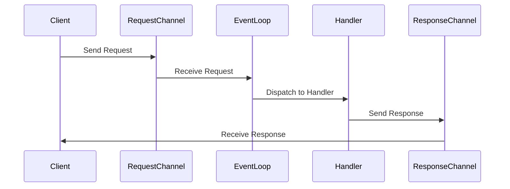

## 9.17. Reactor Pattern with core.async

### Introduction to the Reactor Pattern

The Reactor Pattern is a design pattern used in event-driven applications to handle service requests that are delivered concurrently to an application. It is particularly useful in scenarios where non-blocking I/O operations are required, such as in servers or graphical user interfaces (GUIs). The pattern allows for efficient handling of multiple inputs and outputs without the need for multiple threads, making it ideal for scalable applications.

In the context of Clojure, the `core.async` library provides powerful tools to implement the Reactor Pattern. By leveraging channels and go blocks, `core.async` allows developers to write asynchronous code that is both readable and efficient.

### Understanding core.async

Before diving into the Reactor Pattern, it's essential to understand the basics of `core.async`. This library introduces the concept of channels, which are used to communicate between different parts of a program asynchronously. Channels can be thought of as queues that allow data to be passed between different threads or go blocks.

#### Key Concepts

- **Channels**: These are the primary means of communication in `core.async`. They can be buffered or unbuffered and support operations like `put!` and `take!`.
- **Go Blocks**: These are lightweight threads that allow for asynchronous operations. They use channels to communicate and can be paused and resumed, making them ideal for non-blocking I/O.
- **Alts!**: This function allows a go block to wait on multiple channels, proceeding with the first one that becomes ready.

### Implementing the Reactor Pattern with core.async

The Reactor Pattern can be implemented in Clojure using `core.async` by setting up a central event loop that listens for events on channels and dispatches them to appropriate handlers.

#### Step-by-Step Implementation

1. **Define Channels for Events**: Create channels for different types of events that the application needs to handle.

2. **Create Event Handlers**: Define functions that will process each type of event.

3. **Set Up the Event Loop**: Use a go block to continuously listen for events on the channels and dispatch them to the appropriate handlers.

4. **Dispatch Events**: Use `put!` to send events to the channels from various parts of the application.

#### Example: A Simple Event-Driven Server

Let's create a simple event-driven server that listens for incoming requests and processes them using the Reactor Pattern.

```clojure
(ns reactor-pattern.core
  (:require [clojure.core.async :refer [chan go-loop <! >! put!]]))

;; Define channels for incoming requests and responses
(def request-chan (chan))
(def response-chan (chan))

;; Event handler for processing requests
(defn handle-request [request]
  (println "Processing request:" request)
  ;; Simulate processing time
  (Thread/sleep 1000)
  (str "Response for " request))

;; Event loop for handling requests
(go-loop []
  (let [request (<! request-chan)]
    (let [response (handle-request request)]
      (>! response-chan response))
    (recur)))

;; Function to simulate incoming requests
(defn simulate-requests []
  (doseq [i (range 5)]
    (put! request-chan (str "Request " i))
    (Thread/sleep 500)))

;; Start simulating requests
(simulate-requests)

;; Event loop for handling responses
(go-loop []
  (let [response (<! response-chan)]
    (println "Received response:" response)
    (recur)))
```

### Benefits of Using the Reactor Pattern with core.async

- **Non-Blocking I/O**: By using channels and go blocks, the Reactor Pattern allows for non-blocking I/O operations, which can significantly improve the performance of applications that handle many concurrent connections.

- **Scalability**: The pattern is well-suited for applications that need to scale, as it can efficiently handle a large number of events without the overhead of managing multiple threads.

- **Simplified Concurrency**: `core.async` provides a high-level abstraction for concurrency, making it easier to write and maintain asynchronous code.

### Use Cases for the Reactor Pattern

- **Servers**: The pattern is ideal for building servers that need to handle many simultaneous connections, such as web servers or chat servers.

- **GUIs**: In graphical user interfaces, the Reactor Pattern can be used to handle user input events, such as mouse clicks or keyboard presses, without blocking the main thread.

- **Real-Time Systems**: Applications that require real-time processing of events, such as monitoring systems or trading platforms, can benefit from the efficiency and responsiveness of the Reactor Pattern.

### Visualizing the Reactor Pattern

To better understand how the Reactor Pattern works, let's visualize the flow of events and their handling using a Mermaid.js diagram.



This diagram illustrates the flow of a request from the client to the server, where it is processed by an event loop and dispatched to a handler. The response is then sent back to the client.

### Design Considerations

When implementing the Reactor Pattern with `core.async`, consider the following:

- **Channel Buffering**: Decide whether to use buffered or unbuffered channels based on the expected load and processing time of events.

- **Error Handling**: Implement robust error handling to ensure that the event loop can recover from failures and continue processing events.

- **Performance Tuning**: Monitor the performance of the event loop and handlers to identify bottlenecks and optimize processing times.

### Clojure Unique Features

Clojure's `core.async` library provides unique features that make it particularly well-suited for implementing the Reactor Pattern:

- **Homoiconicity**: Clojure's code-as-data philosophy allows for powerful metaprogramming capabilities, which can be leveraged to dynamically generate event handlers or modify the event loop.

- **Immutable Data Structures**: Clojure's emphasis on immutability ensures that data shared between different parts of the application remains consistent and free from race conditions.

- **Functional Programming Paradigm**: The use of pure functions and higher-order functions in Clojure promotes a clean and modular design, making it easier to reason about the flow of events and their processing.

### Differences and Similarities with Other Patterns

The Reactor Pattern is often compared to the Observer Pattern, as both involve handling events. However, the Reactor Pattern is more focused on non-blocking I/O and scalability, while the Observer Pattern is typically used for notifying observers of state changes.

### Try It Yourself

To get hands-on experience with the Reactor Pattern in Clojure, try modifying the example code to handle different types of events or add additional channels for logging or error handling. Experiment with different buffering strategies and observe how they affect the performance of the application.

### References and Further Reading

- [Clojure core.async Documentation](https://clojure.github.io/core.async/)
- [Reactor Pattern on Wikipedia](https://en.wikipedia.org/wiki/Reactor_pattern)
- [Concurrency in Clojure](https://clojure.org/about/concurrency)

### Ready to Test Your Knowledge?



### What is the primary purpose of the Reactor Pattern?

- [x] To handle service requests delivered concurrently in an event-driven application.
- [ ] To manage database transactions.
- [ ] To implement user authentication.
- [ ] To perform data serialization.

> **Explanation:** The Reactor Pattern is designed to handle concurrent service requests in event-driven applications, making it ideal for non-blocking I/O operations.

### Which Clojure library is used to implement the Reactor Pattern?

- [x] core.async
- [ ] clojure.java.io
- [ ] clojure.spec
- [ ] clojure.test

> **Explanation:** The `core.async` library provides channels and go blocks, which are essential for implementing the Reactor Pattern in Clojure.

### What is the role of channels in core.async?

- [x] To facilitate asynchronous communication between different parts of a program.
- [ ] To store configuration settings.
- [ ] To manage database connections.
- [ ] To define user interfaces.

> **Explanation:** Channels in `core.async` are used for asynchronous communication, allowing data to be passed between threads or go blocks.

### How does the Reactor Pattern improve scalability?

- [x] By allowing non-blocking I/O operations and efficient event handling.
- [ ] By increasing the number of threads used.
- [ ] By reducing memory usage.
- [ ] By simplifying database queries.

> **Explanation:** The Reactor Pattern improves scalability by enabling non-blocking I/O operations, which allows for efficient handling of multiple concurrent events.

### What is a go block in core.async?

- [x] A lightweight thread for asynchronous operations.
- [ ] A data structure for storing events.
- [ ] A function for logging errors.
- [ ] A tool for testing code.

> **Explanation:** A go block is a lightweight thread in `core.async` that allows for asynchronous operations and communication via channels.

### Which function allows a go block to wait on multiple channels?

- [x] alts!
- [ ] put!
- [ ] take!
- [ ] go-loop

> **Explanation:** The `alts!` function allows a go block to wait on multiple channels, proceeding with the first one that becomes ready.

### What is a common use case for the Reactor Pattern?

- [x] Building servers that handle many simultaneous connections.
- [ ] Managing database schemas.
- [ ] Designing user interfaces.
- [ ] Performing mathematical calculations.

> **Explanation:** The Reactor Pattern is commonly used in building servers that need to handle many simultaneous connections efficiently.

### How can you simulate incoming requests in the example code?

- [x] By using the `simulate-requests` function to put requests on the request channel.
- [ ] By modifying the `handle-request` function.
- [ ] By creating a new channel for responses.
- [ ] By using a database query.

> **Explanation:** The `simulate-requests` function in the example code puts requests on the request channel, simulating incoming requests.

### What is a key benefit of using core.async for concurrency?

- [x] Simplified concurrency with high-level abstractions.
- [ ] Increased memory usage.
- [ ] Reduced code readability.
- [ ] Complex error handling.

> **Explanation:** `core.async` provides high-level abstractions for concurrency, making it easier to write and maintain asynchronous code.

### True or False: The Reactor Pattern is only useful for server applications.

- [ ] True
- [x] False

> **Explanation:** The Reactor Pattern is not limited to server applications; it can also be used in GUIs and real-time systems for efficient event handling.



Remember, this is just the beginning. As you progress, you'll build more complex and interactive applications using the Reactor Pattern and `core.async`. Keep experimenting, stay curious, and enjoy the journey!
