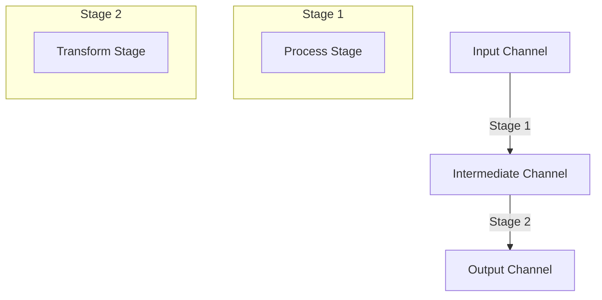

## 9.18. Pipeline Pattern for Data Processing

In the realm of data processing, the pipeline pattern is a powerful design approach that allows for the efficient handling of data through a series of processing stages. In Clojure, the `core.async` library provides robust support for implementing pipelines, enabling developers to process data concurrently and manage backpressure effectively. This section delves into the pipeline pattern, its advantages, and how to implement it using Clojure's `core.async`.

### Understanding the Pipeline Pattern

The pipeline pattern is a design pattern that processes data in stages, where each stage performs a specific transformation or operation on the data. This pattern is particularly useful in scenarios where data needs to be processed in a sequential yet concurrent manner, such as in ETL (Extract, Transform, Load) processes or real-time stream processing.

#### Advantages of the Pipeline Pattern

1. **Modularity**: Each stage of the pipeline can be developed and tested independently, promoting clean and maintainable code.
2. **Concurrency**: By leveraging Clojure's `core.async`, stages can run concurrently, improving throughput and performance.
3. **Scalability**: Pipelines can be easily scaled by adjusting the concurrency level of each stage.
4. **Backpressure Management**: The pattern naturally handles backpressure, ensuring that slower stages do not overwhelm faster ones.

### Implementing Pipelines with `core.async`

Clojure's `core.async` library provides a set of functions to create and manage pipelines. The `pipeline` and `pipeline-blocking` functions are central to this implementation, allowing for asynchronous and blocking operations, respectively.

#### Basic Pipeline Example

Let's start with a simple example to illustrate the basic structure of a pipeline using `core.async`.

```clojure
(ns pipeline-example
  (:require [clojure.core.async :refer [chan pipeline <!! >!! close!]]))

(defn process-stage [input]
  (* input 2))

(defn create-pipeline [input-channel output-channel]
  (pipeline 4 output-channel (map process-stage) input-channel))

(defn -main []
  (let [input-channel (chan 10)
        output-channel (chan 10)]
    (create-pipeline input-channel output-channel)
    (>!! input-channel 1)
    (>!! input-channel 2)
    (>!! input-channel 3)
    (close! input-channel)
    (println (<!! output-channel))
    (println (<!! output-channel))
    (println (<!! output-channel))))
```

In this example, we define a simple processing stage `process-stage` that doubles the input value. The `create-pipeline` function sets up a pipeline with a concurrency level of 4, meaning up to four items can be processed concurrently. The `-main` function demonstrates sending data through the pipeline and receiving the processed output.

### Managing Stages and Concurrency

When designing a pipeline, it's crucial to manage the stages and their concurrency levels effectively. Each stage can have its own concurrency level, which determines how many items it can process simultaneously.

#### Example: Multi-Stage Pipeline

Let's extend our previous example to include multiple stages.

```clojure
(defn transform-stage [input]
  (str "Transformed: " input))

(defn create-multi-stage-pipeline [input-channel output-channel]
  (let [intermediate-channel (chan 10)]
    (pipeline 4 intermediate-channel (map process-stage) input-channel)
    (pipeline 2 output-channel (map transform-stage) intermediate-channel)))

(defn -main []
  (let [input-channel (chan 10)
        output-channel (chan 10)]
    (create-multi-stage-pipeline input-channel output-channel)
    (>!! input-channel 1)
    (>!! input-channel 2)
    (>!! input-channel 3)
    (close! input-channel)
    (println (<!! output-channel))
    (println (<!! output-channel))
    (println (<!! output-channel))))
```

In this multi-stage pipeline, we introduce a `transform-stage` that converts the processed data into a string. The pipeline now consists of two stages, each with its own concurrency level. The first stage processes data with a concurrency of 4, while the second stage has a concurrency of 2.

### Handling Backpressure

Backpressure is a critical aspect of pipeline design, ensuring that slower stages do not become bottlenecks. In `core.async`, channels naturally handle backpressure by blocking when full, preventing data from being lost or overwhelming the system.

#### Example: Backpressure Management

Consider a scenario where the second stage is significantly slower than the first. We can adjust the buffer sizes and concurrency levels to manage backpressure effectively.

```clojure
(defn slow-transform-stage [input]
  (Thread/sleep 1000) ; Simulate a slow operation
  (str "Slowly Transformed: " input))

(defn create-backpressure-pipeline [input-channel output-channel]
  (let [intermediate-channel (chan 5)] ; Smaller buffer to manage backpressure
    (pipeline 4 intermediate-channel (map process-stage) input-channel)
    (pipeline 1 output-channel (map slow-transform-stage) intermediate-channel)))

(defn -main []
  (let [input-channel (chan 10)
        output-channel (chan 10)]
    (create-backpressure-pipeline input-channel output-channel)
    (dotimes [i 10]
      (>!! input-channel i))
    (close! input-channel)
    (dotimes [_ 10]
      (println (<!! output-channel)))))
```

In this example, the `slow-transform-stage` simulates a slow operation by introducing a delay. The intermediate channel has a smaller buffer size to manage backpressure, ensuring that the pipeline does not become overwhelmed.

### Scenarios for Using the Pipeline Pattern

The pipeline pattern is particularly useful in scenarios such as ETL processes and stream processing, where data needs to be processed in a sequential yet concurrent manner.

#### ETL Processes

In ETL processes, data is extracted from a source, transformed, and then loaded into a destination. The pipeline pattern allows each of these stages to be handled independently and concurrently, improving efficiency and scalability.

#### Stream Processing

For real-time stream processing, the pipeline pattern enables data to be processed as it arrives, with each stage handling a specific transformation or operation. This approach is ideal for applications that require low-latency processing, such as financial trading systems or real-time analytics.

### Best Practices for Designing Efficient Pipelines

1. **Define Clear Stage Boundaries**: Ensure each stage has a well-defined responsibility and interface.
2. **Optimize Concurrency Levels**: Adjust concurrency levels based on the complexity and resource requirements of each stage.
3. **Monitor and Adjust Buffer Sizes**: Use appropriate buffer sizes to manage backpressure and prevent data loss.
4. **Test for Performance**: Regularly test the pipeline under load to identify bottlenecks and optimize performance.
5. **Use Logging and Monitoring**: Implement logging and monitoring to track the flow of data and identify issues.

### Clojure Unique Features

Clojure's immutable data structures and functional programming paradigm make it particularly well-suited for implementing the pipeline pattern. The use of `core.async` provides a powerful abstraction for managing concurrency and backpressure, allowing developers to focus on the logic of each stage without worrying about low-level threading details.

### Differences and Similarities with Other Patterns

The pipeline pattern is often compared to the chain of responsibility pattern. While both involve processing data through a series of handlers, the pipeline pattern emphasizes concurrent processing and backpressure management, making it more suitable for high-throughput data processing scenarios.

### Try It Yourself

To gain a deeper understanding of the pipeline pattern, try modifying the code examples provided. Experiment with different concurrency levels, buffer sizes, and processing stages to see how they affect the performance and behavior of the pipeline.

### Visualizing the Pipeline Pattern

Below is a diagram illustrating the flow of data through a multi-stage pipeline, highlighting the concurrency and backpressure management aspects.



This diagram shows how data flows from the input channel through two stages, each with its own concurrency level, before reaching the output channel. The intermediate channel acts as a buffer, managing backpressure between the stages.

### Ready to Test Your Knowledge?



### What is the primary advantage of using the pipeline pattern in data processing?

- [x] Modularity and concurrency
- [ ] Simplicity and ease of use
- [ ] Low memory usage
- [ ] High latency

> **Explanation:** The pipeline pattern provides modularity and concurrency, allowing stages to be developed independently and processed concurrently.

### Which Clojure library is commonly used to implement pipelines?

- [x] core.async
- [ ] clojure.set
- [ ] clojure.java.io
- [ ] clojure.string

> **Explanation:** The `core.async` library is used to implement pipelines in Clojure, providing functions for managing concurrency and backpressure.

### How does `core.async` handle backpressure in pipelines?

- [x] By blocking when channels are full
- [ ] By dropping data
- [ ] By duplicating data
- [ ] By increasing buffer sizes automatically

> **Explanation:** `core.async` handles backpressure by blocking when channels are full, preventing data from being lost or overwhelming the system.

### What is a common use case for the pipeline pattern?

- [x] ETL processes
- [ ] File I/O operations
- [ ] GUI rendering
- [ ] Static website generation

> **Explanation:** The pipeline pattern is commonly used in ETL processes, where data is extracted, transformed, and loaded in stages.

### Which function is used to create a pipeline in `core.async`?

- [x] pipeline
- [ ] map
- [ ] filter
- [ ] reduce

> **Explanation:** The `pipeline` function in `core.async` is used to create pipelines for concurrent data processing.

### What is the role of buffer sizes in a pipeline?

- [x] To manage backpressure
- [ ] To increase data throughput
- [ ] To reduce memory usage
- [ ] To simplify code

> **Explanation:** Buffer sizes in a pipeline help manage backpressure by controlling the flow of data between stages.

### How can you optimize a pipeline for performance?

- [x] Adjust concurrency levels and buffer sizes
- [ ] Use global variables
- [ ] Minimize function calls
- [ ] Avoid using channels

> **Explanation:** Optimizing a pipeline involves adjusting concurrency levels and buffer sizes to balance resource usage and performance.

### What is a key difference between the pipeline pattern and the chain of responsibility pattern?

- [x] The pipeline pattern emphasizes concurrency
- [ ] The chain of responsibility pattern is more modular
- [ ] The pipeline pattern is simpler to implement
- [ ] The chain of responsibility pattern handles errors better

> **Explanation:** The pipeline pattern emphasizes concurrency and backpressure management, making it suitable for high-throughput scenarios.

### True or False: The pipeline pattern can only be used for batch processing.

- [ ] True
- [x] False

> **Explanation:** The pipeline pattern can be used for both batch and real-time stream processing, making it versatile for various data processing scenarios.

### Which of the following is a best practice for designing efficient pipelines?

- [x] Define clear stage boundaries
- [ ] Use a single channel for all stages
- [ ] Avoid using concurrency
- [ ] Minimize logging

> **Explanation:** Defining clear stage boundaries ensures each stage has a well-defined responsibility, promoting modularity and maintainability.



Remember, this is just the beginning. As you progress, you'll build more complex and interactive pipelines. Keep experimenting, stay curious, and enjoy the journey!
