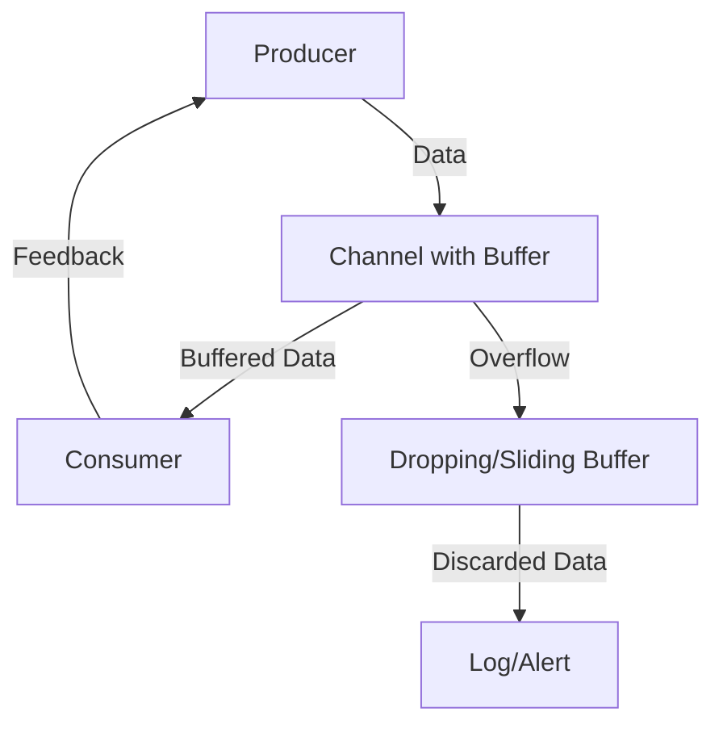

## 9.19. Handling Backpressure in Async Systems

In the world of asynchronous programming, managing the flow of data between producers and consumers is crucial to maintaining system stability and performance. This is where the concept of backpressure comes into play. In this section, we will explore what backpressure is, why it occurs, and how to handle it effectively in Clojure using `core.async`. We will delve into various strategies, including blocking, buffering, and patterns like the leaky bucket and token bucket, to design systems resilient to overload.

### Understanding Backpressure

**Backpressure** is a mechanism for controlling the flow of data between producers and consumers in a system. It occurs when the rate of data production exceeds the rate of data consumption, leading to potential resource exhaustion and system instability. In asynchronous systems, where operations are non-blocking and can occur concurrently, managing backpressure is essential to prevent bottlenecks and ensure smooth data flow.

#### Why Backpressure Occurs

Backpressure typically arises in scenarios where:

- **Producers generate data faster than consumers can process it**: This can lead to queues filling up, memory exhaustion, and ultimately, system crashes.
- **Network latency or slow I/O operations**: These can delay data processing, causing a backlog.
- **Resource constraints**: Limited CPU, memory, or bandwidth can hinder the system's ability to handle high data volumes.

### Core.Async and Backpressure

Clojure's `core.async` library provides powerful tools for managing concurrency and asynchronous operations. It supports backpressure through mechanisms like blocking and buffering, allowing developers to control data flow effectively.

#### Blocking and Buffering

In `core.async`, channels are the primary means of communication between concurrent processes. Channels can be configured with different types of buffers to manage backpressure:

- **Unbuffered Channels**: These channels block the producer if the consumer is not ready to receive data, effectively implementing backpressure by pausing data production until the consumer catches up.

```clojure
(require '[clojure.core.async :refer [chan go <! >!]])

(let [c (chan)] ; Unbuffered channel
  (go
    (>! c "Hello")) ; Producer blocks until consumer is ready
  (go
    (println (<! c)))) ; Consumer receives data
```

- **Buffered Channels**: These channels allow a specified number of items to be queued, providing a temporary buffer that can absorb bursts of data without blocking the producer immediately.

```clojure
(let [c (chan 10)] ; Buffered channel with capacity 10
  (go
    (dotimes [i 15]
      (>! c i)
      (println "Produced" i)))
  (go
    (dotimes [i 15]
      (println "Consumed" (<! c)))))
```

- **Dropping and Sliding Buffers**: These specialized buffers handle overflow differently. Dropping buffers discard new data when full, while sliding buffers remove the oldest data to make room for new entries.

```clojure
(require '[clojure.core.async :refer [dropping-buffer sliding-buffer]])

(let [c (chan (dropping-buffer 5))] ; Dropping buffer
  (go
    (dotimes [i 10]
      (>! c i)
      (println "Produced" i)))
  (go
    (dotimes [i 5]
      (println "Consumed" (<! c)))))
```

### Handling Producer-Consumer Scenarios

In producer-consumer scenarios, backpressure can be managed by carefully designing the interaction between producers and consumers. Here are some strategies:

#### Rate Limiting

Implement rate limiting to control the speed at which producers generate data. This can be achieved using timers or delays in `core.async`.

```clojure
(require '[clojure.core.async :refer [timeout]])

(let [c (chan)]
  (go
    (dotimes [i 10]
      (<! (timeout 1000)) ; Delay production by 1 second
      (>! c i)
      (println "Produced" i)))
  (go
    (dotimes [i 10]
      (println "Consumed" (<! c)))))
```

#### Dynamic Buffer Sizing

Adjust buffer sizes dynamically based on system load or consumer speed. This requires monitoring system performance and adapting buffer capacities accordingly.

#### Feedback Loops

Implement feedback loops where consumers can signal producers to slow down or pause production when overwhelmed. This can be done using additional channels for communication.

```clojure
(let [c (chan)
      feedback (chan)]
  (go
    (dotimes [i 10]
      (when (<! feedback) ; Wait for feedback before producing
        (>! c i)
        (println "Produced" i))))
  (go
    (dotimes [i 10]
      (println "Consumed" (<! c))
      (>! feedback true)))) ; Send feedback to producer
```

### Patterns for Managing Backpressure

Several patterns can be employed to manage backpressure effectively:

#### Leaky Bucket Pattern

The leaky bucket pattern smooths out bursts of data by allowing data to "leak" at a constant rate. This is akin to a bucket with a hole at the bottom, where water (data) is added at varying rates but leaks out steadily.

```clojure
(let [c (chan 10)]
  (go
    (dotimes [i 20]
      (>! c i)
      (println "Produced" i)))
  (go
    (while true
      (<! (timeout 500)) ; Leak data at a steady rate
      (println "Consumed" (<! c)))))
```

#### Token Bucket Pattern

The token bucket pattern allows bursts of data up to a certain limit, controlled by tokens. Tokens are replenished at a steady rate, and data can only be produced if tokens are available.

```clojure
(defn token-bucket [rate capacity]
  (let [tokens (atom capacity)]
    (fn []
      (when (pos? @tokens)
        (swap! tokens dec)
        true))))

(let [c (chan)
      bucket (token-bucket 1 5)] ; 1 token per second, capacity 5
  (go
    (dotimes [i 10]
      (when (bucket)
        (>! c i)
        (println "Produced" i))
      (<! (timeout 1000)))) ; Replenish tokens every second
  (go
    (dotimes [i 10]
      (println "Consumed" (<! c)))))
```

### Designing Resilient Systems

To design systems resilient to overload, consider the following guidelines:

- **Monitor System Performance**: Continuously monitor system metrics to detect bottlenecks and adjust configurations dynamically.
- **Implement Graceful Degradation**: Design systems to degrade gracefully under load, prioritizing critical operations and shedding non-essential tasks.
- **Use Circuit Breakers**: Implement circuit breakers to prevent cascading failures by temporarily halting operations when a subsystem is overloaded.
- **Optimize Resource Utilization**: Ensure efficient use of CPU, memory, and I/O resources to handle varying loads effectively.
- **Test Under Load**: Conduct stress testing to identify potential weaknesses and optimize system performance under high load conditions.

### Visualizing Backpressure Management

Below is a diagram illustrating the flow of data in a producer-consumer system with backpressure management using `core.async`.



**Diagram Description**: This diagram shows a producer sending data to a buffered channel. The consumer processes data from the channel and provides feedback to the producer. Overflow data is handled by a dropping or sliding buffer, with discarded data logged or alerted.

### Try It Yourself

Experiment with the provided code examples by modifying buffer sizes, delay intervals, or feedback mechanisms. Observe how these changes affect the system's ability to handle backpressure.

### References and Further Reading

- [Clojure Core.Async Documentation](https://clojure.github.io/core.async/)
- [Reactive Streams Specification](https://www.reactive-streams.org/)
- [Backpressure in Reactive Systems](https://www.reactivemanifesto.org/glossary#Back-Pressure)

### Knowledge Check

To reinforce your understanding of handling backpressure in async systems, try answering the following questions.

## **Ready to Test Your Knowledge?**



### What is backpressure in asynchronous systems?

- [x] A mechanism for controlling data flow between producers and consumers
- [ ] A method for increasing data production rates
- [ ] A technique for reducing memory usage
- [ ] A strategy for optimizing CPU utilization

> **Explanation:** Backpressure is a mechanism for controlling the flow of data between producers and consumers to prevent resource exhaustion.

### How does `core.async` support backpressure?

- [x] Through blocking and buffering mechanisms
- [ ] By increasing consumer speed
- [ ] By reducing producer output
- [ ] By optimizing memory usage

> **Explanation:** `core.async` supports backpressure through blocking and buffering mechanisms that manage data flow.

### What is the purpose of a dropping buffer in `core.async`?

- [x] To discard new data when the buffer is full
- [ ] To remove the oldest data to make room for new entries
- [ ] To increase buffer capacity dynamically
- [ ] To prioritize critical data

> **Explanation:** A dropping buffer discards new data when the buffer is full, preventing overflow.

### Which pattern allows data to "leak" at a constant rate?

- [x] Leaky Bucket Pattern
- [ ] Token Bucket Pattern
- [ ] Circuit Breaker Pattern
- [ ] Rate Limiting Pattern

> **Explanation:** The leaky bucket pattern allows data to "leak" at a constant rate, smoothing out bursts.

### What is the function of tokens in the token bucket pattern?

- [x] To control data production based on available tokens
- [ ] To increase consumer processing speed
- [ ] To dynamically adjust buffer sizes
- [ ] To prioritize critical operations

> **Explanation:** Tokens in the token bucket pattern control data production, allowing bursts up to a certain limit.

### How can feedback loops help manage backpressure?

- [x] By allowing consumers to signal producers to slow down
- [ ] By increasing buffer sizes dynamically
- [ ] By optimizing resource utilization
- [ ] By reducing data production rates

> **Explanation:** Feedback loops allow consumers to signal producers to slow down or pause production when overwhelmed.

### What is a key guideline for designing systems resilient to overload?

- [x] Implement graceful degradation
- [ ] Increase buffer sizes indefinitely
- [ ] Prioritize non-essential tasks
- [ ] Reduce monitoring efforts

> **Explanation:** Implementing graceful degradation helps systems maintain functionality under load by prioritizing critical operations.

### What is the role of circuit breakers in managing backpressure?

- [x] To prevent cascading failures by halting operations when overloaded
- [ ] To increase data production rates
- [ ] To reduce memory usage
- [ ] To optimize CPU utilization

> **Explanation:** Circuit breakers prevent cascading failures by temporarily halting operations when a subsystem is overloaded.

### Which of the following is a strategy for handling producer-consumer scenarios?

- [x] Rate Limiting
- [ ] Increasing buffer sizes
- [ ] Reducing consumer speed
- [ ] Optimizing memory usage

> **Explanation:** Rate limiting controls the speed at which producers generate data, helping manage backpressure.

### True or False: Backpressure is only relevant in synchronous systems.

- [ ] True
- [x] False

> **Explanation:** Backpressure is particularly relevant in asynchronous systems where operations are non-blocking and can occur concurrently.



Remember, managing backpressure is crucial for building robust and efficient asynchronous systems. Keep experimenting, stay curious, and enjoy the journey of mastering Clojure's concurrency capabilities!
