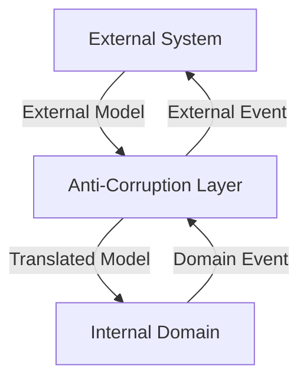

## 9.2.1 Integration Within DDD Framework in Clojure

In the realm of software architecture, Domain-Driven Design (DDD) offers a robust framework for managing complex systems by focusing on the core domain and its logic. One of the critical components of DDD is the Anti-Corruption Layer (ACL), which acts as a protective barrier between different bounded contexts, ensuring that the integrity of domain models is maintained. In this article, we will explore how to implement the ACL within the DDD framework using Clojure, leveraging its functional programming paradigms to maintain clean and decoupled code.

### Introduction to Anti-Corruption Layer in DDD

The Anti-Corruption Layer is a design pattern that prevents the corruption of a domain model by external systems. It acts as a translator or adapter between different bounded contexts, ensuring that changes in one context do not adversely affect another. This is particularly important in systems where multiple contexts interact with each other or with external services.

#### Key Objectives of the ACL:
- **Maintain Independence:** Ensure that bounded contexts remain independent and do not leak domain models across boundaries.
- **Prevent Coupling:** Avoid direct coupling of domain models across different contexts.
- **Facilitate Translation:** Translate commands and events between contexts to maintain consistency and integrity.

### Implementing ACL in Clojure

Clojure, with its emphasis on immutability and functional programming, provides an excellent platform for implementing the ACL pattern. By using namespaces and clear module boundaries, we can effectively separate domain models and manage interactions between contexts.

#### Defining Bounded Contexts

In Clojure, bounded contexts can be represented using separate namespaces. This separation ensures that each context has its own domain model and logic, preventing unintended dependencies.

```clojure
;; Internal domain
(ns myapp.domain.user)

(defrecord User [id name email])

(defn create-user [id name email]
  (->User id name email))

;; External service models
(ns myapp.external.user-service)

(defrecord ExternalUser [userId fullName emailAddress])

(defn fetch-user [user-id]
  ;; Simulate fetching user from an external service
  (->ExternalUser user-id "John Doe" "john.doe@example.com"))
```

#### Implementing an ACL Between Contexts

The ACL acts as a mediator between the internal domain and external services. It translates data and commands, ensuring that the internal domain remains unaffected by changes in external systems.

```clojure
(ns myapp.acl.user
  (:require [myapp.domain.user :as domain]
            [myapp.external.user-service :as external]))

(defn external->internal [external-user]
  (domain/create-user (:userId external-user)
                      (:fullName external-user)
                      (:emailAddress external-user)))

(defn get-user [user-id]
  (let [external-user (external/fetch-user user-id)]
    (external->internal external-user)))
```

### Ensuring Domain Models Are Not Leaked

A crucial aspect of the ACL is to ensure that domain models are not leaked across contexts. This means that external models should not be used directly within the domain logic. Instead, they should be translated into internal models through the ACL.

#### Translate Commands and Events

The ACL is responsible for translating commands and events between contexts. This involves mapping external events to domain events and vice versa, ensuring that each context operates independently.

```clojure
(defn handle-external-event [external-event]
  ;; Translate external event to domain event
  (let [domain-event (translate-event external-event)]
    (process-domain-event domain-event)))

(defn translate-event [external-event]
  ;; Logic to translate external event to domain event
  )

(defn process-domain-event [domain-event]
  ;; Logic to handle domain event
  )
```

### Visualizing the Anti-Corruption Layer

To better understand the role of the ACL, let's visualize how it fits within the DDD framework using a conceptual diagram.



### Advantages and Disadvantages

#### Advantages:
- **Decoupling:** The ACL ensures that bounded contexts remain decoupled, reducing the risk of unintended dependencies.
- **Flexibility:** Changes in external systems do not directly impact the internal domain, providing flexibility in adapting to external changes.
- **Consistency:** By translating commands and events, the ACL maintains consistency across contexts.

#### Disadvantages:
- **Complexity:** Implementing an ACL can introduce additional complexity, as it requires careful management of translations and interactions.
- **Performance Overhead:** The translation process may introduce performance overhead, especially in systems with high interaction volumes.

### Best Practices for Implementing ACL in Clojure

- **Use Namespaces Effectively:** Leverage Clojure's namespace system to clearly define and separate bounded contexts.
- **Focus on Immutability:** Utilize Clojure's immutable data structures to ensure that domain models remain consistent and unaffected by external changes.
- **Leverage Functional Programming:** Use pure functions to handle translations and interactions, minimizing side effects and enhancing testability.

### Conclusion

The Anti-Corruption Layer is a vital component of the Domain-Driven Design framework, ensuring that bounded contexts remain independent and domain models are protected from external influences. By leveraging Clojure's functional programming paradigms, we can implement the ACL effectively, maintaining clean and decoupled code. As you explore the integration of DDD patterns in Clojure, consider the ACL as a powerful tool for managing complex interactions and preserving domain integrity.

## Quiz Time!



### What is the primary purpose of the Anti-Corruption Layer (ACL) in DDD?

- [x] To prevent the corruption of a domain model by external systems
- [ ] To enhance the performance of the system
- [ ] To simplify the user interface
- [ ] To increase the coupling between different contexts

> **Explanation:** The ACL acts as a protective barrier to prevent the corruption of a domain model by external systems.

### How does Clojure help in implementing the ACL pattern?

- [x] By using namespaces and clear module boundaries
- [ ] By using mutable state extensively
- [ ] By relying on object-oriented programming
- [ ] By avoiding the use of functions

> **Explanation:** Clojure's namespaces and functional programming paradigms help in maintaining separation and immutability.

### What is a bounded context in DDD?

- [x] A boundary within which a particular domain model is defined and used
- [ ] A global context that applies to the entire application
- [ ] A context that is shared across all systems
- [ ] A context that is not related to domain models

> **Explanation:** A bounded context is a boundary within which a particular domain model is defined and used.

### Why is it important to ensure domain models are not leaked across contexts?

- [x] To maintain independence and prevent unintended dependencies
- [ ] To increase the complexity of the system
- [ ] To ensure all contexts are tightly coupled
- [ ] To allow external systems to modify domain models directly

> **Explanation:** Ensuring domain models are not leaked helps maintain independence and prevents unintended dependencies.

### What role does the ACL play in translating commands and events?

- [x] It maps external events to domain events and vice versa
- [ ] It directly modifies the domain model
- [ ] It simplifies the user interface
- [ ] It increases the coupling between contexts

> **Explanation:** The ACL translates commands and events to maintain consistency and independence across contexts.

### Which of the following is a disadvantage of implementing an ACL?

- [x] It can introduce additional complexity
- [ ] It simplifies the system architecture
- [ ] It reduces the need for translations
- [ ] It eliminates the need for bounded contexts

> **Explanation:** Implementing an ACL can introduce additional complexity due to the need for careful management of translations and interactions.

### How can Clojure's immutability benefit the implementation of an ACL?

- [x] By ensuring domain models remain consistent and unaffected by external changes
- [ ] By allowing direct modification of domain models
- [ ] By increasing the coupling between contexts
- [ ] By relying on mutable state

> **Explanation:** Clojure's immutability ensures that domain models remain consistent and unaffected by external changes.

### What is a key advantage of using the ACL pattern?

- [x] It ensures that bounded contexts remain decoupled
- [ ] It increases the complexity of the system
- [ ] It allows external systems to directly modify domain models
- [ ] It eliminates the need for namespaces

> **Explanation:** The ACL pattern ensures that bounded contexts remain decoupled, reducing the risk of unintended dependencies.

### In the provided Clojure code example, what is the purpose of the `external->internal` function?

- [x] To translate an external user model to an internal user model
- [ ] To fetch a user from the external service
- [ ] To directly modify the internal user model
- [ ] To increase the coupling between contexts

> **Explanation:** The `external->internal` function translates an external user model to an internal user model.

### True or False: The ACL pattern is only applicable in object-oriented programming languages.

- [ ] True
- [x] False

> **Explanation:** The ACL pattern is applicable in various programming paradigms, including functional programming languages like Clojure.


