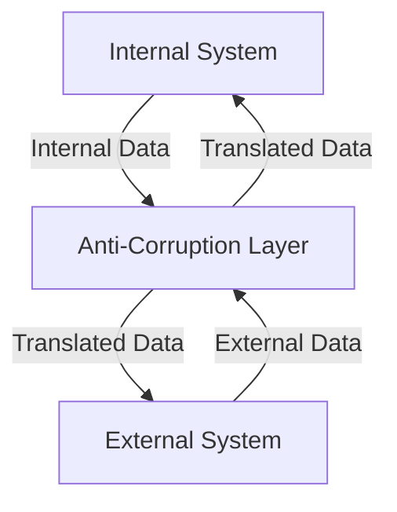

## 9.2 Anti-Corruption Layer in Clojure

In the world of software development, integrating with external systems is often necessary but can introduce complexities and risks to your domain model. The Anti-Corruption Layer (ACL) design pattern provides a strategic solution to these challenges by acting as a protective buffer between your system and external systems. This pattern ensures that your domain model remains pure and unaffected by external influences, preserving its integrity and consistency.

### Introduction

The Anti-Corruption Layer is a design pattern that serves as a boundary between different systems, translating or mapping concepts and models from one system to another. This pattern is particularly useful when integrating with legacy systems or third-party services that have different data structures, terminologies, or business logic.

### Detailed Explanation

#### Purpose and Relevance

The primary purpose of the ACL is to prevent the external system's models from leaking into your domain model. By doing so, it maintains the integrity of your domain and ensures that your system's core logic remains consistent and unaffected by external changes.

**Key Benefits:**
- **Domain Integrity:** Keeps your domain model clean and consistent.
- **Flexibility:** Allows for easier adaptation to changes in external systems.
- **Decoupling:** Reduces the dependency on external systems, making your system more robust and maintainable.

#### Components and Workflow

The ACL pattern involves several key components and steps:

1. **Identify Differences Between External and Internal Models:**
   - Map out discrepancies in data structures and business logic between your system and the external system.

2. **Create Translation Functions:**
   - Implement functions to translate data between external and internal representations.

3. **Implement the ACL Interface:**
   - Encapsulate all interactions with the external system within the ACL.

4. **Use Protocols or Multimethods for Flexibility:**
   - Leverage Clojure's protocols or multimethods to provide flexible and extensible translation mechanisms.

5. **Integrate the ACL with Your Application:**
   - Ensure that all data exchange with the external system goes through the ACL.

### Visual Aids

#### Conceptual Diagram

Below is a conceptual diagram illustrating the role of the Anti-Corruption Layer in a system architecture:



### Code Examples

Let's explore how to implement the Anti-Corruption Layer in Clojure using translation functions, protocols, and records.

#### Translation Functions

Translation functions are responsible for converting data between external and internal representations.

```clojure
(defn external->internal [external-entity]
  ;; Transform external entity to internal representation
  {:id (:external-id external-entity)
   :name (:external-name external-entity)
   :value (:external-value external-entity)})

(defn internal->external [internal-entity]
  ;; Transform internal entity to external representation
  {:external-id (:id internal-entity)
   :external-name (:name internal-entity)
   :external-value (:value internal-entity)})
```

#### Implementing the ACL Interface

The ACL interface encapsulates all interactions with the external system.

```clojure
(defn fetch-external-data [params]
  (let [external-response (call-external-api params)]
    (external->internal external-response)))

(defn send-internal-data [internal-data]
  (let [external-data (internal->external internal-data)]
    (call-external-api external-data)))
```

#### Using Protocols for Flexibility

Protocols provide a flexible way to define translation behavior.

```clojure
(defprotocol DataTranslator
  (to-internal [this external-data])
  (to-external [this internal-data]))

(defrecord Translator []
  DataTranslator
  (to-internal [this external-data] (external->internal external-data))
  (to-external [this internal-data] (internal->external internal-data)))

(def translator (->Translator))
```

#### Integrating the ACL with Your Application

Finally, integrate the ACL into your application to handle data processing.

```clojure
(defn process-data [params]
  (let [internal-data (fetch-external-data params)]
    ;; Work with internal-data
    ))
```

### Use Cases

The Anti-Corruption Layer is applicable in various scenarios, such as:

- **Integrating with Legacy Systems:** When dealing with outdated systems that have different data models.
- **Third-Party Services:** When consuming APIs from external vendors that may change over time.
- **Microservices Communication:** When different microservices have distinct domain models.

### Advantages and Disadvantages

**Advantages:**
- **Preserves Domain Integrity:** Keeps your domain model clean and unaffected by external changes.
- **Enhances Flexibility:** Allows for easier adaptation to changes in external systems.
- **Reduces Coupling:** Minimizes dependencies on external systems.

**Disadvantages:**
- **Increased Complexity:** Adds an additional layer of abstraction, which can increase complexity.
- **Performance Overhead:** May introduce performance overhead due to data translation.

### Best Practices

- **Encapsulate External Interactions:** Keep all interactions with external systems within the ACL to avoid contamination.
- **Use Protocols for Flexibility:** Leverage Clojure's protocols to provide flexible and extensible translation mechanisms.
- **Maintain Clear Boundaries:** Clearly define the boundaries between your domain model and external systems.

### Comparisons

Compared to other integration patterns, the Anti-Corruption Layer focuses specifically on maintaining domain integrity by translating data and concepts. It is particularly useful when the external system's model is significantly different from your domain model.

### Conclusion

The Anti-Corruption Layer is a powerful design pattern that helps maintain the integrity of your domain model when integrating with external systems. By translating data and concepts, it ensures that your system remains robust, flexible, and maintainable.

## Quiz Time!



### What is the primary purpose of the Anti-Corruption Layer?

- [x] To prevent external system models from leaking into your domain model
- [ ] To enhance performance by caching external data
- [ ] To simplify the user interface
- [ ] To manage database transactions

> **Explanation:** The Anti-Corruption Layer acts as a buffer to prevent external models from affecting your domain model, preserving its integrity.

### Which Clojure feature is recommended for implementing flexible translation mechanisms in an ACL?

- [x] Protocols
- [ ] Atoms
- [ ] Refs
- [ ] Futures

> **Explanation:** Protocols provide a flexible way to define and implement translation behavior in Clojure.

### What is a disadvantage of using the Anti-Corruption Layer?

- [x] Increased complexity
- [ ] Reduced domain integrity
- [ ] Decreased flexibility
- [ ] Higher coupling with external systems

> **Explanation:** The ACL adds an additional layer of abstraction, which can increase the complexity of the system.

### Which of the following is a key benefit of the Anti-Corruption Layer?

- [x] Domain integrity
- [ ] Faster data processing
- [ ] Simplified user interface
- [ ] Direct access to external systems

> **Explanation:** The ACL helps maintain the integrity of the domain model by preventing external influences.

### How does the Anti-Corruption Layer affect system flexibility?

- [x] It enhances flexibility by allowing easier adaptation to changes in external systems.
- [ ] It reduces flexibility by tightly coupling with external systems.
- [ ] It has no impact on system flexibility.
- [ ] It complicates the system, reducing flexibility.

> **Explanation:** The ACL enhances flexibility by providing a buffer that allows for easier adaptation to changes in external systems.

### What is the role of translation functions in the ACL?

- [x] To convert data between external and internal representations
- [ ] To manage database transactions
- [ ] To handle user authentication
- [ ] To optimize performance

> **Explanation:** Translation functions are responsible for converting data between external and internal representations in the ACL.

### Which of the following is NOT a component of the Anti-Corruption Layer?

- [x] User interface components
- [ ] Translation functions
- [ ] Protocols or multimethods
- [ ] Encapsulation of external interactions

> **Explanation:** The user interface is not a component of the ACL, which focuses on data translation and encapsulation.

### What is a common use case for the Anti-Corruption Layer?

- [x] Integrating with legacy systems
- [ ] Enhancing user interface design
- [ ] Managing database schemas
- [ ] Optimizing algorithm performance

> **Explanation:** The ACL is commonly used when integrating with legacy systems that have different data models.

### How does the ACL reduce coupling with external systems?

- [x] By encapsulating all interactions within the ACL
- [ ] By directly accessing external APIs
- [ ] By storing external data in the domain model
- [ ] By simplifying the user interface

> **Explanation:** The ACL reduces coupling by encapsulating all interactions with external systems, preventing direct dependencies.

### True or False: The Anti-Corruption Layer can introduce performance overhead due to data translation.

- [x] True
- [ ] False

> **Explanation:** The ACL may introduce performance overhead due to the additional data translation processes involved.


