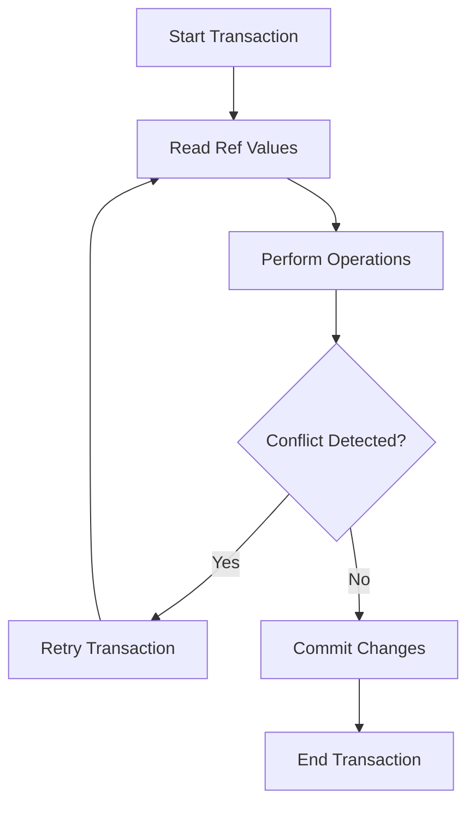

## 9.2. Software Transactional Memory (STM) with Refs

Concurrency is a fundamental aspect of modern software development, especially in a world where applications are expected to handle multiple tasks simultaneously. Clojure, a functional programming language that runs on the Java Virtual Machine (JVM), offers a unique approach to managing concurrency through its Software Transactional Memory (STM) system. In this section, we will delve into the concept of STM, explore how Refs are used to manage shared, mutable state, and provide practical examples and best practices for using STM in Clojure.

### Understanding Software Transactional Memory (STM)

Software Transactional Memory (STM) is a concurrency control mechanism analogous to database transactions for controlling access to shared memory in concurrent computing. STM allows multiple threads to execute transactions on shared memory, ensuring that all operations within a transaction are atomic, consistent, and isolated. This means that transactions appear to execute sequentially, even though they may be executed concurrently.

#### Advantages of STM

1. **Atomicity**: STM ensures that a series of operations within a transaction are completed as a single unit. If any operation fails, the entire transaction is rolled back, maintaining system consistency.

2. **Consistency**: STM maintains data consistency by ensuring that transactions only commit if they do not violate any constraints.

3. **Isolation**: Transactions are isolated from each other, meaning that intermediate states are not visible to other transactions.

4. **Ease of Use**: STM abstracts the complexity of locks and other low-level concurrency mechanisms, making it easier for developers to write concurrent code.

5. **Composability**: STM transactions can be composed, allowing complex operations to be built from simpler ones.

### Refs in Clojure

In Clojure, Refs are used to manage shared, mutable state in a concurrent environment. Refs provide a way to coordinate changes to multiple pieces of state, ensuring that updates are consistent and atomic.

#### How Refs Work

Refs are part of Clojure's STM system and are designed to be used within transactions. A Ref holds a mutable reference to a value, and changes to the value are made within a transaction using the `dosync` macro. The STM system ensures that all changes within a transaction are applied atomically.

Here's a simple example of using Refs in Clojure:

```clojure
(def account-balance (ref 1000))

(defn deposit [amount]
  (dosync
    (alter account-balance + amount)))

(defn withdraw [amount]
  (dosync
    (alter account-balance - amount)))

(deposit 500)
(withdraw 200)

(println @account-balance) ; Output: 1300
```

In this example, `account-balance` is a Ref that holds the balance of an account. The `deposit` and `withdraw` functions modify the balance within a `dosync` transaction, ensuring that the operations are atomic and consistent.

### Using `dosync` Transactions with Refs

The `dosync` macro is used to create a transaction in Clojure. All operations on Refs within a `dosync` block are part of a single transaction. If any operation fails, the transaction is retried until it succeeds.

Here's a more complex example that demonstrates using multiple Refs within a transaction:

```clojure
(def account-a (ref 1000))
(def account-b (ref 2000))

(defn transfer [from-account to-account amount]
  (dosync
    (alter from-account - amount)
    (alter to-account + amount)))

(transfer account-a account-b 300)

(println @account-a) ; Output: 700
(println @account-b) ; Output: 2300
```

In this example, we have two accounts, `account-a` and `account-b`, each represented by a Ref. The `transfer` function moves money from one account to another within a `dosync` transaction, ensuring that the transfer is atomic and consistent.

### Scenarios Where STM is Appropriate

STM is particularly useful in scenarios where multiple threads need to coordinate updates to shared state. Some common use cases include:

- **Financial Transactions**: Ensuring that debits and credits are applied atomically.
- **Inventory Management**: Coordinating updates to stock levels across multiple threads.
- **Gaming**: Managing the state of a game world where multiple players interact concurrently.

### Best Practices and Potential Pitfalls

#### Best Practices

1. **Keep Transactions Short**: Long transactions can lead to contention and reduce performance. Keep transactions as short as possible to minimize conflicts.

2. **Minimize Side Effects**: Avoid performing side effects (e.g., I/O operations) within transactions, as they can lead to inconsistent states if the transaction is retried.

3. **Use Refs for Coordinated State**: Use Refs when you need to coordinate changes to multiple pieces of state. For independent state, consider using Atoms or Agents.

4. **Monitor Performance**: Use tools to monitor the performance of your STM system and identify bottlenecks.

#### Potential Pitfalls

1. **Contention**: High contention on Refs can lead to performance issues. Consider redesigning your system to reduce contention.

2. **Starvation**: In rare cases, transactions may be starved if they are repeatedly retried. Monitor your system for signs of starvation.

3. **Complexity**: While STM simplifies concurrency, it can still be complex to reason about. Ensure that your team is familiar with the concepts and best practices.

### Visualizing STM with Refs

To better understand how STM with Refs works, let's visualize the process using a flowchart.



**Figure 1**: This flowchart illustrates the process of a transaction in Clojure's STM system. The transaction reads the current values of Refs, performs operations, checks for conflicts, and either retries or commits the changes.

### Try It Yourself

Experiment with the code examples provided in this section. Try modifying the `transfer` function to handle different scenarios, such as transferring money between multiple accounts or handling insufficient funds. Observe how the STM system handles these changes and ensures consistency.

### References and Links

- [Clojure Official Documentation](https://clojure.org/reference/refs)
- [Software Transactional Memory on Wikipedia](https://en.wikipedia.org/wiki/Software_transactional_memory)
- [Concurrency in Clojure by Rich Hickey](https://www.infoq.com/presentations/Value-Identity-State-Rich-Hickey/)

### Knowledge Check

To reinforce your understanding of STM with Refs in Clojure, try answering the following questions.

## **Ready to Test Your Knowledge?**



### What is the primary advantage of using STM in Clojure?

- [x] Ensures atomicity, consistency, and isolation of transactions
- [ ] Simplifies syntax for concurrent programming
- [ ] Increases execution speed of concurrent programs
- [ ] Provides a graphical interface for managing transactions

> **Explanation:** STM ensures that transactions are atomic, consistent, and isolated, which is crucial for maintaining data integrity in concurrent environments.

### How are changes to Refs made in Clojure?

- [x] Using the `dosync` macro
- [ ] Directly modifying the Ref value
- [ ] Using the `def` keyword
- [ ] Through the `let` binding

> **Explanation:** Changes to Refs are made within a `dosync` transaction, ensuring atomicity and consistency.

### What happens if a transaction fails in Clojure's STM?

- [x] The transaction is retried
- [ ] The transaction is aborted
- [ ] The transaction is partially committed
- [ ] The transaction is logged for review

> **Explanation:** If a transaction fails, it is automatically retried until it succeeds, ensuring consistency.

### Which of the following is a potential pitfall of using STM?

- [x] High contention on Refs
- [ ] Increased memory usage
- [ ] Lack of atomicity
- [ ] Difficulty in debugging

> **Explanation:** High contention on Refs can lead to performance issues, as transactions may be retried frequently.

### In what scenarios is STM particularly useful?

- [x] Financial transactions and inventory management
- [ ] Single-threaded applications
- [ ] Applications without shared state
- [ ] Simple data processing tasks

> **Explanation:** STM is useful in scenarios where multiple threads need to coordinate updates to shared state, such as financial transactions and inventory management.

### What is the role of the `alter` function in STM?

- [x] It updates the value of a Ref within a transaction
- [ ] It creates a new Ref
- [ ] It deletes a Ref
- [ ] It reads the value of a Ref

> **Explanation:** The `alter` function is used to update the value of a Ref within a transaction, ensuring atomicity.

### Why should side effects be minimized within transactions?

- [x] They can lead to inconsistent states if the transaction is retried
- [ ] They increase the complexity of the transaction
- [ ] They are not allowed in Clojure
- [ ] They slow down the transaction

> **Explanation:** Side effects can lead to inconsistent states if a transaction is retried, so they should be minimized within transactions.

### What is a common best practice when using STM?

- [x] Keep transactions short
- [ ] Use Refs for all state management
- [ ] Avoid using `dosync`
- [ ] Perform I/O operations within transactions

> **Explanation:** Keeping transactions short minimizes contention and improves performance.

### True or False: STM transactions in Clojure can be composed.

- [x] True
- [ ] False

> **Explanation:** STM transactions can be composed, allowing complex operations to be built from simpler ones.

### What is a Ref in Clojure?

- [x] A mutable reference to a value used within STM
- [ ] A function for reading values
- [ ] A keyword for defining variables
- [ ] A type of collection

> **Explanation:** A Ref is a mutable reference to a value, used within Clojure's STM system to manage shared, mutable state.



Remember, mastering STM with Refs in Clojure is just the beginning. As you continue to explore concurrency and parallelism, you'll discover even more powerful tools and techniques to build robust, efficient applications. Keep experimenting, stay curious, and enjoy the journey!
