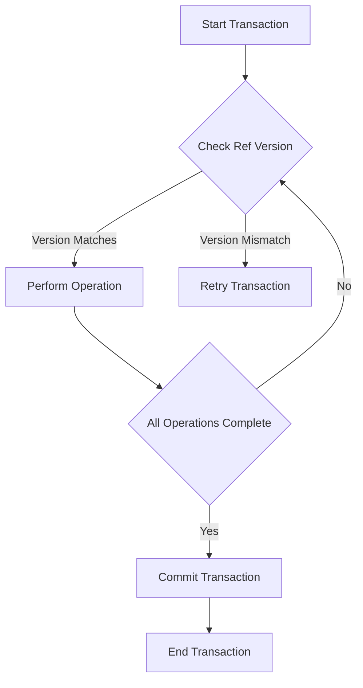

## 9.20. Transactional Memory Patterns

In the realm of concurrent programming, managing shared state safely and efficiently is a perennial challenge. Clojure, with its emphasis on immutability and functional programming, offers a powerful solution through Software Transactional Memory (STM). This section delves into transactional memory patterns, focusing on how STM and Refs can be used to manage complex state changes atomically in concurrent applications.

### Introduction to Software Transactional Memory (STM)

Software Transactional Memory (STM) is a concurrency control mechanism analogous to database transactions for memory. It allows multiple threads to perform operations on shared memory without explicit locks, ensuring consistency and atomicity. In Clojure, STM is implemented using Refs, which are mutable references to immutable data structures.

#### Key Concepts

- **Atomicity**: Ensures that a series of operations within a transaction are completed entirely or not at all.
- **Consistency**: Guarantees that transactions transform the system from one valid state to another.
- **Isolation**: Ensures that transactions do not interfere with each other, providing a consistent view of the data.

### Revisiting Refs and Transactions

Refs in Clojure are used to manage shared, synchronous, and coordinated state. They are updated within transactions, which are blocks of code executed atomically.

#### Basic Usage of Refs

```clojure
(def account-balance (ref 1000))

;; Performing a transaction
(dosync
  (alter account-balance + 100))
```

- **`ref`**: Creates a reference to a value.
- **`dosync`**: Starts a transaction block.
- **`alter`**: Changes the value of a Ref within a transaction.

### Advanced Transactional Memory Patterns

#### Nesting Transactions

Nesting transactions allows for complex operations to be broken down into smaller, manageable units. Each nested transaction is part of a larger transaction, ensuring atomicity across all operations.

```clojure
(defn transfer-funds [from-account to-account amount]
  (dosync
    (alter from-account - amount)
    (alter to-account + amount)))

(defn batch-transfer [transfers]
  (dosync
    (doseq [[from to amount] transfers]
      (transfer-funds from to amount))))
```

- **Pattern**: Use nested transactions to encapsulate related operations.
- **Consideration**: Ensure that nested transactions are not too granular, as this can lead to performance overhead.

#### Coordination Across Multiple Refs

Coordinating changes across multiple Refs is a common requirement in concurrent applications. STM ensures that all changes are applied atomically.

```clojure
(defn update-accounts [accounts]
  (dosync
    (doseq [account accounts]
      (alter account update-balance))))
```

- **Pattern**: Use a single transaction to update multiple Refs.
- **Consideration**: Be mindful of transaction size and complexity to avoid contention.

### Performance Considerations and Limitations

While STM provides a robust mechanism for managing concurrency, it is not without limitations. Understanding these can help in designing efficient systems.

#### Performance Considerations

- **Transaction Size**: Large transactions can lead to contention and retries. Keep transactions as small and focused as possible.
- **Read-Only Transactions**: Use `ref-set` for read-only transactions to avoid unnecessary retries.
- **Retry Overhead**: STM may retry transactions multiple times, which can impact performance.

#### Limitations

- **Scalability**: STM is not a silver bullet for all concurrency problems. It may not scale well in highly contended environments.
- **Complexity**: Designing systems with STM requires careful consideration of transaction boundaries and state dependencies.

### Best Practices for Using STM

To effectively use STM in Clojure, consider the following best practices:

- **Minimize Transaction Scope**: Keep transactions small and focused to reduce contention.
- **Avoid Side Effects**: Ensure that transactions are pure and free of side effects.
- **Use `ensure` for Consistency**: Use `ensure` to read Refs without causing retries.
- **Profile and Optimize**: Regularly profile your application to identify and optimize bottlenecks.

### Common Pitfalls and How to Avoid Them

- **Overusing Transactions**: Avoid wrapping every operation in a transaction. Use STM judiciously.
- **Ignoring Retry Logic**: Be aware of the retry mechanism and design transactions to minimize retries.
- **Neglecting Read Consistency**: Use `ensure` to maintain consistency in read operations.

### Try It Yourself

Experiment with the following code examples to deepen your understanding of STM in Clojure:

1. Modify the `transfer-funds` function to include a fee for each transfer.
2. Implement a transaction that updates multiple accounts based on a set of rules.
3. Create a nested transaction that performs a series of operations on a shared data structure.

### Visualizing STM in Clojure

To better understand how STM works in Clojure, let's visualize the process using a flowchart:



**Figure 1**: Flowchart illustrating the STM process in Clojure.

### References and Further Reading

- [Clojure Documentation on STM](https://clojure.org/reference/refs)
- [Rich Hickey's Talk on STM](https://www.youtube.com/watch?v=J1kJ__xYZJE)
- [Concurrency in Clojure: A Practical Guide](https://practical.li/clojure/concurrency/)

### Summary

Transactional memory patterns in Clojure provide a powerful tool for managing concurrency. By leveraging STM and Refs, developers can ensure atomicity and consistency in complex state changes. While STM offers many advantages, it is important to be aware of its limitations and design systems accordingly. With the right approach, STM can be a valuable asset in building robust and efficient concurrent applications.

## **Ready to Test Your Knowledge?**



### What is the primary purpose of Software Transactional Memory (STM) in Clojure?

- [x] To manage shared state safely and efficiently in concurrent applications.
- [ ] To perform database transactions.
- [ ] To handle file I/O operations.
- [ ] To manage network connections.

> **Explanation:** STM is used to manage shared state safely and efficiently in concurrent applications by ensuring atomicity, consistency, and isolation.

### Which Clojure construct is used to start a transaction block?

- [ ] `ref`
- [x] `dosync`
- [ ] `alter`
- [ ] `ensure`

> **Explanation:** `dosync` is used to start a transaction block in Clojure.

### What is a common pattern when using STM to update multiple Refs?

- [ ] Use separate transactions for each Ref.
- [x] Use a single transaction to update multiple Refs.
- [ ] Avoid using transactions altogether.
- [ ] Use nested transactions for each Ref.

> **Explanation:** A common pattern is to use a single transaction to update multiple Refs to ensure atomicity and consistency.

### What is a potential downside of large transactions in STM?

- [ ] They are more efficient.
- [x] They can lead to contention and retries.
- [ ] They are easier to manage.
- [ ] They require less memory.

> **Explanation:** Large transactions can lead to contention and retries, which can impact performance.

### Which function is used to change the value of a Ref within a transaction?

- [ ] `ref-set`
- [x] `alter`
- [ ] `ensure`
- [ ] `dosync`

> **Explanation:** `alter` is used to change the value of a Ref within a transaction.

### What should be avoided within STM transactions to ensure purity?

- [x] Side effects
- [ ] Pure functions
- [ ] Immutable data
- [ ] Atomic operations

> **Explanation:** Side effects should be avoided within STM transactions to ensure purity and consistency.

### What is the role of `ensure` in STM?

- [ ] To start a transaction block.
- [ ] To change the value of a Ref.
- [x] To read Refs without causing retries.
- [ ] To commit a transaction.

> **Explanation:** `ensure` is used to read Refs without causing retries, maintaining consistency in read operations.

### What is a common pitfall when using STM?

- [ ] Using too few transactions.
- [x] Overusing transactions.
- [ ] Ignoring transaction boundaries.
- [ ] Using immutable data structures.

> **Explanation:** Overusing transactions can lead to unnecessary complexity and performance issues.

### Which of the following is a best practice for using STM?

- [x] Minimize transaction scope.
- [ ] Use transactions for every operation.
- [ ] Avoid using `ensure`.
- [ ] Use large transactions for efficiency.

> **Explanation:** Minimizing transaction scope helps reduce contention and improve performance.

### True or False: STM in Clojure automatically handles retries for transactions.

- [x] True
- [ ] False

> **Explanation:** STM in Clojure automatically handles retries for transactions to ensure atomicity and consistency.



Remember, mastering transactional memory patterns in Clojure is a journey. As you continue to explore and experiment, you'll gain deeper insights into building robust and efficient concurrent applications. Keep pushing the boundaries, stay curious, and enjoy the process!
