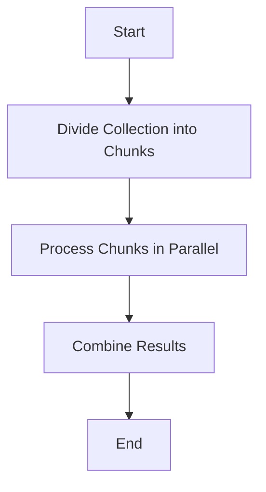

## 9.21. Reducers and Parallelism

In the realm of functional programming, Clojure stands out with its robust support for concurrency and parallelism. One of the key features that enable efficient parallel data processing in Clojure is the concept of reducers. In this section, we will delve into what reducers are, how they differ from traditional sequences, and how you can leverage them to perform parallel operations efficiently. We will also explore the performance benefits, limitations, and considerations when using reducers.

### Understanding Reducers

Reducers in Clojure are a powerful abstraction for processing collections in parallel. They provide a way to define data processing pipelines that can automatically leverage parallelism, making them ideal for handling large data sets efficiently.

#### What Are Reducers?

Reducers are a part of the `clojure.core.reducers` library, introduced to enable parallel processing of collections. Unlike traditional sequences, which process elements one at a time, reducers allow operations to be executed in parallel, taking advantage of multi-core processors.

#### How Reducers Differ from Sequences

While sequences in Clojure are lazy and allow for efficient composition of operations, they are inherently sequential. This means that each element is processed one after the other. In contrast, reducers are designed to be parallelizable, enabling operations to be split across multiple threads.

### Using `clojure.core.reducers`

The `clojure.core.reducers` library provides a set of functions that facilitate parallel processing. Let's explore how to use these functions to perform parallel operations.

#### Basic Usage

To use reducers, you typically start with a collection and apply a series of transformations using functions like `map`, `filter`, and `reduce`. The key difference is that these functions are part of the reducers library and are optimized for parallel execution.

```clojure
(require '[clojure.core.reducers :as r])

(def data (range 1 1000000))

;; Using reducers to perform a parallel map and reduce
(defn parallel-sum-of-squares [coll]
  (r/fold + (r/map #(* % %) coll)))

(println (parallel-sum-of-squares data))
```

In this example, we use `r/map` to square each element in the collection and `r/fold` to sum the results. The `r/fold` function is a parallel version of `reduce` that divides the collection into chunks, processes each chunk in parallel, and then combines the results.

#### Comparing Reducers with Traditional `map`/`reduce`

To understand the benefits of reducers, let's compare them with traditional `map` and `reduce`.

```clojure
;; Traditional map and reduce
(defn sequential-sum-of-squares [coll]
  (reduce + (map #(* % %) coll)))

(println (sequential-sum-of-squares data))
```

While both functions achieve the same result, the reducer-based version can take advantage of multiple cores, potentially leading to significant performance improvements, especially for large data sets.

### Performance Benefits of Reducers

Reducers can offer substantial performance benefits by parallelizing data processing tasks. This is particularly advantageous for CPU-bound operations where the workload can be evenly distributed across multiple cores.

#### When to Use Reducers

- **Large Data Sets**: When processing large collections, reducers can significantly reduce execution time by leveraging parallelism.
- **CPU-Bound Operations**: Tasks that are computationally intensive and can be divided into independent sub-tasks are ideal candidates for reducers.
- **Multi-Core Systems**: Systems with multiple cores can benefit the most from the parallel execution capabilities of reducers.

### Limitations and Considerations

While reducers offer powerful parallel processing capabilities, there are some limitations and considerations to keep in mind.

#### Limitations

- **Not Suitable for All Tasks**: Reducers are best suited for operations that can be parallelized. Tasks with dependencies between elements may not benefit from reducers.
- **Overhead**: For small data sets, the overhead of managing parallel tasks may outweigh the performance gains.

#### Considerations

- **Chunk Size**: The performance of reducers can be influenced by the size of the chunks into which the data is divided. Tuning the chunk size can help optimize performance.
- **Side Effects**: Since reducers are designed for parallel execution, operations with side effects may lead to unpredictable results.

### Visualizing Reducers and Parallelism

To better understand how reducers work, let's visualize the process of parallel data processing using a flowchart.



This flowchart illustrates the basic steps involved in using reducers for parallel data processing. The collection is divided into chunks, each chunk is processed in parallel, and the results are combined to produce the final output.

### Try It Yourself

To gain a deeper understanding of reducers, try modifying the code examples provided. Experiment with different operations, such as filtering or transforming data, and observe how reducers handle these tasks in parallel.

### External Resources

For more information on reducers and their usage, refer to the [Reducers Documentation](https://clojure.org/reference/reducers).

### Knowledge Check

To reinforce your understanding of reducers and parallelism, try answering the following questions:

## **Ready to Test Your Knowledge?**



### What is the primary advantage of using reducers in Clojure?

- [x] Parallel processing of collections
- [ ] Sequential processing of collections
- [ ] Lazy evaluation of collections
- [ ] Immutable data structures

> **Explanation:** The primary advantage of reducers is their ability to process collections in parallel, leveraging multi-core processors for improved performance.


### Which function in `clojure.core.reducers` is used for parallel reduction?

- [x] `r/fold`
- [ ] `r/reduce`
- [ ] `r/map`
- [ ] `r/filter`

> **Explanation:** The `r/fold` function is used for parallel reduction, allowing collections to be processed in chunks concurrently.


### How do reducers differ from traditional sequences in Clojure?

- [x] Reducers enable parallel processing, while sequences are sequential.
- [ ] Reducers are lazy, while sequences are eager.
- [ ] Reducers are immutable, while sequences are mutable.
- [ ] Reducers are used for I/O operations, while sequences are not.

> **Explanation:** Reducers are designed for parallel processing, whereas traditional sequences process elements sequentially.


### When should you consider using reducers?

- [x] For large data sets and CPU-bound operations
- [ ] For small data sets and I/O-bound operations
- [ ] For operations with side effects
- [ ] For tasks with dependencies between elements

> **Explanation:** Reducers are most beneficial for large data sets and CPU-bound operations that can be parallelized.


### What is a potential limitation of using reducers?

- [x] Overhead for small data sets
- [ ] Lack of support for lazy evaluation
- [ ] Inability to process immutable data
- [ ] Difficulty in handling I/O operations

> **Explanation:** For small data sets, the overhead of managing parallel tasks may outweigh the performance benefits.


### Which of the following is a key consideration when using reducers?

- [x] Chunk size
- [ ] Data immutability
- [ ] Lazy evaluation
- [ ] I/O operations

> **Explanation:** The chunk size can influence the performance of reducers, as it determines how the data is divided for parallel processing.


### What type of operations are best suited for reducers?

- [x] CPU-bound operations
- [ ] I/O-bound operations
- [ ] Operations with side effects
- [ ] Operations with dependencies between elements

> **Explanation:** CPU-bound operations that can be divided into independent sub-tasks are ideal for reducers.


### What is the role of `r/map` in the reducers library?

- [x] To apply a function to each element in parallel
- [ ] To filter elements based on a predicate
- [ ] To reduce elements to a single value
- [ ] To sort elements in a collection

> **Explanation:** `r/map` applies a function to each element in the collection, allowing for parallel execution.


### How can you optimize the performance of reducers?

- [x] By tuning the chunk size
- [ ] By using mutable data structures
- [ ] By introducing side effects
- [ ] By increasing I/O operations

> **Explanation:** Tuning the chunk size can help optimize the performance of reducers by balancing the workload across threads.


### True or False: Reducers are always faster than traditional sequences.

- [ ] True
- [x] False

> **Explanation:** While reducers can offer performance benefits for large data sets and CPU-bound tasks, they may not always be faster than traditional sequences, especially for small data sets where the overhead of parallelism can outweigh the gains.



Remember, this is just the beginning of your journey with reducers and parallelism in Clojure. As you continue to explore and experiment, you'll discover more ways to harness the power of parallel processing in your applications. Keep experimenting, stay curious, and enjoy the journey!
