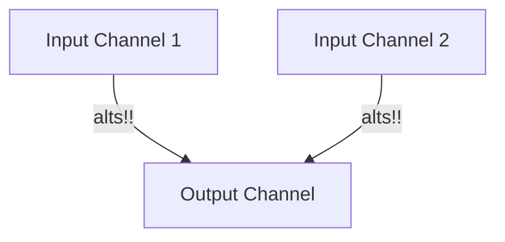
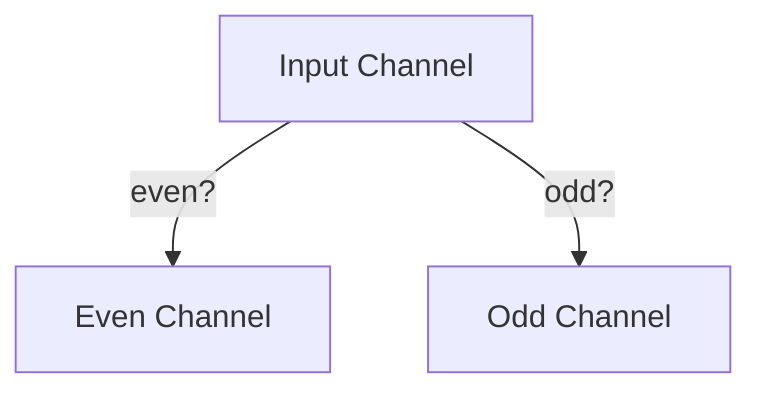

## 9.22. core.async Advanced Patterns

In this section, we delve into advanced patterns and techniques in Clojure's `core.async` library. These patterns enable developers to build sophisticated asynchronous and concurrent systems, leveraging the full power of Clojure's functional programming paradigm. We'll explore concepts like transducers on channels, mult, and mix, and provide examples of using these features in complex scenarios. We'll also discuss error handling and exception propagation in `core.async`, and highlight patterns like multiplexing, demultiplexing, and merging channels. Let's embark on this journey to master asynchronous programming in Clojure!

### Introduction to core.async

Before diving into advanced patterns, let's briefly revisit the basics of `core.async`. It is a library that provides facilities for asynchronous programming using channels, which are similar to queues. Channels can be used to communicate between different parts of a program, allowing for concurrent execution without the need for explicit locks or callbacks.

### Transducers on Channels

Transducers are a powerful feature in Clojure that allow for composable and efficient data transformations. When applied to channels, transducers enable transformations on the data flowing through the channel without creating intermediate collections.

#### Example: Using Transducers with Channels

```clojure
(require '[clojure.core.async :refer [chan transduce >!! <!!]])

;; Create a channel with a transducer that filters even numbers
(def ch (chan 10 (filter even?)))

;; Put some numbers onto the channel
(doseq [n (range 10)]
  (>!! ch n))

;; Take numbers from the channel and print them
(println (repeatedly 5 #(<!! ch))) ;; Output: (0 2 4 6 8)
```

In this example, we create a channel with a transducer that filters even numbers. We then put numbers onto the channel and take them off, observing that only even numbers are passed through.

### Mult and Mix

`core.async` provides powerful constructs like `mult` and `mix` for managing multiple channels.

#### Mult: Broadcasting to Multiple Channels

`mult` allows you to broadcast messages from a single channel to multiple channels. This is useful when you want to distribute the same data to different consumers.

```clojure
(require '[clojure.core.async :refer [chan mult tap >!! <!!]])

;; Create a channel and a mult
(def ch (chan))
(def m (mult ch))

;; Create two channels to tap into the mult
(def ch1 (chan))
(def ch2 (chan))

(tap m ch1)
(tap m ch2)

;; Put a message onto the original channel
(>!! ch "Hello, World!")

;; Both tapped channels receive the message
(println (<!! ch1)) ;; Output: "Hello, World!"
(println (<!! ch2)) ;; Output: "Hello, World!"
```

In this example, we create a `mult` from a channel and tap two channels into it. When we put a message onto the original channel, both tapped channels receive the message.

#### Mix: Combining Multiple Channels

`mix` allows you to combine multiple channels into a single channel, providing a way to manage complex channel topologies.

```clojure
(require '[clojure.core.async :refer [chan mix admix >!! <!!]])

;; Create two channels
(def ch1 (chan))
(def ch2 (chan))

;; Create a mix and admix the channels
(def mx (mix (chan)))
(admix mx ch1)
(admix mx ch2)

;; Put messages onto the channels
(>!! ch1 "Message from ch1")
(>!! ch2 "Message from ch2")

;; Take messages from the mix
(println (<!! mx)) ;; Output: "Message from ch1"
(println (<!! mx)) ;; Output: "Message from ch2"
```

Here, we create a `mix` and admix two channels into it. Messages from both channels are combined into the mix, allowing us to take them from a single channel.

### Error Handling and Exception Propagation

Handling errors in asynchronous systems can be challenging. `core.async` provides mechanisms for propagating exceptions and handling errors gracefully.

#### Example: Propagating Exceptions

```clojure
(require '[clojure.core.async :refer [chan go >!! <!!]])

(defn safe-put [ch val]
  (try
    (>!! ch val)
    (catch Exception e
      (println "Error putting value:" (.getMessage e)))))

(def ch (chan))

(go
  (safe-put ch (/ 1 0))) ;; Division by zero

(println (<!! ch)) ;; Output: nil
```

In this example, we define a `safe-put` function that catches exceptions when putting values onto a channel. This allows us to handle errors without crashing the program.

### Multiplexing and Demultiplexing Channels

Multiplexing and demultiplexing are patterns used to manage multiple channels efficiently.

#### Multiplexing: Combining Multiple Inputs

Multiplexing involves combining multiple input channels into a single output channel.

```clojure
(require '[clojure.core.async :refer [chan alts!! >!! <!!]])

(def ch1 (chan))
(def ch2 (chan))

;; Put messages onto the channels
(>!! ch1 "Message from ch1")
(>!! ch2 "Message from ch2")

;; Multiplex the channels
(let [[val ch] (alts!! [ch1 ch2])]
  (println "Received:" val "from" ch))
```

In this example, we use `alts!!` to multiplex two channels, allowing us to receive messages from either channel.

#### Demultiplexing: Distributing to Multiple Outputs

Demultiplexing involves distributing messages from a single input channel to multiple output channels based on some criteria.

```clojure
(require '[clojure.core.async :refer [chan go >!! <!!]])

(def ch (chan))
(def even-ch (chan))
(def odd-ch (chan))

(go
  (loop []
    (let [val (<!! ch)]
      (if (even? val)
        (>!! even-ch val)
        (>!! odd-ch val))
      (recur))))

;; Put messages onto the input channel
(doseq [n (range 10)]
  (>!! ch n))

;; Take messages from the output channels
(println "Even:" (repeatedly 5 #(<!! even-ch))) ;; Output: (0 2 4 6 8)
(println "Odd:" (repeatedly 5 #(<!! odd-ch)))   ;; Output: (1 3 5 7 9)
```

Here, we demultiplex a single input channel into two output channels based on whether the numbers are even or odd.

### Merging Channels

Merging channels is a pattern where multiple input channels are combined into a single output channel, similar to multiplexing but with a focus on combining rather than selecting.

```clojure
(require '[clojure.core.async :refer [chan merge >!! <!!]])

(def ch1 (chan))
(def ch2 (chan))

;; Create a merged channel
(def merged-ch (merge [ch1 ch2]))

;; Put messages onto the channels
(>!! ch1 "Message from ch1")
(>!! ch2 "Message from ch2")

;; Take messages from the merged channel
(println (<!! merged-ch)) ;; Output: "Message from ch1"
(println (<!! merged-ch)) ;; Output: "Message from ch2"
```

In this example, we merge two channels into a single channel, allowing us to take messages from both channels in a unified manner.

### Encouraging Exploration and Experimentation

The advanced patterns in `core.async` provide a rich set of tools for building complex asynchronous systems. We encourage you to explore and experiment with these patterns, adapting them to your specific use cases and discovering new ways to leverage `core.async` in your applications.

### Visualizing core.async Patterns

To better understand the flow of data in `core.async` patterns, let's visualize some of these concepts using Mermaid.js diagrams.

#### Diagram: Multiplexing Channels



This diagram illustrates the multiplexing pattern, where multiple input channels are combined into a single output channel using `alts!!`.

#### Diagram: Demultiplexing Channels



Here, we see the demultiplexing pattern, where a single input channel is distributed to multiple output channels based on a condition.

### References and Links

For further reading on `core.async` and its advanced patterns, consider exploring the following resources:

- [Clojure core.async Documentation](https://clojure.github.io/core.async/)
- [Clojure Transducers Guide](https://clojure.org/guides/transducers)
- [Concurrency in Clojure](https://clojure.org/reference/concurrency)

### Knowledge Check

To reinforce your understanding of `core.async` advanced patterns, try answering the following questions and challenges.

## **Ready to Test Your Knowledge?**



### What is the purpose of using transducers on channels in core.async?

- [x] To transform data flowing through the channel without intermediate collections
- [ ] To increase the buffer size of the channel
- [ ] To enable synchronous communication
- [ ] To handle errors in the channel

> **Explanation:** Transducers allow for efficient data transformations on channels without creating intermediate collections, making them ideal for processing streams of data.

### How does the `mult` construct in core.async work?

- [x] It broadcasts messages from a single channel to multiple channels
- [ ] It combines multiple channels into one
- [ ] It filters messages based on a condition
- [ ] It merges channels into a single output

> **Explanation:** The `mult` construct allows a single channel to broadcast messages to multiple tapped channels, enabling multiple consumers to receive the same data.

### What is the role of the `mix` construct in core.async?

- [x] To combine multiple channels into a single channel
- [ ] To broadcast messages to multiple channels
- [ ] To filter messages based on a condition
- [ ] To handle errors in the channel

> **Explanation:** The `mix` construct combines multiple channels into a single channel, allowing for complex channel topologies and message routing.

### How can exceptions be propagated in core.async?

- [x] By using try-catch blocks around channel operations
- [ ] By using a special error channel
- [ ] By ignoring exceptions
- [ ] By using transducers

> **Explanation:** Exceptions can be propagated in `core.async` by wrapping channel operations in try-catch blocks, allowing for graceful error handling.

### What is the difference between multiplexing and merging channels?

- [x] Multiplexing selects messages from multiple channels, while merging combines them into one
- [ ] Multiplexing combines channels, while merging selects messages
- [ ] Both are the same
- [ ] Multiplexing is for synchronous channels, merging is for asynchronous

> **Explanation:** Multiplexing involves selecting messages from multiple channels, while merging combines messages from multiple channels into a single output channel.

### What is the purpose of demultiplexing in core.async?

- [x] To distribute messages from a single input channel to multiple output channels
- [ ] To combine multiple input channels into one
- [ ] To broadcast messages to multiple channels
- [ ] To handle errors in the channel

> **Explanation:** Demultiplexing distributes messages from a single input channel to multiple output channels based on some criteria, allowing for targeted message routing.

### How can you merge two channels in core.async?

- [x] By using the `merge` function
- [ ] By using the `mult` function
- [ ] By using the `mix` function
- [ ] By using transducers

> **Explanation:** The `merge` function in `core.async` allows you to combine multiple input channels into a single output channel, facilitating unified message processing.

### What is a key advantage of using transducers with channels?

- [x] They provide composable and efficient data transformations
- [ ] They increase the buffer size of the channel
- [ ] They enable synchronous communication
- [ ] They handle errors in the channel

> **Explanation:** Transducers provide composable and efficient data transformations, allowing for streamlined processing of data streams without intermediate collections.

### How does the `alts!!` function work in core.async?

- [x] It selects a message from one of multiple channels
- [ ] It combines multiple channels into one
- [ ] It broadcasts messages to multiple channels
- [ ] It handles errors in the channel

> **Explanation:** The `alts!!` function selects a message from one of multiple channels, enabling multiplexing by allowing a program to receive messages from any of several channels.

### True or False: The `mult` construct can be used to combine multiple channels into a single channel.

- [ ] True
- [x] False

> **Explanation:** False. The `mult` construct is used to broadcast messages from a single channel to multiple channels, not to combine multiple channels into one.



Remember, mastering these advanced patterns in `core.async` is just the beginning. As you progress, you'll build more complex and interactive asynchronous systems. Keep experimenting, stay curious, and enjoy the journey!
