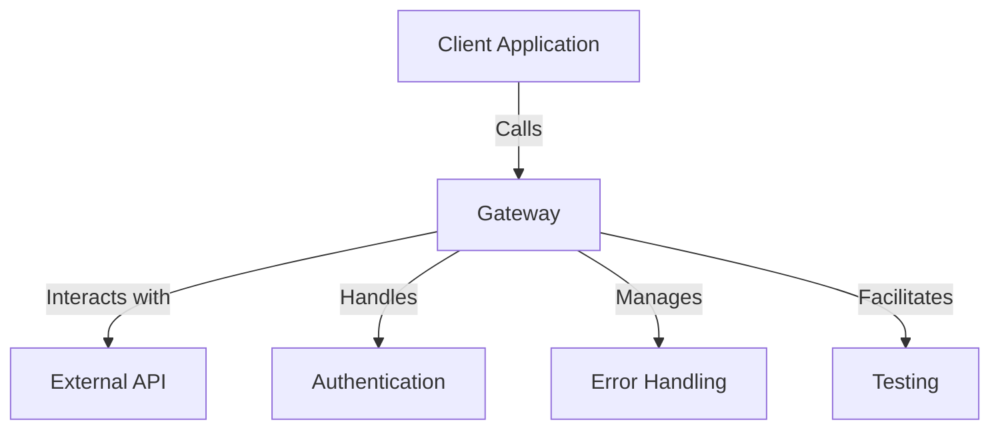

## 9.3 Gateway in Clojure

In the world of software development, integrating with external systems and APIs is a common requirement. The Gateway design pattern provides a structured approach to manage these integrations, offering a unified interface that abstracts the complexities involved. This article delves into the Gateway pattern within the context of Clojure, illustrating how it can simplify interactions with external services.

### Introduction

The Gateway pattern serves as an intermediary between your application and external services. It encapsulates the intricacies of API calls, authentication, error handling, and data transformation, presenting a clean and consistent interface to the rest of your application. This abstraction not only simplifies the integration process but also enhances maintainability by decoupling business logic from external dependencies.

### Detailed Explanation

#### Purpose and Relevance

The primary purpose of a Gateway is to provide a single point of access to external services, hiding the underlying implementation details. This is particularly useful when dealing with complex APIs or when multiple services need to be accessed in a consistent manner. By centralizing the integration logic, changes to external services can be managed without impacting the core business logic of your application.

#### Components and Workflow

1. **Gateway Module or Namespace:** 
   - A dedicated namespace encapsulates all the functions and logic related to the external service.
   
2. **Interface Functions:**
   - Public functions that expose the capabilities of the external service to the rest of the application.
   
3. **Internal Configuration and Authentication:**
   - Handles the setup of necessary credentials and configurations required for service access.
   
4. **Error Handling and Retries:**
   - Implements robust error handling and retry mechanisms to ensure reliability.
   
5. **Testing Facilitation:**
   - Provides mechanisms to mock external interactions during testing, ensuring isolation of business logic.

### Visual Aids

#### Architectural Diagram



### Code Examples

#### Creating a Gateway Module

Define a namespace for the Gateway, encapsulating all related functions and logic.

```clojure
(ns myapp.gateway.payment)
```

#### Defining Interface Functions

These functions provide a clean interface for interacting with the external service.

```clojure
(defn process-payment [payment-details]
  ;; Interact with payment service
  )

(defn check-payment-status [transaction-id]
  ;; Interact with payment service
  )
```

#### Handling Authentication and Configuration

Manage authentication and configuration internally to keep the interface clean.

```clojure
(def ^:private api-key "your-api-key")

(defn- make-request [endpoint params]
  ;; Use api-key to authenticate
  )
```

#### Implementing Error Handling and Retries

Ensure robust error handling and implement retry logic to handle transient failures.

```clojure
(defn process-payment [payment-details]
  (try
    (make-request "/process-payment" payment-details)
    (catch Exception e
      (log/error e "Payment processing failed")
      ;; Handle error or retry
      )))
```

#### Using the Gateway in Business Logic

Integrate the Gateway into your business logic, ensuring a clean separation of concerns.

```clojure
(defn complete-order [order-details]
  (let [payment-response (payment/process-payment (:payment order-details))]
    ;; Handle payment response
    ))
```

#### Facilitating Testing

Mock the Gateway functions in tests to isolate and test business logic independently.

```clojure
(deftest test-complete-order
  (with-redefs [payment/process-payment (fn [_] {:status "success"})]
    (is (= (complete-order {:payment {:amount 100}}) :order-completed))))
```

### Use Cases

- **E-commerce Platforms:** Integrate with payment gateways to process transactions securely.
- **Social Media Applications:** Interact with social media APIs for user authentication and data retrieval.
- **Data Aggregation Services:** Consolidate data from multiple external sources into a unified format.

### Advantages and Disadvantages

#### Advantages

- **Abstraction:** Simplifies complex API interactions.
- **Decoupling:** Separates business logic from integration logic.
- **Maintainability:** Facilitates changes to external services without affecting core logic.

#### Disadvantages

- **Overhead:** Introduces an additional layer that may add complexity if not managed properly.
- **Performance:** Potential performance bottlenecks if the Gateway is not optimized.

### Best Practices

- **Use Clojure's Functional Paradigms:** Leverage higher-order functions and immutability to enhance Gateway implementations.
- **Implement Robust Error Handling:** Ensure that the Gateway can gracefully handle failures and retries.
- **Facilitate Testing:** Design the Gateway to be easily mockable, allowing for isolated testing of business logic.

### Comparisons

- **Facade Pattern:** While similar in providing a simplified interface, the Gateway pattern is specifically tailored for external service interactions, whereas the Facade pattern is more general-purpose.

### Conclusion

The Gateway design pattern is a powerful tool for managing external service integrations in Clojure applications. By abstracting the complexities of API interactions, it enhances maintainability and scalability, allowing developers to focus on core business logic. As you implement this pattern, consider the best practices and potential pitfalls to maximize its benefits.

## Quiz Time!



### What is the primary purpose of a Gateway in software design?

- [x] To provide a single point of access to external services
- [ ] To manage internal application state
- [ ] To optimize database queries
- [ ] To handle user authentication

> **Explanation:** The Gateway pattern is designed to provide a unified interface for interacting with external services, abstracting the complexities involved.

### Which of the following is NOT a component of a Gateway?

- [ ] Interface Functions
- [ ] Error Handling
- [x] User Interface
- [ ] Authentication

> **Explanation:** A Gateway focuses on backend service interactions and does not involve user interface components.

### How does a Gateway enhance maintainability?

- [x] By decoupling business logic from external service interactions
- [ ] By increasing the complexity of the codebase
- [ ] By directly embedding external service logic into business functions
- [ ] By eliminating the need for error handling

> **Explanation:** The Gateway pattern separates the concerns of business logic and external service interactions, making it easier to manage changes.

### What is a common use case for the Gateway pattern?

- [x] Integrating with payment gateways in e-commerce platforms
- [ ] Rendering UI components
- [ ] Optimizing database indexing
- [ ] Managing application state

> **Explanation:** The Gateway pattern is often used to manage interactions with external services, such as payment gateways.

### Which Clojure feature is particularly useful for implementing a Gateway?

- [x] Higher-order functions
- [ ] Mutable state
- [ ] Direct database access
- [ ] Inline CSS

> **Explanation:** Higher-order functions in Clojure allow for flexible and reusable code, which is beneficial in implementing a Gateway.

### What is a potential disadvantage of using a Gateway?

- [x] It can introduce additional overhead
- [ ] It simplifies code complexity
- [ ] It eliminates the need for testing
- [ ] It directly improves UI performance

> **Explanation:** While a Gateway provides abstraction, it can also introduce overhead if not managed properly.

### How can you facilitate testing when using a Gateway?

- [x] By mocking Gateway functions in tests
- [ ] By embedding test logic in production code
- [ ] By avoiding error handling
- [ ] By using global variables

> **Explanation:** Mocking Gateway functions allows for isolated testing of business logic without relying on external services.

### What is the difference between a Gateway and a Facade pattern?

- [x] A Gateway is specifically for external service interactions, while a Facade is more general-purpose
- [ ] A Facade is specifically for external service interactions, while a Gateway is more general-purpose
- [ ] Both patterns serve the same purpose
- [ ] A Gateway is used for UI components, while a Facade is used for backend logic

> **Explanation:** The Gateway pattern is tailored for managing external service interactions, whereas the Facade pattern provides a simplified interface for any complex subsystem.

### Which of the following best describes the role of error handling in a Gateway?

- [x] To ensure reliability and manage transient failures
- [ ] To increase the complexity of the Gateway
- [ ] To directly modify external service logic
- [ ] To handle UI rendering

> **Explanation:** Error handling in a Gateway ensures that the system can gracefully manage failures and retries, maintaining reliability.

### True or False: A Gateway should directly expose external service details to the client application.

- [ ] True
- [x] False

> **Explanation:** A Gateway should abstract the details of external services, providing a clean interface to the client application.


