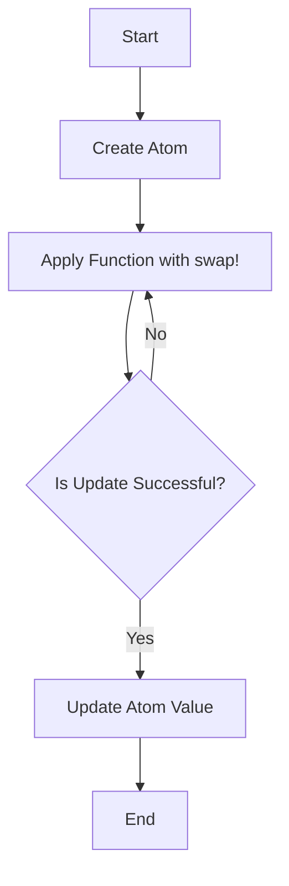

## 9.3. Managing Shared State with Atoms

In the realm of concurrent programming, managing shared state can be a daunting task. Clojure, with its emphasis on immutability and functional programming, provides several constructs to handle state changes safely and efficiently. Among these constructs, Atoms stand out as a simple yet powerful tool for managing independent, synchronous state changes. In this section, we will delve into the concept of Atoms, explore their usage, and understand their advantages and limitations.

### What Are Atoms?

Atoms in Clojure are a type of reference that provides a way to manage shared, mutable state. They are designed for scenarios where you have independent state changes that do not require coordination with other state changes. Atoms ensure that state changes are atomic, meaning they are completed in a single, indivisible operation, which is crucial in a concurrent environment.

#### How Atoms Differ from Refs and Agents

Clojure offers several constructs for managing state: Atoms, Refs, and Agents. Each serves a different purpose and is suited for different use cases:

- **Atoms**: Best for managing independent state changes. They provide atomic updates and are synchronous, meaning the state is updated immediately.
- **Refs**: Used for coordinated state changes that need to be consistent across multiple references. Refs use Software Transactional Memory (STM) to ensure that changes are atomic and consistent.
- **Agents**: Suitable for asynchronous updates. Agents allow state changes to be processed in a separate thread, making them ideal for tasks that do not require immediate consistency.

### Creating and Updating Atoms

Atoms are created using the `atom` function, which takes an initial value. You can update the value of an Atom using `swap!` or `reset!`.

#### Example: Creating an Atom

```clojure
(def my-atom (atom 0))
```

In this example, `my-atom` is an Atom initialized with the value `0`.

#### Updating Atoms with `swap!`

The `swap!` function is used to update the value of an Atom. It takes the Atom, a function, and any additional arguments. The function is applied to the current value of the Atom, and the result becomes the new value.

```clojure
(swap! my-atom inc) ; Increments the value of my-atom by 1
```

Here, `inc` is a function that increments its argument by 1. The `swap!` function applies `inc` to the current value of `my-atom`, updating it atomically.

#### Updating Atoms with `reset!`

The `reset!` function sets the value of an Atom to a new value, without considering the current value.

```clojure
(reset! my-atom 10) ; Sets the value of my-atom to 10
```

### Use Cases for Atoms

Atoms are ideal for scenarios where state changes are independent and do not require coordination with other state changes. Some common use cases include:

- **Counters**: Atoms are perfect for implementing counters, where each update is independent of others.
- **Caches**: When building a simple cache, Atoms can be used to store and update cached values.
- **Configuration Settings**: Atoms can hold configuration settings that may change at runtime.

### Advantages of Atoms

Atoms offer several advantages that make them a popular choice for managing state in Clojure:

- **Simplicity**: Atoms provide a straightforward way to manage state changes without the complexity of locks or transactions.
- **Performance**: Since Atoms are synchronous and do not require coordination, they are generally faster than Refs.
- **Atomicity**: Atoms ensure that state changes are atomic, providing consistency in a concurrent environment.

### Considerations for Atomicity and Consistency

While Atoms provide atomic updates, it's important to consider the implications of atomicity and consistency:

- **Atomicity**: Each update to an Atom is atomic, meaning it is completed in a single operation. This ensures that no other thread can see an intermediate state.
- **Consistency**: Atoms do not provide consistency across multiple references. If you need to coordinate changes across multiple Atoms, you may need to use Refs or another mechanism.

### Visualizing Atom Operations

To better understand how Atoms work, let's visualize the process of updating an Atom using a flowchart.



**Figure 1**: This flowchart illustrates the process of updating an Atom using `swap!`. If the update is not successful (due to a race condition), the function is retried until it succeeds.

### Try It Yourself

Experiment with Atoms by modifying the code examples provided. Try creating an Atom with a different initial value or using a different function with `swap!`. Observe how Atoms handle concurrent updates by running the code in a multi-threaded environment.

### Knowledge Check

Before we conclude, let's test your understanding of Atoms with a few questions.

## **Ready to Test Your Knowledge?**



### What is the primary use case for Atoms in Clojure?

- [x] Managing independent, synchronous state changes
- [ ] Coordinating state changes across multiple references
- [ ] Asynchronous state updates
- [ ] Handling large data sets

> **Explanation:** Atoms are best suited for managing independent, synchronous state changes.

### Which function is used to update the value of an Atom by applying a function to its current value?

- [x] swap!
- [ ] reset!
- [ ] alter
- [ ] ref-set

> **Explanation:** `swap!` is used to update the value of an Atom by applying a function to its current value.

### What is the difference between `swap!` and `reset!`?

- [x] `swap!` applies a function to the current value, while `reset!` sets a new value directly.
- [ ] `swap!` sets a new value directly, while `reset!` applies a function.
- [ ] Both perform the same operation.
- [ ] `swap!` is asynchronous, while `reset!` is synchronous.

> **Explanation:** `swap!` applies a function to the current value, while `reset!` sets a new value directly.

### Which of the following is NOT a characteristic of Atoms?

- [ ] Atomic updates
- [ ] Synchronous state changes
- [ ] Coordination across multiple references
- [x] Asynchronous updates

> **Explanation:** Atoms do not provide coordination across multiple references; they are used for independent state changes.

### What happens if a `swap!` operation fails due to a race condition?

- [x] The operation is retried until it succeeds.
- [ ] The operation is aborted.
- [ ] An exception is thrown.
- [ ] The Atom is reset to its initial value.

> **Explanation:** If a `swap!` operation fails due to a race condition, it is retried until it succeeds.

### True or False: Atoms are suitable for managing state changes that require coordination with other state changes.

- [ ] True
- [x] False

> **Explanation:** Atoms are not suitable for managing state changes that require coordination with other state changes; Refs are more appropriate for such scenarios.

### Which Clojure construct is best for asynchronous state updates?

- [ ] Atoms
- [ ] Refs
- [x] Agents
- [ ] Vars

> **Explanation:** Agents are best suited for asynchronous state updates.

### How do Atoms ensure atomicity in state updates?

- [x] By completing updates in a single, indivisible operation
- [ ] By using locks
- [ ] By coordinating with other Atoms
- [ ] By using transactions

> **Explanation:** Atoms ensure atomicity by completing updates in a single, indivisible operation.

### Which function would you use to set an Atom to a specific value, ignoring its current value?

- [ ] swap!
- [x] reset!
- [ ] alter
- [ ] ref-set

> **Explanation:** `reset!` is used to set an Atom to a specific value, ignoring its current value.

### True or False: Atoms provide consistency across multiple references.

- [ ] True
- [x] False

> **Explanation:** Atoms do not provide consistency across multiple references; they are used for independent state changes.



### Summary

In this section, we've explored the concept of Atoms in Clojure and how they provide a simple and efficient mechanism for managing shared state in a concurrent environment. Atoms are ideal for scenarios where state changes are independent and do not require coordination with other state changes. By understanding the strengths and limitations of Atoms, you can effectively manage state in your Clojure applications. Remember, this is just the beginning. As you continue your journey with Clojure, you'll discover more powerful tools and techniques for building robust and efficient applications. Keep experimenting, stay curious, and enjoy the journey!
