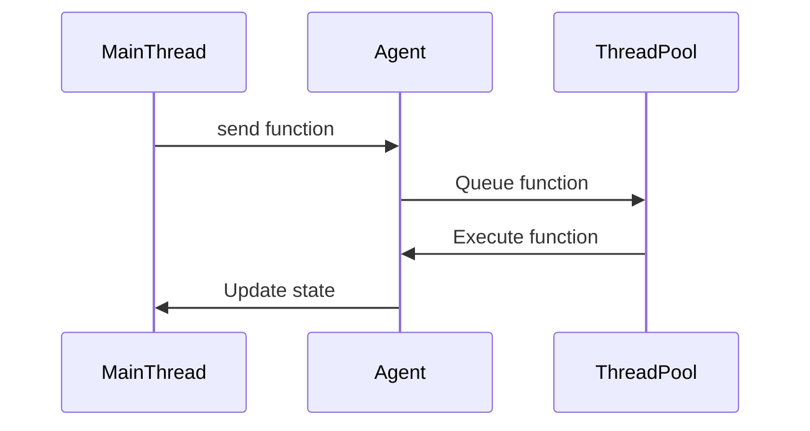

## 9.4. Asynchronous Programming with Agents

Asynchronous programming is a cornerstone of modern software development, allowing applications to perform tasks concurrently without blocking the main execution thread. In Clojure, Agents provide a powerful mechanism for managing asynchronous, independent actions on shared state. This section delves into the concept of Agents, their role in Clojure's concurrency model, and how they can be leveraged to build efficient, high-throughput applications.

### Understanding Agents in Clojure

Agents in Clojure are designed to manage state changes asynchronously. They allow you to perform operations on a shared state without blocking the main thread, making them ideal for tasks that can be executed independently. Unlike other concurrency primitives in Clojure, such as Atoms and Refs, Agents are specifically tailored for asynchronous updates.

#### How Agents Work

Agents encapsulate a piece of state and provide a way to apply functions to that state asynchronously. When you send a function to an Agent, it is queued for execution, and the Agent's state is updated once the function is applied. This process is non-blocking, meaning that the calling thread can continue executing other tasks while the Agent processes the function.

Here's a simple example of creating and using an Agent:

```clojure
;; Define an Agent with an initial state of 0
(def my-agent (agent 0))

;; Define a function to increment the state
(defn increment [state]
  (inc state))

;; Send the increment function to the Agent
(send my-agent increment)

;; Check the Agent's state
@my-agent
;; => 1
```

In this example, we create an Agent with an initial state of `0`. We then define a function `increment` that increases the state by one. By using `send`, we apply the `increment` function to the Agent's state asynchronously.

### Sending Actions to Agents

Clojure provides two primary functions for sending actions to Agents: `send` and `send-off`. Both functions allow you to queue functions for execution on an Agent, but they differ in how they handle threading and blocking behavior.

#### Using `send`

The `send` function is used for actions that are CPU-bound and do not block. It queues the function for execution on a thread pool dedicated to handling such tasks. This ensures that the main thread is not blocked while the Agent processes the function.

```clojure
;; Send a CPU-bound function to the Agent
(send my-agent (fn [state] (+ state 10)))

;; Check the Agent's state
@my-agent
;; => 11
```

In this example, we send a function that adds `10` to the Agent's state. The `send` function ensures that this operation is performed asynchronously without blocking the main thread.

#### Using `send-off`

The `send-off` function is used for actions that may block, such as I/O operations. It queues the function for execution on a separate thread pool designed to handle blocking tasks. This prevents blocking operations from affecting the responsiveness of the application.

```clojure
;; Send a blocking function to the Agent
(send-off my-agent (fn [state]
                     (Thread/sleep 1000) ; Simulate a blocking operation
                     (+ state 20)))

;; Check the Agent's state after the operation completes
@my-agent
;; => 31
```

In this example, we use `send-off` to send a function that simulates a blocking operation with `Thread/sleep`. The function adds `20` to the Agent's state once the operation completes.

### Differences Between `send` and `send-off`

The primary difference between `send` and `send-off` lies in their handling of threading and blocking behavior:

- **`send`**: Suitable for CPU-bound tasks. Uses a fixed-size thread pool, ensuring that tasks do not block the main thread. Ideal for operations that are quick and do not involve I/O.
- **`send-off`**: Suitable for I/O-bound or blocking tasks. Uses a separate thread pool that can grow as needed, allowing blocking operations to be handled without affecting the application's responsiveness.

### Use Cases for Agents

Agents are particularly advantageous in scenarios where you need to manage state changes asynchronously and independently. Some common use cases include:

- **Background Processing**: Performing tasks such as data processing or computation in the background without blocking the main application thread.
- **I/O Operations**: Handling I/O-bound tasks, such as reading from or writing to a file or network socket, without blocking the main thread.
- **State Management**: Managing shared state in a concurrent application where state changes can be performed independently and asynchronously.

### Error Handling and Monitoring

Error handling is an important aspect of working with Agents. By default, if an error occurs while processing a function sent to an Agent, the Agent's state is not updated, and the error is logged. You can customize error handling by setting an error handler for the Agent.

```clojure
;; Define an error handler
(defn error-handler [agent exception]
  (println "Error occurred:" (.getMessage exception)))

;; Set the error handler for the Agent
(set-error-handler! my-agent error-handler)

;; Send a function that causes an error
(send my-agent (fn [state] (/ state 0)))
```

In this example, we define an error handler that prints the error message to the console. We then set this handler for the Agent using `set-error-handler!`. When an error occurs, the handler is invoked, allowing you to manage errors gracefully.

### Monitoring Agent Activity

Clojure provides functions to monitor the activity of Agents, such as `await` and `await-for`. These functions allow you to wait for all actions sent to an Agent to complete before proceeding.

```clojure
;; Wait for all actions to complete
(await my-agent)

;; Wait for actions to complete with a timeout
(await-for 5000 my-agent)
```

In this example, `await` blocks the calling thread until all actions sent to the Agent are completed. `await-for` does the same but with a specified timeout.

### Visualizing Agent Workflow

To better understand the workflow of Agents in Clojure, let's visualize the process using a Mermaid.js diagram:



**Diagram Description**: This sequence diagram illustrates the workflow of sending a function to an Agent. The main thread sends a function to the Agent, which queues it for execution on a thread pool. Once the function is executed, the Agent updates its state.

### Try It Yourself

Experiment with Agents by modifying the code examples provided. Try sending different functions to an Agent and observe how the state changes. Consider creating a simple application that uses Agents to manage state asynchronously.

### Key Takeaways

- **Agents**: Provide a mechanism for asynchronous state management in Clojure.
- **`send` vs. `send-off`**: Use `send` for CPU-bound tasks and `send-off` for I/O-bound or blocking tasks.
- **Error Handling**: Customize error handling with error handlers to manage exceptions gracefully.
- **Monitoring**: Use `await` and `await-for` to monitor Agent activity and ensure all actions are completed.

### References and Further Reading

- [Clojure Documentation on Agents](https://clojure.org/reference/agents)
- [Concurrency in Clojure](https://clojure.org/about/concurrency)
- [Functional Programming with Clojure](https://www.braveclojure.com/)

## **Ready to Test Your Knowledge?**



### What is the primary purpose of Agents in Clojure?

- [x] To manage state changes asynchronously
- [ ] To perform synchronous computations
- [ ] To handle exceptions in a program
- [ ] To manage memory allocation

> **Explanation:** Agents in Clojure are designed to manage state changes asynchronously, allowing for non-blocking updates to shared state.

### Which function is used to send CPU-bound tasks to an Agent?

- [x] `send`
- [ ] `send-off`
- [ ] `await`
- [ ] `await-for`

> **Explanation:** The `send` function is used for CPU-bound tasks, queuing them for execution on a fixed-size thread pool.

### What is the difference between `send` and `send-off`?

- [x] `send` is for CPU-bound tasks, while `send-off` is for I/O-bound tasks
- [ ] `send` blocks the main thread, while `send-off` does not
- [ ] `send` is used for error handling, while `send-off` is not
- [ ] `send` is for synchronous tasks, while `send-off` is for asynchronous tasks

> **Explanation:** `send` is used for CPU-bound tasks, while `send-off` is used for I/O-bound or blocking tasks, utilizing different thread pools.

### How can you customize error handling for an Agent?

- [x] By setting an error handler with `set-error-handler!`
- [ ] By using `try-catch` blocks within the Agent
- [ ] By overriding the default exception handler
- [ ] By using `send-off` instead of `send`

> **Explanation:** You can customize error handling for an Agent by setting an error handler using the `set-error-handler!` function.

### What does the `await` function do?

- [x] Waits for all actions sent to an Agent to complete
- [ ] Sends a function to an Agent
- [ ] Blocks the main thread indefinitely
- [ ] Monitors the state of an Agent

> **Explanation:** The `await` function blocks the calling thread until all actions sent to an Agent are completed.

### Which function is suitable for blocking tasks?

- [x] `send-off`
- [ ] `send`
- [ ] `await`
- [ ] `await-for`

> **Explanation:** `send-off` is suitable for blocking tasks, as it uses a separate thread pool designed to handle such operations.

### What is the role of the thread pool in Agent operations?

- [x] To execute functions sent to Agents asynchronously
- [ ] To manage memory allocation for Agents
- [ ] To handle exceptions in Agent functions
- [ ] To synchronize state changes across multiple Agents

> **Explanation:** The thread pool executes functions sent to Agents asynchronously, allowing for non-blocking state updates.

### How can you monitor the completion of actions sent to an Agent?

- [x] Using `await` or `await-for`
- [ ] By checking the Agent's state directly
- [ ] By setting a completion handler
- [ ] By using `send-off` instead of `send`

> **Explanation:** You can monitor the completion of actions sent to an Agent using the `await` or `await-for` functions.

### True or False: Agents in Clojure block the main thread when updating state.

- [ ] True
- [x] False

> **Explanation:** Agents in Clojure do not block the main thread when updating state, as they perform operations asynchronously.

### Which of the following is a common use case for Agents?

- [x] Background processing
- [ ] Synchronous data retrieval
- [ ] Memory management
- [ ] Exception handling

> **Explanation:** Agents are commonly used for background processing, allowing tasks to be performed asynchronously without blocking the main application thread.



Remember, this is just the beginning. As you progress, you'll build more complex and interactive applications using Clojure's powerful concurrency model. Keep experimenting, stay curious, and enjoy the journey!
