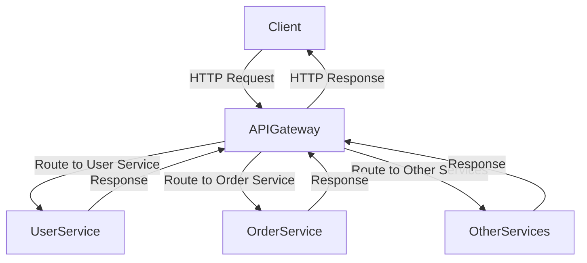

## 9.4 Microservice API Gateway in Clojure

In the world of microservices, an API Gateway serves as a crucial component that aggregates multiple microservice APIs into a single entry point. This pattern not only simplifies client interactions but also manages cross-cutting concerns such as authentication, routing, rate limiting, and load balancing. In this section, we will explore how to set up an API Gateway in Clojure, leveraging its rich ecosystem of libraries and functional programming paradigms.

### Introduction

An API Gateway acts as a reverse proxy, routing requests from clients to the appropriate microservice. It abstracts the complexity of the microservices architecture from the client, providing a unified interface for interaction. This pattern is particularly beneficial in scenarios where microservices are numerous and diverse, as it reduces the number of requests a client must make and simplifies the client-side logic.

### Detailed Explanation

The API Gateway pattern is essential for managing the complexity of microservices. It handles various cross-cutting concerns:

- **Authentication and Authorization:** Ensures that only authenticated and authorized requests are processed.
- **Routing:** Directs requests to the appropriate microservice based on the request path or other criteria.
- **Rate Limiting:** Controls the number of requests a client can make in a given time period to prevent abuse.
- **Load Balancing:** Distributes incoming requests across multiple instances of a microservice to ensure high availability and performance.

### Setting Up an API Gateway Using a Web Framework

To implement an API Gateway in Clojure, we can use the Compojure library for routing and Ring for handling HTTP requests. Below is a step-by-step guide to setting up a basic API Gateway.

#### Step 1: Set Up the Environment

First, ensure you have the necessary dependencies in your `project.clj`:

```clojure
(defproject api-gateway "0.1.0-SNAPSHOT"
  :dependencies [[org.clojure/clojure "1.10.3"]
                 [ring/ring-core "1.9.0"]
                 [ring/ring-jetty-adapter "1.9.0"]
                 [compojure "1.6.2"]])
```

#### Step 2: Define Proxy Routes

Use Compojure to define routes that proxy requests to the appropriate microservices:

```clojure
(require '[ring.adapter.jetty :refer [run-jetty]])
(require '[compojure.core :refer [defroutes GET POST]])
(require '[compojure.route :as route])

(defroutes app-routes
  (GET "/api/users/:id" [id]
    (proxy-request (str "http://user-service/users/" id)))
  (POST "/api/orders" request
    (proxy-request "http://order-service/orders" request))
  (route/not-found "Not Found"))
```

#### Step 3: Implement the `proxy-request` Function

The `proxy-request` function forwards the original request to the target microservice. You can modify headers or the request body as needed:

```clojure
(defn proxy-request [url & [original-request]]
  ;; Forward the original request to the microservice
  ;; Optionally modify headers or body
  {:status 200 :body "Request proxied successfully"})
```

#### Step 4: Add Middleware for Cross-Cutting Concerns

Middleware functions can be used to handle authentication, rate limiting, and other concerns.

**Authentication Middleware:**

```clojure
(defn wrap-authentication [handler]
  (fn [request]
    (if (authenticated? request)
      (handler request)
      {:status 401 :body "Unauthorized"})))
```

**Rate Limiting Middleware:**

```clojure
(defn wrap-rate-limit [handler]
  (fn [request]
    (if (within-rate-limit? request)
      (handler request)
      {:status 429 :body "Too Many Requests"})))
```

#### Step 5: Compose Middleware and Start the Server

Compose the middleware and start the server using Jetty:

```clojure
(def app
  (-> app-routes
      wrap-authentication
      wrap-rate-limit))

(run-jetty app {:port 8080})
```

### Supporting Protocol Translation and Aggregation

In some cases, you may need to convert between different protocols (e.g., from REST to gRPC) or aggregate responses from multiple services. This can be achieved by extending the `proxy-request` function to handle these scenarios.

### Visualizing the API Gateway Architecture

Below is a conceptual diagram illustrating the role of an API Gateway in a microservices architecture:



### Advantages and Disadvantages

**Advantages:**

- **Simplified Client Interaction:** Clients interact with a single endpoint, reducing complexity.
- **Centralized Management:** Cross-cutting concerns are handled in one place, improving maintainability.
- **Scalability:** The gateway can be scaled independently to handle varying loads.

**Disadvantages:**

- **Single Point of Failure:** If the gateway goes down, all services become inaccessible.
- **Increased Latency:** Additional processing at the gateway can introduce latency.

### Best Practices

- **Use Caching:** Implement caching strategies to reduce load on backend services.
- **Monitor and Log:** Continuously monitor and log requests to detect and troubleshoot issues.
- **Secure the Gateway:** Ensure robust security measures are in place to protect against attacks.

### Conclusion

The API Gateway pattern is a powerful tool in the microservices architecture, providing a unified interface for clients and managing various cross-cutting concerns. By leveraging Clojure's functional programming capabilities and rich ecosystem, you can build a robust and scalable API Gateway that enhances the client experience and simplifies microservice interactions.

## Quiz Time!



### What is the primary role of an API Gateway in a microservices architecture?

- [x] To aggregate multiple microservice APIs into a single entry point
- [ ] To store data for microservices
- [ ] To replace all microservices with a monolithic application
- [ ] To directly handle all client-side logic

> **Explanation:** An API Gateway aggregates multiple microservice APIs into a single entry point, simplifying client interactions and managing cross-cutting concerns.

### Which Clojure library is used for routing in the API Gateway example?

- [x] Compojure
- [ ] Luminus
- [ ] Pedestal
- [ ] Re-frame

> **Explanation:** Compojure is used for defining routes in the API Gateway example.

### What is a common cross-cutting concern managed by an API Gateway?

- [x] Authentication
- [ ] Data storage
- [ ] UI rendering
- [ ] Database indexing

> **Explanation:** Authentication is a common cross-cutting concern managed by an API Gateway.

### How does the `proxy-request` function contribute to the API Gateway?

- [x] It forwards requests to the appropriate microservice
- [ ] It stores data in a database
- [ ] It handles client-side rendering
- [ ] It manages user sessions

> **Explanation:** The `proxy-request` function forwards requests to the appropriate microservice, acting as a proxy.

### What is a potential disadvantage of using an API Gateway?

- [x] Single point of failure
- [ ] Increased data redundancy
- [ ] Decreased security
- [ ] Simplified client interaction

> **Explanation:** An API Gateway can become a single point of failure if not properly managed.

### Which middleware function is used for rate limiting in the example?

- [x] `wrap-rate-limit`
- [ ] `wrap-authentication`
- [ ] `wrap-logging`
- [ ] `wrap-caching`

> **Explanation:** The `wrap-rate-limit` middleware function is used for rate limiting in the example.

### What is the purpose of the `wrap-authentication` middleware?

- [x] To ensure only authenticated requests are processed
- [ ] To log all incoming requests
- [ ] To compress response data
- [ ] To handle database transactions

> **Explanation:** The `wrap-authentication` middleware ensures that only authenticated requests are processed.

### What is a benefit of using an API Gateway?

- [x] Centralized management of cross-cutting concerns
- [ ] Direct access to all microservices by clients
- [ ] Reduced need for security measures
- [ ] Increased complexity for clients

> **Explanation:** An API Gateway centralizes the management of cross-cutting concerns, simplifying the architecture.

### Which of the following is NOT a function of an API Gateway?

- [x] Directly storing data in a database
- [ ] Routing requests to microservices
- [ ] Managing authentication
- [ ] Implementing rate limiting

> **Explanation:** An API Gateway does not directly store data in a database; it routes requests and manages concerns like authentication and rate limiting.

### True or False: An API Gateway can convert between different protocols, such as from REST to gRPC.

- [x] True
- [ ] False

> **Explanation:** An API Gateway can support protocol translation, such as converting between REST and gRPC, to facilitate communication between clients and microservices.


