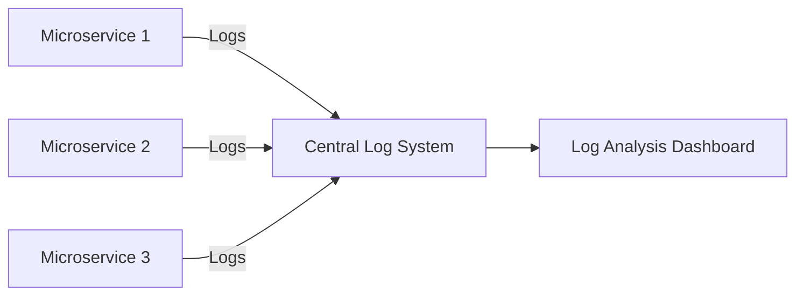

## 9.5 Microservices Log Aggregation in Clojure

In a microservices architecture, where applications are composed of numerous independent services, effective logging is crucial for monitoring, troubleshooting, and ensuring system reliability. This section explores the design pattern of microservices log aggregation in Clojure, emphasizing structured logging, correlation IDs, and integration with log management systems for real-time analysis.

### Introduction

Microservices log aggregation involves centralizing logs from various services to provide a unified view of the system's behavior. This approach simplifies monitoring, debugging, and auditing by allowing developers and operators to trace requests across service boundaries and identify issues quickly.

### Detailed Explanation

#### The Importance of Centralized Logging

Centralized logging is essential in microservices environments for several reasons:

- **Unified View:** Aggregating logs from multiple services provides a comprehensive view of the system's operations.
- **Troubleshooting:** Simplifies the process of identifying and resolving issues by correlating logs from different services.
- **Monitoring:** Enables real-time monitoring of application health and performance.
- **Audit and Compliance:** Facilitates auditing and compliance by maintaining a complete log history.

#### Implementing Consistent Logging Across Services

Consistency in logging is key to effective log aggregation. In Clojure, the `taoensso.timbre` library is a popular choice for logging due to its flexibility and ease of use. Here's how you can set up consistent logging across your microservices:

```clojure
(require '[taoensso.timbre :as timbre])

(timbre/merge-config!
  {:appenders {:println {:enabled? false}}
   :middleware [timbre/structured-output]})
```

This configuration disables the default `println` appender and enables structured output, which is crucial for log aggregation.

#### Using Structured Logging

Structured logging involves logging data in a structured format, such as JSON, which makes it easier to parse and analyze. Here's an example of structured logging in Clojure:

```clojure
(timbre/info {:event :user-login
              :user-id 123
              :details "User logged in successfully."})
```

Structured logs allow you to include rich context in your logs, making them more informative and easier to query.

#### Including Correlation IDs in Logs

Correlation IDs are unique identifiers that trace a request across multiple services, providing a way to link related logs. Here's how you can implement correlation IDs in Clojure:

```clojure
(def ^:dynamic *correlation-id* nil)

(defn wrap-correlation-id [handler]
  (fn [request]
    (binding [*correlation-id* (or (get-in request [:headers "x-correlation-id"]) (generate-id))]
      (handler (assoc-in request [:headers "x-correlation-id"] *correlation-id*)))))

;; Use *correlation-id* in logs
(timbre/info {:event :processing-request
              :correlation-id *correlation-id*
              :details "Processing started."})
```

By including correlation IDs in your logs, you can trace the flow of a request through your system, making it easier to diagnose issues.

#### Configuring Log Appenders for Aggregation

To aggregate logs effectively, you need to configure log appenders to send logs to a centralized system, such as Elasticsearch. You can also use log shippers like Filebeat if you're writing logs to files. Here's a conceptual diagram of how log aggregation works:



This diagram illustrates how logs from multiple microservices are sent to a central log system, which then feeds into a log analysis dashboard for monitoring and analysis.

#### Monitoring and Analyzing Logs

Once logs are aggregated, you can use dashboards and alerting systems to monitor application health and performance. Tools like Kibana provide powerful visualization capabilities, allowing you to create dashboards that display key metrics and trends.

### Use Cases

- **Real-Time Monitoring:** Use log aggregation to monitor application performance and detect anomalies in real-time.
- **Troubleshooting:** Quickly identify and resolve issues by tracing requests across service boundaries using correlation IDs.
- **Audit and Compliance:** Maintain a comprehensive log history for auditing and compliance purposes.

### Advantages and Disadvantages

**Advantages:**

- **Improved Monitoring:** Centralized logs provide a unified view of the system, enhancing monitoring capabilities.
- **Simplified Troubleshooting:** Correlation IDs and structured logs make it easier to trace and resolve issues.
- **Scalability:** Log aggregation scales with your microservices architecture, supporting growth and complexity.

**Disadvantages:**

- **Complexity:** Setting up and maintaining a centralized logging system can be complex.
- **Cost:** Storing and processing large volumes of logs can be costly.

### Best Practices

- **Use Structured Logging:** Always log data in a structured format to facilitate parsing and analysis.
- **Implement Correlation IDs:** Use correlation IDs to trace requests across services.
- **Monitor Log Volume:** Keep an eye on log volume to manage storage costs and performance.
- **Secure Your Logs:** Ensure that logs are stored securely to protect sensitive information.

### Conclusion

Microservices log aggregation in Clojure is a powerful design pattern that enhances monitoring, troubleshooting, and auditing capabilities. By implementing consistent logging, structured logs, and correlation IDs, you can gain valuable insights into your system's behavior and ensure its reliability and performance.

## Quiz Time!



### What is the primary benefit of centralized logging in a microservices architecture?

- [x] Provides a unified view of the system's operations
- [ ] Reduces the need for logging
- [ ] Increases the complexity of the system
- [ ] Eliminates the need for monitoring tools

> **Explanation:** Centralized logging provides a unified view of the system's operations, simplifying monitoring and troubleshooting.

### Which Clojure library is commonly used for logging in microservices?

- [x] taoensso.timbre
- [ ] clojure.core
- [ ] ring.middleware
- [ ] clojure.java.io

> **Explanation:** `taoensso.timbre` is a popular logging library in Clojure, known for its flexibility and ease of use.

### What is the purpose of structured logging?

- [x] To log data in a structured format for easier parsing and analysis
- [ ] To reduce the size of log files
- [ ] To eliminate the need for log management systems
- [ ] To make logs less readable

> **Explanation:** Structured logging involves logging data in a structured format, such as JSON, which makes it easier to parse and analyze.

### How do correlation IDs help in a microservices architecture?

- [x] They trace a request across multiple services
- [ ] They reduce the number of logs generated
- [ ] They increase the security of logs
- [ ] They eliminate the need for structured logging

> **Explanation:** Correlation IDs trace a request across multiple services, providing a way to link related logs and simplify troubleshooting.

### What is a potential disadvantage of centralized logging?

- [x] Complexity in setup and maintenance
- [ ] Reduced monitoring capabilities
- [ ] Increased need for manual log analysis
- [ ] Decreased system performance

> **Explanation:** Setting up and maintaining a centralized logging system can be complex, especially in a microservices architecture.

### Which tool can be used for visualizing logs in a centralized logging system?

- [x] Kibana
- [ ] Leiningen
- [ ] Ring
- [ ] CIDER

> **Explanation:** Kibana is a powerful visualization tool that can be used to create dashboards and analyze logs in a centralized logging system.

### What is the role of log appenders in log aggregation?

- [x] To send logs to a centralized system
- [ ] To reduce log file size
- [ ] To encrypt logs
- [ ] To generate log files

> **Explanation:** Log appenders are configured to send logs to a centralized system, facilitating log aggregation.

### Why is it important to monitor log volume in a centralized logging system?

- [x] To manage storage costs and performance
- [ ] To increase the number of logs generated
- [ ] To reduce the need for log analysis
- [ ] To eliminate the need for correlation IDs

> **Explanation:** Monitoring log volume is important to manage storage costs and ensure the performance of the logging system.

### What is the benefit of using dashboards in log analysis?

- [x] They provide visual insights into key metrics and trends
- [ ] They reduce the need for structured logging
- [ ] They increase the complexity of log analysis
- [ ] They eliminate the need for log management systems

> **Explanation:** Dashboards provide visual insights into key metrics and trends, enhancing log analysis and monitoring.

### True or False: Correlation IDs are optional in a microservices architecture.

- [ ] True
- [x] False

> **Explanation:** While technically optional, correlation IDs are highly recommended in a microservices architecture to trace requests and simplify troubleshooting.


