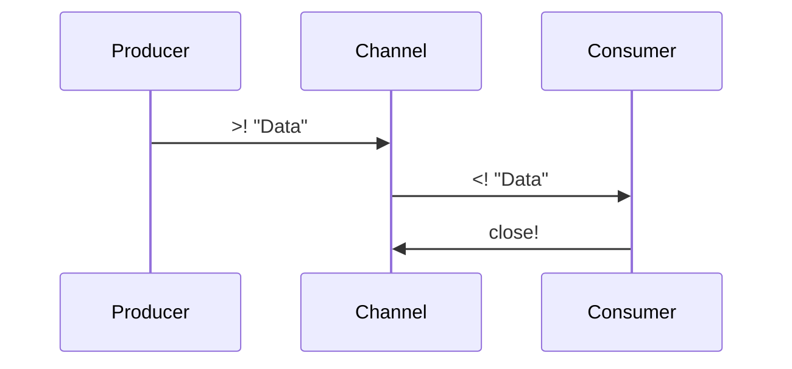

## 9.5. core.async and Channels

### Introduction to core.async

Concurrency and parallelism are crucial in modern software development, enabling applications to perform multiple tasks simultaneously and efficiently. In Clojure, the `core.async` library introduces a powerful model for managing concurrency through Communicating Sequential Processes (CSP). This model allows developers to write asynchronous code that is both expressive and easy to reason about.

The `core.async` library provides channels as a means of communication between different parts of a program. Channels act as conduits through which data can be passed, enabling different processes to communicate without being tightly coupled. This decoupling is essential for building scalable and maintainable systems.

### Understanding Channels

Channels in `core.async` are similar to queues that can be used to pass messages between different parts of a program. They provide a way to communicate between asynchronous processes, allowing data to be sent and received without blocking the main thread.

#### Creating Channels

To create a channel, you use the `chan` function:

```clojure
(require '[clojure.core.async :refer [chan]])

(def my-channel (chan))
```

This creates an unbuffered channel, meaning that any attempt to put data into the channel will block until another process is ready to take data from it.

#### Buffered Channels

Channels can also be buffered, allowing them to store a fixed number of messages before blocking. This is useful for controlling the flow of data and preventing bottlenecks.

```clojure
(def buffered-channel (chan 10)) ; A channel with a buffer size of 10
```

### Communicating with Channels

#### Sending Data

To send data to a channel, you use the `>!` operator within a `go` block. The `go` block is a macro that allows you to write asynchronous code in a synchronous style.

```clojure
(require '[clojure.core.async :refer [go >!]])

(go
  (>! my-channel "Hello, World!"))
```

#### Receiving Data

To receive data from a channel, you use the `<!` operator, also within a `go` block.

```clojure
(require '[clojure.core.async :refer [<!]])

(go
  (let [message (<! my-channel)]
    (println "Received message:" message)))
```

### The Role of go Blocks

The `go` block is a fundamental construct in `core.async` that allows you to write asynchronous code that looks synchronous. Inside a `go` block, you can use the `<!` and `>!` operators to perform non-blocking operations on channels.

```clojure
(go
  (let [result (<! (some-async-operation))]
    (println "Operation result:" result)))
```

### Advanced Channel Operations

#### Using alts!

The `alts!` function allows you to perform a non-deterministic choice between multiple channel operations. It returns the first operation that completes, along with the value.

```clojure
(require '[clojure.core.async :refer [alts!]])

(go
  (let [[value channel] (alts! [my-channel another-channel])]
    (println "Received value:" value "from channel:" channel)))
```

#### Closing Channels

Channels can be closed using the `close!` function. Once a channel is closed, no more data can be put into it, but you can still take data until the channel is empty.

```clojure
(require '[clojure.core.async :refer [close!]])

(close! my-channel)
```

### Buffering and Channel Types

Channels can be unbuffered, buffered, or use special types of buffers like sliding or dropping buffers.

- **Unbuffered Channels**: Block until both a sender and receiver are ready.
- **Buffered Channels**: Allow a fixed number of items to be buffered.
- **Sliding Buffers**: Keep the most recent items, discarding older ones when full.
- **Dropping Buffers**: Discard new items when full.

```clojure
(def sliding-channel (chan (sliding-buffer 5)))
(def dropping-channel (chan (dropping-buffer 5)))
```

### Common Patterns and Best Practices

#### Pipeline Pattern

The pipeline pattern is a common use case for `core.async`, where data is processed in stages, each stage being a separate process.

```clojure
(defn process-stage [in out]
  (go
    (while true
      (let [data (<! in)]
        (>! out (process-data data))))))

(def input (chan))
(def output (chan))

(process-stage input output)
```

#### Error Handling

When using `core.async`, it's important to handle errors gracefully. Consider wrapping your `go` blocks in `try-catch` to manage exceptions.

```clojure
(go
  (try
    (let [result (<! (some-async-operation))]
      (println "Result:" result))
    (catch Exception e
      (println "Error occurred:" (.getMessage e)))))
```

#### Avoiding Deadlocks

Deadlocks can occur if channels are not used carefully. Ensure that channels are properly closed and that there are no circular dependencies between processes.

### Visualizing core.async

To better understand how `core.async` works, let's visualize the flow of data through channels using a Mermaid.js sequence diagram.



This diagram illustrates a simple producer-consumer pattern where data is sent from a producer to a consumer through a channel.

### External Resources

For more information on `core.async`, check out the following resources:

- [core.async on Clojure.org](https://clojure.org/reference/async)
- [core.async GitHub Repository](https://github.com/clojure/core.async)

### Knowledge Check

To reinforce your understanding of `core.async` and channels, try the following exercises:

1. Create a channel and use a `go` block to send and receive a message.
2. Implement a pipeline pattern with multiple stages of data processing.
3. Experiment with different types of buffers and observe their behavior.
4. Use `alts!` to handle multiple channels and prioritize operations.

### Summary

In this section, we've explored the `core.async` library and its role in facilitating asynchronous communication in Clojure. By understanding channels, `go` blocks, and advanced operations like `alts!`, you can build robust and efficient concurrent applications. Remember, this is just the beginning. Keep experimenting, stay curious, and enjoy the journey!

## **Ready to Test Your Knowledge?**



### What is the primary purpose of the `core.async` library in Clojure?

- [x] To facilitate asynchronous communication between processes using channels.
- [ ] To provide a framework for building web applications.
- [ ] To enhance the performance of Clojure's garbage collector.
- [ ] To simplify the syntax of Clojure's functional programming constructs.

> **Explanation:** The `core.async` library is designed to facilitate asynchronous communication between processes using channels, enabling concurrent programming in Clojure.

### How do you create an unbuffered channel in `core.async`?

- [x] `(chan)`
- [ ] `(chan 10)`
- [ ] `(unbuffered-chan)`
- [ ] `(create-channel)`

> **Explanation:** An unbuffered channel is created using the `chan` function without any arguments.

### Which operator is used to send data to a channel within a `go` block?

- [x] `>!`
- [ ] `<!!`
- [ ] `<!`
- [ ] `put!`

> **Explanation:** The `>!` operator is used within a `go` block to send data to a channel.

### What does the `alts!` function do?

- [x] It performs a non-deterministic choice between multiple channel operations.
- [ ] It creates an alternative channel.
- [ ] It closes all channels in a list.
- [ ] It buffers data in a channel.

> **Explanation:** The `alts!` function allows you to perform a non-deterministic choice between multiple channel operations, returning the first one that completes.

### How can you close a channel in `core.async`?

- [x] `close!`
- [ ] `terminate!`
- [ ] `end-channel`
- [ ] `shutdown!`

> **Explanation:** The `close!` function is used to close a channel in `core.async`.

### What is the purpose of a sliding buffer in a channel?

- [x] To keep the most recent items, discarding older ones when full.
- [ ] To discard new items when full.
- [ ] To increase the channel's capacity dynamically.
- [ ] To ensure all items are processed in order.

> **Explanation:** A sliding buffer keeps the most recent items and discards older ones when the buffer is full.

### Which of the following is a best practice when using `core.async`?

- [x] Handle errors gracefully using `try-catch` within `go` blocks.
- [ ] Use global state to manage channel data.
- [ ] Avoid closing channels to keep them reusable.
- [ ] Use blocking operations within `go` blocks.

> **Explanation:** Handling errors gracefully using `try-catch` within `go` blocks is a best practice to ensure robust asynchronous code.

### What is a potential risk when using channels improperly?

- [x] Deadlocks
- [ ] Memory leaks
- [ ] Syntax errors
- [ ] Increased garbage collection

> **Explanation:** Improper use of channels can lead to deadlocks, where processes are waiting indefinitely for each other.

### What type of buffer discards new items when full?

- [x] Dropping buffer
- [ ] Sliding buffer
- [ ] Unbuffered
- [ ] Overflow buffer

> **Explanation:** A dropping buffer discards new items when it is full, unlike a sliding buffer which discards old items.

### True or False: Channels in `core.async` can only be used within `go` blocks.

- [ ] True
- [x] False

> **Explanation:** While `go` blocks are commonly used with channels for non-blocking operations, channels can also be used with blocking operations outside of `go` blocks.


